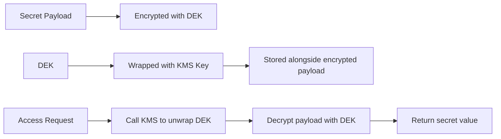

# How to Configure CMEK for Secret Manager in GCP

Author: [nawazdhandala](https://www.github.com/nawazdhandala)

Tags: GCP, Secret Manager, CMEK, Cloud KMS, Encryption

Description: Learn how to configure customer-managed encryption keys for Google Cloud Secret Manager, giving you full control over the encryption of your most sensitive secrets.

---

By default, Secret Manager encrypts all secret data at rest using Google-managed encryption keys. This is transparent and requires zero configuration. For most workloads, this level of encryption is perfectly adequate. But some organizations - particularly those in regulated industries like finance and healthcare - need to control the encryption keys themselves. They need the ability to rotate keys on their own schedule, disable keys to make data inaccessible, and maintain a complete audit trail of key usage.

Customer-Managed Encryption Keys (CMEK) provide this control. When you configure CMEK for Secret Manager, your secrets are encrypted using keys that you create and manage in Cloud KMS. You decide when keys are rotated, you can disable or destroy keys to cut off access, and every use of the key is logged in Cloud Audit Logs.

## How CMEK Works with Secret Manager

When you create a secret with CMEK, each secret version's payload is encrypted using a data encryption key (DEK), and that DEK is itself encrypted (wrapped) using your Cloud KMS key. This is called envelope encryption.

When someone accesses a secret version, Secret Manager calls Cloud KMS to unwrap the DEK, then uses the unwrapped DEK to decrypt the secret payload. If the KMS key is disabled or destroyed, the unwrap fails and the secret becomes inaccessible.



## Prerequisites

- A GCP project with Secret Manager and Cloud KMS APIs enabled
- A Cloud KMS key ring and key (or permissions to create them)
- The `roles/secretmanager.admin` role for managing secrets
- The `roles/cloudkms.admin` role for managing keys

Enable the APIs:

```bash
# Enable required APIs
gcloud services enable \
  secretmanager.googleapis.com \
  cloudkms.googleapis.com \
  --project=my-project-id
```

## Step 1 - Create a Cloud KMS Key

If you do not already have a KMS key, create a key ring and a symmetric encryption key:

```bash
# Create a key ring
gcloud kms keyrings create secret-manager-keyring \
  --location=global \
  --project=my-project-id

# Create a symmetric encryption key for Secret Manager
gcloud kms keys create secret-encryption-key \
  --keyring=secret-manager-keyring \
  --location=global \
  --purpose=encryption \
  --rotation-period=90d \
  --next-rotation-time="$(date -u -v+90d +%Y-%m-%dT%H:%M:%SZ)" \
  --project=my-project-id
```

Note the full key resource name. It follows this format:
```
projects/my-project-id/locations/global/keyRings/secret-manager-keyring/cryptoKeys/secret-encryption-key
```

## Step 2 - Grant Secret Manager Access to the Key

Secret Manager uses a service agent to call Cloud KMS. You need to grant this agent the `cloudkms.cryptoKeyEncrypterDecrypter` role on your key.

First, find the Secret Manager service agent:

```bash
# The service agent email follows this pattern:
# service-PROJECT_NUMBER@gcp-sa-secretmanager.iam.gserviceaccount.com

# Get your project number
gcloud projects describe my-project-id --format="get(projectNumber)"
```

Then grant the role:

```bash
# Grant the Secret Manager service agent access to encrypt/decrypt with the key
gcloud kms keys add-iam-policy-binding secret-encryption-key \
  --keyring=secret-manager-keyring \
  --location=global \
  --member="serviceAccount:service-PROJECT_NUMBER@gcp-sa-secretmanager.iam.gserviceaccount.com" \
  --role="roles/cloudkms.cryptoKeyEncrypterDecrypter" \
  --project=my-project-id
```

## Step 3 - Create a Secret with CMEK (Automatic Replication)

For secrets with automatic replication, specify the KMS key at creation time:

```bash
# Create a secret with CMEK using automatic replication
gcloud secrets create my-cmek-secret \
  --replication-policy="automatic" \
  --kms-key-name="projects/my-project-id/locations/global/keyRings/secret-manager-keyring/cryptoKeys/secret-encryption-key" \
  --project=my-project-id

# Add the secret value
echo -n "my-sensitive-data" | gcloud secrets versions add my-cmek-secret \
  --data-file=- \
  --project=my-project-id
```

## Step 4 - Create a Secret with CMEK (User-Managed Replication)

For user-managed replication, you need a KMS key in each region where the secret is replicated. Create a YAML file defining the replication and key mapping:

```yaml
# cmek-replication-config.yaml
# Each replica region needs its own KMS key
userManaged:
  replicas:
    - location: us-central1
      customerManagedEncryption:
        kmsKeyName: projects/my-project-id/locations/us-central1/keyRings/regional-keyring/cryptoKeys/secret-key-us
    - location: europe-west1
      customerManagedEncryption:
        kmsKeyName: projects/my-project-id/locations/europe-west1/keyRings/regional-keyring/cryptoKeys/secret-key-eu
```

Create the regional keys first:

```bash
# Create a key ring in us-central1
gcloud kms keyrings create regional-keyring \
  --location=us-central1 \
  --project=my-project-id

# Create a key in us-central1
gcloud kms keys create secret-key-us \
  --keyring=regional-keyring \
  --location=us-central1 \
  --purpose=encryption \
  --project=my-project-id

# Create a key ring in europe-west1
gcloud kms keyrings create regional-keyring \
  --location=europe-west1 \
  --project=my-project-id

# Create a key in europe-west1
gcloud kms keys create secret-key-eu \
  --keyring=regional-keyring \
  --location=europe-west1 \
  --purpose=encryption \
  --project=my-project-id

# Grant the Secret Manager service agent access to both keys
gcloud kms keys add-iam-policy-binding secret-key-us \
  --keyring=regional-keyring \
  --location=us-central1 \
  --member="serviceAccount:service-PROJECT_NUMBER@gcp-sa-secretmanager.iam.gserviceaccount.com" \
  --role="roles/cloudkms.cryptoKeyEncrypterDecrypter" \
  --project=my-project-id

gcloud kms keys add-iam-policy-binding secret-key-eu \
  --keyring=regional-keyring \
  --location=europe-west1 \
  --member="serviceAccount:service-PROJECT_NUMBER@gcp-sa-secretmanager.iam.gserviceaccount.com" \
  --role="roles/cloudkms.cryptoKeyEncrypterDecrypter" \
  --project=my-project-id
```

Then create the secret with the replication config:

```bash
# Create the secret with user-managed replication and per-region CMEK
gcloud secrets create my-regional-secret \
  --replication-policy-file=cmek-replication-config.yaml \
  --project=my-project-id
```

## Terraform Configuration

Here is the complete setup in Terraform:

```hcl
# Cloud KMS key for Secret Manager CMEK
resource "google_kms_crypto_key" "secret_key" {
  name            = "secret-encryption-key"
  key_ring        = google_kms_key_ring.secret_ring.id
  rotation_period = "7776000s"  # 90 days
  purpose         = "ENCRYPT_DECRYPT"
}

resource "google_kms_key_ring" "secret_ring" {
  name     = "secret-manager-keyring"
  location = "global"
  project  = var.project_id
}

# Grant Secret Manager service agent access to the key
resource "google_kms_crypto_key_iam_member" "secret_manager_access" {
  crypto_key_id = google_kms_crypto_key.secret_key.id
  role          = "roles/cloudkms.cryptoKeyEncrypterDecrypter"
  member        = "serviceAccount:service-${var.project_number}@gcp-sa-secretmanager.iam.gserviceaccount.com"
}

# Create a secret with CMEK
resource "google_secret_manager_secret" "cmek_secret" {
  secret_id = "my-cmek-secret"
  project   = var.project_id

  replication {
    auto {
      customer_managed_encryption {
        kms_key_name = google_kms_crypto_key.secret_key.id
      }
    }
  }

  depends_on = [google_kms_crypto_key_iam_member.secret_manager_access]
}

# Add a version
resource "google_secret_manager_secret_version" "cmek_version" {
  secret      = google_secret_manager_secret.cmek_secret.id
  secret_data = var.secret_value
}
```

## Verifying CMEK Configuration

Confirm that a secret is using CMEK by describing it:

```bash
# Check the encryption configuration of a secret
gcloud secrets describe my-cmek-secret \
  --project=my-project-id \
  --format="yaml(replication)"
```

The output should show the `customerManagedEncryption` block with your KMS key name.

## Key Rotation and Impact

When you rotate the Cloud KMS key, new secret versions are encrypted with the new key version. Existing secret versions remain encrypted with the key version that was current when they were created. Secret Manager handles the key version selection automatically - you do not need to re-encrypt existing data.

```bash
# Manually rotate the KMS key
gcloud kms keys versions create \
  --key=secret-encryption-key \
  --keyring=secret-manager-keyring \
  --location=global \
  --primary \
  --project=my-project-id
```

## Emergency Access Revocation

One of the main advantages of CMEK is the ability to revoke access to all secret data by disabling the KMS key:

```bash
# Disable the key - all secrets encrypted with it become inaccessible
gcloud kms keys versions disable KEY_VERSION \
  --key=secret-encryption-key \
  --keyring=secret-manager-keyring \
  --location=global \
  --project=my-project-id
```

This is a drastic action and should only be used in emergencies. Disabling the key means no application can read any secret encrypted with that key until the key is re-enabled.

## Cost Considerations

CMEK adds Cloud KMS costs on top of Secret Manager costs. Each KMS operation (encrypt or decrypt) is billed. Since Secret Manager uses KMS every time a secret version is accessed, high-volume secret access can generate meaningful KMS costs. Monitor your KMS usage and consider caching secret values in your application to reduce API calls.

CMEK for Secret Manager gives you the control that regulated environments demand. You own the keys, you control rotation, and you have a kill switch for emergency data protection. For most development workloads Google-managed keys are fine, but for production systems handling sensitive data in regulated industries, CMEK is often a requirement rather than an option.
