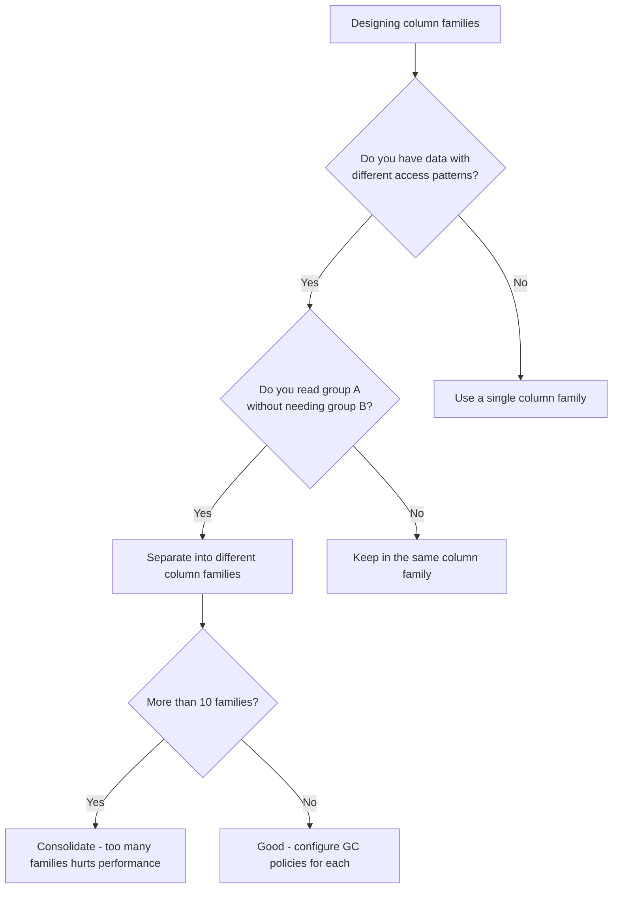

# How to Configure Column Family Settings for Optimal Bigtable Performance

Author: [nawazdhandala](https://www.github.com/nawazdhandala)

Tags: GCP, Cloud Bigtable, Column Families, Performance Tuning, Schema Design

Description: Optimize your Cloud Bigtable performance by properly configuring column family settings including garbage collection policies, cell versioning, and data grouping strategies.

---

Column families are one of the most important design decisions you will make when working with Cloud Bigtable. They determine how your data is physically stored, how efficiently it can be read, and how much storage you consume over time. Getting column family settings right from the start saves you from painful data migrations later.

I have seen teams dump everything into a single column family and wonder why their reads are slow. I have also seen teams create dozens of column families when two or three would have been perfect. In this post, I will break down exactly how to configure column family settings for optimal performance.

## What Are Column Families?

In Bigtable, data is organized as a sparse, sorted map. Each row has a row key and contains data organized into column families. A column family groups related columns together. Within each family, individual columns are identified by column qualifiers.

The critical thing to understand is that column families are not just a logical grouping - they affect physical storage. Bigtable stores data from the same column family together on disk. This means reading data from one column family does not require reading data from other families.

## Creating Column Families

When you create a table, you define its column families. You can also add or modify column families on an existing table without downtime.

```bash
# Create a table with multiple column families
cbt -instance=my-instance createtable sensor-data

# Create column families for different data categories
cbt -instance=my-instance createfamily sensor-data readings
cbt -instance=my-instance createfamily sensor-data metadata
cbt -instance=my-instance createfamily sensor-data alerts
```

Using the Python client:

```python
# Create column families programmatically with the Python client
from google.cloud import bigtable
from google.cloud.bigtable import column_family

client = bigtable.Client(project="my-project", admin=True)
instance = client.instance("my-instance")
table = instance.table("sensor-data")

# Create the table first
table.create()

# Define and create column families with specific settings
readings_cf = table.column_family("readings")
readings_cf.create()

metadata_cf = table.column_family("metadata")
metadata_cf.create()

alerts_cf = table.column_family("alerts")
alerts_cf.create()
```

## Garbage Collection Policies

Garbage collection (GC) policies are the most important column family setting. They control how Bigtable manages old versions of cell data. Without proper GC policies, your storage costs will grow without bound.

There are two types of GC policies:

### Max Versions Policy

This limits the number of cell versions Bigtable keeps. When a new version is written, older versions beyond the limit are eligible for garbage collection.

```python
# Set a max versions policy - keep only the 3 most recent versions of each cell
from google.cloud.bigtable import column_family

max_versions_rule = column_family.MaxVersionsGCRule(3)
readings_cf = table.column_family("readings", gc_rule=max_versions_rule)
readings_cf.create()
```

Using the CLI:

```bash
# Set a max versions garbage collection policy via the CLI
cbt -instance=my-instance setgcpolicy sensor-data readings maxversions=3
```

### Max Age Policy

This automatically removes cell versions older than a specified duration. Perfect for time-series data where old data loses relevance.

```python
# Set a max age policy - automatically remove data older than 7 days
import datetime

max_age_rule = column_family.MaxAgeGCRule(datetime.timedelta(days=7))
alerts_cf = table.column_family("alerts", gc_rule=max_age_rule)
alerts_cf.create()
```

```bash
# Set a max age garbage collection policy via the CLI
cbt -instance=my-instance setgcpolicy sensor-data alerts maxage=7d
```

### Union and Intersection Policies

You can combine GC policies using union (OR) and intersection (AND) logic.

A union policy deletes data that matches either condition:

```python
# Union policy: delete data if it is older than 30 days OR there are more than 5 versions
rule1 = column_family.MaxAgeGCRule(datetime.timedelta(days=30))
rule2 = column_family.MaxVersionsGCRule(5)

# Data is deleted when EITHER condition is met
union_rule = column_family.GCRuleUnion(rules=[rule1, rule2])
cf = table.column_family("readings", gc_rule=union_rule)
cf.update()
```

An intersection policy deletes data only when both conditions are met:

```python
# Intersection policy: delete data only if it is older than 30 days AND there are more than 2 versions
rule1 = column_family.MaxAgeGCRule(datetime.timedelta(days=30))
rule2 = column_family.MaxVersionsGCRule(2)

# Data is deleted only when BOTH conditions are met
intersection_rule = column_family.GCRuleIntersection(rules=[rule1, rule2])
cf = table.column_family("readings", gc_rule=intersection_rule)
cf.update()
```

The intersection approach is more conservative. It keeps data unless it is both old and has many versions.

## How Many Column Families Should You Use?

The general guidance is to use a small number of column families - typically between 1 and 10. Here is a decision framework:



**Group data by access pattern.** If your application reads user profile data without needing activity logs, put them in separate families. This way, a profile read does not pull activity data from disk.

**Keep frequently co-read data together.** If you always read columns A, B, and C together, put them in the same family. Cross-family reads are more expensive than reads within a single family.

**Avoid too many families.** Each column family adds metadata overhead. More than about 10 families per table starts to degrade performance.

## Column Family Naming Conventions

Column family names are stored in every row, so shorter names save storage at scale.

```bash
# Short, descriptive column family names save storage at scale
# Good: "cf1", "d", "m", "events"
# Avoid: "sensor_reading_data_points", "user_activity_metadata_information"

cbt -instance=my-instance createfamily sensor-data d    # for data
cbt -instance=my-instance createfamily sensor-data m    # for metadata
```

At billions of rows, the storage savings from short column family names can be significant.

## Modifying Column Family Settings on Live Tables

One of Bigtable's strengths is that you can modify column family settings without downtime. Updates happen asynchronously.

```python
# Update garbage collection policy on an existing column family
# This runs without any downtime or impact on live traffic
from google.cloud.bigtable import column_family
import datetime

client = bigtable.Client(project="my-project", admin=True)
instance = client.instance("my-instance")
table = instance.table("sensor-data")

# Get the existing column family and update its GC rule
new_rule = column_family.MaxAgeGCRule(datetime.timedelta(days=14))
cf = table.column_family("readings", gc_rule=new_rule)
cf.update()

print("GC policy updated - Bigtable will apply it during next compaction")
```

Note that garbage collection does not happen immediately. Bigtable applies GC policies during periodic compactions. Data marked for deletion may still appear in reads briefly after you change the policy.

## Monitoring Column Family Storage

Keep an eye on how much storage each column family consumes:

```bash
# Check table and column family sizes
cbt -instance=my-instance ls sensor-data
```

In Cloud Monitoring, you can track the `bigtable.googleapis.com/disk/bytes_used` metric broken down by table. Large column families with no GC policy are a red flag.

## Common Mistakes

**No GC policy at all.** If you never set a GC policy, Bigtable keeps every version of every cell forever. Storage costs creep up silently.

**Using maxversions=1 when you need versioning.** If your application does read-modify-write operations or you use timestamps for time-series data, keeping only one version means you cannot recover from accidental overwrites.

**Too many small column families.** Each family has overhead. If you are creating a family for every single attribute, consolidate related attributes into fewer families.

**Changing GC policies without understanding the impact.** Switching from maxversions=10 to maxversions=1 will eventually delete 9 out of 10 versions. Make sure that is what you want before updating.

## Wrapping Up

Column family configuration is not glamorous, but it directly impacts your Bigtable performance and cost. Group related data together, set appropriate garbage collection policies, keep family names short, and revisit your settings as your access patterns evolve. Getting these details right means your Bigtable tables stay fast and cost-efficient as they grow from gigabytes to petabytes.
