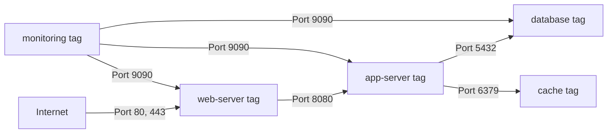

# How to Configure Compute Engine VM Network Tags and Firewall Rules for Micro-Segmentation

Author: [nawazdhandala](https://www.github.com/nawazdhandala)

Tags: GCP, Compute Engine, Network Tags, Firewall Rules, Micro-Segmentation

Description: Learn how to use network tags and firewall rules on GCP Compute Engine to implement micro-segmentation and control traffic flow between VMs precisely.

---

In a flat network where every VM can talk to every other VM, a single compromised instance can reach everything. Micro-segmentation changes this by creating fine-grained network controls that restrict traffic to only the paths that are actually needed. On GCP, you implement micro-segmentation using network tags and firewall rules.

Network tags are labels you attach to VMs. Firewall rules reference these tags to control which VMs can send or receive traffic. The combination gives you precise control over east-west traffic (between VMs) without needing separate VPC networks or subnets for each tier.

## Understanding Network Tags and Firewall Rules

A quick overview of how the pieces fit together:

- **Network tags**: Free-form strings attached to VMs (e.g., "web-server", "database", "monitoring")
- **Source tags**: In a firewall rule, traffic is allowed FROM VMs with these tags
- **Target tags**: In a firewall rule, the rule applies TO VMs with these tags
- **Source ranges**: Traffic is allowed from these IP ranges (used for external sources)



In this architecture, the database can only be reached by app servers, not directly from the web tier. The monitoring system can reach all tiers but only on the metrics port.

## Applying Tags to VMs

Add tags when creating a VM:

```bash
# Create a web server with appropriate tags
gcloud compute instances create web-1 \
    --zone=us-central1-a \
    --machine-type=e2-medium \
    --image-family=debian-12 \
    --image-project=debian-cloud \
    --tags=web-server,http-server,https-server
```

Add tags to existing VMs:

```bash
# Add tags to an existing VM
gcloud compute instances add-tags app-1 \
    --zone=us-central1-a \
    --tags=app-server

# Remove tags from a VM
gcloud compute instances remove-tags app-1 \
    --zone=us-central1-a \
    --tags=old-tag
```

## Building a Micro-Segmented Firewall

Let me walk through creating a complete set of firewall rules for a three-tier application (web, app, database) with a monitoring tier.

### Rule 1: Allow Internet Traffic to Web Servers

```bash
# Allow HTTP and HTTPS from the internet to web servers only
gcloud compute firewall-rules create allow-internet-to-web \
    --network=default \
    --action=allow \
    --direction=ingress \
    --source-ranges=0.0.0.0/0 \
    --target-tags=web-server \
    --rules=tcp:80,tcp:443 \
    --priority=1000 \
    --description="Allow internet traffic to web tier"
```

### Rule 2: Allow Web Servers to Talk to App Servers

```bash
# Allow web servers to reach app servers on port 8080
gcloud compute firewall-rules create allow-web-to-app \
    --network=default \
    --action=allow \
    --direction=ingress \
    --source-tags=web-server \
    --target-tags=app-server \
    --rules=tcp:8080 \
    --priority=1000 \
    --description="Allow web tier to app tier"
```

### Rule 3: Allow App Servers to Talk to Database

```bash
# Allow app servers to reach database on PostgreSQL port
gcloud compute firewall-rules create allow-app-to-db \
    --network=default \
    --action=allow \
    --direction=ingress \
    --source-tags=app-server \
    --target-tags=database \
    --rules=tcp:5432 \
    --priority=1000 \
    --description="Allow app tier to database tier"
```

### Rule 4: Allow App Servers to Talk to Cache

```bash
# Allow app servers to reach Redis cache
gcloud compute firewall-rules create allow-app-to-cache \
    --network=default \
    --action=allow \
    --direction=ingress \
    --source-tags=app-server \
    --target-tags=cache \
    --rules=tcp:6379 \
    --priority=1000 \
    --description="Allow app tier to cache tier"
```

### Rule 5: Allow Monitoring to Scrape All Tiers

```bash
# Allow monitoring system to reach metrics endpoints on all tiers
gcloud compute firewall-rules create allow-monitoring-scrape \
    --network=default \
    --action=allow \
    --direction=ingress \
    --source-tags=monitoring \
    --target-tags=web-server,app-server,database,cache \
    --rules=tcp:9090,tcp:9100 \
    --priority=1000 \
    --description="Allow monitoring to scrape metrics from all tiers"
```

### Rule 6: Deny Everything Else

GCP has an implied deny-all ingress rule at the lowest priority. But for extra clarity and to override any default "allow" rules:

```bash
# Explicitly deny all other internal traffic (optional, for clarity)
gcloud compute firewall-rules create deny-all-internal \
    --network=default \
    --action=deny \
    --direction=ingress \
    --source-ranges=10.128.0.0/9 \
    --rules=all \
    --priority=65534 \
    --description="Deny all internal traffic not explicitly allowed"
```

### Rule 7: Allow Health Check Traffic

Do not forget health checks for load balancers:

```bash
# Allow Google health check probes to web and app tiers
gcloud compute firewall-rules create allow-health-checks \
    --network=default \
    --action=allow \
    --direction=ingress \
    --source-ranges=130.211.0.0/22,35.191.0.0/16 \
    --target-tags=web-server,app-server \
    --rules=tcp:80,tcp:8080 \
    --priority=900 \
    --description="Allow Google health check probes"
```

## Terraform Configuration

Here is the complete micro-segmentation setup in Terraform:

```hcl
# Web tier firewall rules
resource "google_compute_firewall" "internet_to_web" {
  name    = "allow-internet-to-web"
  network = "default"

  allow {
    protocol = "tcp"
    ports    = ["80", "443"]
  }

  source_ranges = ["0.0.0.0/0"]
  target_tags   = ["web-server"]
}

# Web to app communication
resource "google_compute_firewall" "web_to_app" {
  name    = "allow-web-to-app"
  network = "default"

  allow {
    protocol = "tcp"
    ports    = ["8080"]
  }

  source_tags = ["web-server"]
  target_tags = ["app-server"]
}

# App to database communication
resource "google_compute_firewall" "app_to_db" {
  name    = "allow-app-to-db"
  network = "default"

  allow {
    protocol = "tcp"
    ports    = ["5432"]
  }

  source_tags = ["app-server"]
  target_tags = ["database"]
}

# App to cache communication
resource "google_compute_firewall" "app_to_cache" {
  name    = "allow-app-to-cache"
  network = "default"

  allow {
    protocol = "tcp"
    ports    = ["6379"]
  }

  source_tags = ["app-server"]
  target_tags = ["cache"]
}

# Monitoring access to all tiers
resource "google_compute_firewall" "monitoring" {
  name    = "allow-monitoring-scrape"
  network = "default"

  allow {
    protocol = "tcp"
    ports    = ["9090", "9100"]
  }

  source_tags = ["monitoring"]
  target_tags = ["web-server", "app-server", "database", "cache"]
}

# Health check access
resource "google_compute_firewall" "health_checks" {
  name    = "allow-health-checks"
  network = "default"
  priority = 900

  allow {
    protocol = "tcp"
    ports    = ["80", "8080"]
  }

  source_ranges = ["130.211.0.0/22", "35.191.0.0/16"]
  target_tags   = ["web-server", "app-server"]
}

# SSH via IAP
resource "google_compute_firewall" "ssh_iap" {
  name    = "allow-ssh-iap"
  network = "default"

  allow {
    protocol = "tcp"
    ports    = ["22"]
  }

  source_ranges = ["35.235.240.0/20"]
  target_tags   = ["web-server", "app-server", "database", "cache", "monitoring"]
}
```

## Verifying Your Firewall Rules

List all firewall rules and check for overly permissive rules:

```bash
# List all firewall rules sorted by priority
gcloud compute firewall-rules list --sort-by=PRIORITY --format="table(name, direction, sourceRanges.list(), sourceTags.list(), targetTags.list(), allowed[].map().firewall_rule().list())"

# Check which rules apply to a specific VM
gcloud compute instances describe web-1 \
    --zone=us-central1-a \
    --format="value(tags.items)"
```

## Testing Connectivity

Use the Network Intelligence Center's connectivity test to verify your rules:

```bash
# Test connectivity from web to app tier
gcloud network-management connectivity-tests create web-to-app-test \
    --source-instance=projects/my-project/zones/us-central1-a/instances/web-1 \
    --destination-instance=projects/my-project/zones/us-central1-a/instances/app-1 \
    --protocol=TCP \
    --destination-port=8080

# Check the test results
gcloud network-management connectivity-tests describe web-to-app-test
```

Or test from inside a VM:

```bash
# From a web server, test connectivity to an app server
curl -m 5 http://APP_SERVER_IP:8080/health
# Should succeed

# From a web server, try to reach the database directly
curl -m 5 telnet://DB_SERVER_IP:5432
# Should timeout (blocked by firewall)
```

## Logging Firewall Activity

Enable firewall logging to see which rules are being hit:

```bash
# Enable logging on a firewall rule
gcloud compute firewall-rules update allow-web-to-app \
    --enable-logging \
    --logging-metadata=include-all

# Query firewall logs
gcloud logging read 'resource.type="gce_subnetwork" AND jsonPayload.rule_details.reference:allow-web-to-app' \
    --limit=20
```

## Best Practices

1. **Use descriptive tag names** that indicate the role, not the technology. "app-server" is better than "nodejs-box".
2. **Follow the principle of least privilege.** Only allow the specific ports and protocols needed.
3. **Document your firewall architecture** with a diagram showing allowed traffic flows.
4. **Use priority levels** strategically. Important allow rules should have lower priority numbers (higher priority) than deny rules.
5. **Enable logging** on important rules so you can audit traffic patterns.
6. **Review rules regularly.** Remove rules for decommissioned services.
7. **Test after changes.** Always verify connectivity after modifying firewall rules.
8. **Use service accounts instead of tags** for more granular control (tags can be changed by instance admins, while service account assignments require IAM permissions).

## Service Accounts as an Alternative

For stricter access control, use service accounts instead of tags. Unlike tags, service accounts cannot be changed by users with only instance-level permissions:

```bash
# Create a firewall rule using service accounts
gcloud compute firewall-rules create allow-web-to-app-sa \
    --network=default \
    --action=allow \
    --direction=ingress \
    --source-service-accounts=web-sa@my-project.iam.gserviceaccount.com \
    --target-service-accounts=app-sa@my-project.iam.gserviceaccount.com \
    --rules=tcp:8080
```

## Wrapping Up

Micro-segmentation with network tags and firewall rules is one of the most effective security measures you can implement on GCP. It limits lateral movement in case of a breach, enforces the principle of least privilege at the network level, and is straightforward to implement. Start by mapping your application's communication patterns, then create firewall rules that allow only those specific flows. Everything else gets denied by default. The investment in setting up proper segmentation pays off enormously when it prevents an attacker from pivoting through your network.
