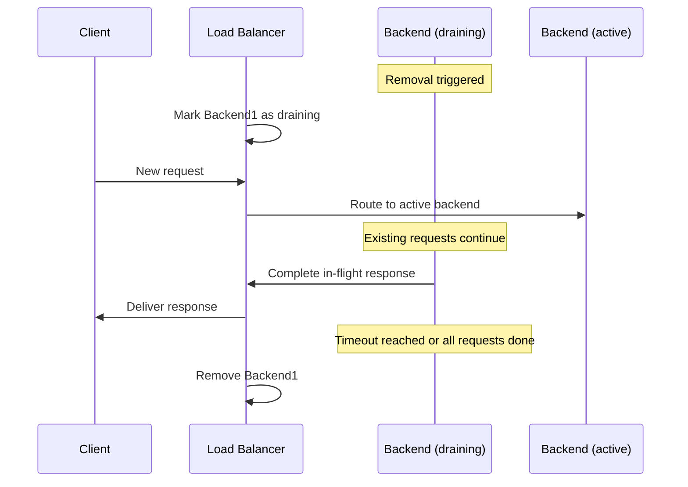

# How to Configure Connection Draining for Zero-Downtime Deployments on GCP Load Balancers

Author: [nawazdhandala](https://www.github.com/nawazdhandala)

Tags: GCP, Load Balancer, Connection Draining, Zero Downtime, Deployments

Description: Learn how to configure connection draining on GCP load balancers to achieve zero-downtime deployments by gracefully handling in-flight requests during backend removal.

---

Deploying new code to production should not mean dropping active user requests. When you remove a backend instance from a load balancer - whether for a rolling update, scaling down, or maintenance - you need existing connections and in-flight requests to complete gracefully. Connection draining is the mechanism that makes this possible. It tells the load balancer to stop sending new requests to a backend that is being removed, while allowing existing requests to finish within a configurable timeout.

This post covers how to configure connection draining in GCP, how it interacts with different deployment strategies, and how to tune it for your specific workload.

## How Connection Draining Works

When a backend instance is removed from a load balancer (either manually or through an autoscaler), the following happens:

1. **Without connection draining**: The load balancer immediately removes the backend. Any in-flight requests are dropped, and clients see errors.

2. **With connection draining**: The load balancer marks the backend as "draining." No new requests are sent to it. Existing requests continue to be served until they complete or the draining timeout expires, whichever comes first.



## Configuring Connection Draining

Connection draining is configured on the backend service. The timeout value (in seconds) specifies how long the load balancer waits for in-flight requests to complete before forcibly closing connections.

```bash
# Set connection draining timeout to 5 minutes (300 seconds)
gcloud compute backend-services update my-backend-service \
    --connection-draining-timeout=300 \
    --global
```

For regional backend services:

```bash
# Set connection draining for a regional backend service
gcloud compute backend-services update my-regional-backend \
    --connection-draining-timeout=300 \
    --region=us-central1
```

## Choosing the Right Timeout

The timeout should be long enough for your longest-running request to complete, but not so long that deployments take forever.

**Short requests (API calls, web pages)**: 30-60 seconds is usually sufficient.

```bash
# For typical web applications with short request times
gcloud compute backend-services update web-backend \
    --connection-draining-timeout=60 \
    --global
```

**Long-running requests (file uploads, report generation)**: Use a longer timeout.

```bash
# For applications with long-running requests
gcloud compute backend-services update upload-backend \
    --connection-draining-timeout=600 \
    --global
```

**WebSocket connections**: These can be very long-lived, so you may need a much longer timeout.

```bash
# For WebSocket backends with long-lived connections
gcloud compute backend-services update ws-backend \
    --connection-draining-timeout=3600 \
    --global
```

**Streaming responses**: For server-sent events or streaming APIs, consider how long a typical stream lasts.

The maximum allowed timeout is 3600 seconds (1 hour). If you need longer than that, you may need to implement application-level reconnection logic.

## Connection Draining with Managed Instance Groups

Connection draining works seamlessly with managed instance group (MIG) operations like rolling updates, autoscaler scale-downs, and instance replacements.

### Rolling Updates

When you update a MIG (to deploy new code), the MIG replaces instances one by one. Connection draining ensures each old instance finishes serving before it is deleted:

```bash
# Configure the MIG for rolling updates with connection draining
gcloud compute instance-groups managed rolling-action start-update my-mig \
    --version=template=new-template \
    --max-surge=1 \
    --max-unavailable=0 \
    --zone=us-central1-a
```

The `--max-unavailable=0` ensures that no instance is removed until a replacement is fully healthy. Combined with connection draining, this gives you true zero-downtime updates:

1. New instance created from new template
2. New instance passes health checks
3. Old instance marked for draining
4. Draining timeout allows in-flight requests to complete
5. Old instance deleted
6. Process repeats for next instance

### Autoscaler Scale-Down

When the autoscaler removes instances, connection draining applies automatically:

```bash
# Verify draining timeout is set before autoscaling
gcloud compute backend-services describe my-backend-service \
    --global \
    --format="get(connectionDraining.drainingTimeoutSec)"
```

## Connection Draining for Different Load Balancer Types

Connection draining works on all GCP load balancer types, but the behavior varies slightly:

**HTTP(S) Load Balancers**: The load balancer stops sending new HTTP requests. Existing requests complete normally. The load balancer can also send a `Connection: close` header on draining responses to signal to HTTP/1.1 clients that they should not reuse the connection.

**TCP Proxy Load Balancer**: Existing TCP connections continue until they close naturally or the timeout expires. No new connections are routed to the draining backend.

**Network Load Balancer (Passthrough)**: Since the load balancer does not terminate connections, it stops directing new packets to the draining backend. Existing "connections" (tracked by a 5-tuple hash) continue to be forwarded.

## Application-Side Graceful Shutdown

Connection draining on the load balancer side is only half the story. Your application should also handle graceful shutdown:

```python
# Python example of graceful shutdown handling
import signal
import sys
from flask import Flask

app = Flask(__name__)
shutting_down = False

def handle_shutdown(signum, frame):
    """Handle SIGTERM for graceful shutdown."""
    global shutting_down
    print("Received SIGTERM, starting graceful shutdown")
    shutting_down = True
    # Continue serving for a bit to handle in-flight requests
    # The load balancer's connection draining handles the rest

# Register signal handlers for graceful shutdown
signal.signal(signal.SIGTERM, handle_shutdown)

@app.route('/health')
def health():
    if shutting_down:
        # Return unhealthy so LB stops sending new traffic
        return 'shutting down', 503
    return 'ok', 200

@app.route('/api/data')
def get_data():
    # Normal request handling - this continues during draining
    return process_request()
```

The key pattern: when your application receives SIGTERM, mark the health check as unhealthy so the load balancer stops sending new traffic, but continue processing in-flight requests.

## Monitoring Connection Draining

You can observe connection draining in action through load balancer logs:

```bash
# View logs during a deployment to see draining in action
gcloud logging read 'resource.type="http_load_balancer" AND
    httpRequest.status>=500' \
    --limit=50 \
    --format="table(timestamp,httpRequest.status,jsonPayload.statusDetails)"
```

During a healthy deployment with proper connection draining, you should see zero 5xx errors.

## Terraform Configuration

```hcl
# Backend service with connection draining configured
resource "google_compute_backend_service" "default" {
  name                  = "my-backend-service"
  protocol              = "HTTP"
  health_checks         = [google_compute_health_check.default.id]
  load_balancing_scheme = "EXTERNAL_MANAGED"

  # Connection draining configuration
  connection_draining_timeout_sec = 300

  backend {
    group = google_compute_instance_group_manager.default.instance_group
  }
}
```

## Testing Connection Draining

To verify connection draining is working correctly during deployments:

```bash
# Start a long-running request before the deployment
curl --max-time 120 https://app.example.com/api/slow-endpoint &
CURL_PID=$!

# Trigger a deployment
gcloud compute instance-groups managed rolling-action start-update my-mig \
    --version=template=new-template \
    --zone=us-central1-a

# Wait for the curl to finish
wait $CURL_PID
echo "Exit code: $?"
# Should be 0 (successful) if connection draining worked
```

## Common Issues

**Timeout too short**: If requests take longer than the draining timeout, they are forcibly terminated. Monitor for 503/502 errors during deployments and increase the timeout if needed.

**Health check too fast**: If your health check has a very short unhealthy threshold, the load balancer might mark an instance as unhealthy and start draining before the application has finished initializing. Make sure the unhealthy threshold is reasonable.

**Application not handling SIGTERM**: If your application exits immediately on SIGTERM without finishing in-flight requests, connection draining on the load balancer side does not help. The backend connection closes and the client gets an error.

**Firewall blocking draining traffic**: During draining, the load balancer still sends traffic to the backend on the same port. Ensure firewall rules remain in place until the instance is actually deleted.

## Wrapping Up

Connection draining is a simple but essential configuration for production load balancers. A single flag with a well-chosen timeout can be the difference between zero-downtime deployments and angry users seeing error pages during releases. Set it on every backend service, tune the timeout to match your longest request duration, and combine it with application-level graceful shutdown handling for the most robust deployment experience.
