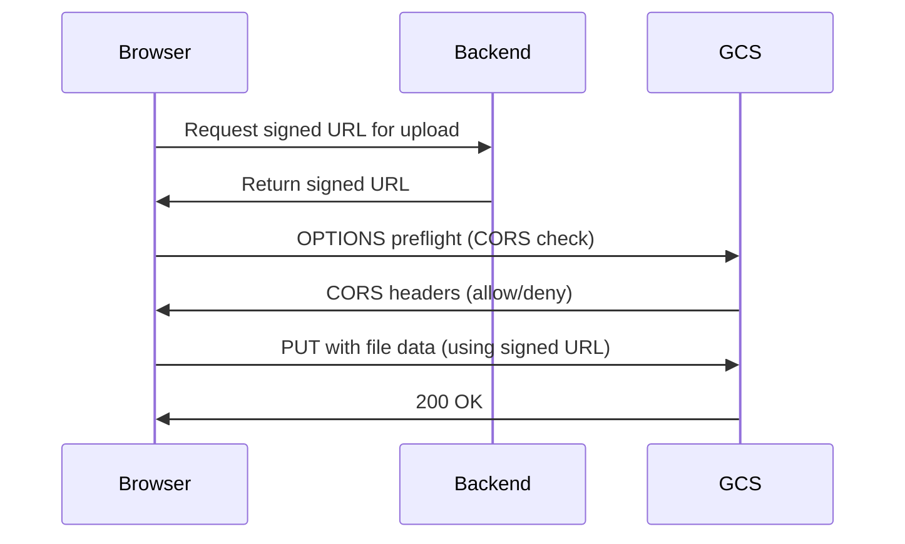

# How to Configure CORS Policies on Google Cloud Storage Buckets

Author: [nawazdhandala](https://www.github.com/nawazdhandala)

Tags: GCP, Google Cloud Storage, CORS, Web Development, Cloud Configuration

Description: Step-by-step guide to configuring CORS (Cross-Origin Resource Sharing) policies on Google Cloud Storage buckets for web applications and APIs.

---

If you have ever tried to load an image, font, or file from a Google Cloud Storage bucket directly in a web application and hit a cryptic browser error about "blocked by CORS policy," you know the frustration. The fix is straightforward once you understand how CORS works with GCS, but the configuration details are not always obvious.

This guide covers everything you need to set up CORS correctly on your Cloud Storage buckets.

## What CORS Is and Why It Matters for GCS

Cross-Origin Resource Sharing (CORS) is a browser security mechanism. When your web application at `https://myapp.com` tries to fetch a resource from `https://storage.googleapis.com/my-bucket/image.png`, the browser checks whether the storage server explicitly allows requests from `myapp.com`. If the CORS headers are not present in the response, the browser blocks the request.

Google Cloud Storage does not enable CORS by default. You need to configure it on each bucket that serves content directly to browsers.

Common scenarios where you need CORS configured:

- Loading images or media files directly from GCS in a web app
- Uploading files directly from a browser to GCS using signed URLs
- Serving web fonts from GCS
- Using XMLHttpRequest or the Fetch API to download files from GCS
- Single-page applications loading JSON or other data files

## Setting Up a Basic CORS Configuration

CORS configuration for GCS is defined in a JSON file. Here is a basic configuration that allows GET requests from a specific origin:

```json
[
  {
    "origin": ["https://myapp.com"],
    "method": ["GET"],
    "responseHeader": ["Content-Type"],
    "maxAgeSeconds": 3600
  }
]
```

Apply it to your bucket:

```bash
# Apply the CORS configuration to the bucket
gcloud storage buckets update gs://my-bucket \
  --cors-file=cors.json
```

Let me break down each field:

- **origin** - which domains can make cross-origin requests to this bucket
- **method** - which HTTP methods are allowed (GET, POST, PUT, DELETE, HEAD, OPTIONS)
- **responseHeader** - which response headers the browser can access
- **maxAgeSeconds** - how long the browser caches the preflight response

## Configuration for Direct Browser Uploads

When you let users upload files directly to GCS from the browser (usually with signed URLs), you need a more permissive configuration:

```json
[
  {
    "origin": ["https://myapp.com", "https://staging.myapp.com"],
    "method": ["GET", "PUT", "POST", "DELETE", "HEAD"],
    "responseHeader": [
      "Content-Type",
      "Content-Length",
      "Content-Range",
      "x-goog-resumable",
      "x-goog-meta-*"
    ],
    "maxAgeSeconds": 3600
  }
]
```

The `x-goog-resumable` header is needed for resumable uploads. The `x-goog-meta-*` wildcard allows reading custom metadata headers.

## Multiple CORS Rules

You can define different rules for different origins. GCS evaluates them in order and uses the first match:

```json
[
  {
    "origin": ["https://myapp.com"],
    "method": ["GET", "PUT", "POST", "DELETE"],
    "responseHeader": ["Content-Type", "x-goog-resumable"],
    "maxAgeSeconds": 3600
  },
  {
    "origin": ["https://partner-site.com"],
    "method": ["GET"],
    "responseHeader": ["Content-Type"],
    "maxAgeSeconds": 1800
  }
]
```

## Development Configuration

During development, you might need to allow localhost:

```json
[
  {
    "origin": [
      "http://localhost:3000",
      "http://localhost:5173",
      "https://myapp.com"
    ],
    "method": ["GET", "PUT", "POST", "DELETE", "HEAD"],
    "responseHeader": [
      "Content-Type",
      "Content-Length",
      "x-goog-resumable",
      "x-goog-meta-*"
    ],
    "maxAgeSeconds": 60
  }
]
```

Notice the lower `maxAgeSeconds` for development - you do not want to cache preflight responses too long while iterating on your setup.

## Using a Wildcard Origin

For public buckets where any site should be able to access the content:

```json
[
  {
    "origin": ["*"],
    "method": ["GET", "HEAD"],
    "responseHeader": ["Content-Type", "Content-Length"],
    "maxAgeSeconds": 3600
  }
]
```

Be careful with wildcard origins combined with methods other than GET. Only use `*` when the bucket content is truly public and read-only.

## Verifying Your CORS Configuration

Check what CORS configuration is currently set on a bucket:

```bash
# View the current CORS configuration
gcloud storage buckets describe gs://my-bucket --format="json(cors_config)"
```

Test the CORS response with curl by simulating a preflight request:

```bash
# Send a preflight OPTIONS request to test CORS headers
curl -i -X OPTIONS \
  -H "Origin: https://myapp.com" \
  -H "Access-Control-Request-Method: GET" \
  -H "Access-Control-Request-Headers: Content-Type" \
  "https://storage.googleapis.com/my-bucket/test-file.txt"
```

You should see headers like:

```
Access-Control-Allow-Origin: https://myapp.com
Access-Control-Allow-Methods: GET
Access-Control-Allow-Headers: Content-Type
Access-Control-Max-Age: 3600
```

For a regular GET request:

```bash
# Test a standard GET request with an Origin header
curl -i -H "Origin: https://myapp.com" \
  "https://storage.googleapis.com/my-bucket/test-file.txt"
```

## Removing CORS Configuration

To clear all CORS rules from a bucket:

```bash
# Remove all CORS configuration from the bucket
gcloud storage buckets update gs://my-bucket --clear-cors
```

## CORS with Signed URLs

When using signed URLs for browser uploads, you need CORS configured on the bucket even though the upload itself is authenticated via the signed URL. The browser still performs CORS preflight checks before sending the actual request.

Here is a typical flow:



The CORS configuration on the bucket determines whether that OPTIONS preflight succeeds.

## Common CORS Issues and Fixes

### The Preflight Response is Cached

If you update your CORS config but the browser still rejects requests, it might be using a cached preflight response. Either wait for `maxAgeSeconds` to expire, clear the browser cache, or test in an incognito window.

### Missing Response Headers

If you can make requests but cannot read certain response headers in JavaScript, add them to `responseHeader`. For example, if you need the `ETag` after an upload:

```json
{
  "origin": ["https://myapp.com"],
  "method": ["GET", "PUT"],
  "responseHeader": ["Content-Type", "ETag", "x-goog-generation"],
  "maxAgeSeconds": 3600
}
```

### XML API vs JSON API URLs

CORS applies differently depending on which API endpoint you use:

- `https://storage.googleapis.com/BUCKET/OBJECT` - XML API, CORS applies
- `https://www.googleapis.com/storage/v1/b/BUCKET/o/OBJECT` - JSON API, CORS applies
- `https://BUCKET.storage.googleapis.com/OBJECT` - path-style, CORS applies

All three respect the bucket CORS configuration, but make sure you are testing against the same URL pattern your application uses.

### Fonts Not Loading

Web fonts require CORS headers. If you host fonts in GCS, make sure your CORS config includes the origin of the site loading the fonts and allows the GET method.

## Terraform Configuration

For infrastructure-as-code setups:

```hcl
resource "google_storage_bucket" "web_assets" {
  name     = "my-web-assets"
  location = "US"

  cors {
    origin          = ["https://myapp.com"]
    method          = ["GET", "PUT", "POST"]
    response_header = ["Content-Type", "x-goog-resumable"]
    max_age_seconds = 3600
  }

  cors {
    origin          = ["https://partner-site.com"]
    method          = ["GET"]
    response_header = ["Content-Type"]
    max_age_seconds = 1800
  }
}
```

CORS configuration is one of those things that is simple in concept but easy to get wrong in practice. Start with the minimum permissions your application needs, test thoroughly with the curl commands above, and expand as needed. Keeping your CORS rules as restrictive as possible is always a good security practice.
