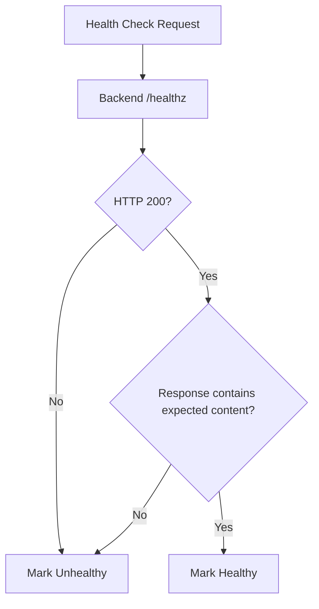

# How to Configure Custom Health Checks with Content Matching on GCP Load Balancer

Author: [nawazdhandala](https://www.github.com/nawazdhandala)

Tags: GCP, Health Checks, Load Balancer, Content Matching, Google Cloud Networking

Description: Learn how to configure custom health checks with content matching on GCP Load Balancer to detect application-level failures beyond simple HTTP status codes.

---

Standard health checks on Google Cloud load balancers typically just verify that a backend returns an HTTP 200 status code. But returning 200 does not always mean your application is healthy. Your web server might be up while the database connection is broken, or the application might be serving an error page with a 200 status. Content matching solves this by letting you verify that the response body actually contains expected content.

This guide walks through setting up health checks that go beyond status codes and validate response content.

## The Problem with Basic Health Checks

Consider this scenario: your application has a health endpoint at `/healthz` that checks database connectivity, cache availability, and disk space. If the database goes down, the endpoint should indicate failure. But what if there is a bug and the endpoint returns HTTP 200 with a body that says `{"status": "unhealthy"}`? A basic health check would see the 200 status and keep sending traffic to that backend.

Content matching catches this. You tell the health check to look for specific text in the response body, and only mark the backend as healthy if that text is present.



## Creating a Health Check with Content Matching

Here is how to create an HTTP health check that validates both the status code and the response body:

```bash
# Create an HTTP health check that verifies the response contains "status":"ok"
# The backend is only considered healthy if both the status code and content match
gcloud compute health-checks create http my-content-health-check \
    --port=8080 \
    --request-path="/healthz" \
    --response="\"status\":\"ok\"" \
    --check-interval=10s \
    --timeout=5s \
    --healthy-threshold=2 \
    --unhealthy-threshold=3
```

The `--response` flag is the content matching string. The health check will look for this exact string anywhere in the response body. If the response is `{"status":"ok","uptime":12345}`, the check passes because `"status":"ok"` appears in the body.

## Health Check Parameters Explained

Let me break down each parameter and why it matters:

- **port** - The port to check. Make sure this matches where your application actually listens.
- **request-path** - The URL path for the health check request. Use a dedicated health endpoint, not your homepage.
- **response** - The string to match in the response body. Must be 1024 bytes or less.
- **check-interval** - How often to probe. 10 seconds is a good default for most applications.
- **timeout** - How long to wait for a response. Keep this well below the check interval.
- **healthy-threshold** - Number of consecutive successes before marking a backend healthy. 2 means a backend must pass twice before receiving traffic.
- **unhealthy-threshold** - Number of consecutive failures before marking a backend unhealthy. 3 gives backends some tolerance for brief hiccups.

## Designing Your Health Endpoint

The health endpoint itself matters as much as the health check configuration. Here is an example of a well-designed health endpoint in a Node.js application:

```javascript
// Health check endpoint that validates all critical dependencies
// Returns a JSON object with overall status and individual component checks
app.get('/healthz', async (req, res) => {
  const checks = {};
  let allHealthy = true;

  // Check database connectivity
  try {
    await db.query('SELECT 1');
    checks.database = 'ok';
  } catch (err) {
    checks.database = 'failed';
    allHealthy = false;
  }

  // Check Redis cache connectivity
  try {
    await redis.ping();
    checks.cache = 'ok';
  } catch (err) {
    checks.cache = 'failed';
    allHealthy = false;
  }

  // Check disk space (ensure at least 100MB free)
  const freeSpace = await getDiskFreeSpace();
  if (freeSpace > 100 * 1024 * 1024) {
    checks.disk = 'ok';
  } else {
    checks.disk = 'low';
    allHealthy = false;
  }

  const status = allHealthy ? 'ok' : 'degraded';
  const httpCode = allHealthy ? 200 : 503;

  // The response includes "status":"ok" only when all checks pass
  // This is what the load balancer content matching looks for
  res.status(httpCode).json({ status, checks });
});
```

With this endpoint, the health check content matching string `"status":"ok"` only matches when all dependencies are healthy. If the database goes down, the response changes to `"status":"degraded"` and the content match fails.

## HTTPS Health Checks with Content Matching

For backends that only accept HTTPS connections:

```bash
# Create an HTTPS health check with content matching
# Useful when your backends terminate TLS directly
gcloud compute health-checks create https my-https-content-check \
    --port=443 \
    --request-path="/healthz" \
    --response="HEALTHY" \
    --check-interval=15s \
    --timeout=5s \
    --healthy-threshold=2 \
    --unhealthy-threshold=3
```

## gRPC Health Checks

If you are running gRPC services, GCP supports gRPC health checks that follow the gRPC health checking protocol:

```bash
# Create a gRPC health check for gRPC backend services
# Uses the standard gRPC health checking protocol
gcloud compute health-checks create grpc my-grpc-health-check \
    --port=50051 \
    --grpc-service-name="my.service.v1" \
    --check-interval=10s \
    --timeout=5s \
    --healthy-threshold=2 \
    --unhealthy-threshold=3
```

## Terraform Configuration

Here is the Terraform version for managing health checks as code:

```hcl
# HTTP health check with content matching
# Only marks backends healthy if the response body contains the expected string
resource "google_compute_health_check" "content_match" {
  name                = "content-match-health-check"
  check_interval_sec  = 10
  timeout_sec         = 5
  healthy_threshold   = 2
  unhealthy_threshold = 3

  http_health_check {
    port         = 8080
    request_path = "/healthz"
    response     = "\"status\":\"ok\""
  }
}

# Attach the health check to a backend service
resource "google_compute_backend_service" "app" {
  name          = "app-backend-service"
  health_checks = [google_compute_health_check.content_match.id]
  protocol      = "HTTP"
  timeout_sec   = 30

  backend {
    group = google_compute_instance_group_manager.app.instance_group
  }
}
```

## Using Different Health Checks for Different Purposes

GCP allows you to attach multiple health checks to a backend service. Consider using separate health checks for liveness and readiness:

```bash
# Liveness check - basic TCP connectivity, checks if the process is alive
gcloud compute health-checks create tcp liveness-check \
    --port=8080 \
    --check-interval=5s \
    --timeout=3s \
    --healthy-threshold=1 \
    --unhealthy-threshold=2

# Readiness check - content matching to verify the app is ready to serve
gcloud compute health-checks create http readiness-check \
    --port=8080 \
    --request-path="/readyz" \
    --response="ready" \
    --check-interval=10s \
    --timeout=5s \
    --healthy-threshold=2 \
    --unhealthy-threshold=3
```

## Troubleshooting Health Check Failures

When content matching health checks fail and you are not sure why, use these debugging steps:

```bash
# Check the health status of all backends in a backend service
gcloud compute backend-services get-health my-backend-service --global

# SSH into a backend instance and test the health endpoint directly
# Compare the output against your expected content match string
curl -v http://localhost:8080/healthz
```

Common causes of content matching failures:

1. **Encoding differences** - Your application might return JSON with different spacing than expected. Use a simple match string that is resilient to formatting changes.
2. **Response too large** - GCP only inspects the first 1024 bytes of the response. Keep your health endpoint response small.
3. **Firewall rules** - Health check probes come from specific Google IP ranges (130.211.0.0/22 and 35.191.0.0/16). Make sure your firewall allows these.

```bash
# Create a firewall rule to allow health check probes from Google's ranges
gcloud compute firewall-rules create allow-health-checks \
    --network=my-vpc \
    --allow=tcp:8080 \
    --source-ranges=130.211.0.0/22,35.191.0.0/16 \
    --target-tags=http-server
```

## Best Practices

**Keep the content match string simple.** Do not match the entire response body. A short, unique string like `"status":"ok"` is more reliable than matching a long JSON object that might change format.

**Make health endpoints fast.** Health checks run every few seconds across all backends. If your health endpoint takes 2 seconds because it runs a complex database query, that adds up. Cache dependency checks or use lightweight probes.

**Use appropriate thresholds.** Setting unhealthy-threshold to 1 means a single failed probe removes the backend from the pool. This is too aggressive for most applications. Start with 3 and adjust based on your tolerance for false positives.

**Monitor health check status.** Set up alerts on the `compute.googleapis.com/instance/uptime_total` metric filtered by health check status to know when backends are flapping between healthy and unhealthy states.

Content matching health checks are a straightforward way to add application-level awareness to your load balancer. They catch a class of failures that simple status code checks miss, and they take just a few minutes to configure.
