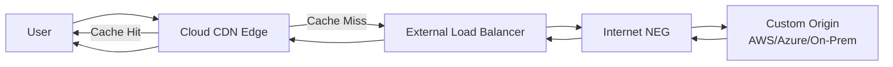

# How to Configure Custom Origins for Non-GCP Backends with Google Cloud CDN

Author: [nawazdhandala](https://www.github.com/nawazdhandala)

Tags: GCP, Cloud CDN, Custom Origins, Content Delivery, Networking

Description: Learn how to configure Google Cloud CDN with custom origins pointing to non-GCP backends like AWS, Azure, or on-premises servers for content delivery.

---

Cloud CDN is not limited to serving content from GCP resources. You can point it at any HTTP or HTTPS backend on the internet - an AWS EC2 instance, an Azure App Service, your own on-premises server, or any other HTTP endpoint. This is called a custom origin, and it lets you use Cloud CDN's global edge network in front of backends that live outside GCP.

In this guide, I will show you how to set up Cloud CDN with a custom origin, configure health checks, and handle the quirks that come with non-GCP backends.

## Why Use Custom Origins

There are several practical reasons to use Cloud CDN with non-GCP backends:

- **Migration in progress**: You are moving to GCP but your backend is still on AWS or on-premises
- **Multi-cloud architecture**: Your backend runs on another cloud provider but you want GCP's CDN edge network
- **Third-party content**: You are caching content from a third-party API or CMS
- **Hybrid setup**: Some content comes from GCP, some from elsewhere

## Architecture Overview

When using a custom origin, the request flow looks like this:



The key component is the Internet Network Endpoint Group (NEG), which tells Cloud CDN where your custom origin lives.

## Step 1: Create an Internet NEG

An Internet NEG defines the external endpoint that Cloud CDN should fetch content from.

```bash
# Create an Internet NEG pointing to your custom origin
gcloud compute network-endpoint-groups create custom-origin-neg \
    --network-endpoint-type=INTERNET_FQDN_PORT \
    --global \
    --project=my-project

# Add the custom origin endpoint
gcloud compute network-endpoint-groups update custom-origin-neg \
    --add-endpoint="fqdn=origin.example.com,port=443" \
    --global \
    --project=my-project
```

You can also use an IP address instead of an FQDN.

```bash
# Create an Internet NEG with an IP address
gcloud compute network-endpoint-groups create custom-origin-neg-ip \
    --network-endpoint-type=INTERNET_IP_PORT \
    --global \
    --project=my-project

# Add the IP-based endpoint
gcloud compute network-endpoint-groups update custom-origin-neg-ip \
    --add-endpoint="ipAddress=203.0.113.50,port=443" \
    --global \
    --project=my-project
```

## Step 2: Create a Backend Service

Create a backend service that uses the Internet NEG as its backend.

```bash
# Create a backend service for the custom origin
gcloud compute backend-services create custom-origin-backend \
    --protocol=HTTPS \
    --global \
    --project=my-project

# Add the Internet NEG as a backend
gcloud compute backend-services add-backend custom-origin-backend \
    --network-endpoint-group=custom-origin-neg \
    --global-network-endpoint-group \
    --global \
    --project=my-project
```

## Step 3: Enable Cloud CDN

Enable Cloud CDN on the backend service and configure caching.

```bash
# Enable Cloud CDN with cache settings
gcloud compute backend-services update custom-origin-backend \
    --enable-cdn \
    --cache-mode=CACHE_ALL_STATIC \
    --default-ttl=3600 \
    --max-ttl=86400 \
    --client-ttl=300 \
    --global \
    --project=my-project
```

## Step 4: Set Up the URL Map and Frontend

Create a URL map and configure the external HTTPS load balancer.

```bash
# Create a URL map that routes to the custom origin backend
gcloud compute url-maps create custom-origin-cdn \
    --default-service=custom-origin-backend \
    --global \
    --project=my-project

# Reserve a static IP for the load balancer
gcloud compute addresses create cdn-ip \
    --ip-version=IPV4 \
    --global \
    --project=my-project

# Create an SSL certificate (using managed certificate)
gcloud compute ssl-certificates create cdn-cert \
    --domains=cdn.example.com \
    --global \
    --project=my-project

# Create the HTTPS proxy
gcloud compute target-https-proxies create cdn-https-proxy \
    --url-map=custom-origin-cdn \
    --ssl-certificates=cdn-cert \
    --global \
    --project=my-project

# Create the forwarding rule
gcloud compute forwarding-rules create cdn-forwarding-rule \
    --address=cdn-ip \
    --target-https-proxy=cdn-https-proxy \
    --ports=443 \
    --global \
    --project=my-project
```

## Step 5: Configure Host Header and Origin Protocol

When Cloud CDN fetches from your custom origin, it needs to send the correct Host header. By default, it uses the FQDN from the Internet NEG, but you might need to customize this.

```bash
# Set custom request headers for the backend service
gcloud compute backend-services update custom-origin-backend \
    --custom-request-headers="Host: origin.example.com" \
    --global \
    --project=my-project
```

If your origin requires specific headers for authentication or routing, add them here.

```bash
# Add multiple custom headers
gcloud compute backend-services update custom-origin-backend \
    --custom-request-headers="Host: origin.example.com" \
    --custom-request-headers="X-CDN-Origin: gcp" \
    --custom-request-headers="X-Forwarded-Proto: https" \
    --global \
    --project=my-project
```

## Step 6: Configure Health Checks

Health checks ensure Cloud CDN does not send traffic to an unhealthy origin.

```bash
# Create a health check for the custom origin
gcloud compute health-checks create https custom-origin-health \
    --host=origin.example.com \
    --port=443 \
    --request-path=/health \
    --check-interval=30 \
    --timeout=10 \
    --healthy-threshold=2 \
    --unhealthy-threshold=3 \
    --global \
    --project=my-project

# Attach the health check to the backend service
gcloud compute backend-services update custom-origin-backend \
    --health-checks=custom-origin-health \
    --global \
    --project=my-project
```

## Terraform Configuration

Here is the complete setup in Terraform.

```hcl
# Internet NEG for the custom origin
resource "google_compute_global_network_endpoint_group" "custom_origin" {
  name                  = "custom-origin-neg"
  network_endpoint_type = "INTERNET_FQDN_PORT"
  default_port          = 443
}

# Add the endpoint to the NEG
resource "google_compute_global_network_endpoint" "origin_endpoint" {
  global_network_endpoint_group = google_compute_global_network_endpoint_group.custom_origin.id
  fqdn                         = "origin.example.com"
  port                         = 443
}

# Backend service with Cloud CDN enabled
resource "google_compute_backend_service" "custom_backend" {
  name                  = "custom-origin-backend"
  protocol              = "HTTPS"
  load_balancing_scheme = "EXTERNAL"
  enable_cdn            = true

  cdn_policy {
    cache_mode  = "CACHE_ALL_STATIC"
    default_ttl = 3600
    max_ttl     = 86400
    client_ttl  = 300
  }

  custom_request_headers = [
    "Host: origin.example.com",
  ]

  backend {
    group = google_compute_global_network_endpoint_group.custom_origin.id
  }

  health_checks = [google_compute_health_check.origin.id]
}

# Health check
resource "google_compute_health_check" "origin" {
  name               = "custom-origin-health"
  check_interval_sec = 30
  timeout_sec        = 10

  https_health_check {
    host         = "origin.example.com"
    port         = 443
    request_path = "/health"
  }
}

# URL map
resource "google_compute_url_map" "cdn" {
  name            = "custom-origin-cdn"
  default_service = google_compute_backend_service.custom_backend.id
}

# SSL certificate
resource "google_compute_managed_ssl_certificate" "cdn_cert" {
  name = "cdn-cert"
  managed {
    domains = ["cdn.example.com"]
  }
}

# HTTPS proxy
resource "google_compute_target_https_proxy" "cdn_proxy" {
  name             = "cdn-https-proxy"
  url_map          = google_compute_url_map.cdn.id
  ssl_certificates = [google_compute_managed_ssl_certificate.cdn_cert.id]
}

# Static IP
resource "google_compute_global_address" "cdn_ip" {
  name = "cdn-ip"
}

# Forwarding rule
resource "google_compute_global_forwarding_rule" "cdn_rule" {
  name       = "cdn-forwarding-rule"
  target     = google_compute_target_https_proxy.cdn_proxy.id
  port_range = "443"
  ip_address = google_compute_global_address.cdn_ip.address
}
```

## Handling CORS with Custom Origins

If your custom origin serves API responses or assets that are loaded cross-origin, you need to handle CORS headers. You can either configure CORS on the origin or add response headers through Cloud CDN.

```bash
# Add CORS headers as custom response headers
gcloud compute backend-services update custom-origin-backend \
    --custom-response-headers="Access-Control-Allow-Origin: *" \
    --custom-response-headers="Access-Control-Allow-Methods: GET, HEAD, OPTIONS" \
    --global \
    --project=my-project
```

## Troubleshooting

**502 Bad Gateway**: Cloud CDN cannot reach the origin. Check that the FQDN or IP in the Internet NEG is correct and the port is open. Verify the origin's firewall allows connections from Google's IP ranges.

**SSL errors**: If the origin uses a self-signed certificate, Cloud CDN will reject it. The origin must have a valid, publicly trusted SSL certificate.

**Wrong content served**: Check the Host header. If the origin serves different content based on the Host header, you need to set the correct custom request header.

**Health check failures**: Make sure the health check path exists on the origin and returns a 200 status. Check that the Host header in the health check matches what the origin expects.

## Wrapping Up

Custom origins expand Cloud CDN beyond GCP, letting you cache and accelerate content from any HTTP backend on the internet. The setup involves a few more components than a standard GCP backend, mainly the Internet NEG and careful header configuration, but once it is running, you get the same caching, edge network, and performance benefits as any other Cloud CDN deployment. This makes it a practical choice during cloud migrations or for multi-cloud architectures where your content lives outside GCP.
