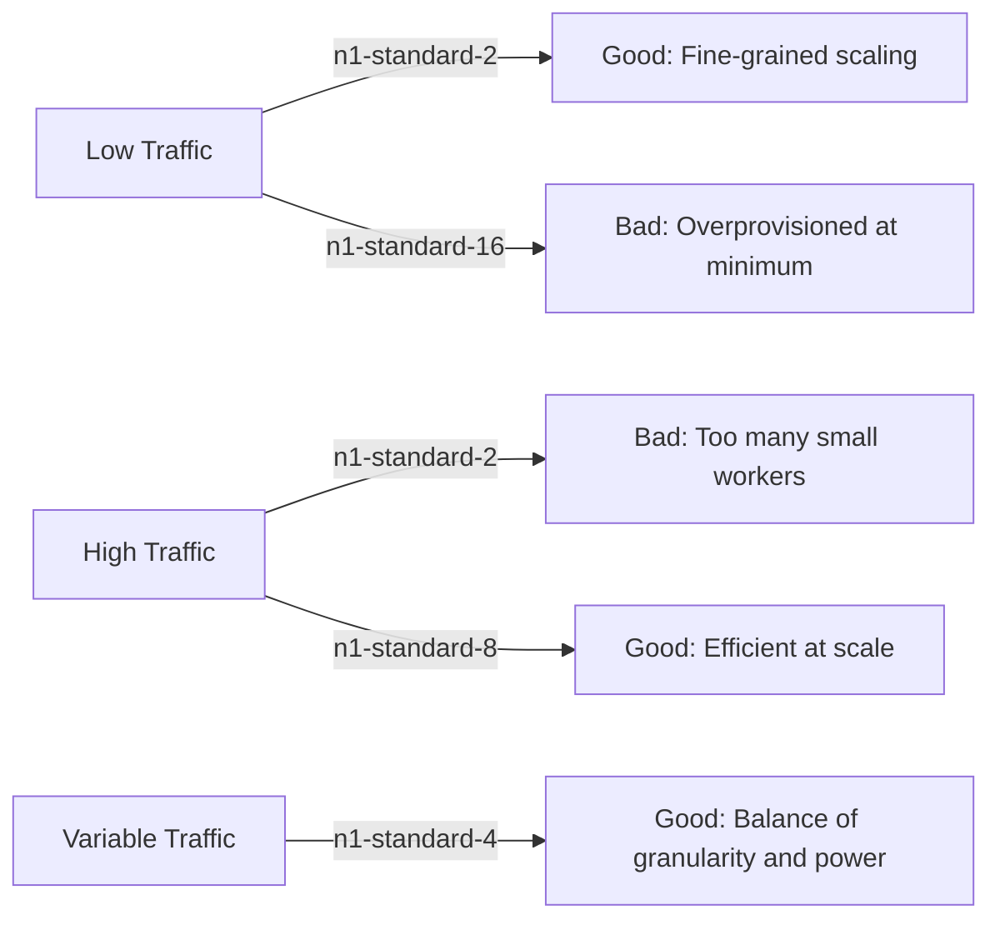

# How to Configure Dataflow Autoscaling for Cost-Efficient Streaming Pipelines

Author: [nawazdhandala](https://www.github.com/nawazdhandala)

Tags: GCP, Google Cloud Dataflow, Autoscaling, Streaming, Cost Optimization

Description: Configure Google Cloud Dataflow autoscaling to automatically adjust worker count based on workload, reducing costs while maintaining pipeline performance.

---

Running a streaming Dataflow pipeline 24/7 with a fixed number of workers is expensive and wasteful. Traffic patterns vary - you might have heavy load during business hours and almost nothing at night. Autoscaling lets Dataflow automatically adjust the number of workers based on actual demand, so you only pay for what you need.

Getting autoscaling right is a balancing act. Scale up too slowly and you get a backlog. Scale down too aggressively and you waste resources on worker startup costs. Let me show you how to configure autoscaling for different scenarios.

## How Dataflow Autoscaling Works

Dataflow's autoscaling algorithm monitors several signals to decide when to add or remove workers:

- **Backlog size**: How much unprocessed data is waiting
- **CPU utilization**: How busy the current workers are
- **Throughput**: How many elements per second are being processed
- **System lag**: The difference between the watermark and wall clock time

Based on these signals, Dataflow calculates the ideal number of workers and adjusts up or down. The algorithm aims to keep the pipeline processing data with minimal lag while using the fewest workers possible.

## Basic Autoscaling Configuration

When launching a streaming pipeline, you control autoscaling through these parameters.

```bash
# Launch with throughput-based autoscaling
gcloud dataflow jobs run my-streaming-job \
  --gcs-location=gs://my-bucket/templates/my-template \
  --region=us-central1 \
  --num-workers=3 \
  --max-num-workers=20 \
  --autoscaling-algorithm=THROUGHPUT_BASED \
  --worker-machine-type=n1-standard-4
```

The key parameters:
- `num-workers`: Initial number of workers when the pipeline starts
- `max-num-workers`: The ceiling - Dataflow will never scale beyond this
- `autoscaling-algorithm`: Set to `THROUGHPUT_BASED` for streaming pipelines

If you are using the Beam SDK to launch your pipeline programmatically, set these in your pipeline options.

```java
// Configure autoscaling in pipeline options
DataflowPipelineOptions options = PipelineOptionsFactory
    .fromArgs(args)
    .as(DataflowPipelineOptions.class);

options.setNumWorkers(3);              // Start with 3 workers
options.setMaxNumWorkers(20);          // Scale up to 20 max
options.setAutoscalingAlgorithm(
    AutoscalingAlgorithmType.THROUGHPUT_BASED);
options.setWorkerMachineType("n1-standard-4");
options.setStreaming(true);

Pipeline pipeline = Pipeline.create(options);
```

## Choosing the Right Machine Type

The machine type affects both cost and autoscaling behavior. Smaller machines mean more granular scaling but more overhead per worker. Larger machines mean coarser scaling but more processing power per worker.



For most streaming pipelines, `n1-standard-4` or `n2-standard-4` provides a good balance. Use larger machines if your pipeline does memory-intensive operations like large joins or aggregations.

## Setting the Right Maximum Workers

Setting `max-num-workers` is about managing cost risk. If something goes wrong - a sudden traffic spike, a slow downstream service - autoscaling will keep adding workers up to the maximum. Each worker costs money.

Calculate your maximum based on your peak expected throughput plus some headroom.

```python
# Rough calculation for max workers
# Suppose each n1-standard-4 worker handles ~5,000 events/sec
# Your peak traffic is 50,000 events/sec
# Add 50% headroom for spikes

events_per_second_peak = 50000
throughput_per_worker = 5000
headroom_factor = 1.5

max_workers = int((events_per_second_peak / throughput_per_worker) * headroom_factor)
# max_workers = 15

print(f"Recommended max workers: {max_workers}")
```

## Horizontal vs. Vertical Autoscaling

Dataflow primarily uses horizontal autoscaling - adding or removing workers. But you can also use vertical autoscaling by choosing different machine types.

For pipelines with consistent per-element processing costs, horizontal scaling works well. For pipelines where memory usage varies (like those with large side inputs or stateful processing), you might need to start with a larger machine type and scale horizontally from there.

```bash
# For memory-intensive pipelines, use a highmem machine type
gcloud dataflow jobs run memory-intensive-job \
  --gcs-location=gs://my-bucket/templates/my-template \
  --region=us-central1 \
  --num-workers=2 \
  --max-num-workers=10 \
  --worker-machine-type=n1-highmem-4 \
  --autoscaling-algorithm=THROUGHPUT_BASED
```

## Controlling Scale-Down Behavior

Dataflow is conservative about scaling down to avoid thrashing. After removing workers, it waits before removing more. This prevents the oscillation pattern where the pipeline scales down, immediately gets a backlog, scales back up, processes the backlog, scales down again, and repeats.

You cannot directly configure the scale-down aggressiveness, but you can influence it by:

1. Setting your initial worker count close to your steady-state need
2. Using the right machine type so each worker handles a meaningful portion of the load
3. Smoothing traffic upstream if possible (batch Pub/Sub publishes)

## Cost Optimization Strategies

Here are strategies I have used to reduce streaming pipeline costs significantly.

**Use preemptible/spot VMs for batch Dataflow jobs.** Streaming jobs cannot use preemptible VMs because worker loss disrupts state, but batch jobs can.

**Right-size your minimum worker count.** If you know your baseline traffic requires at least 2 workers, set `num-workers=2` and let autoscaling handle the rest. Do not set it to 10 if you only need 2 most of the time.

**Monitor and adjust max-workers.** Review your actual peak worker count over the past month. If you set max to 20 but never go above 8, lower the max to 12 to reduce risk.

```bash
# Check historical worker count for a running job
gcloud dataflow metrics list JOB_ID \
  --region=us-central1 \
  --filter="name.name=CurrentNumWorkers"
```

**Consider Dataflow Prime for automatic vertical scaling.** Dataflow Prime can adjust CPU, memory, and disk independently per worker, potentially reducing costs further.

## Monitoring Autoscaling Behavior

You should actively monitor how autoscaling behaves to validate your configuration.

```bash
# View autoscaling events in the job logs
gcloud logging read "resource.type=dataflow_step AND
  jsonPayload.message:\"Autoscaler\"" \
  --project=my-project \
  --limit=20 \
  --format="table(timestamp, jsonPayload.message)"
```

Key metrics to watch in Cloud Monitoring:

```
dataflow.googleapis.com/job/current_num_vcpus  # Total vCPUs in use
dataflow.googleapis.com/job/system_lag          # How far behind the pipeline is
dataflow.googleapis.com/job/backlog_bytes       # Unprocessed data volume
dataflow.googleapis.com/job/elements_produced   # Throughput
```

Set up alerts for when system lag exceeds your acceptable threshold. If autoscaling cannot keep up, you might need to increase max workers or optimize your pipeline.

## Disabling Autoscaling

In some cases, you might want to disable autoscaling and run with a fixed number of workers. This is useful for debugging, benchmarking, or when you have very predictable traffic.

```bash
# Run with exactly 5 workers, no autoscaling
gcloud dataflow jobs run fixed-workers-job \
  --gcs-location=gs://my-bucket/templates/my-template \
  --region=us-central1 \
  --num-workers=5 \
  --max-num-workers=5 \
  --autoscaling-algorithm=NONE
```

Setting `max-num-workers` equal to `num-workers` with `NONE` algorithm ensures a fixed worker count.

## Autoscaling with Streaming Engine

Dataflow Streaming Engine offloads shuffle and state management from workers to the Dataflow service. This changes autoscaling dynamics because workers are lighter and can scale faster.

```bash
# Enable Streaming Engine for faster autoscaling
gcloud dataflow jobs run streaming-engine-job \
  --gcs-location=gs://my-bucket/templates/my-template \
  --region=us-central1 \
  --num-workers=2 \
  --max-num-workers=15 \
  --enable-streaming-engine \
  --worker-machine-type=n1-standard-2
```

With Streaming Engine, you can often use smaller machine types because the heavy lifting is done by the service. Workers mainly handle user code execution. This makes autoscaling more granular and cost-effective.

## Practical Recommendations

Start with autoscaling enabled. There is rarely a good reason to use fixed workers for a production streaming pipeline.

Set your initial worker count to handle your average load, not your peak. Let autoscaling handle spikes.

Review your costs monthly. Look at the ratio of worker hours to data processed. If the cost per GB is climbing, investigate whether you are over-provisioned or if your pipeline efficiency has degraded.

Use Streaming Engine. It almost always reduces costs and improves autoscaling responsiveness for streaming pipelines.

Autoscaling is one of Dataflow's best features for managing the cost of always-on streaming pipelines. Configure it thoughtfully, monitor it actively, and adjust based on real usage patterns.
