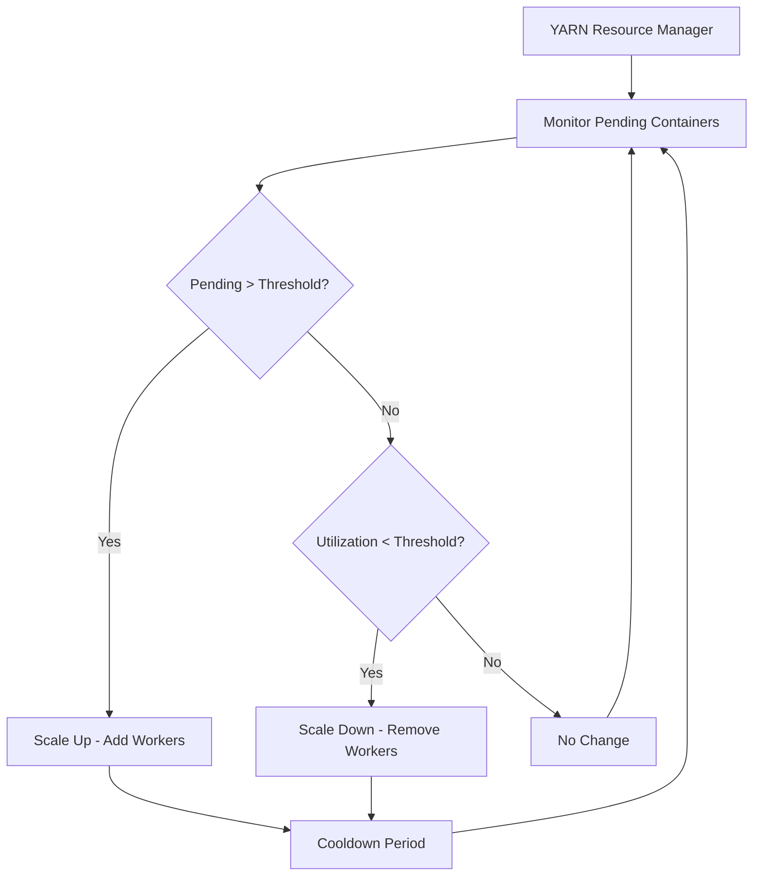

# How to Configure Dataproc Autoscaling Policies for Variable Workloads

Author: [nawazdhandala](https://www.github.com/nawazdhandala)

Tags: GCP, Google Cloud Dataproc, Autoscaling, Spark, Cost Optimization

Description: Configure Dataproc autoscaling policies to automatically adjust cluster size based on YARN metrics, reducing costs for variable Spark and Hadoop workloads.

---

Running a fixed-size Dataproc cluster for variable workloads wastes money. If your cluster is sized for peak load, it sits mostly idle during off-peak hours. If it is sized for average load, peak periods cause job queuing and slow processing. Autoscaling solves this by dynamically adjusting the number of worker nodes based on actual demand.

Dataproc autoscaling uses YARN metrics to make scaling decisions. When pending containers pile up, it adds workers. When resources are underutilized, it removes workers. The challenge is configuring the policy so it scales fast enough to handle spikes without thrashing back and forth during normal operation.

## How Dataproc Autoscaling Works

Dataproc's autoscaler monitors YARN (Yet Another Resource Negotiator) metrics, specifically the ratio of pending memory and available memory. When jobs request more resources than the cluster can provide, pending containers accumulate. The autoscaler sees this and adds workers.



## Creating an Autoscaling Policy

Autoscaling policies are defined as YAML configuration files and created as Dataproc resources.

```yaml
# autoscaling-policy.yaml
workerConfig:
  minInstances: 2
  maxInstances: 20
  weight: 1

secondaryWorkerConfig:
  minInstances: 0
  maxInstances: 50
  weight: 1

basicAlgorithm:
  yarnConfig:
    scaleUpFactor: 1.0
    scaleDownFactor: 1.0
    scaleUpMinWorkerFraction: 0.0
    scaleDownMinWorkerFraction: 0.0
    gracefulDecommissionTimeout: 1h

  cooldownPeriod: 2m
```

Create the policy using the gcloud CLI.

```bash
# Create the autoscaling policy
gcloud dataproc autoscaling-policies import my-scaling-policy \
  --source=autoscaling-policy.yaml \
  --region=us-central1
```

## Understanding Policy Parameters

Let me break down what each parameter does, because the names are not always intuitive.

**minInstances and maxInstances**: The bounds for scaling. Workers will never go below min or above max. Set min to the number of workers needed for your baseline load.

**weight**: Controls the ratio between primary and secondary (preemptible) workers when scaling. A weight of 1 for both means equal scaling. If you set secondary weight to 3 and primary weight to 1, the autoscaler adds 3 secondary workers for every 1 primary worker.

**scaleUpFactor**: A multiplier from 0.0 to 1.0 that controls how aggressively to scale up. A value of 1.0 means "add enough workers to handle all pending containers immediately." A value of 0.5 means "add half the workers needed." Lower values make scaling more gradual.

**scaleDownFactor**: Same concept for scaling down. A value of 1.0 removes all unnecessary workers immediately. A lower value makes scale-down more gradual.

**scaleUpMinWorkerFraction**: The minimum fraction of workers to add in a single scaling event. This prevents adding just 1 worker at a time, which can be slow for large spikes. A value of 0.1 means "always add at least 10% of the current cluster size."

**gracefulDecommissionTimeout**: How long to wait for running tasks to finish before removing a worker during scale-down. This prevents killing in-progress tasks.

**cooldownPeriod**: The minimum time between scaling actions. This prevents thrashing.

## Attaching a Policy to a Cluster

Apply the autoscaling policy when creating a cluster.

```bash
# Create a cluster with the autoscaling policy
gcloud dataproc clusters create my-cluster \
  --region=us-central1 \
  --autoscaling-policy=my-scaling-policy \
  --num-workers=4 \
  --num-secondary-workers=0 \
  --worker-machine-type=n1-standard-8 \
  --master-machine-type=n1-standard-4 \
  --image-version=2.1-debian11
```

You can also attach a policy to an existing cluster.

```bash
# Update an existing cluster to use autoscaling
gcloud dataproc clusters update my-cluster \
  --region=us-central1 \
  --autoscaling-policy=my-scaling-policy
```

## Cost-Optimized Policy with Preemptible Workers

For significant cost savings, configure the policy to prefer preemptible (spot) workers for scale-up.

```yaml
# cost-optimized-policy.yaml
workerConfig:
  # Keep a small fixed number of primary workers for stability
  minInstances: 2
  maxInstances: 4
  weight: 1

secondaryWorkerConfig:
  # Use preemptible workers for burst capacity
  minInstances: 0
  maxInstances: 30
  weight: 3    # Scale preemptible 3x faster than primary

basicAlgorithm:
  yarnConfig:
    scaleUpFactor: 1.0
    scaleDownFactor: 1.0
    scaleUpMinWorkerFraction: 0.0
    scaleDownMinWorkerFraction: 0.0
    gracefulDecommissionTimeout: 30m

  cooldownPeriod: 2m
```

With this configuration, the cluster maintains 2-4 primary workers for reliability and uses preemptible workers (at roughly 80% discount) for burst capacity up to 30 additional nodes.

```bash
# Create the cost-optimized cluster
gcloud dataproc clusters create cost-optimized \
  --region=us-central1 \
  --autoscaling-policy=cost-optimized-policy \
  --num-workers=2 \
  --num-secondary-workers=0 \
  --secondary-worker-type=preemptible \
  --worker-machine-type=n1-standard-8 \
  --master-machine-type=n1-standard-4
```

## Aggressive Scale-Up, Gradual Scale-Down

In practice, you usually want to scale up quickly (to avoid job delays) but scale down slowly (to avoid thrashing and to handle follow-up jobs).

```yaml
# aggressive-up-gradual-down.yaml
workerConfig:
  minInstances: 2
  maxInstances: 20
  weight: 1

secondaryWorkerConfig:
  minInstances: 0
  maxInstances: 30
  weight: 2

basicAlgorithm:
  yarnConfig:
    # Scale up aggressively - add all needed workers at once
    scaleUpFactor: 1.0
    scaleUpMinWorkerFraction: 0.2  # Add at least 20% more workers

    # Scale down gradually - remove only 25% of excess at a time
    scaleDownFactor: 0.25
    scaleDownMinWorkerFraction: 0.0

    # Wait an hour for tasks to finish before removing workers
    gracefulDecommissionTimeout: 1h

  # Wait 5 minutes between scaling actions
  cooldownPeriod: 5m
```

The `scaleDownFactor` of 0.25 means the cluster slowly shrinks over multiple cooldown periods rather than dropping all extra workers at once. This is better for batch workloads where jobs arrive in bursts.

## Monitoring Autoscaling

Watch the autoscaling behavior to validate your policy.

```bash
# View autoscaling events in the cluster's logs
gcloud logging read 'resource.type="cloud_dataproc_cluster" AND
  resource.labels.cluster_name="my-cluster" AND
  jsonPayload.message:"scaling"' \
  --project=my-project \
  --region=us-central1 \
  --limit=20 \
  --format="table(timestamp, jsonPayload.message)"
```

Key metrics to monitor in Cloud Monitoring:

```
cloud.google.com/dataproc/cluster/yarn/nodemanagers  # Current worker count
cloud.google.com/dataproc/cluster/yarn/pending_memory_mb  # Pending memory
cloud.google.com/dataproc/cluster/yarn/available_memory_mb  # Available memory
```

Set up alerts for when pending memory stays high for more than a few cooldown periods. This indicates the cluster is at max capacity and cannot scale further.

## Common Autoscaling Issues

**Scaling too slowly for short-lived jobs.** If your jobs only take 5 minutes and the cooldown is 2 minutes, the cluster might not scale up before the job finishes. For short jobs, reduce the cooldown period and increase scaleUpFactor.

**Workers being removed during shuffle.** Spark shuffle data is stored on local disks. If a worker is removed during a shuffle-heavy stage, the shuffle data is lost and the stage needs to restart. Set gracefulDecommissionTimeout to be longer than your longest shuffle stage.

**Preemptible workers being reclaimed.** Preemptible VMs can be reclaimed at any time. For long-running jobs, this can cause repeated task failures. Configure your Spark jobs to handle this with speculation and retry settings.

```bash
# Spark settings for handling preemptible worker loss
--properties="spark.speculation=true,\
spark.task.maxFailures=8,\
spark.stage.maxConsecutiveAttempts=4"
```

## Updating a Policy

You can update an autoscaling policy without recreating clusters. Clusters using the policy pick up changes automatically.

```bash
# Update the autoscaling policy
gcloud dataproc autoscaling-policies import my-scaling-policy \
  --source=updated-policy.yaml \
  --region=us-central1
```

Autoscaling is one of the most impactful ways to reduce Dataproc costs. A well-configured policy adapts your cluster to actual workload demands, eliminating the over-provisioning that is almost inevitable with fixed-size clusters. Start with conservative settings, monitor the behavior, and adjust based on what you observe.
