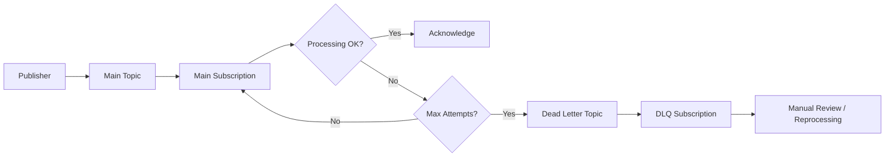

# How to Configure Dead Letter Topics in Pub/Sub for Failed Message Handling

Author: [nawazdhandala](https://www.github.com/nawazdhandala)

Tags: GCP, Pub/Sub, Dead Letter Queue, Error Handling, Messaging

Description: A step-by-step guide to setting up dead letter topics in Google Cloud Pub/Sub to handle messages that repeatedly fail processing, preventing them from blocking your pipeline.

---

Messages fail. Network calls time out, data is malformed, dependencies go down. In a messaging system like Pub/Sub, a failed message gets retried automatically. That is usually a good thing. But what happens when a message keeps failing no matter how many times it is retried? Without a dead letter topic, that message sits in your subscription forever, getting redelivered endlessly, wasting resources, and potentially blocking other messages.

Dead letter topics (also called dead letter queues or DLQs) solve this by catching messages that exceed a maximum number of delivery attempts and routing them to a separate topic. From there, you can inspect them, fix the underlying issue, and reprocess them if needed.

## How Dead Letter Topics Work

The concept is simple:

1. A message is delivered to a subscription
2. The subscriber fails to acknowledge it within the deadline
3. Pub/Sub redelivers the message
4. After a configured number of delivery attempts, Pub/Sub moves the message to the dead letter topic
5. A separate subscription on the dead letter topic holds these failed messages for review

Here is the flow visualized:



## Setting Up a Dead Letter Topic

Let me walk through the complete setup. First, create the dead letter topic and a subscription to read from it:

```bash
# Create the dead letter topic
gcloud pubsub topics create order-events-dlq

# Create a subscription on the DLQ for reviewing failed messages
gcloud pubsub subscriptions create order-events-dlq-reader \
  --topic=order-events-dlq \
  --ack-deadline=120 \
  --message-retention-duration=7d
```

Next, update your main subscription to use the dead letter topic:

```bash
# Configure the main subscription to use the dead letter topic
gcloud pubsub subscriptions update order-processor-sub \
  --dead-letter-topic=order-events-dlq \
  --max-delivery-attempts=5
```

The `--max-delivery-attempts` can be set between 5 and 100. Setting it too low means transient failures will send messages to the DLQ unnecessarily. Setting it too high means a genuinely bad message will be retried many times before being removed.

## Granting Required Permissions

This is the step people most commonly forget. The Pub/Sub service account needs specific permissions to forward messages to the dead letter topic:

```bash
# Get the project number
PROJECT_NUMBER=$(gcloud projects describe my-project --format="value(projectNumber)")

# The Pub/Sub service account needs to publish to the DLQ topic
gcloud pubsub topics add-iam-policy-binding order-events-dlq \
  --member="serviceAccount:service-${PROJECT_NUMBER}@gcp-sa-pubsub.iam.gserviceaccount.com" \
  --role="roles/pubsub.publisher"

# The Pub/Sub service account needs subscriber access on the source subscription
gcloud pubsub subscriptions add-iam-policy-binding order-processor-sub \
  --member="serviceAccount:service-${PROJECT_NUMBER}@gcp-sa-pubsub.iam.gserviceaccount.com" \
  --role="roles/pubsub.subscriber"
```

Without these permissions, the dead letter forwarding silently fails and messages continue being redelivered to the original subscription indefinitely.

## Terraform Configuration

Here is the complete setup in Terraform:

```hcl
# Main topic for order events
resource "google_pubsub_topic" "order_events" {
  name = "order-events"
  message_retention_duration = "604800s"
}

# Dead letter topic
resource "google_pubsub_topic" "order_events_dlq" {
  name = "order-events-dlq"
  message_retention_duration = "604800s"

  labels = {
    purpose = "dead-letter-queue"
    source  = "order-events"
  }
}

# Main subscription with dead letter policy
resource "google_pubsub_subscription" "order_processor" {
  name  = "order-processor-sub"
  topic = google_pubsub_topic.order_events.id

  ack_deadline_seconds = 60

  # Dead letter configuration
  dead_letter_policy {
    dead_letter_topic     = google_pubsub_topic.order_events_dlq.id
    max_delivery_attempts = 5
  }

  # Retry with exponential backoff before hitting DLQ
  retry_policy {
    minimum_backoff = "10s"
    maximum_backoff = "600s"
  }

  expiration_policy {
    ttl = ""
  }
}

# DLQ subscription for reading failed messages
resource "google_pubsub_subscription" "order_events_dlq_reader" {
  name  = "order-events-dlq-reader"
  topic = google_pubsub_topic.order_events_dlq.id

  ack_deadline_seconds       = 120
  message_retention_duration = "604800s"

  expiration_policy {
    ttl = ""
  }
}

# IAM: Allow Pub/Sub to publish to the DLQ topic
resource "google_pubsub_topic_iam_member" "dlq_publisher" {
  topic  = google_pubsub_topic.order_events_dlq.name
  role   = "roles/pubsub.publisher"
  member = "serviceAccount:service-${data.google_project.current.number}@gcp-sa-pubsub.iam.gserviceaccount.com"
}

# IAM: Allow Pub/Sub to acknowledge messages in the source subscription
resource "google_pubsub_subscription_iam_member" "source_subscriber" {
  subscription = google_pubsub_subscription.order_processor.name
  role         = "roles/pubsub.subscriber"
  member       = "serviceAccount:service-${data.google_project.current.number}@gcp-sa-pubsub.iam.gserviceaccount.com"
}

data "google_project" "current" {}
```

## Understanding Delivery Attempts

When Pub/Sub forwards a message to the dead letter topic, it adds a `CloudPubSubDeadLetterSourceDeliveryCount` attribute to the message. This tells you how many times the message was delivered before being dead-lettered:

```python
# Reading messages from the DLQ with delivery count information
from google.cloud import pubsub_v1
import json

subscriber = pubsub_v1.SubscriberClient()
dlq_path = subscriber.subscription_path("my-project", "order-events-dlq-reader")

def review_dead_letter(message):
    """Review a dead-lettered message and log failure details."""
    delivery_count = message.attributes.get(
        'CloudPubSubDeadLetterSourceDeliveryCount', 'unknown'
    )
    source_subscription = message.attributes.get(
        'CloudPubSubDeadLetterSourceSubscription', 'unknown'
    )

    print(f"Dead letter message ID: {message.message_id}")
    print(f"Delivery attempts: {delivery_count}")
    print(f"Source subscription: {source_subscription}")
    print(f"Original publish time: {message.publish_time}")
    print(f"Message data: {message.data.decode('utf-8')}")
    print("---")

    # Decide what to do: fix and republish, or permanently discard
    message.ack()

streaming_pull = subscriber.subscribe(dlq_path, callback=review_dead_letter)

try:
    streaming_pull.result(timeout=60)
except Exception:
    streaming_pull.cancel()
```

## Building a DLQ Processor

For production systems, you typically want an automated DLQ processor rather than manual review. Here is a pattern that inspects dead-lettered messages, logs them, and optionally republishes them:

```python
# Automated DLQ processor that logs failures and optionally republishes
from google.cloud import pubsub_v1
import json
import logging

logging.basicConfig(level=logging.INFO)
logger = logging.getLogger(__name__)

subscriber = pubsub_v1.SubscriberClient()
publisher = pubsub_v1.PublisherClient()

dlq_sub_path = subscriber.subscription_path("my-project", "order-events-dlq-reader")
main_topic_path = publisher.topic_path("my-project", "order-events")

def process_dead_letter(message):
    """Process dead-lettered messages with logging and optional republish."""
    delivery_count = int(message.attributes.get(
        'CloudPubSubDeadLetterSourceDeliveryCount', 0
    ))

    try:
        data = json.loads(message.data.decode('utf-8'))
    except json.JSONDecodeError:
        # Message is not valid JSON, log and discard
        logger.error(f"Non-JSON message in DLQ: {message.message_id}")
        message.ack()
        return

    # Log the failure for analysis
    logger.warning(
        f"Dead letter: message_id={message.message_id}, "
        f"attempts={delivery_count}, "
        f"data_preview={str(data)[:200]}"
    )

    # Check if the issue might be transient
    if delivery_count <= 10:
        # Republish with a marker to track republished messages
        data['_dlq_republished'] = True
        data['_dlq_original_message_id'] = message.message_id

        publisher.publish(
            main_topic_path,
            data=json.dumps(data).encode('utf-8'),
            republished_from_dlq='true'
        )
        logger.info(f"Republished message {message.message_id}")
    else:
        # Too many attempts, write to permanent error log
        logger.error(f"Permanently failed message: {message.message_id}")

    message.ack()

streaming_pull = subscriber.subscribe(
    dlq_sub_path,
    callback=process_dead_letter,
    flow_control=pubsub_v1.types.FlowControl(max_messages=10)
)

logger.info("DLQ processor started")
streaming_pull.result()
```

## Monitoring Dead Letter Topics

Set up alerts on your DLQ so you know when messages are failing. The key metric to watch is the number of undelivered messages in the DLQ subscription:

```hcl
# Alert when messages appear in the dead letter queue
resource "google_monitoring_alert_policy" "dlq_messages" {
  display_name = "Dead Letter Queue - Messages Detected"
  combiner     = "OR"

  conditions {
    display_name = "Messages in DLQ"

    condition_threshold {
      filter = <<-EOT
        resource.type = "pubsub_subscription"
        AND resource.labels.subscription_id = "order-events-dlq-reader"
        AND metric.type = "pubsub.googleapis.com/subscription/num_undelivered_messages"
      EOT

      aggregations {
        alignment_period   = "300s"
        per_series_aligner = "ALIGN_MEAN"
      }

      comparison      = "COMPARISON_GT"
      threshold_value = 0
      duration        = "300s"
    }
  }

  notification_channels = [
    google_monitoring_notification_channel.slack.name,
  ]
}
```

## Choosing the Right Max Delivery Attempts

The `max_delivery_attempts` setting is a tradeoff:

- **Too low (5)**: Transient issues like brief network outages will send messages to the DLQ prematurely. You will spend time reprocessing messages that would have succeeded on the next retry.

- **Too high (100)**: A genuinely bad message gets retried many times, wasting compute resources and potentially creating noise in logs.

- **Sweet spot (10-20)**: For most applications, 10-20 attempts with exponential backoff gives transient failures enough time to resolve while catching permanent failures reasonably quickly.

Combine the delivery attempts with a retry policy that includes backoff:

```bash
# Configure both retry policy and dead letter together
gcloud pubsub subscriptions update order-processor-sub \
  --dead-letter-topic=order-events-dlq \
  --max-delivery-attempts=15 \
  --min-retry-delay=10s \
  --max-retry-delay=600s
```

## Wrapping Up

Dead letter topics are essential for any production Pub/Sub deployment. Without them, a single poison message can cause endless retries and resource waste. The setup takes a few minutes - create a DLQ topic, update your subscription, grant IAM permissions, and add monitoring. Build a DLQ processor to automatically handle or republish failed messages, and tune your max delivery attempts to balance between handling transient failures and catching permanent ones. It is a small investment that prevents a whole category of production incidents.
