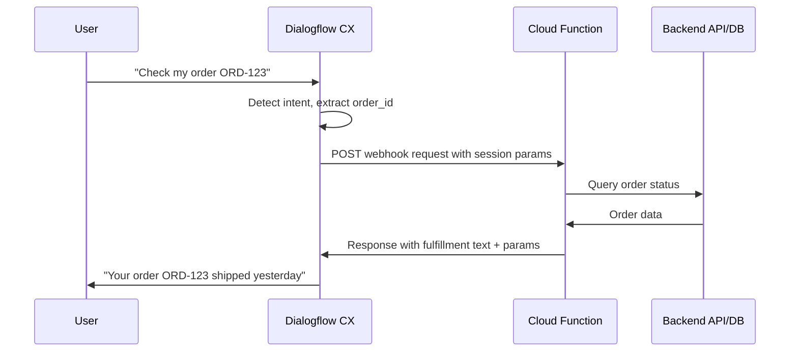

# How to Configure Dialogflow CX Webhooks with Cloud Functions for Dynamic Fulfillment

Author: [nawazdhandala](https://www.github.com/nawazdhandala)

Tags: GCP, Dialogflow CX, Webhooks, Cloud Functions, Fulfillment, Conversational AI, Google Cloud

Description: Configure Dialogflow CX webhooks with Google Cloud Functions to provide dynamic fulfillment responses from external APIs and databases in your virtual agent.

---

A virtual agent that can only respond with static messages is not very useful. Real conversations need dynamic data - looking up order status, checking account balances, scheduling appointments, or querying inventory. Dialogflow CX uses webhooks to call external services during conversations, and Cloud Functions is the natural serverless backend for handling these webhook requests on Google Cloud.

In this guide, I will show you how to set up webhooks in Dialogflow CX, build Cloud Functions to handle them, pass parameters between the agent and your backend, and handle errors gracefully.

## How Webhooks Work in Dialogflow CX

When a conversation reaches a page or transition that has a webhook configured, Dialogflow CX sends an HTTP POST request to your webhook URL with the current session state, detected intent, and extracted parameters. Your webhook processes the request and returns a response that can include text messages, parameter updates, and page transitions.



## Prerequisites

- A Dialogflow CX agent set up (see the flows and pages guide)
- Cloud Functions API enabled
- A backend API or database to query

## Step 1: Create the Cloud Function for Webhook Handling

The webhook Cloud Function receives a JSON payload from Dialogflow CX and returns a JSON response. The request format includes session info, the detected intent, and current parameter values.

This Cloud Function handles multiple webhook tags for different fulfillment scenarios:

```python
import functions_framework
import requests
import json

# Backend API base URL
ORDER_API = "https://api.mystore.com/orders"
CUSTOMER_API = "https://api.mystore.com/customers"

@functions_framework.http
def dialogflow_webhook(request):
    """Main webhook handler for Dialogflow CX.

    Routes to specific handlers based on the webhook tag.
    """
    req_json = request.get_json()

    # Extract the webhook tag to determine which handler to call
    tag = req_json.get("fulfillmentInfo", {}).get("tag", "")

    # Extract session parameters
    session_params = req_json.get("sessionInfo", {}).get("parameters", {})

    # Route to the appropriate handler
    handlers = {
        "lookup-order": handle_order_lookup,
        "process-return": handle_return_request,
        "check-inventory": handle_inventory_check,
        "get-customer-info": handle_customer_lookup,
    }

    handler = handlers.get(tag)
    if handler:
        return handler(session_params, req_json)
    else:
        # Default response for unknown tags
        return build_response(
            f"I'm sorry, I couldn't process that request. (Unknown tag: {tag})"
        )


def handle_order_lookup(params, full_request):
    """Looks up order status from the backend API."""
    order_id = params.get("order_id", "")

    if not order_id:
        return build_response(
            "I need your order number to look that up. Could you provide it?"
        )

    try:
        # Call the backend order API
        response = requests.get(f"{ORDER_API}/{order_id}", timeout=5)

        if response.status_code == 200:
            order = response.json()
            status = order.get("status", "unknown")
            tracking = order.get("tracking_number", "N/A")
            eta = order.get("estimated_delivery", "unknown")

            # Build a natural response with order details
            message = (
                f"I found your order {order_id}. "
                f"Current status: {status}. "
            )
            if tracking != "N/A":
                message += f"Tracking number: {tracking}. "
            if eta != "unknown":
                message += f"Estimated delivery: {eta}."

            # Return the response with updated session parameters
            return build_response(
                message,
                session_params={
                    "order_status": status,
                    "tracking_number": tracking,
                    "estimated_delivery": eta,
                }
            )
        elif response.status_code == 404:
            return build_response(
                f"I couldn't find an order with ID {order_id}. "
                "Could you double-check the order number?"
            )
        else:
            return build_response(
                "I'm having trouble looking up your order right now. "
                "Let me connect you with a human agent."
            )

    except requests.exceptions.Timeout:
        return build_response(
            "The order lookup is taking longer than expected. "
            "Please try again in a moment."
        )


def handle_return_request(params, full_request):
    """Processes a return request."""
    order_id = params.get("order_id", "")
    item_id = params.get("item_id", "")
    return_reason = params.get("return_reason", "")

    try:
        # Submit the return request to the backend
        response = requests.post(
            f"{ORDER_API}/{order_id}/returns",
            json={
                "item_id": item_id,
                "reason": return_reason,
            },
            timeout=5,
        )

        if response.status_code == 201:
            return_data = response.json()
            return_id = return_data.get("return_id", "")
            refund_amount = return_data.get("refund_amount", 0)

            return build_response(
                f"Your return has been initiated. Return ID: {return_id}. "
                f"You'll receive a refund of ${refund_amount:.2f} "
                "within 5-7 business days once we receive the item.",
                session_params={
                    "return_id": return_id,
                    "refund_amount": refund_amount,
                }
            )
        else:
            return build_response(
                "I wasn't able to process the return. "
                "This might be outside the return window. "
                "Let me transfer you to a support agent."
            )

    except Exception as e:
        return build_response(
            "Something went wrong while processing your return. "
            "Let me connect you with a support agent who can help."
        )


def handle_inventory_check(params, full_request):
    """Checks product inventory."""
    product_id = params.get("product_id", "")
    size = params.get("size", "")
    color = params.get("color", "")

    # Query inventory API
    inventory_params = {"product_id": product_id}
    if size:
        inventory_params["size"] = size
    if color:
        inventory_params["color"] = color

    response = requests.get(
        "https://api.mystore.com/inventory",
        params=inventory_params,
        timeout=5,
    )

    if response.status_code == 200:
        data = response.json()
        quantity = data.get("quantity", 0)
        if quantity > 0:
            return build_response(
                f"Good news - that item is in stock with {quantity} available.",
                session_params={"in_stock": True, "quantity": quantity}
            )
        else:
            return build_response(
                "Unfortunately, that item is currently out of stock.",
                session_params={"in_stock": False, "quantity": 0}
            )

    return build_response("I couldn't check the inventory right now. Please try again later.")


def handle_customer_lookup(params, full_request):
    """Looks up customer information."""
    email = params.get("customer_email", "")

    response = requests.get(f"{CUSTOMER_API}?email={email}", timeout=5)

    if response.status_code == 200 and response.json():
        customer = response.json()[0]
        return build_response(
            f"I found your account, {customer.get('name', '')}.",
            session_params={
                "customer_name": customer.get("name", ""),
                "customer_id": customer.get("id", ""),
            }
        )

    return build_response("I couldn't find an account with that email address.")


def build_response(message, session_params=None):
    """Builds a Dialogflow CX webhook response.

    Args:
        message: The text message to send to the user
        session_params: Optional dict of session parameters to update
    """
    response = {
        "fulfillmentResponse": {
            "messages": [
                {
                    "text": {
                        "text": [message]
                    }
                }
            ]
        }
    }

    # Add session parameter updates if provided
    if session_params:
        response["sessionInfo"] = {
            "parameters": session_params
        }

    return json.dumps(response), 200, {"Content-Type": "application/json"}
```

## Step 2: Deploy the Cloud Function

Deploy the function with appropriate settings for webhook use:

```bash
# Deploy the webhook Cloud Function
gcloud functions deploy dialogflow-webhook \
  --gen2 \
  --runtime=python311 \
  --region=us-central1 \
  --source=. \
  --entry-point=dialogflow_webhook \
  --trigger-http \
  --allow-unauthenticated \
  --memory=256Mi \
  --timeout=10s \
  --min-instances=1 \
  --max-instances=10
```

Setting `min-instances=1` avoids cold starts that could cause webhook timeouts. Dialogflow CX has a 5-second default webhook timeout, so keeping an instance warm is important.

## Step 3: Register the Webhook in Dialogflow CX

Now register the Cloud Function URL as a webhook in your Dialogflow CX agent:

```python
from google.cloud import dialogflowcx_v3

def create_webhook(agent_name, display_name, webhook_url):
    """Registers a webhook in Dialogflow CX."""
    client = dialogflowcx_v3.WebhooksClient()

    webhook = dialogflowcx_v3.Webhook(
        display_name=display_name,
        generic_web_service=dialogflowcx_v3.Webhook.GenericWebService(
            uri=webhook_url,
            # Set timeout to 5 seconds
            request_headers={},
        ),
        timeout={"seconds": 5},
    )

    response = client.create_webhook(
        parent=agent_name,
        webhook=webhook,
    )
    print(f"Webhook created: {response.name}")
    return response

webhook = create_webhook(
    "projects/my-project/locations/us-central1/agents/AGENT_ID",
    "Order Management Webhook",
    "https://us-central1-my-project.cloudfunctions.net/dialogflow-webhook"
)
```

## Step 4: Attach Webhooks to Pages

Configure pages to call the webhook at the right point in the conversation:

```python
from google.cloud import dialogflowcx_v3

def attach_webhook_to_page(page_name, webhook_name, tag):
    """Attaches a webhook call to a page's entry fulfillment."""
    client = dialogflowcx_v3.PagesClient()

    page = client.get_page(name=page_name)

    # Update the entry fulfillment to include a webhook call
    page.entry_fulfillment = dialogflowcx_v3.Fulfillment(
        webhook=webhook_name,
        tag=tag,
        messages=[
            dialogflowcx_v3.ResponseMessage(
                text=dialogflowcx_v3.ResponseMessage.Text(
                    text=["One moment while I look that up..."]
                )
            )
        ],
    )

    client.update_page(
        page=page,
        update_mask={"paths": ["entry_fulfillment"]},
    )
    print(f"Webhook attached to page with tag: {tag}")

# Attach the lookup-order webhook to the Order Lookup page
attach_webhook_to_page(
    "projects/.../pages/LOOKUP_PAGE_ID",
    webhook.name,
    "lookup-order"
)
```

## Step 5: Handle Webhook Errors

Always plan for webhook failures. Configure fallback messages so the conversation does not break:

```python
# In your page configuration, add an error handler
def configure_webhook_error_handling(page_name):
    """Adds error handling for webhook failures on a page."""
    client = dialogflowcx_v3.PagesClient()
    page = client.get_page(name=page_name)

    # Set webhook error message
    page.entry_fulfillment.set_parameter_actions = [
        dialogflowcx_v3.Fulfillment.SetParameterAction(
            parameter="webhook_error",
            value=False,
        )
    ]

    # Add a transition route for webhook failure
    error_route = dialogflowcx_v3.TransitionRoute(
        condition="$webhook.error",
        trigger_fulfillment=dialogflowcx_v3.Fulfillment(
            messages=[
                dialogflowcx_v3.ResponseMessage(
                    text=dialogflowcx_v3.ResponseMessage.Text(
                        text=[
                            "I'm having trouble connecting to our systems. "
                            "Would you like me to try again, or connect you "
                            "with a live agent?"
                        ]
                    )
                )
            ]
        ),
    )

    page.transition_routes.append(error_route)
    client.update_page(page=page, update_mask={"paths": ["transition_routes"]})
```

## Summary

Webhooks are what make Dialogflow CX agents actually useful in production. The combination of Cloud Functions for serverless execution and Dialogflow CX's tag-based routing gives you a clean architecture where each webhook tag maps to a specific backend operation. Keep your webhook response times under 5 seconds, always handle errors gracefully, and use session parameters to pass data between the webhook and the conversation flow. Start with your most common use case, get it working end to end, and then expand to handle more scenarios.
