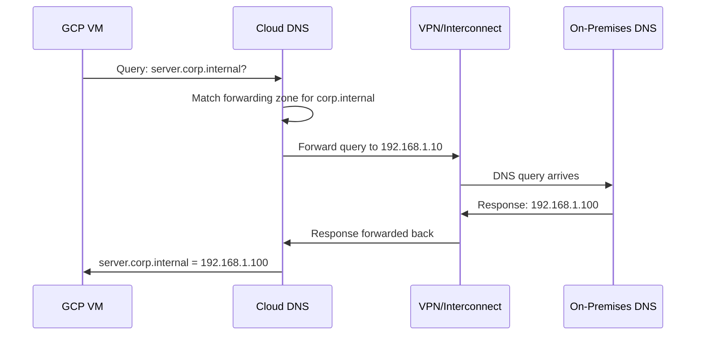

# How to Configure DNS Forwarding Zones to Resolve On-Premises Hostnames from GCP

Author: [nawazdhandala](https://www.github.com/nawazdhandala)

Tags: GCP, Cloud DNS, DNS Forwarding, On-Premises, Hybrid Cloud

Description: Learn how to set up DNS forwarding zones in Google Cloud DNS to resolve on-premises hostnames from GCP VMs through VPN or Interconnect connectivity.

---

In hybrid cloud environments, your GCP workloads often need to resolve hostnames that live in your on-premises DNS infrastructure. Maybe you have an internal Active Directory domain, legacy applications with on-premises hostnames, or databases that are only discoverable through your corporate DNS servers. DNS forwarding zones in Cloud DNS let you forward specific DNS queries from GCP to your on-premises DNS servers, so VMs in GCP can resolve those internal hostnames seamlessly.

This post covers the complete setup, from prerequisites to testing and troubleshooting.

## How DNS Forwarding Zones Work

A DNS forwarding zone tells Cloud DNS: "For queries matching this domain, do not try to answer locally. Instead, forward the query to these specific DNS servers."

When a VM in your VPC makes a DNS query for `server.corp.internal`, and you have a forwarding zone for `corp.internal` pointing to your on-premises DNS server at `192.168.1.10`, the flow looks like this:



## Prerequisites

Before setting up DNS forwarding, you need:

1. **Network connectivity**: A Cloud VPN or Cloud Interconnect connection between GCP and your on-premises network
2. **On-premises DNS servers**: The IP addresses of your DNS servers that can resolve the internal hostnames
3. **Firewall rules**: Both GCP and on-premises firewalls must allow DNS traffic (UDP and TCP port 53) from Cloud DNS to the on-premises DNS servers
4. **Routing**: GCP must have routes to reach the on-premises DNS server IPs

## Step 1: Verify Network Connectivity

Before configuring DNS forwarding, verify that GCP can reach your on-premises DNS servers:

```bash
# From a GCP VM, test connectivity to the on-premises DNS server
nc -zv 192.168.1.10 53

# Test DNS resolution directly against the on-premises server
dig @192.168.1.10 server.corp.internal
```

If these fail, fix your VPN/Interconnect connectivity and firewall rules first.

## Step 2: Create a DNS Forwarding Zone

Create a forwarding zone for the on-premises domain:

```bash
# Create a forwarding zone that sends queries to on-premises DNS
gcloud dns managed-zones create on-prem-forward \
    --dns-name="corp.internal." \
    --description="Forward DNS queries to on-premises DNS servers" \
    --visibility=private \
    --networks=my-vpc \
    --forwarding-targets="192.168.1.10,192.168.1.11"
```

This creates a forwarding zone for `corp.internal` that sends queries to two on-premises DNS servers (for redundancy).

## Step 3: Configure Forwarding for Multiple Domains

If your on-premises environment has multiple DNS domains, create separate forwarding zones for each:

```bash
# Forward Active Directory domain
gcloud dns managed-zones create ad-forward \
    --dns-name="ad.company.com." \
    --visibility=private \
    --networks=my-vpc \
    --forwarding-targets="192.168.1.10,192.168.1.11"

# Forward legacy application domain
gcloud dns managed-zones create legacy-forward \
    --dns-name="legacy.internal." \
    --visibility=private \
    --networks=my-vpc \
    --forwarding-targets="192.168.1.10"

# Forward reverse DNS for on-premises IP ranges
gcloud dns managed-zones create reverse-forward \
    --dns-name="168.192.in-addr.arpa." \
    --visibility=private \
    --networks=my-vpc \
    --forwarding-targets="192.168.1.10"
```

## Step 4: Configure Private vs Standard Forwarding

Cloud DNS supports two forwarding modes:

**Standard forwarding** (default): Uses the VPC's default routing to reach the target DNS server. The source IP of the DNS query comes from a Cloud DNS IP range.

**Private forwarding**: Routes the DNS query through the VPC using the same path as other traffic. The source IP comes from a GCP-managed IP range (35.199.192.0/19).

For on-premises DNS servers reached through VPN/Interconnect, private forwarding is usually what you need:

```bash
# Create a forwarding zone with private forwarding
gcloud dns managed-zones create on-prem-private-forward \
    --dns-name="corp.internal." \
    --visibility=private \
    --networks=my-vpc \
    --forwarding-targets="192.168.1.10[private],192.168.1.11[private]"
```

The `[private]` suffix after the IP address enables private forwarding for that target.

## Step 5: Configure Firewall Rules

### GCP Side

Allow outbound DNS traffic from Cloud DNS to your on-premises servers:

```bash
# Allow DNS traffic from the 35.199.192.0/19 range (Cloud DNS forwarding IPs)
gcloud compute firewall-rules create allow-dns-forwarding \
    --network=my-vpc \
    --action=allow \
    --direction=egress \
    --destination-ranges=192.168.1.10/32,192.168.1.11/32 \
    --rules=tcp:53,udp:53
```

### On-Premises Side

Configure your on-premises firewall to allow DNS queries from GCP. The source IP range depends on the forwarding mode:

- **Standard forwarding**: Source IPs are from Google's public ranges
- **Private forwarding**: Source IPs are from `35.199.192.0/19`

Add a firewall rule on your on-premises network allowing DNS traffic from `35.199.192.0/19` to your DNS servers.

## Step 6: Configure Routes

For private forwarding, ensure you have a route for `35.199.192.0/19` through the VPN/Interconnect:

```bash
# Check if the route exists
gcloud compute routes list --filter="destRange=35.199.192.0/19"
```

If it does not exist and you are using a Cloud Router with custom route advertisements, you need to add it. For most VPN setups with dynamic routing, this route is handled automatically.

## Step 7: Test DNS Resolution

From a GCP VM in the authorized VPC:

```bash
# Test resolution of on-premises hostnames
dig server.corp.internal +short

# Test resolution with verbose output to see the query path
dig server.corp.internal +trace

# Test reverse resolution
dig -x 192.168.1.100

# Verify standard GCP resolution still works
dig www.google.com +short
```

## Advanced: Conditional Forwarding

You can create forwarding zones for very specific subdomains while handling the parent domain differently:

```bash
# Forward only the database subdomain to on-premises DNS
gcloud dns managed-zones create db-forward \
    --dns-name="db.corp.internal." \
    --visibility=private \
    --networks=my-vpc \
    --forwarding-targets="192.168.1.10[private]"

# Create a private zone for the rest of corp.internal
gcloud dns managed-zones create corp-private \
    --dns-name="corp.internal." \
    --visibility=private \
    --networks=my-vpc
```

Cloud DNS uses the most specific matching zone. Queries for `db.corp.internal` go to the forwarding zone, while queries for other `corp.internal` names use the private zone.

## Forwarding to Multiple On-Premises Locations

If you have DNS servers in multiple on-premises locations:

```bash
# Forward to DNS servers in different data centers
gcloud dns managed-zones create multi-site-forward \
    --dns-name="global.internal." \
    --visibility=private \
    --networks=my-vpc \
    --forwarding-targets="192.168.1.10[private],10.0.1.10[private],172.16.1.10[private]"
```

Cloud DNS tries all forwarding targets and uses the first successful response. This provides redundancy across sites.

## Forwarding to Cloud-Based DNS Services

Forwarding zones are not limited to on-premises servers. You can forward to any DNS server reachable from your VPC:

```bash
# Forward to a DNS server in another cloud provider (via VPN)
gcloud dns managed-zones create aws-forward \
    --dns-name="aws.company.com." \
    --visibility=private \
    --networks=my-vpc \
    --forwarding-targets="10.200.0.2[private]"
```

## Monitoring and Logging

Enable DNS query logging to troubleshoot forwarding issues:

```bash
# Enable logging on the VPC's DNS policy
gcloud dns policies create logging-policy \
    --networks=my-vpc \
    --enable-logging
```

View the logs:

```bash
# View DNS query logs
gcloud logging read 'resource.type="dns_query"' \
    --limit=20 \
    --format="table(timestamp,jsonPayload.queryName,jsonPayload.responseCode,jsonPayload.serverLatency)"
```

## Troubleshooting

**Queries timing out**: Check that firewall rules on both sides allow DNS traffic. For private forwarding, verify that `35.199.192.0/19` can reach your DNS servers.

**SERVFAIL responses**: Your on-premises DNS server is reachable but returning an error. Check the on-premises DNS server logs. It might be rejecting queries from unknown source IPs.

**Partial resolution**: Some names resolve but others do not. This could be a split DNS issue where the on-premises server only handles certain zones. Create forwarding zones for each specific domain.

**Slow resolution**: DNS forwarding adds latency (the VPN/Interconnect round trip). If this is a problem, consider running a caching DNS server in GCP or migrating frequently-used records to a Cloud DNS private zone.

```bash
# Check the response time from GCP to on-premises DNS
dig @192.168.1.10 server.corp.internal +stats | grep "Query time"
```

## Terraform Configuration

```hcl
# DNS forwarding zone
resource "google_dns_managed_zone" "on_prem_forward" {
  name        = "on-prem-forward"
  dns_name    = "corp.internal."
  description = "Forward to on-premises DNS"
  visibility  = "private"

  private_visibility_config {
    networks {
      network_url = google_compute_network.vpc.id
    }
  }

  forwarding_config {
    target_name_servers {
      ipv4_address    = "192.168.1.10"
      forwarding_path = "private"
    }
    target_name_servers {
      ipv4_address    = "192.168.1.11"
      forwarding_path = "private"
    }
  }
}
```

## Wrapping Up

DNS forwarding zones are essential for hybrid cloud environments where GCP workloads need to resolve on-premises hostnames. The setup is straightforward: create a forwarding zone, point it at your on-premises DNS servers, ensure firewall rules allow DNS traffic, and verify connectivity. Use private forwarding mode for on-premises targets reached through VPN/Interconnect, and create separate forwarding zones for each domain you need to resolve. Combined with private DNS zones for GCP-native names, you get a complete DNS solution that bridges cloud and on-premises seamlessly.
