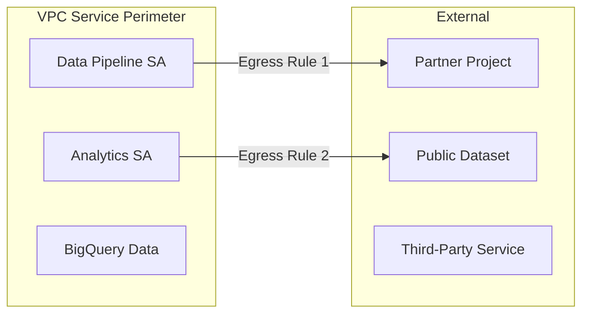

# How to Configure Egress Rules for VPC Service Controls Perimeters

Author: [nawazdhandala](https://www.github.com/nawazdhandala)

Tags: GCP, VPC Service Controls, Egress Rules, Data Protection, Cloud Security

Description: Learn how to configure egress rules for VPC Service Controls perimeters to allow controlled data flow from inside the perimeter to external projects and services.

---

Ingress rules control what comes into your perimeter. Egress rules control what goes out. In many ways, egress rules are the more important of the two because they are what actually prevent data exfiltration - the primary use case for VPC Service Controls.

By default, a VPC Service Controls perimeter blocks all API calls that would send data from inside the perimeter to outside. This means a compromised service account cannot copy your BigQuery tables to an external project, cannot download Cloud Storage objects to a machine outside your network, and cannot replicate your Spanner database to another organization.

But sometimes you genuinely need data to flow outward. Maybe you share datasets with a partner, publish reports to an external bucket, or use a third-party analytics service. Egress rules let you allow these specific flows without opening the floodgates.

## Egress Rule Structure

An egress rule has two parts:

1. **From**: Which identities inside the perimeter are allowed to send data out
2. **To**: Where they can send it (external project, service, and method)



## Prerequisites

- An existing VPC Service Controls perimeter
- The `roles/accesscontextmanager.policyAdmin` role
- Knowledge of which outbound flows are legitimate

## Step 1: Identify Required Egress Flows

Before writing any rules, catalog the outbound data flows from projects inside your perimeter.

```bash
# Check audit logs for outbound API calls that were blocked
gcloud logging read \
  'protoPayload.metadata.@type="type.googleapis.com/google.cloud.audit.VpcServiceControlAuditMetadata" AND protoPayload.metadata.violationReason="RESOURCES_NOT_IN_SAME_SERVICE_PERIMETER"' \
  --limit=50 \
  --format="table(timestamp, protoPayload.authenticationInfo.principalEmail, protoPayload.methodName, protoPayload.resourceName)" \
  --project=my-project-id
```

This shows you exactly what is being blocked, which tells you what egress rules you might need.

## Step 2: Create an Egress Rule for Partner Data Sharing

Allow a specific service account to write data to a partner's BigQuery dataset.

Create `egress-policy.yaml`:

```yaml
# egress-policy.yaml - Allow data sharing with partner
- egressFrom:
    identities:
      - serviceAccount:data-pipeline@my-internal-project.iam.gserviceaccount.com
  egressTo:
    operations:
      - serviceName: bigquery.googleapis.com
        methodSelectors:
          - method: google.cloud.bigquery.v2.JobService.InsertJob
          - method: google.cloud.bigquery.v2.TableDataService.InsertAll
    resources:
      - projects/PARTNER_PROJECT_NUMBER
```

Apply the egress rule:

```bash
# Apply egress rules to the perimeter
gcloud access-context-manager perimeters update my-perimeter \
  --set-egress-policies=egress-policy.yaml \
  --policy=$ACCESS_POLICY_ID
```

## Step 3: Create an Egress Rule for Cloud Storage Export

Allow exporting reports to an external bucket.

```yaml
# storage-egress.yaml - Allow report exports to external bucket
- egressFrom:
    identities:
      - serviceAccount:report-generator@my-internal-project.iam.gserviceaccount.com
  egressTo:
    operations:
      - serviceName: storage.googleapis.com
        methodSelectors:
          - method: google.storage.objects.create
          - method: google.storage.objects.get
    resources:
      - projects/EXTERNAL_STORAGE_PROJECT_NUMBER
```

## Step 4: Create an Egress Rule for Any Identity

Sometimes you need to allow any identity inside the perimeter to access specific external resources.

```yaml
# any-identity-egress.yaml - Allow all perimeter identities to access a shared project
- egressFrom:
    identityType: ANY_IDENTITY
  egressTo:
    operations:
      - serviceName: storage.googleapis.com
        methodSelectors:
          - method: "*"
    resources:
      - projects/SHARED_ASSETS_PROJECT_NUMBER
```

Use `identityType: ANY_IDENTITY` carefully - it allows every identity in the perimeter to access the specified resources.

## Step 5: Combine Multiple Egress Rules

Real-world perimeters typically need several egress rules.

```yaml
# combined-egress.yaml

# Rule 1: Data pipeline exports to partner
- egressFrom:
    identities:
      - serviceAccount:data-pipeline@internal.iam.gserviceaccount.com
  egressTo:
    operations:
      - serviceName: bigquery.googleapis.com
        methodSelectors:
          - method: google.cloud.bigquery.v2.JobService.InsertJob
    resources:
      - projects/PARTNER_PROJECT_NUMBER

# Rule 2: Backup service writes to backup project
- egressFrom:
    identities:
      - serviceAccount:backup-sa@internal.iam.gserviceaccount.com
  egressTo:
    operations:
      - serviceName: storage.googleapis.com
        methodSelectors:
          - method: google.storage.objects.create
          - method: google.storage.objects.list
    resources:
      - projects/BACKUP_PROJECT_NUMBER

# Rule 3: Monitoring sends data to centralized ops project
- egressFrom:
    identityType: ANY_SERVICE_ACCOUNT
  egressTo:
    operations:
      - serviceName: monitoring.googleapis.com
        methodSelectors:
          - method: "*"
      - serviceName: logging.googleapis.com
        methodSelectors:
          - method: "*"
    resources:
      - projects/CENTRAL_OPS_PROJECT_NUMBER
```

```bash
# Apply all egress rules
gcloud access-context-manager perimeters update my-perimeter \
  --set-egress-policies=combined-egress.yaml \
  --policy=$ACCESS_POLICY_ID
```

## Step 6: Test with Dry-Run

Always test egress rules in dry-run mode before enforcing.

```bash
# Apply egress rules to dry-run config only
gcloud access-context-manager perimeters dry-run update my-perimeter \
  --set-egress-policies=combined-egress.yaml \
  --policy=$ACCESS_POLICY_ID
```

Monitor the logs to see if the rules correctly allow the desired flows and still block everything else.

## Step 7: Audit Egress Rule Usage

Regularly review what data is actually flowing out through your egress rules.

```bash
# Look at successful API calls that match egress rules
gcloud logging read \
  'protoPayload.serviceName="bigquery.googleapis.com" AND protoPayload.authenticationInfo.principalEmail="data-pipeline@internal.iam.gserviceaccount.com"' \
  --limit=20 \
  --format="table(timestamp, protoPayload.methodName, protoPayload.resourceName)" \
  --project=my-project-id
```

## Common Egress Scenarios

**Scenario: Shared VPC host project outside the perimeter**

If your Shared VPC host project is outside the perimeter but service projects are inside:

```yaml
- egressFrom:
    identityType: ANY_IDENTITY
  egressTo:
    operations:
      - serviceName: compute.googleapis.com
        methodSelectors:
          - method: "*"
    resources:
      - projects/SHARED_VPC_HOST_PROJECT_NUMBER
```

**Scenario: Using a public dataset in BigQuery**

If you need to query public datasets from inside the perimeter:

```yaml
- egressFrom:
    identityType: ANY_IDENTITY
  egressTo:
    operations:
      - serviceName: bigquery.googleapis.com
        methodSelectors:
          - method: google.cloud.bigquery.v2.JobService.InsertJob
          - method: google.cloud.bigquery.v2.JobService.GetQueryResults
    resources:
      - projects/PUBLIC_DATASET_PROJECT_NUMBER
```

**Scenario: Cloud Function calling an external API through Cloud Storage**

If a Cloud Function inside the perimeter needs to write results to a bucket in another project:

```yaml
- egressFrom:
    identities:
      - serviceAccount:function-sa@internal.iam.gserviceaccount.com
  egressTo:
    operations:
      - serviceName: storage.googleapis.com
        methodSelectors:
          - method: google.storage.objects.create
    resources:
      - projects/EXTERNAL_PROJECT_NUMBER
```

## Best Practices

1. **Be as specific as possible with method selectors.** Using `"*"` for methods allows any operation. If you only need read access, only allow read methods.

2. **Use specific identities, not ANY_IDENTITY.** The more specific you are about who can egress data, the smaller your attack surface.

3. **Review egress rules quarterly.** Business relationships change, and rules that were needed six months ago might no longer be relevant.

4. **Log and monitor egress activity.** Set up alerts for unusual egress volumes or patterns.

5. **Document the business justification for each rule.** When auditors ask why data can flow to a specific external project, you want a clear answer ready.

## Troubleshooting

If an egress rule is not working:

```bash
# Check for VPC SC violations with the specific identity
gcloud logging read \
  'protoPayload.metadata.@type="type.googleapis.com/google.cloud.audit.VpcServiceControlAuditMetadata" AND protoPayload.authenticationInfo.principalEmail="data-pipeline@internal.iam.gserviceaccount.com" AND protoPayload.metadata.violationReason!=""' \
  --limit=10 \
  --format=json \
  --project=my-project-id
```

Common issues:
- Wrong project number in the `resources` field
- Missing method selectors for the specific API methods being called
- Identity mismatch (the actual caller is a different service account than expected)

## Conclusion

Egress rules are the enforcement mechanism that makes VPC Service Controls truly effective at preventing data exfiltration. Without them, the perimeter blocks everything going out. With well-crafted rules, you allow exactly the data flows your business needs while blocking everything else. The key is specificity - narrow identities, narrow methods, narrow destination projects. Every broad rule is a potential exfiltration path, so treat each egress rule as a calculated security decision.
