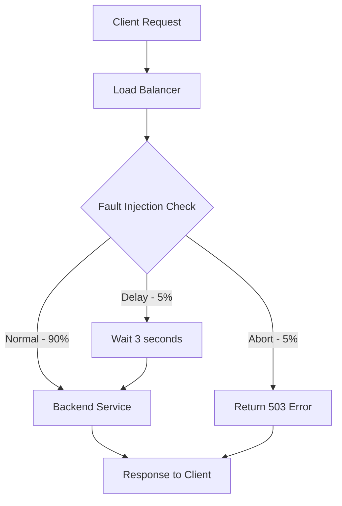

# How to Configure Fault Injection for Chaos Testing on Google Cloud Load Balancer

Author: [nawazdhandala](https://www.github.com/nawazdhandala)

Tags: GCP, Load Balancer, Fault Injection, Chaos Testing, Reliability

Description: Learn how to configure fault injection on Google Cloud Load Balancer to test your application's resilience by injecting delays and errors into production-like traffic.

---

Your application works great when everything is running smoothly. But what happens when a backend starts responding slowly? Or when 10% of requests fail with server errors? If you have not tested these scenarios, you are going to find out the hard way during a real incident. Fault injection lets you simulate these failures deliberately so you can verify that your retry logic, circuit breakers, timeouts, and error handling work as expected.

Google Cloud's Application Load Balancer has built-in fault injection capabilities through URL map route rules. You can inject delays, abort requests with specific error codes, or do both simultaneously - all without deploying any special infrastructure.

## Types of Fault Injection

The load balancer supports two types of faults:

1. **Delay injection**: Adds artificial latency to a percentage of requests before forwarding them to the backend
2. **Abort injection**: Returns an error response (like 503) for a percentage of requests without forwarding them to the backend



## Step 1 - Inject Delay Faults

Delay injection simulates slow backend responses. This is useful for testing timeout configurations and degraded performance scenarios.

```bash
gcloud compute url-maps import app-url-map --source=- <<'EOF'
name: app-url-map
defaultService: projects/my-project/global/backendServices/app-backend
hostRules:
  - hosts:
      - "*"
    pathMatcher: fault-injection-routes
pathMatchers:
  - name: fault-injection-routes
    defaultService: projects/my-project/global/backendServices/app-backend
    routeRules:
      - priority: 1
        matchRules:
          - prefixMatch: "/"
        routeAction:
          weightedBackendServices:
            - backendService: projects/my-project/global/backendServices/app-backend
              weight: 100
          faultInjectionPolicy:
            delay:
              fixedDelay:
                seconds: 3
                nanos: 0
              percentage: 10.0
EOF
```

This configuration adds a 3-second delay to 10% of all requests. The other 90% flow normally. This helps you test whether your client-side timeouts and loading states handle slow responses gracefully.

## Step 2 - Inject Abort Faults

Abort injection returns error codes without even reaching the backend. This simulates backend failures.

```bash
gcloud compute url-maps import app-url-map --source=- <<'EOF'
name: app-url-map
defaultService: projects/my-project/global/backendServices/app-backend
hostRules:
  - hosts:
      - "*"
    pathMatcher: abort-routes
pathMatchers:
  - name: abort-routes
    defaultService: projects/my-project/global/backendServices/app-backend
    routeRules:
      - priority: 1
        matchRules:
          - prefixMatch: "/"
        routeAction:
          weightedBackendServices:
            - backendService: projects/my-project/global/backendServices/app-backend
              weight: 100
          faultInjectionPolicy:
            abort:
              httpStatus: 503
              percentage: 5.0
EOF
```

This returns a 503 Service Unavailable response for 5% of requests. You can test specific error codes by changing `httpStatus` to 500 (Internal Server Error), 429 (Too Many Requests), 504 (Gateway Timeout), or any other HTTP status code.

## Step 3 - Combine Delays and Aborts

For more realistic chaos testing, inject both delays and errors simultaneously.

```bash
gcloud compute url-maps import app-url-map --source=- <<'EOF'
name: app-url-map
defaultService: projects/my-project/global/backendServices/app-backend
hostRules:
  - hosts:
      - "*"
    pathMatcher: combined-faults
pathMatchers:
  - name: combined-faults
    defaultService: projects/my-project/global/backendServices/app-backend
    routeRules:
      - priority: 1
        matchRules:
          - prefixMatch: "/"
        routeAction:
          weightedBackendServices:
            - backendService: projects/my-project/global/backendServices/app-backend
              weight: 100
          faultInjectionPolicy:
            delay:
              fixedDelay:
                seconds: 2
              percentage: 15.0
            abort:
              httpStatus: 503
              percentage: 5.0
EOF
```

With this setup, roughly 15% of requests get a 2-second delay, and about 5% get a 503 error. Some requests might be selected for both - they would get the delay but then be aborted before reaching the backend.

## Step 4 - Scope Faults to Specific Paths

In practice, you want to inject faults selectively rather than across your entire application.

```bash
gcloud compute url-maps import app-url-map --source=- <<'EOF'
name: app-url-map
defaultService: projects/my-project/global/backendServices/app-backend
hostRules:
  - hosts:
      - "*"
    pathMatcher: scoped-faults
pathMatchers:
  - name: scoped-faults
    defaultService: projects/my-project/global/backendServices/app-backend
    routeRules:
      # Inject faults only on the API path
      - priority: 1
        matchRules:
          - prefixMatch: "/api/orders"
        routeAction:
          weightedBackendServices:
            - backendService: projects/my-project/global/backendServices/app-backend
              weight: 100
          faultInjectionPolicy:
            delay:
              fixedDelay:
                seconds: 5
              percentage: 20.0
            abort:
              httpStatus: 500
              percentage: 10.0
      # No faults on health checks
      - priority: 2
        matchRules:
          - prefixMatch: "/healthz"
        service: projects/my-project/global/backendServices/app-backend
      # No faults on static assets
      - priority: 3
        matchRules:
          - prefixMatch: "/static/"
        service: projects/my-project/global/backendServices/app-backend
      # Mild faults on other API paths
      - priority: 4
        matchRules:
          - prefixMatch: "/api/"
        routeAction:
          weightedBackendServices:
            - backendService: projects/my-project/global/backendServices/app-backend
              weight: 100
          faultInjectionPolicy:
            delay:
              fixedDelay:
                seconds: 1
              percentage: 5.0
EOF
```

## Step 5 - Use Header-Based Fault Injection

Limit fault injection to only requests from your test clients by combining it with header matching. This way, normal users are unaffected.

```bash
gcloud compute url-maps import app-url-map --source=- <<'EOF'
name: app-url-map
defaultService: projects/my-project/global/backendServices/app-backend
hostRules:
  - hosts:
      - "*"
    pathMatcher: header-gated-faults
pathMatchers:
  - name: header-gated-faults
    defaultService: projects/my-project/global/backendServices/app-backend
    routeRules:
      # Only inject faults when the chaos testing header is present
      - priority: 1
        matchRules:
          - prefixMatch: "/"
            headerMatches:
              - headerName: "x-chaos-test"
                exactMatch: "enabled"
        routeAction:
          weightedBackendServices:
            - backendService: projects/my-project/global/backendServices/app-backend
              weight: 100
          faultInjectionPolicy:
            delay:
              fixedDelay:
                seconds: 3
              percentage: 50.0
            abort:
              httpStatus: 503
              percentage: 25.0
      # Normal traffic without faults
      - priority: 2
        matchRules:
          - prefixMatch: "/"
        service: projects/my-project/global/backendServices/app-backend
EOF
```

Now only requests with `x-chaos-test: enabled` header experience faults. Your test suite sends this header, while production users see normal behavior.

## Step 6 - Automate Chaos Testing

Build an automated chaos testing pipeline that injects faults, runs your test suite, and verifies the results.

```python
# chaos_test.py - Automated chaos testing with fault injection
import subprocess
import requests
import time
import json

PROJECT = "my-project"
URL_MAP = "app-url-map"
BASE_URL = "https://app.example.com"

def update_fault_config(delay_pct, delay_sec, abort_pct, abort_code):
    """Update the URL map with new fault injection settings."""
    config = {
        "name": URL_MAP,
        "defaultService": f"projects/{PROJECT}/global/backendServices/app-backend",
        "hostRules": [{"hosts": ["*"], "pathMatcher": "chaos"}],
        "pathMatchers": [{
            "name": "chaos",
            "defaultService": f"projects/{PROJECT}/global/backendServices/app-backend",
            "routeRules": [{
                "priority": 1,
                "matchRules": [{"prefixMatch": "/", "headerMatches": [
                    {"headerName": "x-chaos-test", "exactMatch": "enabled"}
                ]}],
                "routeAction": {
                    "weightedBackendServices": [{
                        "backendService": f"projects/{PROJECT}/global/backendServices/app-backend",
                        "weight": 100
                    }],
                    "faultInjectionPolicy": {
                        "delay": {"fixedDelay": {"seconds": delay_sec}, "percentage": delay_pct},
                        "abort": {"httpStatus": abort_code, "percentage": abort_pct}
                    }
                }
            }]
        }]
    }

    # Write config and apply
    with open("/tmp/chaos_config.json", "w") as f:
        json.dump(config, f)

    subprocess.run([
        "gcloud", "compute", "url-maps", "import", URL_MAP,
        "--source=/tmp/chaos_config.json", "--quiet"
    ], check=True)

    # Wait for config to propagate
    time.sleep(30)

def run_tests(test_name, num_requests=100):
    """Send test requests and measure results."""
    results = {"success": 0, "error": 0, "slow": 0, "total": num_requests}
    latencies = []

    for i in range(num_requests):
        start = time.time()
        try:
            resp = requests.get(
                f"{BASE_URL}/api/test",
                headers={"x-chaos-test": "enabled"},
                timeout=10
            )
            latency = time.time() - start
            latencies.append(latency)

            if resp.status_code == 200:
                results["success"] += 1
            else:
                results["error"] += 1

            if latency > 2.0:
                results["slow"] += 1
        except requests.exceptions.Timeout:
            results["error"] += 1
            latencies.append(10.0)

    results["avg_latency"] = sum(latencies) / len(latencies)
    results["p99_latency"] = sorted(latencies)[int(len(latencies) * 0.99)]

    print(f"\n--- {test_name} ---")
    print(f"Success: {results['success']}/{results['total']}")
    print(f"Errors: {results['error']}/{results['total']}")
    print(f"Slow (>2s): {results['slow']}/{results['total']}")
    print(f"Avg Latency: {results['avg_latency']:.2f}s")
    print(f"P99 Latency: {results['p99_latency']:.2f}s")

    return results

# Run chaos test scenarios
scenarios = [
    ("Baseline", 0, 0, 0, 200),
    ("10% Delay (3s)", 10, 3, 0, 200),
    ("5% Abort (503)", 0, 0, 5, 503),
    ("Combined Chaos", 15, 2, 10, 503),
]

for name, delay_pct, delay_sec, abort_pct, abort_code in scenarios:
    print(f"\nConfiguring: {name}")
    update_fault_config(delay_pct, delay_sec, abort_pct, abort_code)
    run_tests(name)

# Clean up - remove fault injection
update_fault_config(0, 0, 0, 200)
print("\nChaos testing complete. Fault injection removed.")
```

## What to Validate During Chaos Tests

When running chaos tests, check for these behaviors:

- **Retry logic**: Does your client retry failed requests with appropriate backoff?
- **Timeout handling**: Do client-side timeouts trigger before the injected delay expires?
- **Circuit breakers**: Does your circuit breaker trip when the error rate exceeds the threshold?
- **Error messages**: Do users see friendly error messages instead of raw 503 responses?
- **Cascading failures**: Does a fault in one service cascade to dependent services?
- **Recovery**: When you remove the fault injection, does the system recover quickly?

## Removing Fault Injection

When you are done testing, remove all fault injection policies.

```bash
gcloud compute url-maps import app-url-map --source=- <<'EOF'
name: app-url-map
defaultService: projects/my-project/global/backendServices/app-backend
hostRules:
  - hosts:
      - "*"
    pathMatcher: clean-routes
pathMatchers:
  - name: clean-routes
    defaultService: projects/my-project/global/backendServices/app-backend
EOF
```

## Wrapping Up

Fault injection on GCP's Application Load Balancer is one of the simplest ways to do chaos testing. You do not need to deploy any additional infrastructure - just update your URL map with the fault policy, run your tests, and observe how your system handles the failures. The header-gated approach lets you run chaos tests against production traffic patterns without affecting real users. Make fault injection a regular part of your release process, and you will catch resilience issues before they become real incidents.
