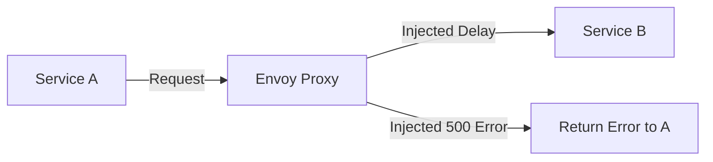

# How to Configure Fault Injection for Resilience Testing in Cloud Service Mesh

Author: [nawazdhandala](https://www.github.com/nawazdhandala)

Tags: GCP, Cloud Service Mesh, Fault Injection, Resilience Testing, Chaos Engineering

Description: Learn how to use Istio fault injection in Cloud Service Mesh to test the resilience of your microservices by introducing controlled delays and errors without modifying application code.

---

Your microservices will eventually face failures in production - slow dependencies, network errors, service outages. The question is whether your application handles these failures gracefully or cascades into a full-blown outage. Fault injection lets you test this before production does it for you. Cloud Service Mesh (built on Istio) can inject faults at the proxy layer, meaning you simulate failures without changing any application code.

This guide covers how to configure fault injection for delays, HTTP errors, and connection failures, and how to build a structured resilience testing program.

## How Fault Injection Works in Istio

When you configure a fault injection rule, the Envoy sidecar proxy intercepts the request and either:

1. **Delays it** - Holds the request for a specified duration before forwarding it
2. **Aborts it** - Returns an error response without forwarding the request at all

This happens at the proxy level, so your application sees what looks like a real failure from its dependency.



The key advantage over application-level fault injection is that it requires zero code changes. You configure faults through Istio VirtualService resources and remove them by deleting the configuration.

## Injecting Delays

Delays simulate slow dependencies - a database that is under heavy load, a third-party API that is throttling you, or network congestion.

### Fixed Delay

This VirtualService adds a 5-second delay to 10% of requests to the payment service.

```yaml
# delay-injection.yaml
# Injects a 5-second delay into 10% of requests to the payment service
apiVersion: networking.istio.io/v1beta1
kind: VirtualService
metadata:
  name: payment-service-fault
  namespace: default
spec:
  hosts:
  - payment-service
  http:
  - fault:
      delay:
        percentage:
          value: 10.0
        fixedDelay: 5s
    route:
    - destination:
        host: payment-service
```

```bash
kubectl apply -f delay-injection.yaml
```

After applying, 10% of requests to the payment service will take at least 5 seconds longer than normal. Watch how your calling services handle this:

- Does the frontend show a loading indicator, or does it hang?
- Does the order service time out and retry, or does it wait forever?
- Do timeouts cascade upstream?

### Testing Timeout Configuration

A common test is to inject a delay longer than your configured timeout. This verifies that timeouts actually work.

```yaml
# timeout-test.yaml
# Injects a delay longer than the expected timeout
apiVersion: networking.istio.io/v1beta1
kind: VirtualService
metadata:
  name: inventory-service-timeout-test
  namespace: default
spec:
  hosts:
  - inventory-service
  http:
  - fault:
      delay:
        percentage:
          value: 100.0
        fixedDelay: 30s
    route:
    - destination:
        host: inventory-service
    timeout: 10s
```

If your calling service has a 10-second timeout configured, all requests should fail after 10 seconds rather than waiting 30 seconds. If they wait the full 30 seconds, your timeout configuration is not working correctly.

## Injecting HTTP Errors

Abort injection returns an HTTP error code without the request ever reaching the destination service.

### Return 500 Internal Server Error

```yaml
# error-injection.yaml
# Returns HTTP 500 for 20% of requests to the recommendation service
apiVersion: networking.istio.io/v1beta1
kind: VirtualService
metadata:
  name: recommendation-service-fault
  namespace: default
spec:
  hosts:
  - recommendation-service
  http:
  - fault:
      abort:
        percentage:
          value: 20.0
        httpStatus: 500
    route:
    - destination:
        host: recommendation-service
```

This tests how your application handles error responses from dependencies. Things to watch for:

- Does the frontend degrade gracefully? A recommendation service failure should not prevent users from browsing products.
- Does the circuit breaker trip? If you have circuit breakers configured, they should open after enough failures.
- Are errors logged and alerted on?

### Return 503 Service Unavailable

```yaml
# unavailable-injection.yaml
# Simulates the auth service being completely down
apiVersion: networking.istio.io/v1beta1
kind: VirtualService
metadata:
  name: auth-service-fault
  namespace: default
spec:
  hosts:
  - auth-service
  http:
  - fault:
      abort:
        percentage:
          value: 100.0
        httpStatus: 503
    route:
    - destination:
        host: auth-service
```

A 100% abort rate simulates a complete service outage. This is the most aggressive test - it shows you exactly what happens when a dependency is entirely unavailable.

## Combining Delays and Errors

In production, failures rarely come in isolation. A degraded service might be both slow AND returning errors. Test this combination.

```yaml
# combined-faults.yaml
# Simulates a degraded service with both delays and errors
apiVersion: networking.istio.io/v1beta1
kind: VirtualService
metadata:
  name: search-service-degraded
  namespace: default
spec:
  hosts:
  - search-service
  http:
  - fault:
      delay:
        percentage:
          value: 50.0
        fixedDelay: 3s
      abort:
        percentage:
          value: 10.0
        httpStatus: 500
    route:
    - destination:
        host: search-service
```

This injects a 3-second delay in 50% of requests and returns a 500 error in 10% of requests. The remaining 40% of requests are processed normally. This closely mimics what a struggling service looks like in production.

## Targeted Fault Injection

Instead of injecting faults for all traffic, target specific requests using match conditions.

### Inject Faults Only for Test Users

```yaml
# targeted-fault.yaml
# Only inject faults for requests with a test header
apiVersion: networking.istio.io/v1beta1
kind: VirtualService
metadata:
  name: payment-service-targeted
  namespace: default
spec:
  hosts:
  - payment-service
  http:
  # Fault injection rule - only for test traffic
  - match:
    - headers:
        x-test-fault:
          exact: "true"
    fault:
      delay:
        percentage:
          value: 100.0
        fixedDelay: 5s
    route:
    - destination:
        host: payment-service
  # Normal route for all other traffic
  - route:
    - destination:
        host: payment-service
```

This is safe to deploy in production because only requests with the `x-test-fault: true` header are affected. Your testing tools can set this header while real user traffic flows normally.

### Inject Faults for Specific Paths

```yaml
# path-specific-fault.yaml
# Inject faults only for checkout-related requests
apiVersion: networking.istio.io/v1beta1
kind: VirtualService
metadata:
  name: api-service-checkout-fault
  namespace: default
spec:
  hosts:
  - api-service
  http:
  - match:
    - uri:
        prefix: /api/v1/checkout
    fault:
      abort:
        percentage:
          value: 50.0
        httpStatus: 503
    route:
    - destination:
        host: api-service
  - route:
    - destination:
        host: api-service
```

## Building a Resilience Testing Program

Fault injection is most valuable when done systematically. Here is a framework for building resilience tests.

### Step 1: Identify Critical Paths

Map out the request paths that matter most to your users. For an e-commerce app, these might be:

- Product browsing (catalog service, search service)
- Checkout flow (cart, payment, inventory)
- User authentication (auth service, user service)

### Step 2: Test Each Dependency

For each service in a critical path, test what happens when it:

- Responds slowly (inject delays)
- Returns errors (inject 5xx)
- Is completely unavailable (100% abort)

### Step 3: Document Expected Behavior

For each test, document what should happen:

- "When the recommendation service is down, the product page should still load without recommendations"
- "When the payment service is slow, the checkout page should show a timeout error after 10 seconds"

### Step 4: Automate the Tests

Create a test suite that runs fault injection scenarios automatically.

```bash
#!/bin/bash
# resilience-test.sh
# Automated resilience testing script

echo "Test 1: Payment service delay"
kubectl apply -f faults/payment-delay.yaml
sleep 5
# Run test assertions
curl -s https://api.example.com/checkout/health | jq '.status'
kubectl delete -f faults/payment-delay.yaml

echo "Test 2: Auth service unavailable"
kubectl apply -f faults/auth-unavailable.yaml
sleep 5
# Run test assertions
curl -s -o /dev/null -w "%{http_code}" https://api.example.com/login
kubectl delete -f faults/auth-unavailable.yaml

echo "Test 3: Combined degradation"
kubectl apply -f faults/search-degraded.yaml
sleep 10
# Run test assertions
curl -s https://api.example.com/search?q=test | jq '.fallback_used'
kubectl delete -f faults/search-degraded.yaml

echo "All resilience tests complete"
```

### Step 5: Run Regularly

Schedule resilience tests to run regularly - weekly at minimum, or as part of your CI/CD pipeline for services that handle critical paths.

## Safety Measures

**Always have a quick removal path.** Before applying any fault injection, make sure you can remove it with a single command. Keep the "clean" VirtualService configuration ready to apply.

**Start with low percentages.** Begin with 1-5% fault injection and increase gradually. A 100% abort rate against a critical service in a shared environment will make you unpopular very quickly.

**Use targeted injection in production.** In production environments, always use header-based or path-based matching to limit the blast radius.

**Monitor while testing.** Have dashboards open showing error rates, latency, and service health while fault injection is active. If things go sideways, you want to know immediately.

**Clean up after yourself.** Remove fault injection configurations as soon as testing is complete. A forgotten fault injection rule can cause mysterious production issues weeks later.

Fault injection through Cloud Service Mesh is one of the easiest and most effective ways to build resilience into your microservices architecture. It finds the weak points before your users do.
