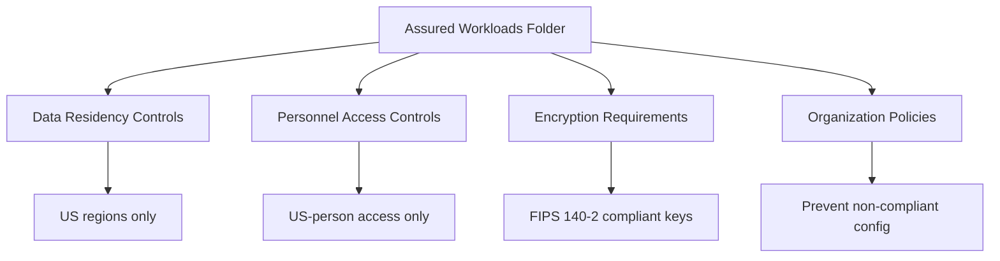

# How to Configure FedRAMP High Baseline Controls with Assured Workloads on GCP

Author: [nawazdhandala](https://www.github.com/nawazdhandala)

Tags: GCP, FedRAMP, Assured Workloads, Compliance, Google Cloud Security

Description: A comprehensive guide to configuring FedRAMP High baseline controls on Google Cloud using Assured Workloads for government and regulated workloads.

---

If you are working with US federal agencies or handling federal data, FedRAMP compliance is not optional. FedRAMP High is the most stringent baseline, required for systems processing high-impact data where a breach could cause severe damage. Google Cloud's Assured Workloads feature creates a compliance boundary that enforces FedRAMP High controls at the infrastructure level.

This guide walks through setting up an Assured Workloads environment for FedRAMP High, configuring the required controls, and maintaining compliance.

## What Assured Workloads Does

Assured Workloads is not just a configuration label. When you create an Assured Workloads folder with FedRAMP High compliance, Google Cloud automatically enforces:

- **Data residency** - Data stays within US regions only
- **Personnel controls** - Only US-based, background-checked Google employees can access the infrastructure
- **Key management** - Encryption keys are managed according to FIPS 140-2 requirements
- **Organization policy restrictions** - Automatically applies organization policies that prevent non-compliant configurations



## Step 1: Enable Assured Workloads

```bash
# Enable the Assured Workloads API
gcloud services enable assuredworkloads.googleapis.com

# Verify the API is enabled
gcloud services list --enabled --filter="name:assuredworkloads"
```

## Step 2: Create a FedRAMP High Assured Workload

```bash
# Create an Assured Workloads folder for FedRAMP High
gcloud assured workloads create \
    --organization=123456789 \
    --location=us \
    --display-name="FedRAMP High Environment" \
    --compliance-regime=FEDRAMP_HIGH \
    --billing-account=BILLING_ACCOUNT_ID \
    --next-rotation-time="2026-03-01T00:00:00Z" \
    --rotation-period=7776000s \
    --labels="compliance=fedramp-high,environment=production" \
    --provisioned-resources-parent=organizations/123456789
```

This creates a new folder in your organization hierarchy with all the FedRAMP High guardrails pre-configured. Every project you create under this folder inherits the compliance controls.

## Step 3: Create Projects Within the Assured Workload

All resources for your FedRAMP workload must live in projects under the Assured Workloads folder:

```bash
# Create a project within the Assured Workloads folder
gcloud projects create fedramp-app-prod \
    --folder=ASSURED_WORKLOAD_FOLDER_ID \
    --labels="compliance=fedramp-high"

# Link the project to your billing account
gcloud billing projects link fedramp-app-prod \
    --billing-account=BILLING_ACCOUNT_ID

# Enable required APIs within the project
gcloud services enable \
    compute.googleapis.com \
    container.googleapis.com \
    storage.googleapis.com \
    bigquery.googleapis.com \
    cloudkms.googleapis.com \
    logging.googleapis.com \
    monitoring.googleapis.com \
    --project=fedramp-app-prod
```

## Step 4: Configure Encryption with CMEK

FedRAMP High requires customer-managed encryption keys (CMEK) with FIPS 140-2 validated key management:

```bash
# Create a Cloud KMS keyring in a US region
gcloud kms keyrings create fedramp-keyring \
    --location=us \
    --project=fedramp-app-prod

# Create an encryption key with a rotation schedule
# FIPS 140-2 Level 3 is satisfied by using Cloud HSM keys
gcloud kms keys create fedramp-data-key \
    --keyring=fedramp-keyring \
    --location=us \
    --purpose=encryption \
    --protection-level=hsm \
    --rotation-period=90d \
    --next-rotation-time="2026-03-01T00:00:00Z" \
    --project=fedramp-app-prod
```

Apply CMEK to storage resources:

```bash
# Create a Cloud Storage bucket with CMEK encryption
gcloud storage buckets create gs://fedramp-app-data \
    --project=fedramp-app-prod \
    --location=us \
    --default-encryption-key=projects/fedramp-app-prod/locations/us/keyRings/fedramp-keyring/cryptoKeys/fedramp-data-key

# Create a BigQuery dataset with CMEK
bq mk --dataset \
    --default_kms_key=projects/fedramp-app-prod/locations/us/keyRings/fedramp-keyring/cryptoKeys/fedramp-data-key \
    --location=US \
    fedramp-app-prod:fedramp_dataset
```

## Step 5: Configure Organization Policies

Assured Workloads automatically applies several organization policies, but you should verify and add additional ones:

```bash
# Verify auto-applied policies
gcloud resource-manager org-policies list \
    --folder=ASSURED_WORKLOAD_FOLDER_ID

# Restrict resource locations to US only
gcloud resource-manager org-policies set-policy location-policy.yaml \
    --folder=ASSURED_WORKLOAD_FOLDER_ID
```

```yaml
# location-policy.yaml
# Restrict all resources to US locations
constraint: constraints/gcp.resourceLocations
listPolicy:
  allowedValues:
    - "in:us-locations"
```

```bash
# Require CMEK for all storage and compute resources
gcloud resource-manager org-policies set-policy cmek-policy.yaml \
    --folder=ASSURED_WORKLOAD_FOLDER_ID
```

```yaml
# cmek-policy.yaml
# Deny creation of resources without CMEK encryption
constraint: constraints/gcp.restrictNonCmekServices
listPolicy:
  deniedValues:
    - "compute.googleapis.com"
    - "storage.googleapis.com"
    - "bigquery.googleapis.com"
    - "container.googleapis.com"
```

Additional security policies:

```bash
# Disable service account key creation
gcloud resource-manager org-policies enable-enforce \
    iam.disableServiceAccountKeyCreation \
    --folder=ASSURED_WORKLOAD_FOLDER_ID

# Disable service account key upload
gcloud resource-manager org-policies enable-enforce \
    iam.disableServiceAccountKeyUpload \
    --folder=ASSURED_WORKLOAD_FOLDER_ID

# Require OS Login for VMs
gcloud resource-manager org-policies enable-enforce \
    compute.requireOsLogin \
    --folder=ASSURED_WORKLOAD_FOLDER_ID

# Disable serial port access
gcloud resource-manager org-policies enable-enforce \
    compute.disableSerialPortAccess \
    --folder=ASSURED_WORKLOAD_FOLDER_ID

# Restrict public IP on VMs
gcloud resource-manager org-policies enable-enforce \
    compute.vmExternalIpAccess \
    --folder=ASSURED_WORKLOAD_FOLDER_ID
```

## Step 6: Configure Logging and Monitoring

FedRAMP High requires comprehensive audit logging:

```bash
# Enable data access audit logging for all services
gcloud projects set-iam-policy fedramp-app-prod audit-policy.yaml
```

Create an audit logging configuration:

```yaml
# audit-policy.yaml - adds to existing IAM policy
auditConfigs:
  - service: allServices
    auditLogConfigs:
      - logType: ADMIN_READ
      - logType: DATA_READ
      - logType: DATA_WRITE
```

```bash
# Create a log sink to export audit logs to a separate storage bucket
# FedRAMP requires log retention for at least 1 year
gcloud logging sinks create fedramp-audit-sink \
    storage.googleapis.com/fedramp-audit-logs \
    --project=fedramp-app-prod \
    --log-filter='logName:"cloudaudit.googleapis.com"'

# Create the audit log storage bucket with retention policy
gcloud storage buckets create gs://fedramp-audit-logs \
    --project=fedramp-app-prod \
    --location=us \
    --retention-period=365d \
    --default-encryption-key=projects/fedramp-app-prod/locations/us/keyRings/fedramp-keyring/cryptoKeys/fedramp-data-key
```

## Step 7: Network Security Configuration

```bash
# Create a VPC with private Google access
gcloud compute networks create fedramp-vpc \
    --project=fedramp-app-prod \
    --subnet-mode=custom

# Create subnets in US regions only
gcloud compute networks subnets create fedramp-subnet-east \
    --project=fedramp-app-prod \
    --network=fedramp-vpc \
    --region=us-east1 \
    --range=10.0.0.0/20 \
    --enable-private-ip-google-access \
    --enable-flow-logs

gcloud compute networks subnets create fedramp-subnet-central \
    --project=fedramp-app-prod \
    --network=fedramp-vpc \
    --region=us-central1 \
    --range=10.0.16.0/20 \
    --enable-private-ip-google-access \
    --enable-flow-logs

# Set up VPC Service Controls perimeter
gcloud access-context-manager perimeters create fedramp-perimeter \
    --policy=POLICY_ID \
    --title="FedRAMP Service Perimeter" \
    --resources="projects/FEDRAMP_PROJECT_NUMBER" \
    --restricted-services="storage.googleapis.com,bigquery.googleapis.com,compute.googleapis.com" \
    --access-levels="accessPolicies/POLICY_ID/accessLevels/corp-access"
```

## Terraform Configuration

```hcl
# Assured Workloads environment for FedRAMP High
resource "google_assured_workloads_workload" "fedramp_high" {
  display_name      = "FedRAMP High Environment"
  compliance_regime = "FEDRAMP_HIGH"
  billing_account   = "billingAccounts/BILLING_ACCOUNT_ID"
  organization      = "123456789"
  location          = "us"

  kms_settings {
    next_rotation_time = "2026-03-01T00:00:00Z"
    rotation_period    = "7776000s"
  }

  labels = {
    compliance  = "fedramp-high"
    environment = "production"
  }
}

# Cloud HSM key for FIPS 140-2 compliance
resource "google_kms_crypto_key" "fedramp_key" {
  name            = "fedramp-data-key"
  key_ring        = google_kms_key_ring.fedramp.id
  rotation_period = "7776000s"  # 90 days
  purpose         = "ENCRYPT_DECRYPT"

  version_template {
    algorithm        = "GOOGLE_SYMMETRIC_ENCRYPTION"
    protection_level = "HSM"  # FIPS 140-2 Level 3
  }
}
```

## Monitoring Compliance Drift

Set up alerts for compliance violations:

```bash
# Create a monitoring alert for organization policy violations
gcloud monitoring policies create \
    --display-name="FedRAMP Compliance Drift Alert" \
    --condition-display-name="Org policy violation detected" \
    --condition-filter='resource.type="audited_resource" AND protoPayload.status.code!=0 AND protoPayload.methodName:"orgpolicy"' \
    --notification-channels=projects/fedramp-app-prod/notificationChannels/CHANNEL_ID
```

Check the Assured Workloads compliance status:

```bash
# View compliance violations for the Assured Workload
gcloud assured workloads violations list \
    --workload=WORKLOAD_ID \
    --organization=123456789 \
    --location=us
```

## Continuous Compliance Checklist

Maintaining FedRAMP High compliance is ongoing. Here are the key areas to monitor:

1. **Data residency** - Regularly verify no resources exist outside US regions
2. **Encryption** - Confirm all storage uses CMEK with HSM-backed keys
3. **Access controls** - Review IAM policies quarterly for least privilege
4. **Audit logging** - Verify logs are being collected and retained
5. **Vulnerability management** - Run Security Command Center scans regularly
6. **Incident response** - Test your incident response plan quarterly

Assured Workloads takes care of the infrastructure-level controls, but your application and operational processes need to satisfy the remaining FedRAMP High controls. Work with your compliance team to map all 421 controls in the NIST SP 800-53 High baseline to your specific implementation.
