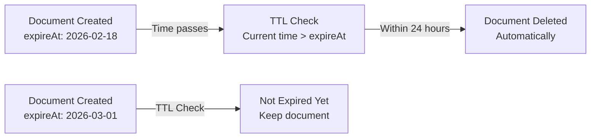

# How to Configure Firestore TTL Policies to Auto-Delete Expired Documents

Author: [nawazdhandala](https://www.github.com/nawazdhandala)

Tags: GCP, Firestore, TTL, Data Management, Firebase

Description: Learn how to set up Firestore TTL (Time-to-Live) policies to automatically delete documents after they expire, reducing storage costs and keeping your database clean.

---

Every application accumulates temporary data - session tokens, verification codes, temporary uploads, event logs, cached results. If you do not clean this data up, your Firestore costs grow indefinitely and queries slow down as collections bloat. You could write a scheduled Cloud Function to delete old documents, but Firestore has a built-in solution: TTL (Time-to-Live) policies.

A TTL policy tells Firestore to automatically delete documents when a specified timestamp field passes. Once configured, Firestore handles the cleanup in the background. No Cloud Functions, no cron jobs, no manual intervention.

## How TTL Policies Work

A TTL policy is attached to a collection group and references a specific timestamp field in your documents. Firestore continuously scans for documents where that timestamp field is in the past and deletes them automatically.

There are a few important details. Deletion is not instant - documents may persist for up to 24 hours after their TTL timestamp has passed. This is because Firestore processes TTL deletions in batches for efficiency. For most use cases (session cleanup, log rotation), this delay is perfectly fine. If you need immediate deletion, you still need your own Cloud Function.



## Setting Up a TTL Policy

You configure TTL policies through the Google Cloud Console, the Firebase CLI, or the gcloud command-line tool.

Using gcloud CLI:

```bash
# Create a TTL policy on the 'sessions' collection group
# The 'expireAt' field determines when each document should be deleted
gcloud firestore fields ttls update expireAt \
  --collection-group=sessions \
  --enable-ttl \
  --project=your-project-id
```

Using the Firebase CLI with `firestore.indexes.json`:

```json
{
  "fieldOverrides": [
    {
      "collectionGroup": "sessions",
      "fieldPath": "expireAt",
      "ttl": true
    }
  ]
}
```

Then deploy the configuration:

```bash
# Deploy the TTL configuration using the Firebase CLI
firebase deploy --only firestore
```

You can also set it up in the Google Cloud Console by navigating to Firestore, clicking on the "TTL" tab, and adding a new policy.

## Writing Documents with Expiration

Once the TTL policy is in place, you just need to make sure your documents have the right timestamp field. The field must be a Firestore Timestamp type (not a string, not a number).

```javascript
// Create a session document that expires in 24 hours
// The TTL policy on the 'expireAt' field will auto-delete it
import { doc, setDoc, Timestamp } from 'firebase/firestore';

async function createSession(userId, sessionData) {
  const sessionId = generateSessionId();

  // Calculate expiration: 24 hours from now
  const expireAt = new Date();
  expireAt.setHours(expireAt.getHours() + 24);

  await setDoc(doc(db, 'sessions', sessionId), {
    userId: userId,
    data: sessionData,
    createdAt: Timestamp.now(),
    expireAt: Timestamp.fromDate(expireAt)  // TTL field - must be a Timestamp
  });

  return sessionId;
}
```

```python
# Python Admin SDK: Create a temporary verification code that expires in 10 minutes
from datetime import datetime, timedelta
from google.cloud.firestore_v1 import SERVER_TIMESTAMP

def create_verification_code(email, code):
    expire_time = datetime.utcnow() + timedelta(minutes=10)

    db.collection('verification-codes').add({
        'email': email,
        'code': code,
        'createdAt': SERVER_TIMESTAMP,
        'expireAt': expire_time  # Python datetime is converted to Timestamp
    })
```

## Common Use Cases

TTL policies work great for several common scenarios.

**Session management**: Delete sessions after they expire. Set the TTL field to the session's expiration time.

```javascript
// Session that expires in 7 days
const expireAt = new Date(Date.now() + 7 * 24 * 60 * 60 * 1000);
await setDoc(doc(db, 'sessions', sessionId), {
  userId: uid,
  expireAt: Timestamp.fromDate(expireAt)
});
```

**Temporary file metadata**: When users upload temporary files, store metadata with a TTL so it gets cleaned up automatically.

```javascript
// Temporary upload metadata - auto-deletes after 1 hour
async function trackTempUpload(userId, fileName, storagePath) {
  const expireAt = new Date(Date.now() + 60 * 60 * 1000);  // 1 hour

  await setDoc(doc(db, 'temp-uploads', `${userId}_${fileName}`), {
    userId: userId,
    fileName: fileName,
    storagePath: storagePath,
    expireAt: Timestamp.fromDate(expireAt)
  });
}
```

**Rate limiting records**: Store rate limit counters with short TTLs to automatically reset them.

```javascript
// Rate limit entry that resets after 1 minute
async function recordRateLimitHit(userId) {
  const windowEnd = new Date(Date.now() + 60 * 1000);  // 1-minute window

  await setDoc(doc(db, 'rate-limits', `${userId}_${Date.now()}`), {
    userId: userId,
    expireAt: Timestamp.fromDate(windowEnd)
  });
}
```

**Event logs**: Keep logs for a retention period and let TTL clean them up.

```python
# Create a log entry that expires after 30 days
from datetime import datetime, timedelta

def log_event(event_type, details):
    expire_time = datetime.utcnow() + timedelta(days=30)

    db.collection('event-logs').add({
        'type': event_type,
        'details': details,
        'createdAt': SERVER_TIMESTAMP,
        'expireAt': expire_time  # Auto-deleted after 30 days
    })
```

## Extending or Preventing Expiration

If a user's session is active, you might want to extend its TTL. Just update the TTL field.

```javascript
// Extend a session's TTL by updating the expireAt field
// Call this on user activity to keep the session alive
import { doc, updateDoc, Timestamp } from 'firebase/firestore';

async function extendSession(sessionId, additionalHours = 24) {
  const newExpiry = new Date();
  newExpiry.setHours(newExpiry.getHours() + additionalHours);

  await updateDoc(doc(db, 'sessions', sessionId), {
    expireAt: Timestamp.fromDate(newExpiry)
  });
}
```

To prevent a document from being deleted by TTL, you can either remove the TTL field or set it to a far-future date.

```javascript
// Prevent a document from expiring by removing the TTL field
import { doc, updateDoc, deleteField } from 'firebase/firestore';

async function makeSessionPermanent(sessionId) {
  await updateDoc(doc(db, 'sessions', sessionId), {
    expireAt: deleteField()  // Remove the field entirely
  });
}
```

## Monitoring TTL Deletions

You can monitor TTL activity through Cloud Monitoring. Firestore exposes metrics for TTL-deleted documents.

```bash
# Check TTL policy status using gcloud
gcloud firestore fields ttls list \
  --collection-group=sessions \
  --project=your-project-id
```

The output will show you the policy state (CREATING, ACTIVE, or NEEDS_REPAIR) and when it was last updated.

## Important Limitations

There are several things to keep in mind when using TTL policies.

The deletion delay of up to 24 hours means TTL is not suitable for time-sensitive expirations. If a verification code expires after 10 minutes, your application code should still check the timestamp and reject expired codes. TTL just handles the cleanup.

TTL deletions count toward your Firestore delete costs. If you have millions of documents expiring, those deletes are billed just like regular deletes.

Only one TTL policy can be active per collection group. You cannot have two different TTL fields on the same collection.

The TTL field must contain a Timestamp value. Documents where the TTL field is missing, null, or a non-timestamp type are simply ignored by the TTL policy - they will not be deleted.

## Wrapping Up

Firestore TTL policies are a simple, low-maintenance way to automatically clean up temporary data. You configure the policy once, make sure your documents have the right timestamp field, and Firestore handles the rest. It is perfect for sessions, temporary tokens, rate limiting records, and log data with retention periods. Just remember that deletion is not instant (up to 24 hours delay), so your application logic should still validate expiration timestamps rather than relying solely on TTL for enforcement. Use TTL for cleanup, not for access control.
