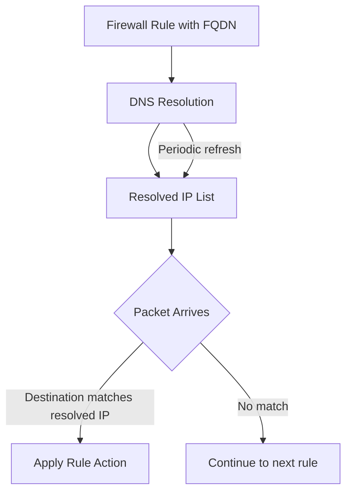

# How to Configure Firewall Policy Rules with FQDN Objects on GCP

Author: [nawazdhandala](https://www.github.com/nawazdhandala)

Tags: GCP, Firewall Policy, FQDN, Network Security, Google Cloud Networking

Description: Learn how to configure firewall policy rules with Fully Qualified Domain Name (FQDN) objects on Google Cloud to control traffic based on domain names instead of IP addresses.

---

Traditional firewall rules work with IP addresses and CIDR ranges. But when you need to allow traffic to a third-party API that uses dynamic IPs behind a CDN, or block traffic to specific domains, IP-based rules become a maintenance headache. Google Cloud's network firewall policies support FQDN (Fully Qualified Domain Name) objects, letting you write rules that reference domain names directly. The firewall resolves these domains and applies the rules to the resolved IPs automatically.

This guide covers how to set up and manage FQDN-based firewall rules effectively.

## How FQDN Objects Work

When you create a firewall rule with an FQDN object, Google Cloud's firewall infrastructure periodically resolves the domain name to its IP addresses. The resolved IPs are then used in the actual packet filtering. If the domain's IP addresses change (which happens frequently with cloud services), the firewall rule updates automatically.



FQDN objects are available in network firewall policies (both global and regional), not in the older VPC firewall rules. This is an important distinction - you need to use the newer firewall policy system.

## Prerequisites

Make sure you have the network firewall policy API enabled:

```bash
# Enable the required API for network firewall policies
gcloud services enable networksecurity.googleapis.com
```

## Creating a Global Network Firewall Policy

Start by creating a firewall policy that will hold your FQDN-based rules:

```bash
# Create a global network firewall policy
gcloud compute network-firewall-policies create fqdn-policy \
    --global \
    --description="Firewall policy with FQDN-based rules"
```

## Adding Egress Rules with FQDN Destinations

The most common use case is controlling outbound traffic from your VMs. For example, allowing VMs to reach specific external APIs:

```bash
# Allow outbound HTTPS traffic to specific API domains
# The firewall resolves these domains and allows traffic to their IPs
gcloud compute network-firewall-policies rules create 1000 \
    --firewall-policy=fqdn-policy \
    --global-firewall-policy \
    --direction=EGRESS \
    --action=allow \
    --layer4-configs=tcp:443 \
    --dest-fqdns="api.github.com,api.stripe.com,storage.googleapis.com" \
    --description="Allow HTTPS to GitHub, Stripe, and GCS APIs"
```

You can combine FQDN objects with other rule parameters:

```bash
# Allow outbound traffic to package repositories for specific tagged VMs
gcloud compute network-firewall-policies rules create 1100 \
    --firewall-policy=fqdn-policy \
    --global-firewall-policy \
    --direction=EGRESS \
    --action=allow \
    --layer4-configs=tcp:443,tcp:80 \
    --dest-fqdns="packages.cloud.google.com,apt.kubernetes.io,registry.npmjs.org" \
    --target-secure-tags=organizations/123456789/env/production \
    --description="Allow package manager access for production VMs"
```

## Implementing a Default-Deny Egress Policy

FQDN rules are most powerful when combined with a default-deny egress policy. This creates a whitelist where VMs can only reach approved external domains:

```bash
# First, add allow rules for specific domains (higher priority)
gcloud compute network-firewall-policies rules create 1000 \
    --firewall-policy=fqdn-policy \
    --global-firewall-policy \
    --direction=EGRESS \
    --action=allow \
    --layer4-configs=tcp:443 \
    --dest-fqdns="api.example.com,auth.example.com" \
    --description="Allow traffic to our external APIs"

# Allow DNS resolution (required for FQDN rules to work)
gcloud compute network-firewall-policies rules create 1500 \
    --firewall-policy=fqdn-policy \
    --global-firewall-policy \
    --direction=EGRESS \
    --action=allow \
    --layer4-configs=tcp:53,udp:53 \
    --dest-ip-ranges=0.0.0.0/0 \
    --description="Allow DNS resolution"

# Allow internal VPC traffic
gcloud compute network-firewall-policies rules create 1600 \
    --firewall-policy=fqdn-policy \
    --global-firewall-policy \
    --direction=EGRESS \
    --action=allow \
    --layer4-configs=all \
    --dest-ip-ranges=10.0.0.0/8,172.16.0.0/12,192.168.0.0/16 \
    --description="Allow internal VPC traffic"

# Deny all other egress traffic (lowest priority allow all is default)
gcloud compute network-firewall-policies rules create 2000 \
    --firewall-policy=fqdn-policy \
    --global-firewall-policy \
    --direction=EGRESS \
    --action=deny \
    --layer4-configs=all \
    --dest-ip-ranges=0.0.0.0/0 \
    --description="Default deny all egress"
```

This setup ensures your VMs can only connect to explicitly approved external services. The DNS allow rule is essential because FQDN resolution needs DNS queries to work.

## Adding Ingress Rules with FQDN Sources

You can also use FQDN objects in ingress rules to allow traffic from specific domains:

```bash
# Allow ingress from a known partner API domain
gcloud compute network-firewall-policies rules create 500 \
    --firewall-policy=fqdn-policy \
    --global-firewall-policy \
    --direction=INGRESS \
    --action=allow \
    --layer4-configs=tcp:8443 \
    --src-fqdns="webhook.partner-api.com" \
    --description="Allow webhook traffic from partner API"
```

Keep in mind that source FQDN matching on ingress relies on reverse DNS, which is less reliable than destination matching on egress. Use it carefully and prefer IP-based rules for ingress when possible.

## Associating the Policy with Your VPC

The firewall policy does not take effect until you associate it with a VPC network:

```bash
# Associate the firewall policy with your VPC network
gcloud compute network-firewall-policies associations create \
    --firewall-policy=fqdn-policy \
    --network=my-vpc \
    --global-firewall-policy \
    --name=fqdn-policy-association
```

## Terraform Configuration

Here is the complete setup in Terraform:

```hcl
# Global network firewall policy with FQDN rules
resource "google_compute_network_firewall_policy" "fqdn_policy" {
  name        = "fqdn-policy"
  description = "Firewall policy with FQDN-based rules"
}

# Allow HTTPS egress to specific API domains
resource "google_compute_network_firewall_policy_rule" "allow_apis" {
  firewall_policy = google_compute_network_firewall_policy.fqdn_policy.name
  priority        = 1000
  direction       = "EGRESS"
  action          = "allow"
  description     = "Allow HTTPS traffic to approved external APIs"

  match {
    # Specify allowed destination domains
    dest_fqdns = [
      "api.github.com",
      "api.stripe.com",
      "storage.googleapis.com",
    ]
    layer4_configs {
      ip_protocol = "tcp"
      ports       = ["443"]
    }
  }
}

# Allow DNS for FQDN resolution
resource "google_compute_network_firewall_policy_rule" "allow_dns" {
  firewall_policy = google_compute_network_firewall_policy.fqdn_policy.name
  priority        = 1500
  direction       = "EGRESS"
  action          = "allow"
  description     = "Allow DNS for FQDN resolution"

  match {
    dest_ip_ranges = ["0.0.0.0/0"]
    layer4_configs {
      ip_protocol = "udp"
      ports       = ["53"]
    }
    layer4_configs {
      ip_protocol = "tcp"
      ports       = ["53"]
    }
  }
}

# Default deny all other egress
resource "google_compute_network_firewall_policy_rule" "deny_all_egress" {
  firewall_policy = google_compute_network_firewall_policy.fqdn_policy.name
  priority        = 2000
  direction       = "EGRESS"
  action          = "deny"
  description     = "Default deny all egress traffic"

  match {
    dest_ip_ranges = ["0.0.0.0/0"]
    layer4_configs {
      ip_protocol = "all"
    }
  }
}

# Associate with VPC
resource "google_compute_network_firewall_policy_association" "default" {
  name              = "fqdn-policy-association"
  firewall_policy   = google_compute_network_firewall_policy.fqdn_policy.name
  attachment_target = google_compute_network.vpc.id
}
```

## Monitoring and Troubleshooting

Check which IPs are resolved for your FQDN objects:

```bash
# View the effective firewall rules on a specific instance
# This shows the resolved IPs for FQDN objects
gcloud compute instances network-interfaces get-effective-firewalls my-instance \
    --zone=us-central1-a

# Check firewall logs for blocked or allowed traffic
gcloud logging read 'resource.type="gce_subnetwork" AND jsonPayload.rule_details.reference:fqdn-policy' \
    --limit=20 \
    --format="table(timestamp, jsonPayload.connection.dest_ip, jsonPayload.disposition)"
```

Enable firewall rules logging to see which rules are hitting:

```bash
# Enable logging on a specific rule
gcloud compute network-firewall-policies rules update 1000 \
    --firewall-policy=fqdn-policy \
    --global-firewall-policy \
    --enable-logging
```

## Limitations to Know About

**Resolution latency.** FQDN objects rely on DNS resolution, which introduces a small delay when IPs change. If a domain's IP changes and your firewall has not refreshed yet, traffic may be briefly blocked or allowed incorrectly.

**Wildcard support.** You can use wildcard FQDNs like `*.googleapis.com` to match all subdomains. This is useful for cloud services that use many subdomains.

**Maximum FQDNs per rule.** Each rule can reference up to 100 FQDN objects. If you need more, split them across multiple rules.

**DNS dependency.** FQDN rules depend on DNS. If your VMs cannot resolve DNS (perhaps due to a misconfigured deny rule), the FQDN rules stop working. Always ensure DNS traffic is allowed before adding FQDN deny rules.

## When to Use FQDN Rules vs IP Rules

FQDN rules are ideal for controlling access to external services with dynamic IPs - SaaS APIs, cloud services, and CDN-backed endpoints. For internal services with stable IPs, traditional IP-based rules are simpler and have no DNS dependency.

Use FQDN rules when you need to whitelist or blacklist external domains, and use IP rules for internal network segmentation. The combination of both gives you a comprehensive firewall posture.
