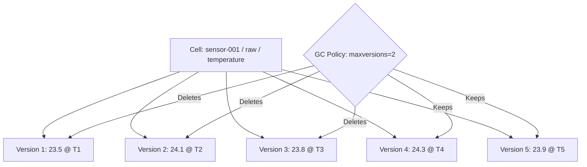

# How to Configure Garbage Collection Policies for Bigtable Column Families

Author: [nawazdhandala](https://www.github.com/nawazdhandala)

Tags: GCP, Cloud Bigtable, Garbage Collection, Column Families, Data Management

Description: Learn how to configure garbage collection policies in Cloud Bigtable to automatically clean up old data, control versioning, and manage storage costs effectively.

---

Cloud Bigtable stores every version of every cell by default. If you update a cell 100 times, all 100 versions are retained. Without garbage collection policies, your storage grows without bound, your reads slow down as they wade through old versions, and your bills climb steadily. Garbage collection (GC) policies tell Bigtable which old versions to discard, keeping your tables lean and your queries fast.

GC policies are set per column family, which gives you fine-grained control. You can keep raw sensor data for 30 days while retaining summary statistics forever. Let me walk through all the options and how to set them up.

## How Garbage Collection Works in Bigtable

Every cell in Bigtable is identified by its row key, column family, column qualifier, and timestamp. When you write to the same cell multiple times, each write creates a new version with a different timestamp. Bigtable keeps all these versions until a GC policy tells it to remove them.

GC runs in the background automatically. When you set or change a policy, Bigtable starts cleaning up data that matches the criteria. The cleanup is not instant - it happens asynchronously as part of regular compaction cycles. But the important thing is that once a GC policy is in place, you do not need to worry about manual cleanup.



## Setting Policies with the cbt CLI

The `cbt` CLI is the quickest way to set GC policies. Here are the three types of policies you can use.

**Max versions**: Keep only the N most recent versions of each cell.

```bash
# Keep only the 1 most recent version of each cell
# Good for data where you only care about the current value
cbt setgcpolicy my-table my-family maxversions=1

# Keep the 3 most recent versions
# Useful when you need some history but not all of it
cbt setgcpolicy my-table my-family maxversions=3
```

**Max age**: Delete versions older than a specified duration.

```bash
# Delete data older than 7 days (168 hours)
cbt setgcpolicy my-table my-family maxage=168h

# Delete data older than 30 days (720 hours)
cbt setgcpolicy my-table my-family maxage=720h

# Delete data older than 1 year (8760 hours)
cbt setgcpolicy my-table my-family maxage=8760h
```

**Union (OR) policy**: Delete data that matches either condition.

```bash
# Delete if older than 30 days OR if there are more than 5 versions
# Whichever condition is met first triggers deletion
cbt setgcpolicy my-table my-family maxversions=5 or maxage=720h
```

**Intersection (AND) policy**: Delete data that matches both conditions.

```bash
# Delete only if BOTH conditions are met:
# older than 7 days AND there are more than 3 versions
# This is more conservative - both conditions must be true
cbt setgcpolicy my-table my-family maxversions=3 and maxage=168h
```

## Setting Policies with Client Libraries

For programmatic setup, here is how to set GC policies using the Python client library.

```python
# Set garbage collection policies using the Python client library
from google.cloud import bigtable
from google.cloud.bigtable import column_family

client = bigtable.Client(project='your-project-id', admin=True)
instance = client.instance('your-instance-id')
table = instance.table('my-table')

# Max versions policy - keep only the latest version
max_versions_rule = column_family.MaxVersionsGCRule(1)
cf_raw = table.column_family('raw', gc_rule=max_versions_rule)
cf_raw.update()  # Use create() if the family does not exist yet

# Max age policy - keep data for 30 days
max_age_rule = column_family.MaxAgeGCRule(datetime.timedelta(days=30))
cf_logs = table.column_family('logs', gc_rule=max_age_rule)
cf_logs.update()

# Union (OR) policy - delete if either condition is met
union_rule = column_family.GCRuleUnion([
    column_family.MaxVersionsGCRule(5),
    column_family.MaxAgeGCRule(datetime.timedelta(days=90))
])
cf_events = table.column_family('events', gc_rule=union_rule)
cf_events.update()

# Intersection (AND) policy - delete only if both conditions are met
intersection_rule = column_family.GCRuleIntersection([
    column_family.MaxVersionsGCRule(3),
    column_family.MaxAgeGCRule(datetime.timedelta(days=7))
])
cf_cache = table.column_family('cache', gc_rule=intersection_rule)
cf_cache.update()
```

And here is the equivalent in Java:

```java
// Set garbage collection policies using the Java client library
import com.google.cloud.bigtable.admin.v2.BigtableTableAdminClient;
import com.google.cloud.bigtable.admin.v2.models.GCRules;
import com.google.cloud.bigtable.admin.v2.models.ModifyColumnFamiliesRequest;
import org.threeten.bp.Duration;

BigtableTableAdminClient adminClient = BigtableTableAdminClient.create(
    "your-project-id", "your-instance-id");

// Max versions policy
ModifyColumnFamiliesRequest request = ModifyColumnFamiliesRequest.of("my-table")
    .updateFamily("raw", GCRules.GCRULES.maxVersions(1));
adminClient.modifyFamilies(request);

// Max age policy - 30 days
ModifyColumnFamiliesRequest ageRequest = ModifyColumnFamiliesRequest.of("my-table")
    .updateFamily("logs", GCRules.GCRULES.maxAge(Duration.ofDays(30)));
adminClient.modifyFamilies(ageRequest);

// Union policy - either condition triggers deletion
ModifyColumnFamiliesRequest unionRequest = ModifyColumnFamiliesRequest.of("my-table")
    .updateFamily("events", GCRules.GCRULES.union()
        .rule(GCRules.GCRULES.maxVersions(5))
        .rule(GCRules.GCRULES.maxAge(Duration.ofDays(90))));
adminClient.modifyFamilies(unionRequest);
```

## Setting Policies with Terraform

If you manage your infrastructure as code, here is how to define GC policies in Terraform:

```hcl
# Terraform configuration for Bigtable table with GC policies
resource "google_bigtable_table" "sensor_data" {
  name          = "sensor-data"
  instance_name = google_bigtable_instance.instance.name

  # Column family with max age GC policy
  column_family {
    family = "raw"
  }

  # Column family with max versions GC policy
  column_family {
    family = "stats"
  }
}

# GC policy for raw data - keep for 90 days
resource "google_bigtable_gc_policy" "raw_policy" {
  instance_name = google_bigtable_instance.instance.name
  table         = google_bigtable_table.sensor_data.name
  column_family = "raw"

  max_age {
    duration = "2160h"  # 90 days
  }
}

# GC policy for stats - keep only latest version
resource "google_bigtable_gc_policy" "stats_policy" {
  instance_name = google_bigtable_instance.instance.name
  table         = google_bigtable_table.sensor_data.name
  column_family = "stats"

  max_version {
    number = 1
  }
}
```

## Understanding Union vs Intersection

The difference between union (OR) and intersection (AND) policies is subtle but important.

**Union (OR)**: Data is deleted if it satisfies any one of the conditions. This is more aggressive - it cleans up data sooner.

```
// Union: maxversions=3 OR maxage=7d
// Version is deleted if:
//   - It is NOT one of the 3 most recent versions, OR
//   - It is older than 7 days
// Whichever condition becomes true first causes deletion
```

**Intersection (AND)**: Data is deleted only if it satisfies all conditions simultaneously. This is more conservative - data sticks around longer.

```
// Intersection: maxversions=3 AND maxage=7d
// Version is deleted only if:
//   - It is NOT one of the 3 most recent versions, AND
//   - It is older than 7 days
// Both conditions must be true. A 10-day-old version is kept if it is
// one of the 3 most recent versions.
```

For most use cases, union policies are what you want. They ensure data does not accumulate beyond either your version limit or your time limit.

## Practical Examples

Here are GC policies for common scenarios:

```bash
# Session store: keep only the current session, delete old ones immediately
cbt setgcpolicy sessions data maxversions=1

# Audit log: keep everything for 7 years (regulatory requirement)
cbt setgcpolicy audit-log entries maxage=61320h  # ~7 years

# Cache layer: aggressive cleanup - 1 version, max 1 hour old
cbt setgcpolicy cache data maxversions=1 or maxage=1h

# Time-series raw data: 90 days retention
cbt setgcpolicy sensor-data raw maxage=2160h

# Time-series aggregates: hourly summaries for 2 years, daily summaries forever
cbt setgcpolicy sensor-data hourly maxage=17520h  # 2 years
# No GC policy on 'daily' family means data is kept forever
```

## Checking Current Policies

You can inspect the current GC policies for any table:

```bash
# List all column families and their GC policies
cbt ls my-table
```

The output will show each column family with its configured GC rule.

## When GC Actually Runs

GC does not happen immediately after you set a policy. Bigtable applies GC policies during compaction, which happens in the background. This means:

- After setting a new policy, existing data that matches the criteria will be cleaned up eventually (usually within hours)
- Deleted data may still appear in reads briefly after it should have been garbage collected
- New writes that immediately exceed the policy are cleaned up during the next compaction
- You cannot force GC to run immediately

Do not design your application logic around GC timing. If you need data to be truly gone at a specific time, delete it explicitly. Use GC policies for ongoing storage management, not for time-critical data removal.

## Wrapping Up

Garbage collection policies are essential for any Bigtable deployment that runs for more than a few days. Without them, your storage grows indefinitely, reads slow down, and costs increase. Set a max versions policy when you only care about the current value, a max age policy for data with a defined retention period, and combine them with union or intersection for more nuanced control. Configure your policies early - ideally when you create the table - and let Bigtable handle the cleanup automatically.
