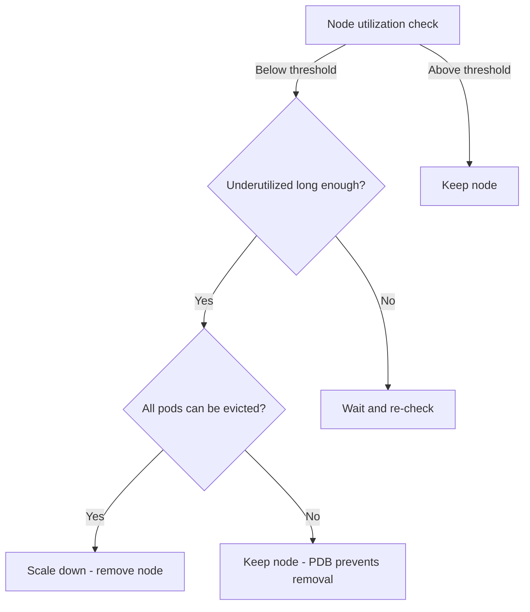

# How to Configure GKE Cluster Autoscaler with Scale-Down Delays to Prevent Flapping

Author: [nawazdhandala](https://www.github.com/nawazdhandala)

Tags: GCP, GKE, Kubernetes, Autoscaling, Cluster Autoscaler, Cost Optimization

Description: Learn how to fine-tune the GKE Cluster Autoscaler's scale-down behavior with delays and thresholds to prevent node flapping and reduce unnecessary churn.

---

The GKE Cluster Autoscaler is great at scaling up - when pods cannot be scheduled, it creates new nodes quickly. But scaling down is where the problems start. The autoscaler identifies underutilized nodes and removes them, which is good for cost savings. The problem is when it removes a node, pods get rescheduled, and the increased load on remaining nodes triggers a scale-up, which then leads to another scale-down... and you are stuck in a loop. This is called flapping.

I have seen clusters where the autoscaler would add two nodes, remove them five minutes later, add them back three minutes after that, and repeat this cycle all day. It wastes money on startup overhead, disrupts workloads with unnecessary evictions, and creates noise in your monitoring.

The fix is tuning the scale-down parameters. Let me show you how.

## Understanding the Scale-Down Decision

The cluster autoscaler evaluates each node for removal based on these criteria:

1. **Utilization threshold**: Is the node's resource utilization below the threshold? (default: 50%)
2. **Scale-down unneeded time**: Has the node been underutilized for long enough? (default: 10 minutes)
3. **Pod disruption**: Can all pods on the node be safely evicted? (respects PDBs)
4. **System pods**: Are there any system pods that prevent removal?



The flapping happens when the "underutilized long enough" window is too short. A node becomes underutilized for 10 minutes (the default), gets removed, and the remaining nodes become overutilized, triggering a scale-up.

## Configuring Scale-Down Parameters

GKE exposes cluster autoscaler tuning through the `autoscaling-profile` and cluster update commands.

### Method 1: Using Autoscaling Profile

GKE offers two built-in profiles:

```bash
# Balanced profile (default) - scales down moderately
gcloud container clusters update my-cluster \
  --region us-central1 \
  --autoscaling-profile balanced

# Optimize-utilization profile - more aggressive scale-down
gcloud container clusters update my-cluster \
  --region us-central1 \
  --autoscaling-profile optimize-utilization
```

The `optimize-utilization` profile sets the utilization threshold higher (closer to 100%), meaning nodes must be nearly empty before being removed. This prevents flapping but may leave underutilized nodes running longer.

### Method 2: Fine-Tuning Specific Parameters

For more control, configure individual parameters.

```bash
# Configure autoscaler behavior with specific parameters
gcloud container clusters update my-cluster \
  --region us-central1 \
  --enable-autoscaling \
  --autoscaling-profile balanced
```

Unfortunately, GKE does not expose all cluster autoscaler flags directly through `gcloud`. For fine-grained control, you need to configure the autoscaler through the node pool or use the Kubernetes cluster autoscaler ConfigMap.

```yaml
# cluster-autoscaler-config.yaml
# Applied via ConfigMap in the kube-system namespace
apiVersion: v1
kind: ConfigMap
metadata:
  name: cluster-autoscaler-status
  namespace: kube-system
data:
  status: |
    Cluster-autoscaler status at 2026-02-17:
    # This is read-only - autoscaler updates this automatically
```

The actual tuning is done through node pool configuration and cluster-level settings.

## Practical Scale-Down Tuning

Here are the most impactful settings you can control through GKE:

### 1. Node Pool Min/Max Sizes

Set appropriate min/max node counts to prevent wild scaling swings.

```bash
# Configure node pool with sensible bounds
gcloud container node-pools update default-pool \
  --cluster my-cluster \
  --region us-central1 \
  --enable-autoscaling \
  --min-nodes 3 \
  --max-nodes 20
```

Setting `--min-nodes 3` means the autoscaler will never scale below 3 nodes, even if the cluster is nearly empty. This prevents the "scale to zero then back up" pattern.

### 2. Pod Resource Requests

The single most impactful change for autoscaler behavior is getting your pod resource requests right. The autoscaler makes decisions based on requested resources, not actual usage.

```yaml
# Bad: Over-provisioned requests lead to high "utilization"
# even when actual usage is low
apiVersion: apps/v1
kind: Deployment
spec:
  template:
    spec:
      containers:
        - resources:
            requests:
              cpu: "2"      # Requests 2 CPU but uses 200m
              memory: "4Gi"  # Requests 4Gi but uses 400Mi
```

```yaml
# Good: Right-sized requests give the autoscaler accurate data
apiVersion: apps/v1
kind: Deployment
spec:
  template:
    spec:
      containers:
        - resources:
            requests:
              cpu: "250m"    # Matches actual usage
              memory: "512Mi" # Matches actual usage
```

When requests are right-sized, the autoscaler accurately knows how much capacity is available and makes better scaling decisions.

### 3. Pod Disruption Budgets

PDBs indirectly control scale-down behavior by preventing the autoscaler from removing nodes if doing so would violate the budget.

```yaml
# PDB prevents autoscaler from removing nodes too aggressively
apiVersion: policy/v1
kind: PodDisruptionBudget
metadata:
  name: web-app-pdb
spec:
  maxUnavailable: 1  # Only 1 pod can be disrupted at a time
  selector:
    matchLabels:
      app: web-app
```

With this PDB and pods spread across nodes, the autoscaler can only remove one node at a time (since removing more would violate the PDB). This naturally slows down scale-down.

### 4. Pod Anti-Affinity

Spread pods across nodes so the autoscaler cannot find "empty" nodes to remove.

```yaml
# Spread pods across nodes - prevents autoscaler from emptying nodes
apiVersion: apps/v1
kind: Deployment
metadata:
  name: web-app
spec:
  replicas: 6
  template:
    spec:
      topologySpreadConstraints:
        - maxSkew: 1
          topologyKey: kubernetes.io/hostname
          whenUnsatisfiable: DoNotSchedule
          labelSelector:
            matchLabels:
              app: web-app
```

When pods are evenly spread, no single node becomes underutilized enough to trigger removal. This is the most effective anti-flapping technique.

### 5. Safe Scale-Down Annotations

Mark certain pods as "do not evict for scale-down" using annotations.

```yaml
# Prevent the autoscaler from evicting this pod for scale-down
apiVersion: v1
kind: Pod
metadata:
  annotations:
    cluster-autoscaler.kubernetes.io/safe-to-evict: "false"
spec:
  containers:
    - name: critical-job
      image: my-job:latest
```

Nodes running pods with `safe-to-evict: false` will not be considered for removal. Use this for long-running batch jobs or pods with local state.

Conversely, mark ephemeral pods as safe to evict:

```yaml
# Allow autoscaler to evict this pod freely
metadata:
  annotations:
    cluster-autoscaler.kubernetes.io/safe-to-evict: "true"
```

## Diagnosing Flapping

Check if your cluster is flapping by looking at node events.

```bash
# Look for rapid scale-up/scale-down cycles
kubectl get events --field-selector reason=ScaleDown --sort-by='.metadata.creationTimestamp' | tail -20
kubectl get events --field-selector reason=ScaleUp --sort-by='.metadata.creationTimestamp' | tail -20

# Check autoscaler status
kubectl -n kube-system describe configmap cluster-autoscaler-status
```

If you see ScaleDown and ScaleUp events alternating every few minutes, you have a flapping problem.

## Monitoring Autoscaler Decisions

Use Cloud Monitoring to track autoscaler behavior over time.

```bash
# View autoscaler logs
gcloud logging read \
  'resource.type="k8s_cluster" AND log_name:"cluster-autoscaler-visibility"' \
  --limit 50 \
  --format "table(timestamp, jsonPayload.decision)"
```

Set up alerts for unusual scaling patterns:

- Alert when more than 5 scale-up/down events happen in an hour
- Alert when node count changes by more than 30% in 10 minutes
- Alert when the autoscaler cannot scale down due to PDB violations

## The Optimize-Utilization Profile in Detail

The `optimize-utilization` profile changes several defaults:

- Scale-down utilization threshold is higher (nodes must be less utilized to be removed)
- Scale-down delay after add is shorter
- Prefers to schedule pods on already-running nodes more aggressively

```bash
# Switch to optimize-utilization if flapping is your main issue
gcloud container clusters update my-cluster \
  --region us-central1 \
  --autoscaling-profile optimize-utilization
```

This profile is better for cost optimization but can lead to bin-packing pods onto fewer nodes, which increases the blast radius if a node fails.

## Wrapping Up

Cluster autoscaler flapping is one of the most common operational issues on GKE. The fix is almost always a combination of: right-sizing pod resource requests so the autoscaler has accurate data, using topology spread constraints to prevent nodes from becoming empty, setting appropriate min-node counts so you always have baseline capacity, and using PDBs to slow down the rate of node removal. Start with the `balanced` profile, right-size your resource requests (use VPA recommendations), and add topology spread constraints to your deployments. Most flapping issues resolve with just these three changes.
