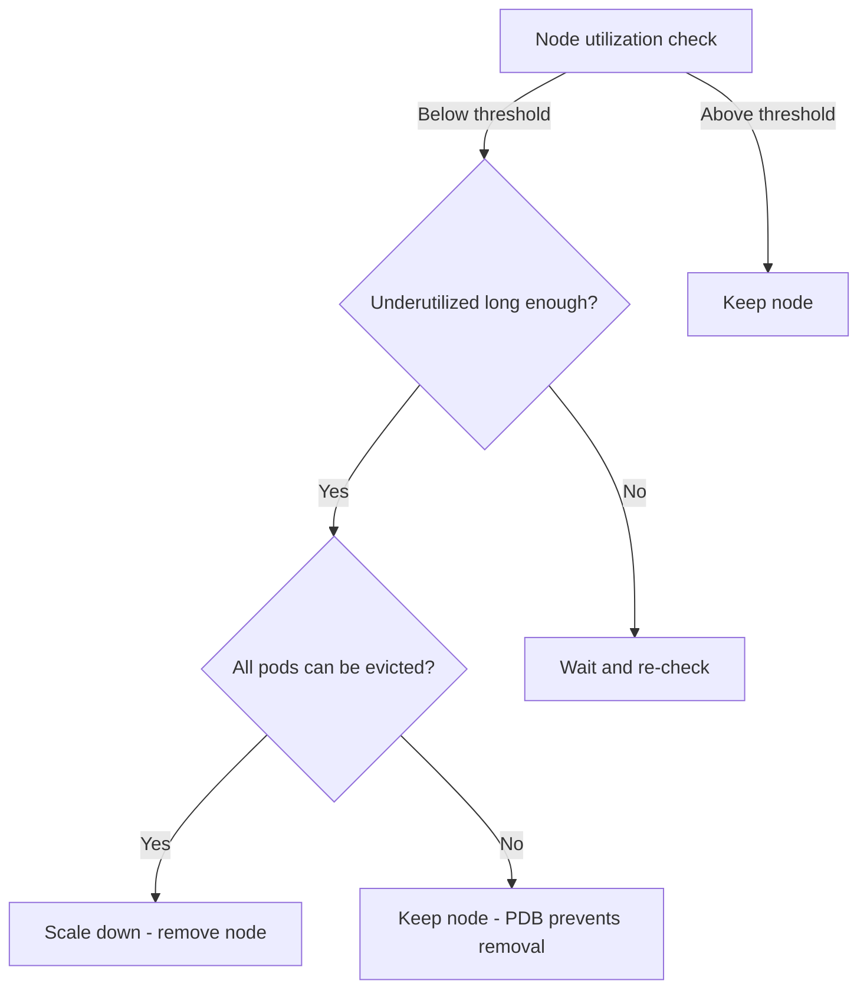

# Configure GKE Cluster Autoscaler with Scale-Down Delays to Prevent Flapping

Author: [nawazdhandala](https://www.github.com/nawazdhandala)

Tags: GCP, GKE, Kubernetes, Autoscaling, Cluster Autoscaler, Cost Optimization

Description: Learn how to fine-tune the GKE Cluster Autoscaler's scale-down behavior with delays and thresholds to prevent node flapping and reduce unnecessary churn.

---

The GKE Cluster Autoscaler is great at scaling up - when pods cannot be scheduled, it creates new nodes quickly. But scaling down is where the problems start. The autoscaler identifies underutilized nodes and removes them, which is good for cost savings. The problem is when it removes a node, pods get rescheduled, and the increased load on remaining nodes triggers a scale-up, which then leads to another scale-down... and you are stuck in a loop. This is called flapping.

I have seen clusters where the autoscaler would add two nodes, remove them five minutes later, add them back three minutes after that, and repeat this cycle all day. It wastes money on startup overhead, disrupts workloads with unnecessary evictions, and creates noise in your monitoring.

The fix is tuning the scale-down parameters. Let me show you how.

## Understanding the Scale-Down Decision

The cluster autoscaler evaluates each node for removal based on these criteria:

1. **Utilization threshold**: Is the node's resource utilization below the threshold? (default: 50%)
2. **Scale-down unneeded time**: Has the node been underutilized for long enough? (default: 10 minutes)
3. **Pod disruption**: Can all pods on the node be safely evicted? (respects PDBs)
4. **System pods**: Are there any system pods that prevent removal?


```mermaid
graph TD
    A[Node utilization check] -->|Below threshold| B{Underutilized long enough?}
    A -->|Above threshold| C[Keep node]
    B -->|Yes| D{All pods can be evicted?}
    B -->|No| E[Wait and re-check]
    D -->|Yes| F[Scale down - remove node]
    D -->|No| G[Keep node - PDB prevents removal]
```

The flapping happens when the "underutilized long enough" window is too short. A node becomes underutilized for 10 minutes (the default), gets removed, and the remaining nodes become overutilized, triggering a scale-up.

## Configuring Scale-Down Parameters

GKE exposes cluster autoscaler tuning through the `autoscaling-profile`, cluster update commands, and node pool settings.

### Method 1: Using Autoscaling Profile

GKE offers two built-in profiles:

```bash
# Balanced profile (default) - scales down moderately

gcloud container clusters update my-cluster \
  --region us-central1 \
  --autoscaling-profile balanced

# Optimize-utilization profile - more aggressive scale-down
gcloud container clusters update my-cluster \
  --region us-central1 \
  --autoscaling-profile optimize-utilization
```

The `optimize-utilization` profile helps GKE identify and remove underutilized nodes more aggressively. It also uses GKE's optimize-utilization scheduler for pods that do not specify a custom scheduler, which encourages tighter packing onto existing nodes. This is better for cost optimization, but it can increase disruption if workloads are not prepared for rescheduling.

### Method 2: Fine-Tuning Specific Parameters

For more control over scale-down timing, configure the node pool consolidation delay.

```bash
# Wait longer before scaling down underutilized nodes
gcloud container node-pools update default-pool \
  --cluster my-cluster \
  --region us-central1 \
  --consolidation-delay 3600s
```

GKE does not expose every upstream Cluster Autoscaler flag directly through `gcloud`, but current GKE node pools do expose `--consolidation-delay` for the delay after which the autoscaler can scale down underutilized nodes.

```yaml
# cluster-autoscaler-config.yaml
# This ConfigMap is status output, not a tuning interface.
apiVersion: v1
kind: ConfigMap
metadata:
  name: cluster-autoscaler-status
  namespace: kube-system
data:
  status: |
    Cluster-autoscaler status at 2026-02-17:
    # This is read-only - autoscaler updates this automatically
```

Do not edit `cluster-autoscaler-status` to configure scale-down behavior. The actual tuning is done through node pool configuration and cluster-level settings.

## Practical Scale-Down Tuning

Here are the most impactful settings you can control through GKE:

### 1. Node Pool Min/Max Sizes

Set appropriate min/max node counts to prevent wild scaling swings.

```bash
# Configure node pool with sensible bounds
gcloud container node-pools update default-pool \
  --cluster my-cluster \
  --region us-central1 \
  --enable-autoscaling \
  --min-nodes 3 \
  --max-nodes 20
```

Setting `--min-nodes 3` means the autoscaler will never scale the node pool below 3 nodes per zone, even if the cluster is nearly empty. This prevents the "scale to zero then back up" pattern. For GKE 1.24 and later, use `--total-min-nodes` if you want to set the minimum across the entire node pool instead of per zone.

### 2. Pod Resource Requests

The single most impactful change for autoscaler behavior is getting your pod resource requests right. The autoscaler makes decisions based on requested resources, not actual usage.

```yaml
# Bad: Over-provisioned requests lead to high "utilization"
# even when actual usage is low
apiVersion: apps/v1
kind: Deployment
spec:
  template:
    spec:
      containers:
        - resources:
            requests:
              cpu: "2"      # Requests 2 CPU but uses 200m
              memory: "4Gi"  # Requests 4Gi but uses 400Mi
```

```yaml
# Good: Right-sized requests give the autoscaler accurate data
apiVersion: apps/v1
kind: Deployment
spec:
  template:
    spec:
      containers:
        - resources:
            requests:
              cpu: "250m"    # Matches actual usage
              memory: "512Mi" # Matches actual usage
```

When requests are right-sized, the autoscaler accurately knows how much capacity is available and makes better scaling decisions.

### 3. Pod Disruption Budgets

PDBs indirectly control scale-down behavior by preventing the autoscaler from removing nodes if doing so would violate the budget.

```yaml
# PDB prevents autoscaler from removing nodes too aggressively
apiVersion: policy/v1
kind: PodDisruptionBudget
metadata:
  name: web-app-pdb
spec:
  maxUnavailable: 1  # Only 1 pod can be disrupted at a time
  selector:
    matchLabels:
      app: web-app
```

With this PDB and pods spread across nodes, the autoscaler can only remove one node at a time (since removing more would violate the PDB). This naturally slows down scale-down.

### 4. Topology Spread Constraints

Spread pods across nodes when availability matters, so a single node removal does not concentrate too many replicas on the same node.

```yaml
# Prefer spreading pods across nodes without blocking autoscaler simulation
apiVersion: apps/v1
kind: Deployment
metadata:
  name: web-app
spec:
  replicas: 6
  template:
    spec:
      topologySpreadConstraints:
        - maxSkew: 1
          topologyKey: kubernetes.io/hostname
          whenUnsatisfiable: ScheduleAnyway
          labelSelector:
            matchLabels:
              app: web-app
```

When pods are evenly spread, the scheduler prefers not to concentrate replicas on the same node. Use `ScheduleAnyway` for this pattern on GKE, because the GKE Cluster Autoscaler does not support strict topology spread constraints with `whenUnsatisfiable: DoNotSchedule`.

### 5. Safe Scale-Down Annotations

Mark certain pods as "do not evict for scale-down" using annotations.

```yaml
# Prevent the autoscaler from evicting this pod for scale-down
apiVersion: v1
kind: Pod
metadata:
  annotations:
    cluster-autoscaler.kubernetes.io/safe-to-evict: "false"
spec:
  containers:
    - name: critical-job
      image: my-job:latest
```

Nodes running pods with `safe-to-evict: false` will not be considered for removal. Use this sparingly for long-running batch jobs or pods that cannot tolerate voluntary eviction.

Conversely, mark ephemeral pods as safe to evict:

```yaml
# Allow autoscaler to evict this pod when other constraints allow it
metadata:
  annotations:
    cluster-autoscaler.kubernetes.io/safe-to-evict: "true"
```

## Diagnosing Flapping

Check if your cluster is flapping by looking at node events.

```bash
# Look for rapid scale-up/scale-down cycles
kubectl get events --field-selector reason=ScaleDown --sort-by='.metadata.creationTimestamp' | tail -20
kubectl get events --field-selector reason=ScaleUp --sort-by='.metadata.creationTimestamp' | tail -20

# Check autoscaler status
kubectl -n kube-system describe configmap cluster-autoscaler-status
```

If you see ScaleDown and ScaleUp events alternating every few minutes, you have a flapping problem.

## Monitoring Autoscaler Decisions

Use Cloud Logging to track autoscaler behavior over time.

```bash
# View autoscaler logs
gcloud logging read \
  'resource.type="k8s_cluster" AND log_id("container.googleapis.com/cluster-autoscaler-visibility")' \
  --limit 50 \
  --format "table(timestamp, jsonPayload)"
```

Set up alerts for unusual scaling patterns:

- Alert when more than 5 scale-up/down events happen in an hour
- Alert when node count changes by more than 30% in 10 minutes
- Alert when the autoscaler cannot scale down due to PDB violations

## The Optimize-Utilization Profile in Detail

The `optimize-utilization` profile changes several defaults:

- Helps the autoscaler identify and remove underutilized nodes
- Uses GKE's optimize-utilization scheduler for pods that do not specify a custom scheduler
- Prefers tighter packing on already-running nodes

```bash
# Switch to optimize-utilization if cost optimization is your main issue
gcloud container clusters update my-cluster \
  --region us-central1 \
  --autoscaling-profile optimize-utilization
```

This profile is better for cost optimization but can lead to bin-packing pods onto fewer nodes, which increases the blast radius if a node fails.

## Wrapping Up

Cluster autoscaler flapping is one of the most common operational issues on GKE. The fix is almost always a combination of: right-sizing pod resource requests so the autoscaler has accurate data, setting an appropriate consolidation delay, setting appropriate min-node counts so you always have baseline capacity, and using PDBs to slow down the rate of node removal. Start with the `balanced` profile, right-size your resource requests (use VPA recommendations), and increase the consolidation delay for node pools that flap. Most flapping issues resolve with just these three changes.
