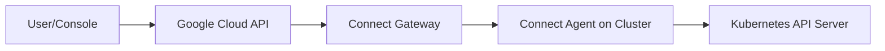

# How to Configure GKE Connect Gateway to Access Remote Clusters from the Google Cloud Console

Author: [nawazdhandala](https://www.github.com/nawazdhandala)

Tags: GCP, GKE, Connect Gateway, Multi-Cluster, Fleet Management, Kubernetes

Description: Learn how to set up GKE Connect Gateway to securely access registered Kubernetes clusters from the Google Cloud Console and gcloud CLI without direct network connectivity.

---

Managing Kubernetes clusters that sit behind firewalls, in private networks, or even in other clouds is a common challenge. Normally, you need a VPN, a bastion host, or direct network connectivity to run kubectl commands. GKE Connect Gateway eliminates that requirement by providing a secure, authenticated proxy through Google Cloud's infrastructure.

With Connect Gateway, you can access any registered cluster from the Google Cloud Console, gcloud CLI, or kubectl - without needing direct network access to the cluster's API server. The connection goes through Google's network, authenticated with your Google Cloud identity.

## How Connect Gateway Works

The architecture is straightforward:



The Connect Agent runs inside your cluster and maintains an outbound connection to Google Cloud. When you send a kubectl command through Connect Gateway, it travels through Google's infrastructure to the Connect Agent, which forwards it to the cluster's API server. Since the agent initiates the outbound connection, you do not need to open any inbound firewall rules.

## Prerequisites

You need:

- A GKE cluster registered with a fleet (or any Kubernetes cluster registered via Connect)
- The GKE Connect Gateway API enabled
- Appropriate IAM roles for users who need access

Enable the required APIs:

```bash
# Enable the Connect Gateway API
gcloud services enable connectgateway.googleapis.com

# Enable the GKE Hub API if not already enabled
gcloud services enable gkehub.googleapis.com
```

## Registering a Cluster

If your cluster is not already registered with the fleet, register it. For GKE clusters:

```bash
# Register a GKE cluster with the fleet
gcloud container clusters update my-cluster \
  --zone us-central1-a \
  --fleet-project=my-project
```

For non-GKE clusters (EKS, AKS, on-premises), you need to install the Connect Agent:

```bash
# Register an external cluster with the fleet
gcloud container fleet memberships register my-external-cluster \
  --context=my-kubeconfig-context \
  --kubeconfig=/path/to/kubeconfig \
  --enable-workload-identity \
  --project=my-project
```

Verify the registration:

```bash
# Check that the membership is active
gcloud container fleet memberships list --project=my-project
```

## Granting Connect Gateway Access

Users need IAM roles to access clusters through Connect Gateway. The key role is `roles/gkehub.gatewayEditor` for read-write access or `roles/gkehub.gatewayReader` for read-only access.

Grant access to a user:

```bash
# Grant a user the ability to access clusters through Connect Gateway
gcloud projects add-iam-policy-binding my-project \
  --member="user:developer@example.com" \
  --role="roles/gkehub.gatewayEditor"
```

Grant access to a group:

```bash
# Grant a Google Group access through Connect Gateway
gcloud projects add-iam-policy-binding my-project \
  --member="group:k8s-admins@example.com" \
  --role="roles/gkehub.gatewayEditor"
```

## Setting Up RBAC on the Cluster

IAM controls who can access the gateway, but Kubernetes RBAC controls what they can do once connected. You need to create RBAC bindings on the cluster that map Google identities to Kubernetes permissions.

Grant cluster-admin to a specific user:

```yaml
# rbac.yaml - Map a Google identity to cluster-admin role
apiVersion: rbac.authorization.k8s.io/v1
kind: ClusterRoleBinding
metadata:
  name: gateway-cluster-admin
subjects:
  - kind: User
    # Use the Google identity email
    name: developer@example.com
    apiGroup: rbac.authorization.k8s.io
roleRef:
  kind: ClusterRole
  name: cluster-admin
  apiGroup: rbac.authorization.k8s.io
```

For more restrictive access, create a custom role:

```yaml
# custom-rbac.yaml - Limited access through Connect Gateway
apiVersion: rbac.authorization.k8s.io/v1
kind: ClusterRole
metadata:
  name: gateway-viewer
rules:
  - apiGroups: [""]
    resources: ["pods", "services", "configmaps"]
    verbs: ["get", "list", "watch"]
  - apiGroups: ["apps"]
    resources: ["deployments", "statefulsets"]
    verbs: ["get", "list", "watch"]
---
apiVersion: rbac.authorization.k8s.io/v1
kind: ClusterRoleBinding
metadata:
  name: gateway-viewers
subjects:
  - kind: Group
    name: developers@example.com
    apiGroup: rbac.authorization.k8s.io
roleRef:
  kind: ClusterRole
  name: gateway-viewer
  apiGroup: rbac.authorization.k8s.io
```

Apply the RBAC configuration:

```bash
kubectl apply -f rbac.yaml
```

## Connecting with kubectl

Get credentials for the cluster through Connect Gateway:

```bash
# Get kubectl credentials through Connect Gateway
gcloud container fleet memberships get-credentials my-cluster \
  --project=my-project
```

This configures your kubeconfig to route through Connect Gateway. Now you can use kubectl normally:

```bash
# These commands go through Connect Gateway automatically
kubectl get pods
kubectl get nodes
kubectl logs deployment/my-app
```

The kubeconfig context will be named something like `connectgateway_my-project_global_my-cluster`.

## Using the Cloud Console

Once Connect Gateway is configured, you can manage the cluster from the Google Cloud Console:

1. Go to Kubernetes Engine > Clusters
2. Click on your registered cluster
3. Use the built-in kubectl terminal or browse workloads in the UI

The Console provides a visual interface for viewing pods, services, logs, and events - all routed through Connect Gateway.

## Accessing Private GKE Clusters

Connect Gateway is particularly useful for private GKE clusters where the API server has no public endpoint. Without Connect Gateway, you would need a bastion host or VPN to access the cluster.

For private clusters, Connect Gateway works out of the box because the Connect Agent inside the cluster makes outbound connections to Google. It does not need an inbound path to the API server.

```bash
# Even for a private cluster, this works through Connect Gateway
gcloud container fleet memberships get-credentials my-private-cluster
kubectl get pods --all-namespaces
```

## Multi-Cluster Access

With Connect Gateway, switching between clusters is seamless:

```bash
# Get credentials for multiple clusters
gcloud container fleet memberships get-credentials cluster-us
gcloud container fleet memberships get-credentials cluster-eu
gcloud container fleet memberships get-credentials cluster-asia

# Switch between contexts
kubectl config use-context connectgateway_my-project_global_cluster-us
kubectl get pods

kubectl config use-context connectgateway_my-project_global_cluster-eu
kubectl get pods
```

## Security Considerations

Connect Gateway adds several security benefits:

- All access is authenticated through Google Cloud IAM
- Audit logs capture every API call, including the user identity
- No need to expose the Kubernetes API server publicly
- No need to manage VPN tunnels or bastion hosts
- Access can be revoked by removing IAM bindings

Check the audit logs for Connect Gateway activity:

```bash
# View Connect Gateway audit logs
gcloud logging read \
  'resource.type="k8s_cluster" AND protoPayload.authenticationInfo.principalEmail!=""' \
  --limit=20 \
  --project=my-project
```

## Terraform Configuration

Set up Connect Gateway access with Terraform:

```hcl
# IAM binding for Connect Gateway access
resource "google_project_iam_member" "gateway_access" {
  project = "my-project"
  role    = "roles/gkehub.gatewayEditor"
  member  = "group:k8s-admins@example.com"
}

# Fleet membership for the cluster
resource "google_gke_hub_membership" "cluster" {
  membership_id = "my-cluster"
  project       = "my-project"

  endpoint {
    gke_cluster {
      resource_link = google_container_cluster.primary.id
    }
  }
}
```

## Troubleshooting

If Connect Gateway is not working:

First, check that the Connect Agent is healthy:

```bash
# Check the Connect Agent pods (if using a GKE cluster)
kubectl get pods -n gke-connect
```

Second, verify the membership status:

```bash
# Check membership state
gcloud container fleet memberships describe my-cluster \
  --project=my-project \
  --format="yaml(state)"
```

Third, make sure the cluster can reach Google Cloud APIs. The Connect Agent needs outbound HTTPS access to `connectgateway.googleapis.com` and `gkeconnect.googleapis.com`.

Connect Gateway turns cluster access from a networking problem into an identity problem. Instead of managing VPNs, firewall rules, and bastion hosts, you manage IAM roles and RBAC bindings. That is a much simpler model, especially when you have clusters in multiple environments.
