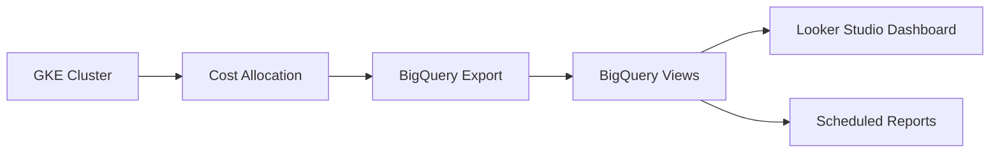

# How to Configure GKE Cost Allocation Labels to Track Kubernetes Spending by Team

Author: [nawazdhandala](https://www.github.com/nawazdhandala)

Tags: GCP, GKE, Cost Management, Kubernetes, FinOps, Billing

Description: Learn how to use GKE cost allocation labels to break down Kubernetes cluster costs by team, project, or environment for accurate chargeback reporting.

---

When multiple teams share a GKE cluster, figuring out who is spending what becomes a real challenge. The cluster shows up as a single line item on your GCP bill, but the engineering manager wants to know how much each team is costing. Finance wants chargeback reports. And without proper cost attribution, nobody has the information they need to make informed decisions about resource usage.

GKE cost allocation solves this by breaking down cluster costs to the namespace and label level. Once enabled, it feeds data into Cloud Billing reports, giving you per-team and per-application cost visibility without any third-party tools.

## Enabling GKE Cost Allocation

Cost allocation is a cluster-level setting. You can enable it on an existing cluster or at creation time.

Enable it on an existing cluster:

```bash
# Enable cost allocation on an existing GKE cluster
gcloud container clusters update my-cluster \
  --zone us-central1-a \
  --enable-cost-allocation
```

Or enable it when creating a new cluster:

```bash
# Create a new cluster with cost allocation enabled from the start
gcloud container clusters create my-cluster \
  --zone us-central1-a \
  --enable-cost-allocation \
  --num-nodes=3
```

It takes about 24-48 hours for cost data to start appearing in your billing reports after enabling this feature.

## How GKE Cost Allocation Works

Once enabled, GKE tracks resource consumption at the pod level and allocates cluster costs proportionally. Here is what gets tracked:

- CPU requests and usage per pod
- Memory requests and usage per pod
- Persistent volume usage
- Network egress (at the pod level)

The costs are split into two categories:

1. Resource costs that can be attributed to specific workloads (based on requests)
2. Unallocated costs for resources that no pod has claimed

This gives you a clear picture of both what teams are requesting and what they are actually using.

## Setting Up Labels for Cost Tracking

The power of cost allocation comes from labels. By labeling your namespaces and workloads consistently, you can slice costs by team, environment, application, or any other dimension that matters to your organization.

Start by labeling your namespaces:

```bash
# Label namespaces with team ownership for cost tracking
kubectl label namespace team-alpha team=alpha
kubectl label namespace team-beta team=beta
kubectl label namespace shared-services team=platform
```

Then make sure your workloads carry the right labels in their pod templates:

```yaml
# deployment.yaml - Deployment with cost allocation labels on the pod template
apiVersion: apps/v1
kind: Deployment
metadata:
  name: api-server
  namespace: team-alpha
  labels:
    app: api-server
    team: alpha
    environment: production
spec:
  replicas: 3
  selector:
    matchLabels:
      app: api-server
  template:
    metadata:
      labels:
        app: api-server
        team: alpha
        environment: production
        cost-center: eng-alpha-001
    spec:
      containers:
        - name: api-server
          image: us-docker.pkg.dev/my-project/my-repo/api-server:v1.0
          resources:
            # Always set resource requests - they drive cost allocation
            requests:
              cpu: 250m
              memory: 256Mi
            limits:
              cpu: 500m
              memory: 512Mi
```

## Configuring GCP Billing Labels

To see GKE cost allocation data in Cloud Billing, you need to enable the GKE cost allocation export to BigQuery. First, make sure billing export is set up:

```bash
# Enable billing export to BigQuery (if not already enabled)
# This is done in the Cloud Console under Billing > Billing export
# The dataset needs to exist first
bq mk --dataset my-project:billing_export
```

Then in the Cloud Console, go to Billing > Billing export and enable detailed usage cost export to your BigQuery dataset.

## Querying Cost Data in BigQuery

Once the data is flowing (after 24-48 hours), you can query it in BigQuery. Here is a query that breaks down GKE costs by namespace:

```sql
-- Query GKE costs grouped by namespace for the last 30 days
SELECT
  labels.value AS namespace,
  SUM(cost) AS total_cost,
  SUM(usage.amount) AS total_usage
FROM
  `my-project.billing_export.gcloud_billing_export_v1_XXXXXX`
LEFT JOIN
  UNNEST(labels) AS labels
WHERE
  service.description = 'Kubernetes Engine'
  AND labels.key = 'k8s-namespace'
  AND usage_start_time >= TIMESTAMP_SUB(CURRENT_TIMESTAMP(), INTERVAL 30 DAY)
GROUP BY
  namespace
ORDER BY
  total_cost DESC;
```

And here is a query that breaks down costs by team label:

```sql
-- Query GKE costs grouped by team label for cost allocation
SELECT
  labels.value AS team,
  SUM(cost) AS total_cost,
  SUM(credits.amount) AS total_credits,
  SUM(cost) + SUM(credits.amount) AS net_cost
FROM
  `my-project.billing_export.gcloud_billing_export_v1_XXXXXX`
LEFT JOIN
  UNNEST(labels) AS labels
LEFT JOIN
  UNNEST(credits) AS credits
WHERE
  service.description = 'Kubernetes Engine'
  AND labels.key = 'k8s-label/team'
  AND usage_start_time >= TIMESTAMP_SUB(CURRENT_TIMESTAMP(), INTERVAL 30 DAY)
GROUP BY
  team
ORDER BY
  total_cost DESC;
```

## Building a Cost Dashboard

You can connect BigQuery to Looker Studio (formerly Data Studio) to create visual cost dashboards. Here is the general approach:

1. Create a BigQuery view that summarizes costs by your key dimensions
2. Connect Looker Studio to that view
3. Build charts showing cost trends, team comparisons, and resource efficiency

The flow looks like this:



## Setting Resource Requests Correctly

Cost allocation is based on resource requests, not actual usage. If a team requests 4 CPUs but only uses 1, they still get charged for 4. This is by design because those resources are reserved and unavailable to other workloads.

This creates an incentive for teams to right-size their resource requests. You can help by providing recommendations:

```bash
# Get resource recommendation for pods in a namespace
# This shows the difference between requests and actual usage
kubectl top pods -n team-alpha --sort-by=cpu
```

Consider using the Vertical Pod Autoscaler (VPA) in recommendation mode to suggest optimal resource requests:

```yaml
# vpa.yaml - VPA in recommendation mode to suggest better resource requests
apiVersion: autoscaling.k8s.io/v1
kind: VerticalPodAutoscaler
metadata:
  name: api-server-vpa
  namespace: team-alpha
spec:
  targetRef:
    apiVersion: apps/v1
    kind: Deployment
    name: api-server
  updatePolicy:
    updateMode: "Off"  # Only recommend, do not auto-apply
```

## Handling Shared Costs

Not all cluster costs can be attributed to a specific team. System components like kube-dns, the metrics server, and monitoring agents run in kube-system and benefit everyone. There are a few approaches to handle these:

- Split shared costs evenly across all teams
- Allocate shared costs proportionally based on each team's resource usage
- Absorb shared costs into a platform team's budget

The approach you choose depends on your organization's culture and what feels fair to the teams involved.

## Enforcing Labels with Admission Controllers

Cost allocation only works if workloads are properly labeled. You can enforce labeling standards using a Kubernetes admission controller.

Here is a simple Gatekeeper constraint that requires a team label on all pods:

```yaml
# require-team-label.yaml - Gatekeeper constraint requiring team labels
apiVersion: constraints.gatekeeper.sh/v1beta1
kind: K8sRequiredLabels
metadata:
  name: require-team-label
spec:
  match:
    kinds:
      - apiGroups: [""]
        kinds: ["Pod"]
  parameters:
    labels:
      - key: "team"
```

This prevents pods from being created without a team label, ensuring cost allocation data is always complete.

## Practical Takeaways

Start by enabling cost allocation and setting up billing export. Label your namespaces and workloads consistently. Build a simple dashboard so teams can see their own spending. And use the data to drive conversations about resource efficiency rather than just cost cutting.

Cost visibility changes behavior. When teams can see what they are spending, they naturally start making smarter decisions about resource requests, replica counts, and scaling configurations. That is the real value of GKE cost allocation - not just tracking costs, but driving efficiency.
