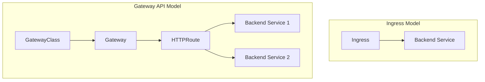

# How to Configure GKE Gateway Controller for Advanced HTTP Routing and Header-Based Matching

Author: [nawazdhandala](https://www.github.com/nawazdhandala)

Tags: GCP, GKE, Kubernetes, Gateway API, HTTP Routing, Load Balancing

Description: Learn how to use the GKE Gateway Controller with the Kubernetes Gateway API for advanced HTTP routing including header-based matching, traffic splitting, and URL rewrites.

---

The Kubernetes Ingress resource has served us well, but it has real limitations. Want to route based on HTTP headers? Not supported in the standard spec. Need traffic splitting for canary deployments? You are at the mercy of vendor-specific annotations. Header-based matching, URL rewrites, request mirroring - all of these require non-standard extensions.

The Gateway API is the replacement. It is a set of official Kubernetes resources that provide much richer routing capabilities, and GKE has a first-class Gateway Controller that implements it using Google Cloud Load Balancers. Let me show you how to set up advanced routing scenarios that were previously impossible or hacky with Ingress.

## Gateway API vs. Ingress

The key difference is in the resource model:



- **GatewayClass**: Defines which controller handles the gateway (GKE provides these)
- **Gateway**: A load balancer instance with listeners
- **HTTPRoute**: Routing rules that attach to a gateway

This separation lets infrastructure teams manage Gateways while application teams manage their own HTTPRoutes.

## Prerequisites

The Gateway API controller is available on GKE clusters running version 1.24 or later. It is enabled by default on most clusters.

```bash
# Verify the GatewayClass resources are available
kubectl get gatewayclass

# You should see:
# NAME                               CONTROLLER                  AGE
# gke-l7-global-external-managed     networking.gke.io/gateway   ...
# gke-l7-regional-external-managed   networking.gke.io/gateway   ...
# gke-l7-rilb                        networking.gke.io/gateway   ...
# gke-l7-gxlb                        networking.gke.io/gateway   ...
```

Each GatewayClass maps to a different type of Google Cloud Load Balancer.

## Step 1: Create a Gateway

A Gateway is a load balancer with one or more listeners (ports).

```yaml
# gateway.yaml - External HTTP/HTTPS Gateway
apiVersion: gateway.networking.k8s.io/v1
kind: Gateway
metadata:
  name: external-gateway
  namespace: default
spec:
  gatewayClassName: gke-l7-global-external-managed
  listeners:
    # HTTP listener
    - name: http
      protocol: HTTP
      port: 80
      allowedRoutes:
        namespaces:
          from: All  # Allow HTTPRoutes from any namespace
    # HTTPS listener with managed certificate
    - name: https
      protocol: HTTPS
      port: 443
      tls:
        mode: Terminate
        certificateRefs:
          - kind: ManagedCertificate
            name: my-cert
      allowedRoutes:
        namespaces:
          from: All
```

```bash
kubectl apply -f gateway.yaml

# Wait for the Gateway to get an IP address
kubectl get gateway external-gateway -w
```

## Step 2: Basic HTTPRoute

Start with a simple HTTPRoute that sends all traffic to a service.

```yaml
# basic-route.yaml - Simple HTTPRoute
apiVersion: gateway.networking.k8s.io/v1
kind: HTTPRoute
metadata:
  name: app-route
  namespace: default
spec:
  parentRefs:
    # Attach this route to the gateway
    - name: external-gateway
  hostnames:
    - "app.example.com"
  rules:
    - matches:
        - path:
            type: PathPrefix
            value: /
      backendRefs:
        - name: web-service
          port: 80
```

## Step 3: Header-Based Routing

Now the good stuff. Route traffic based on HTTP headers. This is incredibly useful for feature flags, A/B testing, and internal tools.

```yaml
# header-routing.yaml - Route based on HTTP headers
apiVersion: gateway.networking.k8s.io/v1
kind: HTTPRoute
metadata:
  name: header-based-route
  namespace: default
spec:
  parentRefs:
    - name: external-gateway
  hostnames:
    - "api.example.com"
  rules:
    # Route requests with X-Version: v2 header to the v2 backend
    - matches:
        - headers:
            - name: X-Version
              value: v2
      backendRefs:
        - name: api-v2-service
          port: 8080

    # Route requests with X-Internal: true to the internal backend
    - matches:
        - headers:
            - name: X-Internal
              value: "true"
      backendRefs:
        - name: internal-api-service
          port: 8080

    # Default rule: everything else goes to v1
    - matches:
        - path:
            type: PathPrefix
            value: /
      backendRefs:
        - name: api-v1-service
          port: 8080
```

With this configuration:
- `curl -H "X-Version: v2" https://api.example.com/users` goes to `api-v2-service`
- `curl -H "X-Internal: true" https://api.example.com/data` goes to `internal-api-service`
- `curl https://api.example.com/users` goes to `api-v1-service`

## Step 4: Traffic Splitting for Canary Deployments

Split traffic between backends by percentage. This is the foundation for canary deployments.

```yaml
# canary-route.yaml - Traffic splitting between stable and canary
apiVersion: gateway.networking.k8s.io/v1
kind: HTTPRoute
metadata:
  name: canary-route
  namespace: default
spec:
  parentRefs:
    - name: external-gateway
  hostnames:
    - "app.example.com"
  rules:
    - matches:
        - path:
            type: PathPrefix
            value: /
      backendRefs:
        # 90% of traffic goes to stable version
        - name: app-stable
          port: 80
          weight: 90
        # 10% of traffic goes to canary version
        - name: app-canary
          port: 80
          weight: 10
```

Gradually increase the canary weight as you gain confidence.

```bash
# To shift traffic, update the weights
# 50/50 split
kubectl patch httproute canary-route --type merge -p '{
  "spec": {
    "rules": [{
      "matches": [{"path": {"type": "PathPrefix", "value": "/"}}],
      "backendRefs": [
        {"name": "app-stable", "port": 80, "weight": 50},
        {"name": "app-canary", "port": 80, "weight": 50}
      ]
    }]
  }
}'
```

## Step 5: URL Rewrites and Redirects

Rewrite URLs before forwarding to backends, or redirect clients to different URLs.

```yaml
# rewrite-route.yaml - URL rewrites and redirects
apiVersion: gateway.networking.k8s.io/v1
kind: HTTPRoute
metadata:
  name: rewrite-route
  namespace: default
spec:
  parentRefs:
    - name: external-gateway
  hostnames:
    - "app.example.com"
  rules:
    # Rewrite /api/v1/* to /* before forwarding to backend
    - matches:
        - path:
            type: PathPrefix
            value: /api/v1
      filters:
        - type: URLRewrite
          urlRewrite:
            path:
              type: ReplacePrefixMatch
              replacePrefixMatch: /
      backendRefs:
        - name: api-service
          port: 8080

    # Redirect /old-page to /new-page
    - matches:
        - path:
            type: Exact
            value: /old-page
      filters:
        - type: RequestRedirect
          requestRedirect:
            path:
              type: ReplaceFullPath
              replaceFullPath: /new-page
            statusCode: 301
```

## Step 6: Request Header Modification

Add, remove, or modify headers before the request reaches your backend.

```yaml
# header-modify-route.yaml - Modify request headers
apiVersion: gateway.networking.k8s.io/v1
kind: HTTPRoute
metadata:
  name: header-modify-route
  namespace: default
spec:
  parentRefs:
    - name: external-gateway
  hostnames:
    - "api.example.com"
  rules:
    - matches:
        - path:
            type: PathPrefix
            value: /
      filters:
        - type: RequestHeaderModifier
          requestHeaderModifier:
            # Add headers to the request
            add:
              - name: X-Gateway-Source
                value: gke-external
              - name: X-Request-Start
                value: "%START_TIME%"
            # Remove headers before forwarding
            remove:
              - X-Debug-Token
      backendRefs:
        - name: api-service
          port: 8080
```

## Combining Multiple Matching Conditions

You can combine path, header, method, and query parameter matching in a single rule.

```yaml
# complex-route.yaml - Multiple matching conditions
apiVersion: gateway.networking.k8s.io/v1
kind: HTTPRoute
metadata:
  name: complex-route
  namespace: default
spec:
  parentRefs:
    - name: external-gateway
  hostnames:
    - "api.example.com"
  rules:
    # Match POST requests to /orders with a specific API version header
    - matches:
        - path:
            type: PathPrefix
            value: /orders
          method: POST
          headers:
            - name: X-API-Version
              value: "2"
      backendRefs:
        - name: orders-v2-service
          port: 8080

    # Match GET requests to /orders (any API version)
    - matches:
        - path:
            type: PathPrefix
            value: /orders
          method: GET
      backendRefs:
        - name: orders-read-service
          port: 8080
```

## Cross-Namespace Routing

The Gateway API supports routing to services in different namespaces, with proper access control.

```yaml
# In the backend namespace, grant access via ReferenceGrant
apiVersion: gateway.networking.k8s.io/v1beta1
kind: ReferenceGrant
metadata:
  name: allow-gateway-route
  namespace: backend
spec:
  from:
    - group: gateway.networking.k8s.io
      kind: HTTPRoute
      namespace: default  # Allow routes from the default namespace
  to:
    - group: ""
      kind: Service
---
# HTTPRoute in default namespace routing to backend namespace
apiVersion: gateway.networking.k8s.io/v1
kind: HTTPRoute
metadata:
  name: cross-namespace-route
  namespace: default
spec:
  parentRefs:
    - name: external-gateway
  rules:
    - matches:
        - path:
            type: PathPrefix
            value: /api
      backendRefs:
        - name: api-service
          namespace: backend  # Different namespace
          port: 8080
```

## Monitoring and Troubleshooting

Check the status of your Gateway and routes.

```bash
# Check Gateway status and assigned IP
kubectl describe gateway external-gateway

# Check HTTPRoute status (look for resolved refs and conditions)
kubectl describe httproute header-based-route

# View load balancer health from GCP
gcloud compute backend-services list --filter "name~gke"
```

## Wrapping Up

The GKE Gateway Controller brings routing capabilities that were previously only available through service meshes or custom Nginx configurations. Header-based routing, traffic splitting, URL rewrites, and cross-namespace routing are all native features. If you are still using Ingress resources with vendor-specific annotations to achieve these patterns, the Gateway API is a cleaner, more portable approach. The resources are more verbose than Ingress, but the expressiveness and the clean separation between infrastructure (Gateway) and application (HTTPRoute) concerns make it worth the migration.
