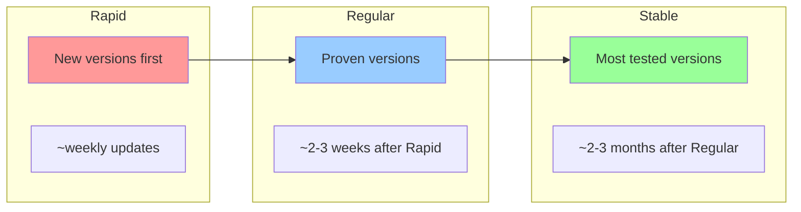

# How to Configure GKE Release Channels to Manage Automatic Cluster Version Upgrades

Author: [nawazdhandala](https://www.github.com/nawazdhandala)

Tags: GCP, GKE, Kubernetes, Release Channels, Cluster Management

Description: Learn how to use GKE release channels to manage automatic Kubernetes version upgrades, balancing stability with access to new features across your clusters.

---

Keeping GKE clusters up to date is one of those tasks that nobody wants to think about but everyone needs to do. Kubernetes releases new versions roughly every four months, and each version has a limited support window. Fall too far behind and you are running an unsupported version with known vulnerabilities.

GKE release channels automate this entirely. You pick a channel that matches your risk tolerance, and GKE handles version upgrades for both the control plane and node pools. No more manually planning upgrade windows or tracking which version each cluster is running.

I manage clusters across all three channels, and the system works well once you understand how each channel behaves. Let me walk through the setup and the tradeoffs.

## The Three Release Channels

GKE offers three release channels, each with different upgrade cadences:



- **Rapid**: Gets new Kubernetes versions first. Good for development and testing environments where you want early access to new features.
- **Regular**: Gets versions after they have been validated in the Rapid channel. This is the default and best for most production workloads.
- **Stable**: Gets versions only after extended validation in both Rapid and Regular. Best for critical production systems that prioritize stability above all else.

## Enrolling a Cluster in a Release Channel

You can set the release channel when creating a cluster or update an existing one.

```bash
# Create a new cluster in the Regular release channel
gcloud container clusters create prod-cluster \
  --region us-central1 \
  --release-channel regular \
  --num-nodes 3

# Create a dev cluster in the Rapid channel
gcloud container clusters create dev-cluster \
  --region us-central1 \
  --release-channel rapid \
  --num-nodes 2

# Create a critical cluster in the Stable channel
gcloud container clusters create critical-cluster \
  --region us-central1 \
  --release-channel stable \
  --num-nodes 3
```

## Changing the Release Channel

You can switch an existing cluster to a different release channel.

```bash
# Move a cluster from Regular to Stable
gcloud container clusters update prod-cluster \
  --region us-central1 \
  --release-channel stable

# Move a cluster from no channel to Regular
gcloud container clusters update legacy-cluster \
  --region us-central1 \
  --release-channel regular
```

When you switch channels, the cluster does not immediately upgrade or downgrade. It stays on its current version until the next scheduled upgrade for the new channel.

## Understanding Version Availability

Each channel has a set of available versions at any time. You can check what versions are available.

```bash
# List available versions for each channel
gcloud container get-server-config \
  --region us-central1 \
  --format "yaml(channels)"

# Check which version your cluster is running
gcloud container clusters describe prod-cluster \
  --region us-central1 \
  --format "value(currentMasterVersion)"

# List available versions for a specific channel
gcloud container get-server-config \
  --region us-central1 \
  --flatten "channels" \
  --filter "channels.channel=REGULAR" \
  --format "yaml(channels.channel,channels.validVersions)"
```

## Configuring Maintenance Windows

Release channel upgrades happen during maintenance windows. Configure these to match your low-traffic periods.

```bash
# Set a daily maintenance window (4 AM to 8 AM UTC)
gcloud container clusters update prod-cluster \
  --region us-central1 \
  --maintenance-window-start "2026-01-01T04:00:00Z" \
  --maintenance-window-end "2026-01-01T08:00:00Z" \
  --maintenance-window-recurrence "FREQ=DAILY"
```

For more control, use maintenance exclusions to block upgrades during critical periods.

```bash
# Block upgrades during the holiday season
gcloud container clusters update prod-cluster \
  --region us-central1 \
  --add-maintenance-exclusion-name "holiday-freeze" \
  --add-maintenance-exclusion-start "2026-12-15T00:00:00Z" \
  --add-maintenance-exclusion-end "2027-01-05T00:00:00Z" \
  --add-maintenance-exclusion-scope no_upgrades
```

Maintenance exclusion scopes:

- `no_upgrades`: Blocks all upgrades (control plane and nodes)
- `no_minor_upgrades`: Blocks minor version upgrades (1.27 to 1.28) but allows patch upgrades (1.27.5 to 1.27.6)
- `no_minor_or_node_upgrades`: Blocks minor upgrades and node pool upgrades

## Node Pool Upgrade Strategy

When the control plane upgrades, node pools follow. You can configure how node pool upgrades happen.

```bash
# Configure surge upgrades for zero-downtime node upgrades
gcloud container node-pools update default-pool \
  --cluster prod-cluster \
  --region us-central1 \
  --max-surge-upgrade 2 \
  --max-unavailable-upgrade 0
```

With `--max-surge-upgrade 2 --max-unavailable-upgrade 0`, GKE creates 2 extra nodes, drains old nodes, and deletes them. Your workload capacity never drops.

## Notifications for Upcoming Upgrades

Set up notifications so you know when upgrades are coming.

```bash
# Create a Pub/Sub topic for cluster notifications
gcloud pubsub topics create gke-cluster-notifications

# Enable notifications on the cluster
gcloud container clusters update prod-cluster \
  --region us-central1 \
  --notification-config pubsub=ENABLED,pubsub-topic=projects/YOUR_PROJECT_ID/topics/gke-cluster-notifications
```

You can then subscribe to this topic with a Cloud Function, email, or Slack integration to alert your team before upgrades happen.

```javascript
// Cloud Function to forward GKE notifications to Slack
exports.gkeNotificationHandler = async (message) => {
  const data = JSON.parse(Buffer.from(message.data, "base64").toString());

  // Filter for upgrade notifications
  if (data.type_url.includes("UpgradeEvent")) {
    const payload = data.payload;
    const slackMessage = {
      text: `GKE Upgrade Notification: Cluster ${payload.cluster} ` +
            `upgrading from ${payload.currentVersion} to ${payload.targetVersion}`,
    };

    // Post to Slack webhook
    await fetch(process.env.SLACK_WEBHOOK_URL, {
      method: "POST",
      body: JSON.stringify(slackMessage),
    });
  }
};
```

## Strategy for Multiple Environments

A common pattern is using different channels across your environments to catch issues before they hit production.

```bash
# Dev environment: Rapid channel - catches issues early
gcloud container clusters create dev-cluster \
  --region us-central1 \
  --release-channel rapid

# Staging environment: Regular channel - validates after dev
gcloud container clusters create staging-cluster \
  --region us-central1 \
  --release-channel regular

# Production: Stable channel - most tested versions
gcloud container clusters create prod-cluster \
  --region us-central1 \
  --release-channel stable
```

This creates a natural progression: new versions hit dev first, then staging, then production. If a version causes issues in dev, you catch it long before it reaches production.

## Handling Upgrade Failures

Sometimes upgrades fail or cause application issues. GKE handles this differently depending on the component.

For control plane upgrades, GKE performs them automatically and rolls back if the upgrade fails. You generally do not need to intervene.

For node pool upgrades, if a node fails to drain (perhaps because of a PDB that cannot be satisfied), GKE retries for a configured period before marking the upgrade as failed.

```bash
# Check upgrade status
gcloud container operations list \
  --filter "targetLink:clusters/prod-cluster AND operationType=UPGRADE_NODES" \
  --format "table(name, status, startTime, endTime)"

# If an upgrade is stuck, check the operation details
gcloud container operations describe OPERATION_ID \
  --region us-central1
```

## Opting Out of Release Channels

While I recommend using release channels, you can opt out if you need complete control over versions.

```bash
# Remove a cluster from its release channel
gcloud container clusters update prod-cluster \
  --region us-central1 \
  --release-channel None
```

Without a release channel, you are responsible for manually upgrading the cluster. GKE will still auto-upgrade the control plane for security patches, but major version upgrades are on you. This adds operational overhead but gives maximum control.

## Checking Your Current Setup

Audit your clusters to see their current release channel and version status.

```bash
# List all clusters with their release channels and versions
gcloud container clusters list \
  --format "table(name, location, currentMasterVersion, releaseChannel.channel)"
```

## Wrapping Up

GKE release channels take the manual work out of Kubernetes version management. Pick Rapid for dev, Regular for most production workloads, and Stable for critical systems. Combine release channels with maintenance windows, maintenance exclusions, surge upgrades, and PDBs for a complete upgrade strategy that keeps your clusters current without disrupting your applications. The key is to use multiple environments with different channels so new versions are validated progressively before reaching production.
