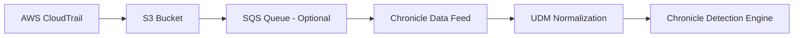

# How to Configure Google Chronicle Feeds for AWS CloudTrail Ingestion

Author: [nawazdhandala](https://www.github.com/nawazdhandala)

Tags: GCP, Chronicle SIEM, AWS CloudTrail, Log Ingestion, Multi-Cloud Security

Description: Step-by-step guide to configuring Google Chronicle SIEM feeds for ingesting AWS CloudTrail logs to enable cross-cloud security monitoring and threat detection.

---

If you run workloads in both AWS and Google Cloud, having a unified view of security events is essential. Google Chronicle SIEM is a solid choice for centralizing security telemetry because it can ingest and normalize logs from multiple cloud providers. AWS CloudTrail is the primary audit trail for everything happening in your AWS accounts, and getting those logs into Chronicle lets you correlate AWS activity with your GCP events in a single pane of glass.

In this guide, I will walk through two methods for ingesting CloudTrail into Chronicle: the S3 bucket approach and the SQS-based approach.

## Architecture Overview

The most common pattern involves CloudTrail writing logs to an S3 bucket, and Chronicle pulling from that bucket on a schedule.



For organizations with many AWS accounts, you can use AWS Organizations to aggregate CloudTrail logs from all accounts into a single S3 bucket, which simplifies the Chronicle feed configuration.

## Prerequisites

Before starting, make sure you have:

- An AWS account with CloudTrail enabled
- An S3 bucket receiving CloudTrail logs
- A Google Chronicle SIEM instance
- Admin access to both AWS and Chronicle consoles

## Method 1: Direct S3 Bucket Feed

This is the simpler approach. Chronicle uses AWS IAM credentials to directly read CloudTrail log files from your S3 bucket.

### Step 1: Create an IAM User for Chronicle

Create a dedicated IAM user in AWS that Chronicle will use to access the S3 bucket.

```json
{
    "Version": "2012-10-17",
    "Statement": [
        {
            "Sid": "ChronicleS3ReadAccess",
            "Effect": "Allow",
            "Action": [
                "s3:GetObject",
                "s3:ListBucket"
            ],
            "Resource": [
                "arn:aws:s3:::your-cloudtrail-bucket",
                "arn:aws:s3:::your-cloudtrail-bucket/*"
            ]
        }
    ]
}
```

Create the IAM user and attach this policy.

```bash
# Create the IAM user
aws iam create-user --user-name chronicle-cloudtrail-reader

# Create the policy
aws iam create-policy \
    --policy-name ChronicleS3ReadPolicy \
    --policy-document file://chronicle-s3-policy.json

# Attach the policy to the user
aws iam attach-user-policy \
    --user-name chronicle-cloudtrail-reader \
    --policy-arn arn:aws:iam::YOUR_AWS_ACCOUNT_ID:policy/ChronicleS3ReadPolicy

# Create access keys for the user
aws iam create-access-key --user-name chronicle-cloudtrail-reader
```

Save the access key ID and secret access key from the output. You will need them for the Chronicle feed configuration.

### Step 2: Verify CloudTrail Is Writing to S3

Confirm that CloudTrail logs are actually being delivered to your bucket.

```bash
# List recent CloudTrail log files in the bucket
aws s3 ls s3://your-cloudtrail-bucket/AWSLogs/YOUR_ACCOUNT_ID/CloudTrail/ --recursive | tail -10
```

CloudTrail log files follow this path pattern:
`s3://bucket-name/AWSLogs/account-id/CloudTrail/region/YYYY/MM/DD/`

Each file is a gzipped JSON document containing a batch of events.

### Step 3: Configure the Feed in Chronicle

In the Chronicle console, go to Settings, then SIEM Settings, then Feeds. Create a new feed with these settings:

- **Source Type**: Amazon S3
- **Log Type**: AWS CloudTrail
- **S3 URI**: `s3://your-cloudtrail-bucket/AWSLogs/`
- **URI is a**: Directory with subdirectories
- **Source Deletion Option**: Never delete (keep your original logs)
- **Access Key ID**: The key from Step 1
- **Secret Access Key**: The secret from Step 1
- **Region**: The AWS region where your bucket is located

Chronicle will start polling the bucket and ingesting new CloudTrail log files.

## Method 2: SQS-Based Feed

For high-volume environments, the SQS approach is more efficient. Instead of Chronicle scanning the entire bucket for new files, S3 sends notifications to an SQS queue when new files arrive, and Chronicle reads from the queue.

### Step 1: Create an SQS Queue

```bash
# Create the SQS queue
aws sqs create-queue \
    --queue-name chronicle-cloudtrail-notifications \
    --attributes '{
        "MessageRetentionPeriod": "1209600",
        "VisibilityTimeout": "300"
    }'
```

### Step 2: Configure S3 Event Notifications

Set up the S3 bucket to send notifications to the SQS queue when new objects are created.

First, update the SQS queue policy to allow S3 to send messages.

```json
{
    "Version": "2012-10-17",
    "Statement": [
        {
            "Sid": "AllowS3Notification",
            "Effect": "Allow",
            "Principal": {
                "Service": "s3.amazonaws.com"
            },
            "Action": "SQS:SendMessage",
            "Resource": "arn:aws:sqs:us-east-1:YOUR_ACCOUNT_ID:chronicle-cloudtrail-notifications",
            "Condition": {
                "ArnEquals": {
                    "aws:SourceArn": "arn:aws:s3:::your-cloudtrail-bucket"
                }
            }
        }
    ]
}
```

```bash
# Set the queue policy
aws sqs set-queue-attributes \
    --queue-url https://sqs.us-east-1.amazonaws.com/YOUR_ACCOUNT_ID/chronicle-cloudtrail-notifications \
    --attributes '{"Policy": "PASTE_POLICY_JSON_HERE"}'
```

Then configure the S3 notification.

```bash
# Configure S3 event notification
aws s3api put-bucket-notification-configuration \
    --bucket your-cloudtrail-bucket \
    --notification-configuration '{
        "QueueConfigurations": [
            {
                "QueueArn": "arn:aws:sqs:us-east-1:YOUR_ACCOUNT_ID:chronicle-cloudtrail-notifications",
                "Events": ["s3:ObjectCreated:*"],
                "Filter": {
                    "Key": {
                        "FilterRules": [
                            {
                                "Name": "suffix",
                                "Value": ".json.gz"
                            }
                        ]
                    }
                }
            }
        ]
    }'
```

### Step 3: Update IAM Permissions

Add SQS permissions to the Chronicle IAM user's policy.

```json
{
    "Version": "2012-10-17",
    "Statement": [
        {
            "Sid": "ChronicleS3ReadAccess",
            "Effect": "Allow",
            "Action": [
                "s3:GetObject",
                "s3:ListBucket"
            ],
            "Resource": [
                "arn:aws:s3:::your-cloudtrail-bucket",
                "arn:aws:s3:::your-cloudtrail-bucket/*"
            ]
        },
        {
            "Sid": "ChronicleQueueAccess",
            "Effect": "Allow",
            "Action": [
                "sqs:ReceiveMessage",
                "sqs:DeleteMessage",
                "sqs:GetQueueAttributes",
                "sqs:GetQueueUrl"
            ],
            "Resource": "arn:aws:sqs:us-east-1:YOUR_ACCOUNT_ID:chronicle-cloudtrail-notifications"
        }
    ]
}
```

### Step 4: Configure the SQS Feed in Chronicle

In the Chronicle console, create a new feed:

- **Source Type**: Amazon SQS
- **Log Type**: AWS CloudTrail
- **SQS Queue URL**: `https://sqs.us-east-1.amazonaws.com/YOUR_ACCOUNT_ID/chronicle-cloudtrail-notifications`
- **Access Key ID**: Your Chronicle IAM user's access key
- **Secret Access Key**: The corresponding secret
- **Region**: us-east-1 (or your queue's region)

## Verifying Ingestion

After configuring the feed, wait a few minutes and then check the Chronicle Data Ingestion dashboard. You should see AWS CloudTrail events appearing.

Run a quick UDM search to verify the data.

```
metadata.product_name = "AWS CloudTrail" AND metadata.event_timestamp.seconds > timestamp("2026-02-17T00:00:00Z")
```

You can also search for specific event types to confirm proper parsing.

```
metadata.product_name = "AWS CloudTrail" AND metadata.product_event_type = "ConsoleLogin"
```

## Writing Cross-Cloud Detection Rules

Once CloudTrail data is in Chronicle alongside your GCP logs, you can write detection rules that correlate across clouds. Here is an example YARA-L rule that detects when the same user authenticates to both AWS and GCP from different IP addresses within a short window.

```
rule cross_cloud_suspicious_auth {
    meta:
        author = "security-team"
        description = "Same user authenticates to AWS and GCP from different IPs within 1 hour"
        severity = "HIGH"

    events:
        // AWS console login
        $aws_login.metadata.product_name = "AWS CloudTrail"
        $aws_login.metadata.product_event_type = "ConsoleLogin"
        $aws_login.principal.user.email_addresses = $user
        $aws_login.principal.ip = $aws_ip

        // GCP login
        $gcp_login.metadata.product_name = "Google Cloud Platform"
        $gcp_login.metadata.event_type = "USER_LOGIN"
        $gcp_login.principal.user.email_addresses = $user
        $gcp_login.principal.ip = $gcp_ip

        // IPs must be different
        $aws_ip != $gcp_ip

    match:
        $user over 1h

    condition:
        $aws_login and $gcp_login
}
```

## Troubleshooting Common Issues

**Feed shows errors about access denied**: Double-check the IAM user's permissions. Make sure the S3 bucket policy does not explicitly deny the user. If using SQS, verify the queue policy allows the Chronicle user to receive and delete messages.

**Logs appear but have parsing errors**: Chronicle has a built-in CloudTrail parser, but sometimes custom CloudTrail configurations produce slightly different formats. Check the Data Ingestion dashboard for parsing error details.

**Duplicate events appearing**: If you switched from direct S3 to SQS without disabling the old feed, you will get duplicates. Disable the old feed first.

**High latency in data appearing**: The direct S3 method has latency because Chronicle polls the bucket periodically. Switching to the SQS method reduces this because Chronicle gets notified immediately when new files arrive.

Getting AWS CloudTrail into Chronicle is one of the highest-value integrations for multi-cloud security monitoring. It gives you visibility into AWS API activity right alongside your GCP logs, enabling the kind of cross-cloud correlation that catches sophisticated attackers moving laterally between cloud environments.
