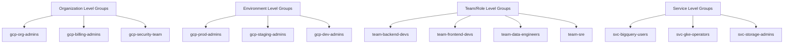

# How to Configure Groups-Based Access Control with Google Cloud Identity

Author: [nawazdhandala](https://www.github.com/nawazdhandala)

Tags: GCP, Cloud Identity, Groups, IAM, Access Control, RBAC

Description: Learn how to implement groups-based access control in Google Cloud using Cloud Identity groups to simplify IAM management and enforce consistent permissions across projects.

---

Managing IAM permissions for individual users does not scale. Once you have more than a handful of people accessing Google Cloud, individual bindings become a maintenance nightmare - hard to audit, easy to get wrong, and slow to update when people change roles. Groups-based access control fixes this by assigning permissions to groups rather than individuals. Add someone to a group and they get the right permissions. Remove them and the permissions go away.

This guide covers how to set up groups in Google Cloud Identity, bind IAM roles to groups, manage group membership, and build a group structure that maps to your organization's access patterns.

## Why Groups-Based Access Control

The advantages are straightforward:

- **Onboarding is fast** - add a new team member to the right groups and they have access
- **Offboarding is safe** - remove them from all groups and access is revoked
- **Auditing is clear** - you can see who has what access by looking at group membership
- **Consistency is enforced** - everyone in the same role gets the same permissions
- **Changes scale** - updating permissions for 50 people means updating one group binding, not 50 individual bindings

## Setting Up Cloud Identity Groups

Cloud Identity groups can be created through the Google Admin Console, the Cloud Identity Groups API, or the gcloud CLI.

### Creating Groups with gcloud

```bash
# Create a group for GCP project administrators
gcloud identity groups create gcp-project-admins@yourcompany.com \
  --organization=yourcompany.com \
  --display-name="GCP Project Admins" \
  --description="Members have admin access to production GCP projects" \
  --with-initial-owner=WITH_INITIAL_OWNER

# Create a group for developers with read/write access
gcloud identity groups create gcp-developers@yourcompany.com \
  --organization=yourcompany.com \
  --display-name="GCP Developers" \
  --description="Members have developer access to development and staging projects"

# Create a group for read-only access
gcloud identity groups create gcp-viewers@yourcompany.com \
  --organization=yourcompany.com \
  --display-name="GCP Viewers" \
  --description="Members have read-only access across GCP projects"

# Create a group for the security team
gcloud identity groups create gcp-security@yourcompany.com \
  --organization=yourcompany.com \
  --display-name="GCP Security Team" \
  --description="Members have security admin access across the organization"
```

### Adding Members to Groups

```bash
# Add a user to the developers group
gcloud identity groups memberships add \
  --group-email=gcp-developers@yourcompany.com \
  --member-email=alice@yourcompany.com \
  --roles=MEMBER

# Add a user as a group manager (can manage membership)
gcloud identity groups memberships add \
  --group-email=gcp-developers@yourcompany.com \
  --member-email=bob@yourcompany.com \
  --roles=MEMBER,MANAGER

# List members of a group
gcloud identity groups memberships list \
  --group-email=gcp-developers@yourcompany.com \
  --format="table(preferredMemberKey.id, roles.name)"
```

## Binding IAM Roles to Groups

Once groups exist, bind IAM roles to them at the appropriate level - organization, folder, or project.

### Organization-Level Bindings

```bash
# Grant the security team organization-wide Security Admin access
gcloud organizations add-iam-policy-binding 123456789 \
  --member="group:gcp-security@yourcompany.com" \
  --role="roles/iam.securityAdmin"

# Grant the security team access to Security Command Center
gcloud organizations add-iam-policy-binding 123456789 \
  --member="group:gcp-security@yourcompany.com" \
  --role="roles/securitycenter.admin"
```

### Folder-Level Bindings

```bash
# Grant project admins Editor access to the production folder
gcloud resource-manager folders add-iam-policy-binding PROD_FOLDER_ID \
  --member="group:gcp-project-admins@yourcompany.com" \
  --role="roles/editor"

# Grant developers Editor access to the development folder
gcloud resource-manager folders add-iam-policy-binding DEV_FOLDER_ID \
  --member="group:gcp-developers@yourcompany.com" \
  --role="roles/editor"

# Grant viewers read access to all folders
gcloud resource-manager folders add-iam-policy-binding PROD_FOLDER_ID \
  --member="group:gcp-viewers@yourcompany.com" \
  --role="roles/viewer"
```

### Project-Level Bindings

```bash
# Grant developers specific roles on a project
gcloud projects add-iam-policy-binding my-app-project \
  --member="group:gcp-developers@yourcompany.com" \
  --role="roles/container.developer"

gcloud projects add-iam-policy-binding my-app-project \
  --member="group:gcp-developers@yourcompany.com" \
  --role="roles/cloudsql.client"
```

## Designing Your Group Structure

A well-designed group hierarchy maps to your organization's roles and responsibilities. Here is a structure that works for most organizations.



### Nesting Groups

Cloud Identity supports group nesting, which reduces the number of IAM bindings you need to maintain.

```bash
# Create a parent group for all GCP users
gcloud identity groups create gcp-all-users@yourcompany.com \
  --organization=yourcompany.com \
  --display-name="All GCP Users"

# Add team groups as members of the parent group
gcloud identity groups memberships add \
  --group-email=gcp-all-users@yourcompany.com \
  --member-email=gcp-developers@yourcompany.com \
  --roles=MEMBER

gcloud identity groups memberships add \
  --group-email=gcp-all-users@yourcompany.com \
  --member-email=gcp-viewers@yourcompany.com \
  --roles=MEMBER
```

Now you can grant base-level access to all GCP users through the parent group, and specific permissions through the child groups.

## Terraform Configuration

Manage groups and their IAM bindings in Terraform for full version control.

```hcl
# Cloud Identity groups
resource "google_cloud_identity_group" "developers" {
  display_name = "GCP Developers"
  parent       = "customers/CUSTOMER_ID"

  group_key {
    id = "gcp-developers@yourcompany.com"
  }

  labels = {
    "cloudidentity.googleapis.com/groups.discussion_forum" = ""
  }
}

resource "google_cloud_identity_group" "admins" {
  display_name = "GCP Admins"
  parent       = "customers/CUSTOMER_ID"

  group_key {
    id = "gcp-admins@yourcompany.com"
  }

  labels = {
    "cloudidentity.googleapis.com/groups.discussion_forum" = ""
  }
}

# Group membership
resource "google_cloud_identity_group_membership" "dev_alice" {
  group = google_cloud_identity_group.developers.id

  preferred_member_key {
    id = "alice@yourcompany.com"
  }

  roles {
    name = "MEMBER"
  }
}

# IAM bindings at the folder level
resource "google_folder_iam_member" "dev_editor" {
  folder = "folders/${var.dev_folder_id}"
  role   = "roles/editor"
  member = "group:gcp-developers@yourcompany.com"
}

resource "google_folder_iam_member" "admin_owner" {
  folder = "folders/${var.prod_folder_id}"
  role   = "roles/owner"
  member = "group:gcp-admins@yourcompany.com"
}

# Organization-level bindings
resource "google_organization_iam_member" "security_admin" {
  org_id = var.org_id
  role   = "roles/iam.securityAdmin"
  member = "group:gcp-security@yourcompany.com"
}
```

## Auditing Group Membership and Access

Regular audits ensure groups have the right members and the right permissions.

```bash
# List all groups in the organization
gcloud identity groups search \
  --organization=yourcompany.com \
  --labels="cloudidentity.googleapis.com/groups.discussion_forum" \
  --format="table(groupKey.id, displayName, description)"

# Check who has access to a specific project via groups
gcloud projects get-iam-policy my-project \
  --flatten="bindings[].members" \
  --filter="bindings.members:group:" \
  --format="table(bindings.role, bindings.members)"
```

For automated auditing, use a script that cross-references group membership with IAM bindings.

```python
# Audit script: list effective permissions per user via group membership
from google.cloud import identity_v1
from google.cloud import resourcemanager_v3

def audit_group_access(group_email, project_id):
    """Show what IAM roles a group grants on a specific project."""
    rm_client = resourcemanager_v3.ProjectsClient()

    # Get the IAM policy for the project
    policy = rm_client.get_iam_policy(
        request={"resource": f"projects/{project_id}"}
    )

    # Find bindings that include this group
    group_member = f"group:{group_email}"
    roles = []
    for binding in policy.bindings:
        if group_member in binding.members:
            roles.append(binding.role)

    print(f"\nGroup: {group_email}")
    print(f"Project: {project_id}")
    print(f"Roles:")
    for role in roles:
        print(f"  - {role}")

    return roles

audit_group_access("gcp-developers@yourcompany.com", "my-app-project")
```

## Best Practices

1. **Never assign roles to individual users in production** - always use groups, even if the group has only one member. This makes future changes easier.

2. **Use descriptive group names** - `gcp-prod-bigquery-admins` is better than `team-alpha`. Future admins need to understand the purpose from the name.

3. **Document group purposes** - use the description field to explain what access the group provides and who should be members.

4. **Review membership quarterly** - stale memberships are a common source of excessive privilege.

5. **Separate duty groups** - do not put billing access and security access in the same group. Separation of duties matters.

6. **Use group expiration** - for temporary access, set membership expiration so access is automatically revoked.

```bash
# Add a member with an expiration date
gcloud identity groups memberships add \
  --group-email=gcp-prod-admins@yourcompany.com \
  --member-email=contractor@yourcompany.com \
  --roles=MEMBER \
  --expiry="2026-03-31T00:00:00Z"
```

Groups-based access control is the foundation of scalable IAM management in Google Cloud. Invest the time to design your group structure properly, enforce the discipline of using groups instead of individual bindings, and review membership regularly. Your future self will thank you when onboarding, offboarding, and auditing take minutes instead of hours.
