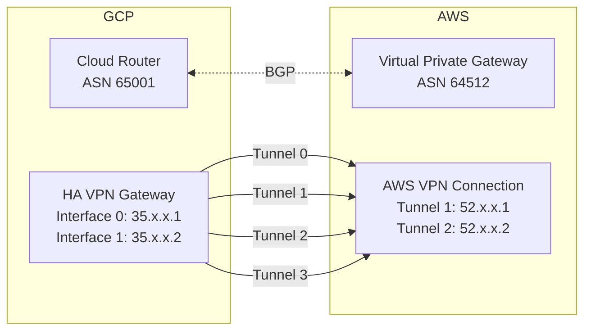

# How to Configure HA VPN Between GCP and AWS with Dynamic Routing

Author: [nawazdhandala](https://www.github.com/nawazdhandala)

Tags: GCP, AWS, HA VPN, BGP, Multi-Cloud Networking

Description: Set up a high-availability VPN connection between Google Cloud and AWS using HA VPN and AWS Site-to-Site VPN with BGP dynamic routing for multi-cloud connectivity.

---

Multi-cloud is a reality for many organizations. You might run workloads in both GCP and AWS, and those workloads need to communicate securely over encrypted tunnels. Setting up HA VPN between GCP and AWS gives you a reliable, encrypted connection with BGP handling dynamic route exchange. The setup is a bit involved because you are configuring both cloud providers, but the result is a production-grade multi-cloud network link.

This guide covers the end-to-end process of connecting GCP HA VPN to AWS Site-to-Site VPN.

## Architecture Overview

The connection uses four VPN tunnels for full redundancy:



AWS creates two tunnels per VPN connection. Since GCP HA VPN has two interfaces, we create two AWS VPN connections (one per GCP interface), resulting in four tunnels total. This gives you the full 99.99% SLA on the GCP side.

## Prerequisites

On the GCP side:
- A VPC network with subnets
- Compute Engine API enabled

On the AWS side:
- A VPC with subnets
- A Virtual Private Gateway or Transit Gateway

## Step 1: Create the GCP Side

### Create the Cloud Router

```bash
# Create a Cloud Router with a private ASN
gcloud compute routers create gcp-aws-router \
  --network=your-gcp-vpc \
  --region=us-central1 \
  --asn=65001 \
  --project=your-project-id
```

### Create the HA VPN Gateway

```bash
# Create the HA VPN gateway
gcloud compute vpn-gateways create gcp-to-aws-vpn \
  --network=your-gcp-vpc \
  --region=us-central1 \
  --project=your-project-id

# Get the external IPs
gcloud compute vpn-gateways describe gcp-to-aws-vpn \
  --region=us-central1 \
  --format="yaml(vpnInterfaces)" \
  --project=your-project-id
```

Note both external IP addresses. You will need them for the AWS configuration.

## Step 2: Create the AWS Side

### Create or Identify the Virtual Private Gateway

In the AWS Console or CLI, create a Virtual Private Gateway:

```bash
# AWS CLI: Create a Virtual Private Gateway
aws ec2 create-vpn-gateway \
  --type ipsec.1 \
  --amazon-side-asn 64512

# Attach it to your VPC
aws ec2 attach-vpn-gateway \
  --vpn-gateway-id vgw-xxxxxxxxx \
  --vpc-id vpc-yyyyyyyyy
```

### Create Two Customer Gateways (One per GCP Interface)

```bash
# Customer Gateway for GCP HA VPN Interface 0
aws ec2 create-customer-gateway \
  --type ipsec.1 \
  --public-ip 35.x.x.1 \
  --bgp-asn 65001

# Customer Gateway for GCP HA VPN Interface 1
aws ec2 create-customer-gateway \
  --type ipsec.1 \
  --public-ip 35.x.x.2 \
  --bgp-asn 65001
```

Replace the IPs with your actual GCP HA VPN interface IPs.

### Create Two VPN Connections

```bash
# VPN Connection 1 (to GCP Interface 0)
aws ec2 create-vpn-connection \
  --type ipsec.1 \
  --customer-gateway-id cgw-aaaaaaa \
  --vpn-gateway-id vgw-xxxxxxxxx \
  --options '{"StaticRoutesOnly": false}'

# VPN Connection 2 (to GCP Interface 1)
aws ec2 create-vpn-connection \
  --type ipsec.1 \
  --customer-gateway-id cgw-bbbbbbb \
  --vpn-gateway-id vgw-xxxxxxxxx \
  --options '{"StaticRoutesOnly": false}'
```

### Download the VPN Configuration

Download the configuration for each VPN connection from the AWS Console. You will need:
- The two AWS tunnel outside IP addresses per connection (4 IPs total)
- The pre-shared keys for each tunnel
- The BGP peer IP addresses (inside tunnel IPs)
- The AWS BGP ASN

## Step 3: Create the Peer VPN Gateway in GCP

Register the AWS tunnel endpoints as a peer gateway. AWS provides two tunnel IPs per VPN connection, so you have four total:

```bash
# Create a peer gateway with four interfaces (two per AWS VPN connection)
gcloud compute external-vpn-gateways create aws-peer-gateway \
  --interfaces="0=52.x.x.1,1=52.x.x.2,2=52.x.x.3,3=52.x.x.4" \
  --project=your-project-id
```

Interfaces 0 and 1 are from AWS VPN Connection 1. Interfaces 2 and 3 are from AWS VPN Connection 2.

## Step 4: Create VPN Tunnels in GCP

Create four tunnels, two from each GCP HA VPN interface:

```bash
# Tunnel 0: GCP Interface 0 to AWS VPN Connection 1, Tunnel 1
gcloud compute vpn-tunnels create gcp-aws-tunnel-0 \
  --vpn-gateway=gcp-to-aws-vpn \
  --peer-external-gateway=aws-peer-gateway \
  --peer-external-gateway-interface=0 \
  --interface=0 \
  --ike-version=2 \
  --shared-secret="psk-from-aws-vpn1-tunnel1" \
  --router=gcp-aws-router \
  --region=us-central1 \
  --project=your-project-id

# Tunnel 1: GCP Interface 0 to AWS VPN Connection 1, Tunnel 2
gcloud compute vpn-tunnels create gcp-aws-tunnel-1 \
  --vpn-gateway=gcp-to-aws-vpn \
  --peer-external-gateway=aws-peer-gateway \
  --peer-external-gateway-interface=1 \
  --interface=0 \
  --ike-version=2 \
  --shared-secret="psk-from-aws-vpn1-tunnel2" \
  --router=gcp-aws-router \
  --region=us-central1 \
  --project=your-project-id

# Tunnel 2: GCP Interface 1 to AWS VPN Connection 2, Tunnel 1
gcloud compute vpn-tunnels create gcp-aws-tunnel-2 \
  --vpn-gateway=gcp-to-aws-vpn \
  --peer-external-gateway=aws-peer-gateway \
  --peer-external-gateway-interface=2 \
  --interface=1 \
  --ike-version=2 \
  --shared-secret="psk-from-aws-vpn2-tunnel1" \
  --router=gcp-aws-router \
  --region=us-central1 \
  --project=your-project-id

# Tunnel 3: GCP Interface 1 to AWS VPN Connection 2, Tunnel 2
gcloud compute vpn-tunnels create gcp-aws-tunnel-3 \
  --vpn-gateway=gcp-to-aws-vpn \
  --peer-external-gateway=aws-peer-gateway \
  --peer-external-gateway-interface=3 \
  --interface=1 \
  --ike-version=2 \
  --shared-secret="psk-from-aws-vpn2-tunnel2" \
  --router=gcp-aws-router \
  --region=us-central1 \
  --project=your-project-id
```

Use the pre-shared keys from the AWS VPN configuration download.

## Step 5: Configure BGP Sessions in GCP

Add BGP interfaces and peers for each tunnel. Use the inside tunnel IP addresses from the AWS configuration:

```bash
# BGP session for tunnel 0
gcloud compute routers add-interface gcp-aws-router \
  --interface-name=aws-bgp-0 \
  --vpn-tunnel=gcp-aws-tunnel-0 \
  --ip-address=169.254.21.2 \
  --mask-length=30 \
  --region=us-central1

gcloud compute routers add-bgp-peer gcp-aws-router \
  --peer-name=aws-peer-0 \
  --interface=aws-bgp-0 \
  --peer-ip-address=169.254.21.1 \
  --peer-asn=64512 \
  --region=us-central1

# BGP session for tunnel 1
gcloud compute routers add-interface gcp-aws-router \
  --interface-name=aws-bgp-1 \
  --vpn-tunnel=gcp-aws-tunnel-1 \
  --ip-address=169.254.22.2 \
  --mask-length=30 \
  --region=us-central1

gcloud compute routers add-bgp-peer gcp-aws-router \
  --peer-name=aws-peer-1 \
  --interface=aws-bgp-1 \
  --peer-ip-address=169.254.22.1 \
  --peer-asn=64512 \
  --region=us-central1

# BGP session for tunnel 2
gcloud compute routers add-interface gcp-aws-router \
  --interface-name=aws-bgp-2 \
  --vpn-tunnel=gcp-aws-tunnel-2 \
  --ip-address=169.254.23.2 \
  --mask-length=30 \
  --region=us-central1

gcloud compute routers add-bgp-peer gcp-aws-router \
  --peer-name=aws-peer-2 \
  --interface=aws-bgp-2 \
  --peer-ip-address=169.254.23.1 \
  --peer-asn=64512 \
  --region=us-central1

# BGP session for tunnel 3
gcloud compute routers add-interface gcp-aws-router \
  --interface-name=aws-bgp-3 \
  --vpn-tunnel=gcp-aws-tunnel-3 \
  --ip-address=169.254.24.2 \
  --mask-length=30 \
  --region=us-central1

gcloud compute routers add-bgp-peer gcp-aws-router \
  --peer-name=aws-peer-3 \
  --interface=aws-bgp-3 \
  --peer-ip-address=169.254.24.1 \
  --peer-asn=64512 \
  --region=us-central1
```

The BGP IP addresses come from the AWS VPN configuration. AWS assigns inside tunnel IPs for each tunnel.

## Step 6: Enable Route Propagation in AWS

In AWS, enable route propagation on your VPC route tables so that routes learned from GCP via BGP are automatically added:

```bash
# Enable route propagation
aws ec2 enable-vgw-route-propagation \
  --route-table-id rtb-xxxxxxxxx \
  --gateway-id vgw-yyyyyyyyy
```

## Step 7: Verify Everything

Check GCP tunnel status:

```bash
# Check all tunnel statuses
gcloud compute vpn-tunnels list \
  --filter="region:us-central1 AND name:gcp-aws" \
  --format="table(name, status, peerIp)" \
  --project=your-project-id
```

Check BGP sessions:

```bash
# Check BGP peer status
gcloud compute routers get-status gcp-aws-router \
  --region=us-central1 \
  --format="yaml(result.bgpPeerStatus)" \
  --project=your-project-id
```

Check AWS tunnel status:

```bash
# Check AWS VPN tunnel status
aws ec2 describe-vpn-connections \
  --vpn-connection-ids vpn-xxxxxxxx \
  --query 'VpnConnections[*].VgwTelemetry'
```

## Testing Cross-Cloud Connectivity

From a GCP VM, ping an AWS instance:

```bash
gcloud compute ssh gcp-test-vm \
  --zone=us-central1-a \
  --command="ping -c 5 10.0.1.10" \
  --project=your-project-id
```

From an AWS instance, ping a GCP VM:

```bash
ssh ec2-user@aws-instance "ping -c 5 10.128.0.10"
```

## Wrapping Up

Setting up HA VPN between GCP and AWS involves configuring both cloud providers to work together, which means more steps than a single-cloud VPN setup. The four-tunnel architecture gives you full redundancy on both sides, and BGP ensures routes are dynamically updated. Once established, this connection provides a reliable encrypted link between your GCP and AWS networks that handles failover automatically. The main ongoing task is monitoring tunnel health and BGP session status across both clouds.
