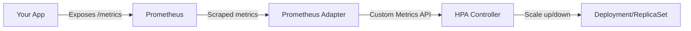

# How to Configure Horizontal Pod Autoscaler Based on Custom Prometheus Metrics in GKE

Author: [nawazdhandala](https://www.github.com/nawazdhandala)

Tags: GCP, GKE, Kubernetes, HPA, Prometheus, Autoscaling

Description: Step-by-step guide to configuring Kubernetes Horizontal Pod Autoscaler in GKE using custom Prometheus metrics for application-aware scaling decisions.

---

The default Horizontal Pod Autoscaler (HPA) in Kubernetes scales based on CPU and memory utilization. That works for some workloads, but most real applications have better scaling signals - request queue depth, active connections, processing latency, or business-specific metrics. If you are running Prometheus in your GKE cluster (and you probably should be), you can feed those custom metrics directly into the HPA.

The setup involves a few moving parts: Prometheus collecting your metrics, a Prometheus adapter exposing them through the Kubernetes custom metrics API, and an HPA configured to use those metrics. Let me walk through each piece.

## Architecture Overview

Here is how the components fit together:



The Prometheus adapter translates Prometheus queries into the Kubernetes custom metrics API format that the HPA controller understands.

## Prerequisites

- A GKE cluster (Standard mode, not Autopilot - we need control over cluster add-ons)
- Prometheus installed in the cluster (I will use the kube-prometheus-stack Helm chart)
- Helm 3 installed
- `kubectl` configured for your cluster

## Step 1: Install Prometheus

If you do not already have Prometheus running, install it with the kube-prometheus-stack chart. This gives you Prometheus, Grafana, and a bunch of useful default dashboards.

```bash
# Add the prometheus-community Helm repo
helm repo add prometheus-community https://prometheus-community.github.io/helm-charts
helm repo update

# Install the kube-prometheus-stack
helm install prometheus prometheus-community/kube-prometheus-stack \
  --namespace monitoring \
  --create-namespace \
  --set prometheus.prometheusSpec.serviceMonitorSelectorNilUsesHelmValues=false
```

The `serviceMonitorSelectorNilUsesHelmValues=false` setting tells Prometheus to discover all ServiceMonitors in the cluster, not just those created by the Helm chart.

## Step 2: Instrument Your Application

Your application needs to expose metrics in Prometheus format. Here is an example Node.js app that exposes a custom metric for request queue depth.

```javascript
// app.js - Express app with Prometheus metrics
const express = require("express");
const client = require("prom-client");

const app = express();

// Create a Prometheus gauge for tracking queue depth
const queueDepth = new client.Gauge({
  name: "app_request_queue_depth",
  help: "Number of requests currently waiting in the processing queue",
  labelValues: ["service"],
});

// Create a histogram for tracking request duration
const requestDuration = new client.Histogram({
  name: "app_request_duration_seconds",
  help: "Duration of HTTP requests in seconds",
  buckets: [0.01, 0.05, 0.1, 0.5, 1, 5],
});

// Expose the /metrics endpoint for Prometheus to scrape
app.get("/metrics", async (req, res) => {
  res.set("Content-Type", client.register.contentType);
  res.end(await client.register.metrics());
});

// Simulate processing with queue depth tracking
app.post("/process", (req, res) => {
  queueDepth.inc(); // Increment when request enters queue
  const end = requestDuration.startTimer();

  // Simulate async processing
  setTimeout(() => {
    queueDepth.dec(); // Decrement when request is processed
    end(); // Record duration
    res.json({ status: "processed" });
  }, Math.random() * 2000);
});

app.listen(8080);
```

## Step 3: Create a ServiceMonitor

Tell Prometheus to scrape your application by creating a ServiceMonitor resource.

```yaml
# service-monitor.yaml - Tells Prometheus to scrape your app
apiVersion: monitoring.coreos.com/v1
kind: ServiceMonitor
metadata:
  name: my-app-monitor
  namespace: default
  labels:
    app: my-app
spec:
  selector:
    matchLabels:
      app: my-app
  endpoints:
    # Scrape the /metrics endpoint every 15 seconds
    - port: http
      interval: 15s
      path: /metrics
```

```bash
# Apply the ServiceMonitor
kubectl apply -f service-monitor.yaml
```

## Step 4: Install the Prometheus Adapter

The adapter bridges Prometheus and the Kubernetes custom metrics API.

```bash
# Install the Prometheus adapter
helm install prometheus-adapter prometheus-community/prometheus-adapter \
  --namespace monitoring \
  --set prometheus.url=http://prometheus-kube-prometheus-prometheus.monitoring.svc \
  --set prometheus.port=9090 \
  -f adapter-values.yaml
```

The `adapter-values.yaml` is where you define how Prometheus metrics map to Kubernetes metrics.

```yaml
# adapter-values.yaml - Configure which Prometheus metrics become HPA metrics
rules:
  default: false

  # Map the app_request_queue_depth metric to a custom Kubernetes metric
  custom:
    - seriesQuery: 'app_request_queue_depth{namespace!="",pod!=""}'
      resources:
        overrides:
          namespace:
            resource: namespace
          pod:
            resource: pod
      name:
        matches: "^(.*)$"
        as: "${1}"
      metricsQuery: 'sum(<<.Series>>{<<.LabelMatchers>>}) by (<<.GroupBy>>)'

    # Map request duration to a per-second rate
    - seriesQuery: 'app_request_duration_seconds_count{namespace!="",pod!=""}'
      resources:
        overrides:
          namespace:
            resource: namespace
          pod:
            resource: pod
      name:
        matches: "^(.*)_total$"
        as: "${1}_per_second"
      metricsQuery: 'sum(rate(<<.Series>>{<<.LabelMatchers>>}[2m])) by (<<.GroupBy>>)'
```

## Step 5: Verify the Custom Metrics API

After installation, verify that the metrics are available through the Kubernetes API.

```bash
# Check if the custom metrics API is registered
kubectl get apiservice v1beta1.custom.metrics.k8s.io

# List available custom metrics
kubectl get --raw /apis/custom.metrics.k8s.io/v1beta1 | jq '.resources[].name'

# Query a specific metric for pods in a namespace
kubectl get --raw "/apis/custom.metrics.k8s.io/v1beta1/namespaces/default/pods/*/app_request_queue_depth" | jq .
```

You should see your `app_request_queue_depth` metric listed with current values for each pod.

## Step 6: Create the HPA with Custom Metrics

Now create an HPA that uses your custom Prometheus metric.

```yaml
# hpa.yaml - HPA using custom Prometheus metrics
apiVersion: autoscaling/v2
kind: HorizontalPodAutoscaler
metadata:
  name: my-app-hpa
  namespace: default
spec:
  scaleTargetRef:
    apiVersion: apps/v1
    kind: Deployment
    name: my-app
  minReplicas: 2
  maxReplicas: 20

  metrics:
    # Primary scaling metric: queue depth per pod
    - type: Pods
      pods:
        metric:
          name: app_request_queue_depth
        target:
          # Scale up when average queue depth exceeds 10 per pod
          type: AverageValue
          averageValue: "10"

    # Secondary metric: CPU as a fallback
    - type: Resource
      resource:
        name: cpu
        target:
          type: Utilization
          averageUtilization: 70

  behavior:
    scaleUp:
      stabilizationWindowSeconds: 30
      policies:
        # Allow scaling up by 4 pods at a time, at most once per minute
        - type: Pods
          value: 4
          periodSeconds: 60
    scaleDown:
      stabilizationWindowSeconds: 300
      policies:
        # Scale down slowly - 1 pod per 2 minutes
        - type: Pods
          value: 1
          periodSeconds: 120
```

```bash
# Apply the HPA
kubectl apply -f hpa.yaml

# Watch the HPA status
kubectl get hpa my-app-hpa --watch
```

## Step 7: Test the Autoscaling

Generate some load and watch the HPA respond.

```bash
# In one terminal, watch the HPA
kubectl get hpa my-app-hpa --watch

# In another terminal, generate load
kubectl run load-test --rm -i --tty --image=busybox -- /bin/sh -c \
  "while true; do wget -q -O- http://my-app:8080/process; done"
```

You should see the `TARGETS` column in the HPA output change as the queue depth increases, and eventually new pods will be created.

## Using Google Cloud Managed Service for Prometheus

If you prefer a managed approach, GKE includes Google Cloud Managed Service for Prometheus (GMP). Instead of running your own Prometheus server, GCP manages it for you.

```bash
# Enable managed Prometheus on your GKE cluster
gcloud container clusters update my-cluster \
  --region us-central1 \
  --enable-managed-prometheus

# Deploy a PodMonitoring resource (GMP's equivalent of ServiceMonitor)
```

```yaml
# pod-monitoring.yaml - GMP equivalent of ServiceMonitor
apiVersion: monitoring.googleapis.com/v1
kind: PodMonitoring
metadata:
  name: my-app-monitoring
  namespace: default
spec:
  selector:
    matchLabels:
      app: my-app
  endpoints:
    - port: http
      interval: 15s
```

With GMP, you use the `Stackdriver` adapter instead of the Prometheus adapter, and metrics flow through Cloud Monitoring.

## Troubleshooting Common Issues

A few things that trip people up:

1. **Metric not appearing in the custom metrics API**: Check that the Prometheus adapter configuration matches your metric name exactly. Use `kubectl logs` on the adapter pod to see what it is discovering.

2. **HPA shows "unknown" for the metric**: This usually means the adapter cannot find the metric for the specific pods. Verify labels match between your ServiceMonitor, your pods, and the adapter rules.

3. **Scaling is too aggressive or too slow**: Tune the `behavior` section of the HPA. The stabilization window and scaling policies give you fine-grained control over how fast the HPA reacts.

```bash
# Debug: Check what the adapter is discovering
kubectl logs -n monitoring deployment/prometheus-adapter --tail 100

# Debug: Check HPA events for errors
kubectl describe hpa my-app-hpa
```

## Wrapping Up

Scaling on custom Prometheus metrics gives you much more intelligent autoscaling than CPU and memory alone. Your application knows best when it is under load - queue depth, connection count, or business metrics like orders per second are all better signals than generic resource utilization. The setup requires a few components (Prometheus, the adapter, and HPA configuration), but once it is running, you get truly application-aware autoscaling that keeps your services responsive under variable load.
