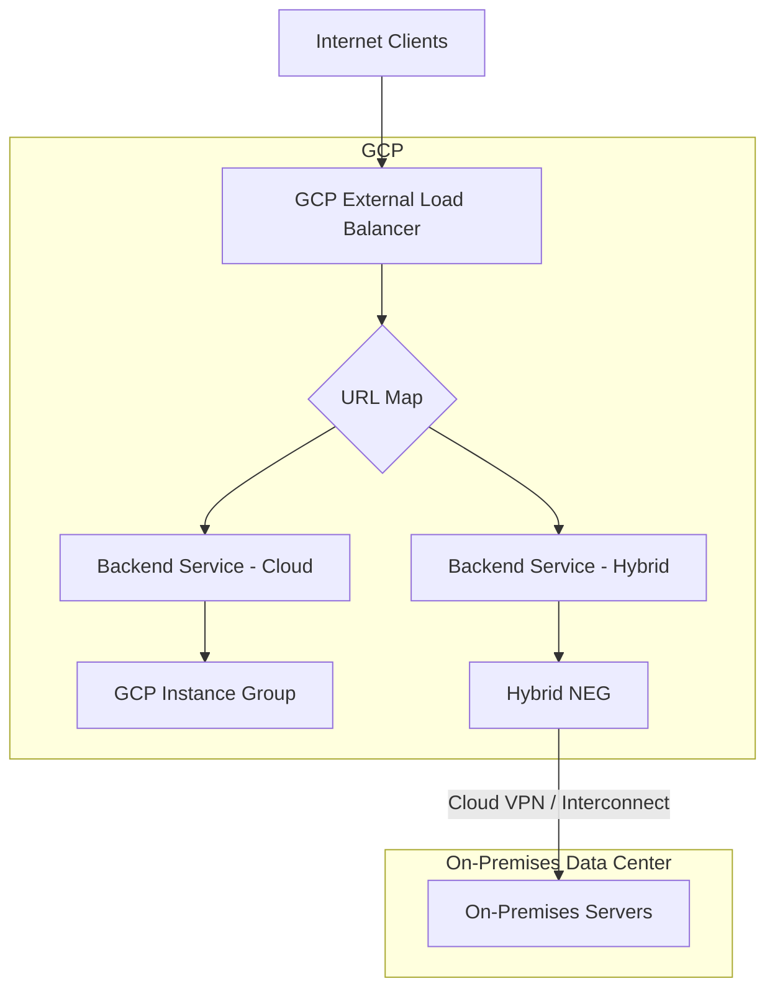

# How to Configure Hybrid Connectivity NEGs to Load Balance On-Premises Backends in GCP

Author: [nawazdhandala](https://www.github.com/nawazdhandala)

Tags: GCP, Hybrid NEG, Load Balancer, On-Premises, Hybrid Cloud

Description: Learn how to use hybrid connectivity network endpoint groups in GCP to route load balancer traffic to on-premises or other cloud backends through VPN or Interconnect.

---

Moving to the cloud rarely happens overnight. During migration, or as a permanent architecture, you often need your GCP load balancer to route traffic to both cloud-based and on-premises backends. Hybrid connectivity network endpoint groups (NEGs) make this possible. They let you add on-premises servers, or servers in another cloud, as backends to a GCP load balancer - as long as they are reachable via Cloud VPN or Cloud Interconnect.

This post covers the setup of hybrid NEGs with practical examples for common migration and hybrid cloud scenarios.

## What Is a Hybrid Connectivity NEG?

A hybrid connectivity NEG is a network endpoint group that contains IP addresses and ports of backends running outside of GCP. These backends must be reachable from your GCP VPC through:
- Cloud VPN (IPsec tunnels)
- Cloud Interconnect (dedicated or partner)
- Any other connectivity that makes the on-premises IPs routable from GCP

The GCP load balancer treats these endpoints like any other backend. It sends health checks to them, distributes traffic based on load balancing algorithms, and handles failover if they become unhealthy.

## Architecture Overview



## Prerequisites

Before configuring hybrid NEGs, you need:

- A VPN tunnel or Interconnect connection between GCP and your on-premises network
- Routes configured so GCP can reach on-premises IP addresses
- On-premises servers running the workload you want to load balance
- Firewall rules (both GCP and on-premises) allowing health check and application traffic

## Step 1: Verify Connectivity

Make sure your on-premises servers are reachable from GCP:

```bash
# From a GCP VM in the same VPC, test connectivity to on-prem
ping 192.168.1.10

# Test the application port
nc -zv 192.168.1.10 8080
```

If these fail, fix your VPN/Interconnect and routing before proceeding.

## Step 2: Create the Hybrid NEG

Create a NEG with the `NON_GCP_PRIVATE_IP_PORT` endpoint type:

```bash
# Create a hybrid NEG in the same zone as your VPN gateway
gcloud compute network-endpoint-groups create on-prem-neg \
    --network-endpoint-type=NON_GCP_PRIVATE_IP_PORT \
    --zone=us-central1-a \
    --network=my-vpc
```

The zone should be in the same region as your Cloud VPN gateway or Interconnect attachment for optimal routing.

## Step 3: Add On-Premises Endpoints

Add the IP addresses and ports of your on-premises servers:

```bash
# Add on-premises server endpoints to the hybrid NEG
gcloud compute network-endpoint-groups update on-prem-neg \
    --zone=us-central1-a \
    --add-endpoint="ip=192.168.1.10,port=8080" \
    --add-endpoint="ip=192.168.1.11,port=8080" \
    --add-endpoint="ip=192.168.1.12,port=8080"
```

You can add or remove endpoints at any time:

```bash
# Remove a server that is being decommissioned
gcloud compute network-endpoint-groups update on-prem-neg \
    --zone=us-central1-a \
    --remove-endpoint="ip=192.168.1.12,port=8080"

# Add a new server
gcloud compute network-endpoint-groups update on-prem-neg \
    --zone=us-central1-a \
    --add-endpoint="ip=192.168.1.13,port=8080"
```

## Step 4: Create a Health Check

Health checks for hybrid NEGs work the same way as for regular backends. The probes are sent from GCP's health check IP ranges through the VPN/Interconnect tunnel:

```bash
# Create a health check for on-premises backends
gcloud compute health-checks create http on-prem-health-check \
    --port=8080 \
    --request-path="/health" \
    --check-interval=30s \
    --timeout=10s \
    --healthy-threshold=2 \
    --unhealthy-threshold=3 \
    --global
```

Note the longer intervals and timeouts compared to cloud-only health checks. On-premises servers have higher latency due to the VPN/Interconnect hop, so give them more time to respond.

## Step 5: Create a Backend Service

```bash
# Create a backend service for hybrid traffic
gcloud compute backend-services create hybrid-backend-service \
    --protocol=HTTP \
    --health-checks=on-prem-health-check \
    --global
```

Add the hybrid NEG as a backend:

```bash
# Add the hybrid NEG to the backend service
gcloud compute backend-services add-backend hybrid-backend-service \
    --network-endpoint-group=on-prem-neg \
    --network-endpoint-group-zone=us-central1-a \
    --balancing-mode=RATE \
    --max-rate-per-endpoint=100 \
    --global
```

The `--balancing-mode=RATE` is required for hybrid NEGs. You must specify `--max-rate-per-endpoint` to define the maximum request rate per on-premises endpoint.

## Step 6: Create the Load Balancer Frontend

```bash
# Create the URL map
gcloud compute url-maps create hybrid-url-map \
    --default-service=hybrid-backend-service \
    --global

# Reserve an IP
gcloud compute addresses create hybrid-lb-ip \
    --ip-version=IPV4 --global

# Create SSL cert and proxy
gcloud compute ssl-certificates create hybrid-cert \
    --domains=app.example.com --global

gcloud compute target-https-proxies create hybrid-https-proxy \
    --url-map=hybrid-url-map \
    --ssl-certificates=hybrid-cert

# Create forwarding rule
gcloud compute forwarding-rules create hybrid-https-rule \
    --address=hybrid-lb-ip \
    --global \
    --target-https-proxy=hybrid-https-proxy \
    --ports=443
```

## Step 7: Configure On-Premises Firewalls

Your on-premises firewall must allow traffic from GCP health check IP ranges and from the VPC subnet ranges:

```
# On-premises firewall rules (pseudo-config)
# Allow health checks from GCP
ALLOW TCP 8080 FROM 130.211.0.0/22
ALLOW TCP 8080 FROM 35.191.0.0/16

# Allow application traffic from GCP VPC
ALLOW TCP 8080 FROM 10.128.0.0/16
```

The exact configuration depends on your firewall vendor.

## Mixed Cloud and On-Premises Backends

The most powerful pattern is mixing cloud and on-premises backends in the same load balancer. During migration, you can gradually shift traffic from on-premises to cloud:

```bash
# Create a GCP backend with instance group
gcloud compute backend-services create mixed-backend \
    --protocol=HTTP \
    --health-checks=on-prem-health-check \
    --global

# Add cloud instances
gcloud compute backend-services add-backend mixed-backend \
    --instance-group=cloud-instances \
    --instance-group-zone=us-central1-a \
    --balancing-mode=RATE \
    --max-rate-per-instance=200 \
    --global

# Add on-premises endpoints
gcloud compute backend-services add-backend mixed-backend \
    --network-endpoint-group=on-prem-neg \
    --network-endpoint-group-zone=us-central1-a \
    --balancing-mode=RATE \
    --max-rate-per-endpoint=50 \
    --global
```

By adjusting `max-rate-per-endpoint` and `max-rate-per-instance`, you control the traffic split. Lower the on-premises rate as you migrate more workload to the cloud.

## Migration Strategy with Traffic Shifting

Here is a practical migration approach:

1. **Phase 1**: All traffic goes to on-premises (max-rate-per-endpoint=100 on-prem, max-rate-per-instance=0 cloud)
2. **Phase 2**: 80/20 split (reduce on-prem rate, increase cloud rate)
3. **Phase 3**: 50/50 split
4. **Phase 4**: 20/80 split
5. **Phase 5**: Remove on-premises backends entirely

```bash
# Phase 3: Equal distribution between cloud and on-prem
gcloud compute backend-services update-backend mixed-backend \
    --network-endpoint-group=on-prem-neg \
    --network-endpoint-group-zone=us-central1-a \
    --balancing-mode=RATE \
    --max-rate-per-endpoint=50 \
    --global

gcloud compute backend-services update-backend mixed-backend \
    --instance-group=cloud-instances \
    --instance-group-zone=us-central1-a \
    --balancing-mode=RATE \
    --max-rate-per-instance=50 \
    --global
```

## Monitoring Hybrid Traffic

Monitor the health and performance of your hybrid backends:

```bash
# Check health status of hybrid backends
gcloud compute backend-services get-health hybrid-backend-service --global

# View load balancer logs filtered for hybrid traffic
gcloud logging read 'resource.type="http_load_balancer"' \
    --limit=20 \
    --format="table(timestamp,httpRequest.requestUrl,httpRequest.status,jsonPayload.backendTargetIp)"
```

## Troubleshooting

**Health checks failing for on-premises backends**: Verify that GCP health check IPs (130.211.0.0/22, 35.191.0.0/16) can reach your on-premises servers through the VPN. Check both GCP and on-premises firewall rules.

**High latency to on-premises backends**: This is expected with VPN. Consider using Interconnect for lower latency, or move latency-sensitive workloads to GCP first.

**Asymmetric routing**: Make sure return traffic from on-premises servers goes back through the same VPN/Interconnect path. Asymmetric routing can cause connection failures.

## Wrapping Up

Hybrid connectivity NEGs bridge the gap between cloud and on-premises infrastructure. They let you use GCP's load balancing features - global distribution, CDN, Cloud Armor, URL-based routing - with backends running anywhere, as long as they are reachable from your VPC. This is invaluable during cloud migrations and for permanent hybrid architectures where some workloads must stay on-premises.
