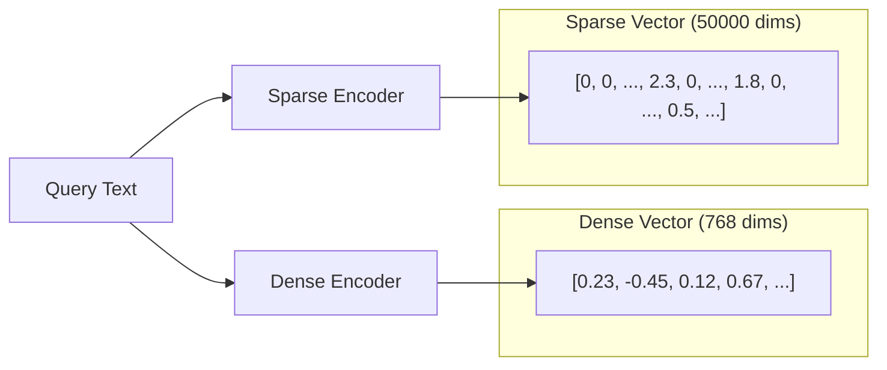

# How to Configure Hybrid Search with Vertex AI Vector Search Combining Dense and Sparse Vectors

Author: [nawazdhandala](https://www.github.com/nawazdhandala)

Tags: GCP, Vertex AI, Vector Search, Hybrid Search, Embeddings

Description: Learn how to configure hybrid search on Vertex AI Vector Search by combining dense semantic embeddings with sparse keyword vectors for better search results.

---

Dense vector search is great at finding semantically similar content - a query about "automobile maintenance" will match documents about "car repair." But it can miss exact keyword matches that matter, like specific product codes, error messages, or technical terms. Sparse vectors, like those from BM25 or TF-IDF, excel at exact matching but miss semantic relationships.

Hybrid search combines both approaches. You search with dense vectors for semantic understanding and sparse vectors for keyword precision, then merge the results. This gives you the best of both worlds and consistently outperforms either approach alone.

## Understanding Dense vs Sparse Vectors

Dense vectors are the fixed-size embeddings you get from models like sentence-transformers or Vertex AI's text embedding API. Every dimension has a non-zero value, and the vector captures the semantic meaning of the text. A 768-dimensional dense vector might represent "the quick brown fox."

Sparse vectors have the same dimensionality as your vocabulary (potentially millions of dimensions) but most values are zero. Only the dimensions corresponding to tokens present in the text have non-zero values. A sparse vector for "the quick brown fox" would have non-zero values at the indices for "the", "quick", "brown", and "fox."



## Generating Dense and Sparse Embeddings

Before setting up the index, you need to generate both types of embeddings for your corpus.

This code generates dense embeddings using Vertex AI and sparse embeddings using BM25:

```python
# embedding_generator.py - Generate both dense and sparse vectors

import numpy as np
from google.cloud import aiplatform
from vertexai.language_models import TextEmbeddingModel
from sklearn.feature_extraction.text import TfidfVectorizer
from collections import Counter
import math

class HybridEmbedder:
    """Generates both dense and sparse embeddings for hybrid search."""

    def __init__(self, corpus=None):
        # Dense model - Vertex AI text embeddings
        self.dense_model = TextEmbeddingModel.from_pretrained("text-embedding-004")

        # Sparse model - BM25-style scoring
        if corpus:
            self._build_bm25_index(corpus)

    def _build_bm25_index(self, corpus):
        """Build BM25 statistics from the corpus."""
        self.doc_count = len(corpus)
        self.avg_doc_length = 0
        self.doc_freqs = Counter()  # How many docs contain each term
        self.vocab = {}  # Term to index mapping

        # Tokenize and compute statistics
        for doc in corpus:
            terms = doc.lower().split()
            self.avg_doc_length += len(terms)
            unique_terms = set(terms)
            for term in unique_terms:
                self.doc_freqs[term] += 1
                if term not in self.vocab:
                    self.vocab[term] = len(self.vocab)

        self.avg_doc_length /= self.doc_count
        self.vocab_size = len(self.vocab)

    def encode_dense(self, texts):
        """Generate dense embeddings using Vertex AI."""
        embeddings = self.dense_model.get_embeddings(texts)
        return [emb.values for emb in embeddings]

    def encode_sparse(self, text, k1=1.5, b=0.75):
        """Generate a BM25-weighted sparse vector for a single text.

        Args:
            text: Input text string
            k1: BM25 term frequency saturation parameter
            b: BM25 document length normalization parameter
        """
        terms = text.lower().split()
        doc_length = len(terms)
        term_freqs = Counter(terms)

        sparse_indices = []
        sparse_values = []

        for term, tf in term_freqs.items():
            if term not in self.vocab:
                continue

            idx = self.vocab[term]
            df = self.doc_freqs.get(term, 0)

            # BM25 IDF component
            idf = math.log((self.doc_count - df + 0.5) / (df + 0.5) + 1)

            # BM25 TF component with length normalization
            tf_norm = (tf * (k1 + 1)) / (tf + k1 * (1 - b + b * doc_length / self.avg_doc_length))

            score = idf * tf_norm

            if score > 0:
                sparse_indices.append(idx)
                sparse_values.append(float(score))

        return sparse_indices, sparse_values

# Initialize with your document corpus
corpus = [
    "How to fix kubernetes pod crash loop backoff",
    "Debugging memory leaks in Python applications",
    "Configuring nginx reverse proxy for microservices",
    # ... thousands more documents
]

embedder = HybridEmbedder(corpus=corpus)
```

## Preparing Hybrid Vectors for Indexing

Vertex AI Vector Search supports sparse embeddings through the `sparse_embedding` field in your datapoints. You need to provide both dense and sparse vectors for each document.

This code prepares the hybrid vector data:

```python
import json

def prepare_hybrid_vectors(embedder, documents, output_path):
    """Generate hybrid embeddings and write to JSONL format.

    Each record contains both a dense embedding and a sparse embedding.
    """
    # Generate dense embeddings in batches
    batch_size = 100
    all_dense = []

    for i in range(0, len(documents), batch_size):
        batch = [doc["text"] for doc in documents[i:i + batch_size]]
        dense_batch = embedder.encode_dense(batch)
        all_dense.extend(dense_batch)

    with open(output_path, "w") as f:
        for i, doc in enumerate(documents):
            # Get sparse embedding
            sparse_indices, sparse_values = embedder.encode_sparse(doc["text"])

            record = {
                "id": doc["id"],
                "embedding": all_dense[i],  # Dense vector
                "sparse_embedding": {
                    "values": sparse_values,
                    "dimensions": sparse_indices
                }
            }

            # Add metadata for filtering
            if "category" in doc:
                record["restricts"] = [
                    {"namespace": "category", "allow_list": [doc["category"]]}
                ]

            f.write(json.dumps(record) + "\n")

    print(f"Prepared {len(documents)} hybrid vectors")

# Prepare the data
documents = [
    {"id": "doc_001", "text": "How to fix kubernetes pod crash loop backoff", "category": "kubernetes"},
    {"id": "doc_002", "text": "Debugging memory leaks in Python applications", "category": "python"},
    # ... more documents
]

prepare_hybrid_vectors(embedder, documents, "hybrid_vectors.jsonl")
```

## Creating a Hybrid Search Index

Create the index with configuration that supports both dense and sparse vectors:

```python
from google.cloud import aiplatform

aiplatform.init(project="your-project-id", location="us-central1")

# Upload hybrid vectors to GCS first
# gsutil cp hybrid_vectors.jsonl gs://your-bucket/hybrid-data/

# Create the hybrid index
index = aiplatform.MatchingEngineIndex.create_tree_ah_index(
    display_name="hybrid-search-index",
    contents_delta_uri="gs://your-bucket/hybrid-data/",
    dimensions=768,  # Dense vector dimensions
    approximate_neighbors_count=150,
    distance_measure_type="DOT_PRODUCT_DISTANCE",
    leaf_node_embedding_count=1000,
    leaf_nodes_to_search_percent=7,
    description="Hybrid search index with dense and sparse vectors"
)

print(f"Hybrid index created: {index.resource_name}")
```

## Querying with Hybrid Search

When querying, provide both dense and sparse query vectors. Vertex AI combines the scores from both to rank results.

This code performs a hybrid search query:

```python
from google.cloud import aiplatform_v1

def hybrid_search(endpoint_name, deployed_index_id, query_text, embedder, num_neighbors=10, alpha=0.5):
    """Perform hybrid search combining dense and sparse vectors.

    Args:
        endpoint_name: Full resource name of the index endpoint
        deployed_index_id: ID of the deployed index
        query_text: The search query string
        embedder: HybridEmbedder instance
        num_neighbors: Number of results to return
        alpha: Weight for dense vs sparse (0=all sparse, 1=all dense)
    """
    # Generate query embeddings
    dense_embedding = embedder.encode_dense([query_text])[0]
    sparse_indices, sparse_values = embedder.encode_sparse(query_text)

    # Create the match client
    client = aiplatform_v1.MatchServiceClient(
        client_options={"api_endpoint": "us-central1-aiplatform.googleapis.com"}
    )

    # Build the hybrid query
    query = aiplatform_v1.FindNeighborsRequest.Query(
        datapoint=aiplatform_v1.IndexDatapoint(
            feature_vector=dense_embedding,
            sparse_embedding=aiplatform_v1.IndexDatapoint.SparseEmbedding(
                values=sparse_values,
                dimensions=sparse_indices
            )
        ),
        neighbor_count=num_neighbors,
        # RRF (Reciprocal Rank Fusion) parameter for combining results
        rrf_ranking_alpha=alpha
    )

    request = aiplatform_v1.FindNeighborsRequest(
        index_endpoint=endpoint_name,
        deployed_index_id=deployed_index_id,
        queries=[query]
    )

    response = client.find_neighbors(request=request)

    # Process results
    results = []
    for neighbor_list in response.nearest_neighbors:
        for neighbor in neighbor_list.neighbors:
            results.append({
                "id": neighbor.datapoint.datapoint_id,
                "distance": neighbor.distance
            })

    return results

# Example search
results = hybrid_search(
    endpoint_name="projects/your-project-id/locations/us-central1/indexEndpoints/ENDPOINT_ID",
    deployed_index_id="hybrid_index_v1",
    query_text="kubernetes pod keeps restarting",
    embedder=embedder,
    num_neighbors=10,
    alpha=0.6  # Slightly favor dense/semantic search
)

for r in results:
    print(f"ID: {r['id']}, Score: {r['distance']:.4f}")
```

## Tuning the Alpha Parameter

The alpha parameter controls the balance between dense and sparse search. Finding the right value depends on your data and use case.

```python
def evaluate_alpha_values(test_queries, ground_truth, embedder, endpoint_name, index_id):
    """Evaluate different alpha values to find the best balance."""
    alphas = [0.0, 0.2, 0.4, 0.5, 0.6, 0.8, 1.0]

    for alpha in alphas:
        recalls = []
        for query, true_ids in zip(test_queries, ground_truth):
            results = hybrid_search(
                endpoint_name=endpoint_name,
                deployed_index_id=index_id,
                query_text=query,
                embedder=embedder,
                num_neighbors=10,
                alpha=alpha
            )
            result_ids = set(r["id"] for r in results)
            recall = len(result_ids.intersection(set(true_ids))) / len(true_ids)
            recalls.append(recall)

        avg_recall = sum(recalls) / len(recalls)
        print(f"Alpha={alpha:.1f}: Average Recall@10 = {avg_recall:.4f}")
```

For most text search use cases, alpha values between 0.5 and 0.7 work well, slightly favoring the dense side. For highly technical content with specific terminology (like error codes or API names), lower alpha values around 0.3-0.4 that favor sparse matching tend to perform better.

## When to Use Hybrid Search

Hybrid search is particularly valuable when your queries mix natural language with specific identifiers. A support ticket search like "kubernetes CrashLoopBackOff error in namespace kube-system" benefits from both semantic understanding of "error" and exact matching of "CrashLoopBackOff" and "kube-system."

Pure dense search works fine when queries and documents are natural language without specific keywords that must match exactly. Pure sparse search is sufficient for exact keyword lookup scenarios. Hybrid search shines in the space between these extremes, which is where most real-world search applications live.

The small additional cost of maintaining both embedding types is almost always worth it for the improvement in search quality. Users notice when their exact keyword queries return irrelevant semantic matches, and hybrid search prevents that.
