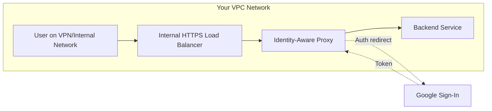

# How to Configure IAP for Internal Application Load Balancers in GCP

Author: [nawazdhandala](https://www.github.com/nawazdhandala)

Tags: GCP, IAP, Internal Load Balancer, Networking, Security, Authentication

Description: A detailed guide on configuring Identity-Aware Proxy for internal HTTP(S) application load balancers in GCP to protect internal applications with Google-backed authentication.

---

Most IAP documentation focuses on external load balancers, but many organizations run internal applications that also need authentication. Think of admin panels, internal APIs, dashboards, and back-office tools that should only be accessible from within your VPC or via VPN - but still need proper user authentication.

IAP works with internal application load balancers too. This lets you add Google identity-based authentication to your internal applications without exposing them to the internet. Users still authenticate through Google Sign-In, but the application itself is only reachable from within your network.

## Architecture

Here is how IAP works with an internal load balancer:



The load balancer has an internal IP address only. Users access it from within the VPC (directly or through VPN/Interconnect). IAP still redirects to Google Sign-In for authentication, which happens over the public internet from the user's browser.

## Prerequisites

- A VPC network with Private Google Access enabled on the subnet
- An internal application load balancer (proxy-based, not passthrough)
- Backend service with health checks
- An SSL certificate for the internal load balancer

Important: IAP for internal load balancers requires the regional internal application load balancer, not the TCP/UDP passthrough load balancer.

## Step 1: Enable Required APIs

```bash
# Enable the necessary APIs
gcloud services enable iap.googleapis.com \
    compute.googleapis.com \
    --project=my-project-id
```

## Step 2: Create the Backend Service

Set up the backend service that your internal load balancer will route to.

```bash
# Create a health check
gcloud compute health-checks create http internal-app-health \
    --port=8080 \
    --request-path=/health \
    --project=my-project-id

# Create the backend service
gcloud compute backend-services create internal-app-backend \
    --protocol=HTTP \
    --port-name=http \
    --health-checks=internal-app-health \
    --load-balancing-scheme=INTERNAL_MANAGED \
    --region=us-central1 \
    --project=my-project-id

# Add the instance group to the backend service
gcloud compute backend-services add-backend internal-app-backend \
    --instance-group=my-instance-group \
    --instance-group-zone=us-central1-a \
    --region=us-central1 \
    --project=my-project-id
```

## Step 3: Create the Internal Load Balancer

Set up the proxy-only subnet (required for internal application load balancers), URL map, SSL certificate, and forwarding rule.

```bash
# Create a proxy-only subnet for the internal load balancer
gcloud compute networks subnets create proxy-only-subnet \
    --purpose=REGIONAL_MANAGED_PROXY \
    --role=ACTIVE \
    --region=us-central1 \
    --network=my-vpc \
    --range=10.129.0.0/23 \
    --project=my-project-id
```

Create a self-signed certificate for the internal load balancer (or use a proper certificate from your internal CA).

```bash
# Create a self-signed SSL certificate for the internal load balancer
gcloud compute ssl-certificates create internal-app-cert \
    --certificate=cert.pem \
    --private-key=key.pem \
    --region=us-central1 \
    --project=my-project-id
```

Set up the URL map and target HTTPS proxy.

```bash
# Create the URL map
gcloud compute url-maps create internal-app-url-map \
    --default-service=internal-app-backend \
    --region=us-central1 \
    --project=my-project-id

# Create the target HTTPS proxy
gcloud compute target-https-proxies create internal-app-https-proxy \
    --url-map=internal-app-url-map \
    --ssl-certificates=internal-app-cert \
    --region=us-central1 \
    --project=my-project-id

# Create the forwarding rule with an internal IP
gcloud compute forwarding-rules create internal-app-rule \
    --load-balancing-scheme=INTERNAL_MANAGED \
    --network=my-vpc \
    --subnet=my-subnet \
    --address=10.128.0.100 \
    --ports=443 \
    --region=us-central1 \
    --target-https-proxy=internal-app-https-proxy \
    --target-https-proxy-region=us-central1 \
    --project=my-project-id
```

## Step 4: Enable IAP on the Backend Service

Now enable IAP on the internal backend service.

```bash
# Enable IAP on the internal backend service
gcloud compute backend-services update internal-app-backend \
    --iap=enabled \
    --region=us-central1 \
    --project=my-project-id
```

Note that for regional (internal) backend services, you use `--region` instead of `--global`.

## Step 5: Grant User Access

```bash
# Grant access to users who need to reach the internal app
gcloud iap web add-iam-policy-binding \
    --resource-type=backend-services \
    --service=internal-app-backend \
    --member="group:internal-app-users@company.com" \
    --role="roles/iap.httpsResourceAccessor" \
    --region=us-central1 \
    --project=my-project-id
```

## Step 6: Configure DNS

Set up internal DNS to point to the load balancer's internal IP.

```bash
# Create a Cloud DNS managed zone for internal DNS
gcloud dns managed-zones create internal-zone \
    --dns-name="internal.company.com." \
    --visibility=private \
    --networks=my-vpc \
    --project=my-project-id

# Add a DNS record for the internal app
gcloud dns record-sets create internal-app.internal.company.com. \
    --type=A \
    --ttl=300 \
    --rrdatas=10.128.0.100 \
    --zone=internal-zone \
    --project=my-project-id
```

## Step 7: Enable Private Google Access

For the IAP authentication redirect to work, the subnet needs Private Google Access enabled so that instances can reach Google's authentication endpoints.

```bash
# Enable Private Google Access on the subnet
gcloud compute networks subnets update my-subnet \
    --region=us-central1 \
    --enable-private-google-access \
    --project=my-project-id
```

Without this, the authentication redirect to Google Sign-In will fail for users on internal networks that do not have internet access.

## Terraform Configuration

Here is the full setup in Terraform.

```hcl
# Proxy-only subnet for internal load balancer
resource "google_compute_subnetwork" "proxy_only" {
  name          = "proxy-only-subnet"
  ip_cidr_range = "10.129.0.0/23"
  region        = "us-central1"
  network       = google_compute_network.vpc.id
  purpose       = "REGIONAL_MANAGED_PROXY"
  role          = "ACTIVE"
}

# Health check
resource "google_compute_health_check" "internal_app" {
  name = "internal-app-health"
  http_health_check {
    port         = 8080
    request_path = "/health"
  }
}

# Backend service with IAP enabled
resource "google_compute_region_backend_service" "internal_app" {
  name                  = "internal-app-backend"
  protocol              = "HTTP"
  port_name             = "http"
  load_balancing_scheme = "INTERNAL_MANAGED"
  region                = "us-central1"

  backend {
    group = google_compute_instance_group_manager.app.instance_group
  }

  health_checks = [google_compute_health_check.internal_app.id]

  iap {
    oauth2_client_id     = google_iap_client.internal_app.client_id
    oauth2_client_secret = google_iap_client.internal_app.secret
  }
}

# URL map
resource "google_compute_region_url_map" "internal_app" {
  name            = "internal-app-url-map"
  region          = "us-central1"
  default_service = google_compute_region_backend_service.internal_app.id
}

# SSL certificate (use google_compute_region_ssl_certificate for managed certs)
resource "google_compute_region_ssl_certificate" "internal_app" {
  name        = "internal-app-cert"
  region      = "us-central1"
  certificate = file("cert.pem")
  private_key = file("key.pem")
}

# Target HTTPS proxy
resource "google_compute_region_target_https_proxy" "internal_app" {
  name             = "internal-app-https-proxy"
  region           = "us-central1"
  url_map          = google_compute_region_url_map.internal_app.id
  ssl_certificates = [google_compute_region_ssl_certificate.internal_app.id]
}

# Forwarding rule
resource "google_compute_forwarding_rule" "internal_app" {
  name                  = "internal-app-rule"
  region                = "us-central1"
  load_balancing_scheme = "INTERNAL_MANAGED"
  network               = google_compute_network.vpc.id
  subnetwork            = google_compute_subnetwork.main.id
  ip_address            = "10.128.0.100"
  port_range            = "443"
  target                = google_compute_region_target_https_proxy.internal_app.id
}

# IAP access for internal users
resource "google_iap_web_region_backend_service_iam_member" "access" {
  project             = var.project_id
  region              = "us-central1"
  web_region_backend_service = google_compute_region_backend_service.internal_app.name
  role                = "roles/iap.httpsResourceAccessor"
  member              = "group:internal-app-users@company.com"
}
```

## Network Considerations

### User Browser Must Reach Google Sign-In

Even though your application is internal, the user's browser needs to reach `accounts.google.com` for the authentication redirect. This means:

- Users on corporate networks need internet access (at least to Google's domains)
- Users on fully air-gapped networks cannot use IAP authentication

### Firewall Rules

Make sure the proxy-only subnet can reach your backend instances.

```bash
# Allow traffic from the proxy-only subnet to backend instances
gcloud compute firewall-rules create allow-internal-lb \
    --direction=INGRESS \
    --action=ALLOW \
    --rules=tcp:8080 \
    --source-ranges=10.129.0.0/23 \
    --target-tags=internal-app \
    --network=my-vpc \
    --project=my-project-id
```

## Troubleshooting

**Cannot reach the load balancer**: Make sure you are connecting from within the VPC or through VPN. Internal load balancers are not accessible from the internet.

**Authentication redirect fails**: The user's browser needs internet access to reach Google Sign-In. If you are on a restricted network, allowlist `accounts.google.com` and related Google domains.

**502 error after authentication**: The backend service is not reachable. Check firewall rules and make sure the proxy-only subnet can reach your backend instances.

**Certificate warnings**: If using a self-signed certificate, browsers will show warnings. For production, use certificates from your internal CA or configure your clients to trust the self-signed cert.

## Summary

IAP for internal application load balancers gives you Google-backed authentication for internal applications without exposing them to the internet. The setup is similar to external IAP, but you use regional backend services and internal load balancing. The key networking requirements are a proxy-only subnet, Private Google Access for the authentication flow, and appropriate firewall rules. Once configured, internal users get the same secure authentication experience as external users, but the application remains completely internal.
