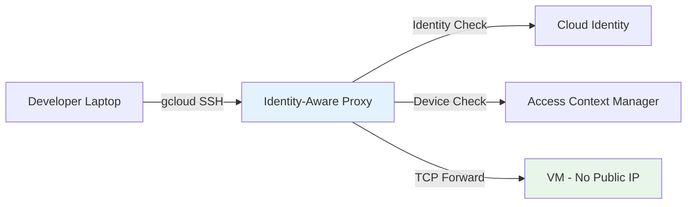

# How to Configure Identity-Aware Proxy with BeyondCorp for SSH and TCP Access

Author: [nawazdhandala](https://www.github.com/nawazdhandala)

Tags: GCP, BeyondCorp, Identity-Aware Proxy, SSH, TCP Forwarding, Security

Description: Learn how to use Identity-Aware Proxy TCP forwarding to enable secure SSH and TCP access to GCP VMs without exposing them to the public internet.

---

SSH access to VMs is one of the biggest security headaches in cloud environments. Opening port 22 to the internet is risky, and managing VPN access for every developer is tedious. Identity-Aware Proxy (IAP) for TCP forwarding solves this by tunneling SSH and other TCP connections through Google's infrastructure, authenticating users with their Google identity, and never exposing your VMs to the public internet.

This guide walks through setting up IAP TCP forwarding for SSH access and extending it to other TCP protocols.

## How IAP TCP Forwarding Works

When you use IAP for TCP, the connection flows like this:

1. You run `gcloud compute ssh` or `gcloud compute start-iap-tunnel`
2. gcloud authenticates you with Google and establishes a tunnel to IAP
3. IAP verifies your identity and checks your access permissions
4. If authorized, IAP forwards the TCP traffic to the target VM's internal IP
5. The VM never needs a public IP or an open firewall rule

This means your VMs can have no external IP addresses and no firewall rules allowing inbound traffic from the internet. All access goes through IAP.

## Prerequisites

- A GCP project with Compute Engine VMs
- The IAP API enabled
- VMs with the IAP TCP forwarding firewall rule configured
- gcloud CLI installed and configured

```bash
# Enable the IAP API
gcloud services enable iap.googleapis.com --project=my-project-id
```

## Step 1: Create the IAP Firewall Rule

IAP TCP forwarding connects to your VMs from a specific IP range. You need a firewall rule that allows this traffic.

```bash
# Create a firewall rule allowing IAP to reach your VMs on SSH port
gcloud compute firewall-rules create allow-iap-ssh \
  --network=default \
  --direction=INGRESS \
  --action=ALLOW \
  --rules=tcp:22 \
  --source-ranges=35.235.240.0/20 \
  --target-tags=allow-iap \
  --project=my-project-id
```

The IP range `35.235.240.0/20` is the range used by IAP for TCP forwarding. This is a Google-owned range and should not change.

If you need to allow other TCP ports (like 3389 for RDP or 3306 for MySQL), add them to the rules.

```bash
# Allow IAP access to multiple ports
gcloud compute firewall-rules create allow-iap-tcp \
  --network=default \
  --direction=INGRESS \
  --action=ALLOW \
  --rules=tcp:22,tcp:3389,tcp:3306,tcp:8080 \
  --source-ranges=35.235.240.0/20 \
  --target-tags=allow-iap \
  --project=my-project-id
```

## Step 2: Remove External IP from VMs

With IAP, your VMs do not need public IPs. Remove them to reduce attack surface.

```bash
# Remove the external IP from a VM
gcloud compute instances delete-access-config my-vm \
  --access-config-name="External NAT" \
  --zone=us-central1-a \
  --project=my-project-id
```

For new VMs, create them without external IPs.

```bash
# Create a VM with no external IP
gcloud compute instances create my-secure-vm \
  --zone=us-central1-a \
  --machine-type=e2-medium \
  --network-interface=no-address \
  --tags=allow-iap \
  --project=my-project-id
```

Note: VMs without external IPs need Cloud NAT or Private Google Access to reach the internet for package updates and other outbound traffic.

## Step 3: Grant IAP Access Permissions

Control who can tunnel through IAP to reach your VMs.

```bash
# Grant a user SSH access through IAP to all VMs in the project
gcloud projects add-iam-policy-binding my-project-id \
  --member="user:alice@example.com" \
  --role="roles/iap.tunnelResourceAccessor"

# Grant a group access
gcloud projects add-iam-policy-binding my-project-id \
  --member="group:sre-team@example.com" \
  --role="roles/iap.tunnelResourceAccessor"
```

For more granular control, bind the role at the instance level.

```bash
# Grant IAP tunnel access to a specific VM only
gcloud compute instances add-iam-policy-binding my-vm \
  --zone=us-central1-a \
  --member="user:alice@example.com" \
  --role="roles/iap.tunnelResourceAccessor" \
  --project=my-project-id
```

Users also need the standard compute SSH permission.

```bash
# Grant compute OS login or instance admin for SSH
gcloud projects add-iam-policy-binding my-project-id \
  --member="user:alice@example.com" \
  --role="roles/compute.osLogin"
```

## Step 4: Connect via SSH Through IAP

Now users can SSH to VMs through IAP.

```bash
# SSH to a VM through IAP (gcloud handles the tunnel automatically)
gcloud compute ssh my-vm \
  --zone=us-central1-a \
  --tunnel-through-iap \
  --project=my-project-id
```

The `--tunnel-through-iap` flag tells gcloud to route the connection through IAP instead of connecting directly. If the VM has no external IP, gcloud will automatically use IAP.

## Step 5: Set Up TCP Tunnels for Other Protocols

IAP is not limited to SSH. You can tunnel any TCP protocol.

```bash
# Create a tunnel to a database running on port 3306
gcloud compute start-iap-tunnel my-db-vm 3306 \
  --local-host-port=localhost:3306 \
  --zone=us-central1-a \
  --project=my-project-id
```

This creates a local port forward. Connect to `localhost:3306` on your machine and the traffic will be tunneled through IAP to port 3306 on `my-db-vm`.

For a web application running on port 8080:

```bash
# Tunnel to a web application for local development access
gcloud compute start-iap-tunnel my-web-vm 8080 \
  --local-host-port=localhost:8080 \
  --zone=us-central1-a \
  --project=my-project-id

# Now open http://localhost:8080 in your browser
```

For RDP access to Windows VMs:

```bash
# Tunnel RDP through IAP
gcloud compute start-iap-tunnel my-windows-vm 3389 \
  --local-host-port=localhost:3389 \
  --zone=us-central1-a \
  --project=my-project-id

# Then connect with your RDP client to localhost:3389
```

## Step 6: Configure SSH Config for Convenience

You can set up your SSH config to automatically use IAP tunneling.

```
# ~/.ssh/config
# SSH config for GCP VMs through IAP
Host gcp-*
  ProxyCommand gcloud compute start-iap-tunnel %h 22 --listen-on-stdin --project=my-project-id --zone=us-central1-a
  User alice
  IdentityFile ~/.ssh/google_compute_engine

# Usage: ssh gcp-my-vm
```

For a more flexible setup that works with different zones:

```bash
# Generate SSH config entries for all VMs in a project
gcloud compute config-ssh \
  --project=my-project-id
```

This creates entries in your SSH config for each VM, and if you add `--tunnel-through-iap`, it will configure IAP tunneling.

## Step 7: Add BeyondCorp Access Levels

For additional security, combine IAP tunnel access with BeyondCorp access levels.

```bash
# Require a secure device for SSH access
gcloud iap tcp add-iam-policy-binding \
  --resource-type=compute \
  --service=my-vm \
  --zone=us-central1-a \
  --member="group:sre-team@example.com" \
  --role="roles/iap.tunnelResourceAccessor" \
  --condition="expression=\"accessPolicies/POLICY_ID/accessLevels/secure-device\" in request.auth.access_levels,title=Require Secure Device" \
  --project=my-project-id
```

This ensures that even if a user has the right identity, they can only SSH if their device meets the security requirements defined in the access level.

## Step 8: Audit SSH Access

All IAP tunnel connections are logged in Cloud Audit Logs.

```bash
# View recent IAP tunnel access logs
gcloud logging read \
  'resource.type="gce_instance" AND
   protoPayload.methodName="AuthorizeUser" AND
   protoPayload.serviceName="iap.googleapis.com"' \
  --project=my-project-id \
  --limit=20 \
  --format="table(timestamp,protoPayload.authenticationInfo.principalEmail,protoPayload.resourceName)"
```

## Architecture Overview



## Troubleshooting

**Connection timeout**: Check that the firewall rule exists and targets the correct VMs. The source range must be `35.235.240.0/20`.

**Permission denied**: Verify the user has both `roles/iap.tunnelResourceAccessor` and an appropriate compute role like `roles/compute.osLogin`.

**Tunnel drops frequently**: IAP tunnels have an idle timeout. For long-running sessions, configure SSH keepalives in your SSH config.

```
# Add to ~/.ssh/config to prevent idle disconnects
Host gcp-*
  ServerAliveInterval 30
  ServerAliveCountMax 3
```

## Summary

IAP TCP forwarding gives you secure, identity-based access to VMs without public IPs or VPNs. Set up the IAP firewall rule, grant tunnel access to users, and use gcloud to establish tunnels. It works for SSH, RDP, database connections, and any other TCP protocol. Combined with BeyondCorp access levels, you get device-aware access control that logs every connection for audit purposes.
