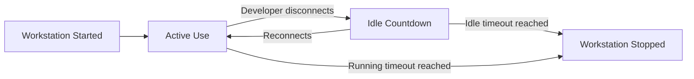

# How to Configure Idle Timeout and Auto-Stop Policies to Reduce Google Cloud Workstation Costs

Author: [nawazdhandala](https://www.github.com/nawazdhandala)

Tags: GCP, Cloud Workstations, Cost Optimization, FinOps, Auto-Stop, Idle Timeout

Description: Learn how to configure idle timeout and auto-stop policies on Google Cloud Workstations to prevent runaway costs from forgotten or unused development environments.

---

Cloud Workstations solve the problem of inconsistent development environments, but they introduce a new problem: cost control. A developer spins up a workstation with a beefy machine type, gets pulled into a meeting, and forgets about it. That workstation keeps running at full price until someone notices or the billing alert fires. Multiply that across a team of 50 developers, and you have a real budget problem.

Google Cloud Workstations provides two mechanisms to control this: idle timeouts and running timeouts. Together, they form an auto-stop policy that shuts down workstations when they are not being used. This guide covers how to configure these effectively.

## Understanding the Two Timeout Types

There are two distinct timeout settings, and they serve different purposes.

**Idle timeout** shuts down a workstation after a period of inactivity. "Activity" means an active IDE connection or SSH session. If a developer closes their laptop and walks away, the workstation detects the dropped connection and starts the idle countdown.

**Running timeout** is a hard cap on how long a workstation can run continuously, regardless of activity. Even if a developer is actively using the workstation, it will stop after this duration. This prevents marathon sessions that blow through budgets.



## Setting Timeouts on a New Configuration

When creating a new workstation configuration, set both timeouts.

```bash
# Create a workstation config with cost-saving timeouts
gcloud workstations configs create cost-optimized-config \
  --cluster=dev-cluster \
  --region=us-central1 \
  --machine-type=e2-standard-8 \
  --pd-disk-size=100 \
  --pd-disk-type=pd-ssd \
  --idle-timeout=1800s \
  --running-timeout=28800s
```

In this example:
- `--idle-timeout=1800s` (30 minutes) - the workstation stops after 30 minutes of no active connections
- `--running-timeout=28800s` (8 hours) - the workstation stops after 8 hours no matter what

## Updating Timeouts on an Existing Configuration

If you already have workstation configurations in production, you can update the timeouts without recreating them.

```bash
# Update the idle timeout to 20 minutes
gcloud workstations configs update existing-config \
  --cluster=dev-cluster \
  --region=us-central1 \
  --idle-timeout=1200s

# Update the running timeout to 10 hours
gcloud workstations configs update existing-config \
  --cluster=dev-cluster \
  --region=us-central1 \
  --running-timeout=36000s
```

Changes take effect on the next workstation start. Currently running workstations are not affected until they restart.

## Choosing the Right Timeout Values

There is no universal right answer, but here are guidelines based on common scenarios.

### Standard Development

For most developers doing regular coding work:

| Setting | Value | Reasoning |
|---|---|---|
| Idle timeout | 30 minutes | Enough time for lunch or a meeting |
| Running timeout | 10 hours | Covers a full workday with buffer |

### ML and Data Science

For data scientists who run long training jobs or notebooks:

| Setting | Value | Reasoning |
|---|---|---|
| Idle timeout | 2 hours | Notebooks can look idle while training |
| Running timeout | 24 hours | Long training runs need time |

### Shared/Pair Programming

For workstations used in pair programming or shared sessions:

| Setting | Value | Reasoning |
|---|---|---|
| Idle timeout | 1 hour | Multiple people may connect/disconnect |
| Running timeout | 12 hours | Extended collaboration sessions |

## Handling Long-Running Background Tasks

The idle timeout can be tricky when developers run background tasks. A long build, a database migration, or a test suite running in the background does not count as "activity" if the IDE connection drops. The workstation might shut down mid-build.

There are a few ways to handle this:

### Option 1: Increase the Idle Timeout for Specific Configs

Create a separate configuration with a longer idle timeout for workloads that need it.

```bash
# A config for workloads with long background tasks
gcloud workstations configs create long-running-config \
  --cluster=dev-cluster \
  --region=us-central1 \
  --machine-type=e2-standard-8 \
  --pd-disk-size=200 \
  --idle-timeout=7200s \
  --running-timeout=43200s
```

### Option 2: Use tmux or screen for Critical Tasks

Run important background tasks in tmux so they survive connection drops. The workstation stays active as long as there is an SSH session or IDE connection, but tmux keeps the task alive across reconnections.

```bash
# Start a tmux session for long-running tasks
tmux new-session -d -s build "make build-all && make test"

# Reconnect later to check status
tmux attach -t build
```

### Option 3: Move Long Tasks Off the Workstation

For truly long-running jobs, submit them to a separate service. Use Cloud Build for builds, Vertex AI for training, or Batch for data processing. The workstation's job is interactive development, not batch processing.

## Monitoring Workstation Costs

Setting timeouts is step one. Monitoring whether they are effective is step two.

### Track Running Hours with Cloud Monitoring

Create a dashboard to track how long workstations are running across your organization.

```bash
# Query workstation uptime from Cloud Logging
gcloud logging read \
  'resource.type="workstations.googleapis.com/Workstation" AND
   protoPayload.methodName="google.cloud.workstations.v1.Workstations.StartWorkstation"' \
  --limit=100 \
  --format="table(timestamp, protoPayload.resourceName)"
```

### Set Up Billing Alerts

Create a budget alert specifically for Cloud Workstations.

```bash
# Create a budget for workstation spending
gcloud billing budgets create \
  --billing-account=BILLING_ACCOUNT_ID \
  --display-name="Cloud Workstations Budget" \
  --budget-amount=5000 \
  --threshold-rule=percent=50 \
  --threshold-rule=percent=80 \
  --threshold-rule=percent=100 \
  --notifications-rule-pubsub-topic=projects/MY_PROJECT/topics/billing-alerts
```

### Generate Cost Reports

Use BigQuery billing export to analyze workstation costs over time:

```sql
-- Query to analyze Cloud Workstations spending by user
SELECT
  labels.value AS workstation_name,
  SUM(cost) AS total_cost,
  SUM(usage.amount) AS total_hours
FROM `billing_dataset.gcp_billing_export_v1`
WHERE service.description = 'Cloud Workstations'
  AND invoice.month = '202602'
GROUP BY workstation_name
ORDER BY total_cost DESC
```

## Enforcing Timeouts with Organization Policies

If you want to make sure all teams follow timeout policies, enforce them at the organization level.

```bash
# Set a maximum idle timeout of 1 hour across the organization
gcloud org-policies set-policy --project=MY_PROJECT policy.yaml
```

Where `policy.yaml` contains constraints for workstation configurations.

You can also use Terraform to manage workstation configurations as code, which makes it easier to enforce standards across teams.

```hcl
# Terraform resource for a cost-optimized workstation config
resource "google_workstations_workstation_config" "default" {
  provider               = google-beta
  workstation_config_id  = "cost-optimized"
  workstation_cluster_id = google_workstations_workstation_cluster.default.workstation_cluster_id
  location               = "us-central1"

  host {
    gce_instance {
      machine_type = "e2-standard-8"
      boot_disk_size_gb = 100
    }
  }

  # Enforce idle timeout of 30 minutes
  idle_timeout = "1800s"

  # Enforce max running time of 10 hours
  running_timeout = "36000s"
}
```

## A Practical Cost Savings Example

Consider a team of 20 developers, each using an `e2-standard-8` workstation ($0.268/hour). Without timeouts, if half of them forget to stop their workstation each night and on weekends:

- 10 workstations running 128 extra hours/month (nights + weekends)
- Extra cost: 10 x 128 x $0.268 = $343/month = $4,116/year

With a 30-minute idle timeout, those same workstations auto-stop within 30 minutes of the developer disconnecting. The wasted hours drop from 128 to maybe 5 per workstation:

- Extra cost: 10 x 5 x $0.268 = $13.40/month = $161/year

That is a 96% reduction in waste, and it is just from setting one configuration parameter.

## Wrapping Up

Idle timeouts and running timeouts are the simplest, most effective cost control for Cloud Workstations. Set them on every configuration, monitor the results, and adjust as needed. The key is finding the balance between developer experience (nobody wants their workstation dying mid-thought) and cost efficiency (nobody wants a surprise bill at the end of the month). Start with a 30-minute idle timeout and 10-hour running timeout, then adjust based on feedback from your team.
