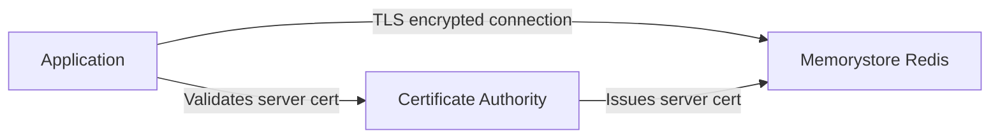

# How to Configure In-Transit Encryption for Memorystore Redis

Author: [nawazdhandala](https://www.github.com/nawazdhandala)

Tags: GCP, Memorystore, Redis, Encryption, TLS, Security

Description: Secure data in transit between your applications and Memorystore Redis by configuring TLS encryption, managing certificates, and updating client connections.

---

Data flowing between your application and Redis is not encrypted by default in Memorystore. If someone gains access to your VPC network - through a compromised VM, a misconfigured firewall rule, or an insider threat - they could sniff the traffic and see your cached data in plain text. In-transit encryption with TLS prevents this by encrypting every byte that travels between your client and the Redis server.

For most internal caching workloads, the VPC itself provides sufficient isolation. But if you are caching sensitive data like authentication tokens, personal information, or financial records, or if your compliance framework requires encryption in transit, you need TLS. In this post, I will show you how to enable it and update your applications to use encrypted connections.

## How In-Transit Encryption Works

When you enable in-transit encryption on a Memorystore Redis instance, the server starts accepting TLS connections on the same port. Memorystore manages the server certificate automatically - you do not need to provision or renew certificates yourself.

The architecture looks like this:



Google manages the Certificate Authority (CA) that signs the server certificate. Your application needs to trust this CA and connect using TLS.

## Enabling In-Transit Encryption

### On a New Instance

Enable TLS when creating the instance:

```bash
# Create a Redis instance with in-transit encryption enabled
gcloud redis instances create secure-redis \
  --size=2 \
  --region=us-central1 \
  --tier=standard \
  --redis-version=redis_7_0 \
  --transit-encryption-mode=SERVER_AUTHENTICATION \
  --enable-auth
```

The `--transit-encryption-mode=SERVER_AUTHENTICATION` flag enables TLS. The server presents its certificate, and clients must verify it.

### On an Existing Instance

You can enable TLS on an already running instance, but be aware this requires a restart:

```bash
# Enable in-transit encryption on an existing instance
# WARNING: This causes a brief period of downtime
gcloud redis instances update my-redis \
  --region=us-central1 \
  --transit-encryption-mode=SERVER_AUTHENTICATION
```

For Standard Tier instances, the update uses the replication mechanism to minimize downtime. The replica is updated first, then a failover occurs. For Basic Tier, there will be a brief outage.

## Downloading the CA Certificate

After enabling TLS, you need the CA certificate to configure your clients. Memorystore provides the certificate through the API:

```bash
# Get the server CA certificates for TLS verification
gcloud redis instances describe secure-redis \
  --region=us-central1 \
  --format="value(serverCaCerts[0].cert)" > /tmp/redis-ca.pem
```

For Kubernetes deployments, store the certificate in a Secret:

```bash
# Store the CA certificate in a Kubernetes secret
gcloud redis instances describe secure-redis \
  --region=us-central1 \
  --format="value(serverCaCerts[0].cert)" | \
kubectl create secret generic redis-tls-ca \
  --from-file=ca.pem=/dev/stdin
```

## Connecting with TLS from Python

Update your Python Redis client to use TLS:

```python
# tls_redis_client.py - Connect to Memorystore Redis with TLS encryption
import os
import ssl
import redis

def create_tls_redis_client():
    """Create a Redis client with TLS encryption enabled."""

    # Path to the CA certificate file
    ca_cert_path = os.environ.get("REDIS_CA_CERT", "/etc/redis-tls/ca.pem")

    # Create an SSL context that verifies the server certificate
    ssl_context = ssl.create_default_context(cafile=ca_cert_path)

    # For Memorystore, we verify the server cert but do not need client certs
    ssl_context.check_hostname = False
    ssl_context.verify_mode = ssl.CERT_REQUIRED

    client = redis.Redis(
        host=os.environ.get("REDIS_HOST", "10.0.0.3"),
        port=int(os.environ.get("REDIS_PORT", "6378")),  # TLS port may differ
        password=os.environ.get("REDIS_AUTH"),
        decode_responses=True,
        ssl=True,
        ssl_ca_certs=ca_cert_path,
        ssl_cert_reqs="required",
        socket_timeout=5,
        retry_on_timeout=True
    )

    # Verify the connection works
    client.ping()
    print("Connected to Redis with TLS encryption")

    return client

# Usage
r = create_tls_redis_client()
r.set("encrypted-key", "this data is encrypted in transit")
print(r.get("encrypted-key"))
```

## Connecting with TLS from Node.js

```javascript
// tls_redis_client.js - Node.js Redis client with TLS
const redis = require("redis");
const fs = require("fs");
const tls = require("tls");

async function createTlsRedisClient() {
    // Read the CA certificate
    const caCert = fs.readFileSync(
        process.env.REDIS_CA_CERT || "/etc/redis-tls/ca.pem"
    );

    const client = redis.createClient({
        socket: {
            host: process.env.REDIS_HOST || "10.0.0.3",
            port: parseInt(process.env.REDIS_PORT || "6378"),
            tls: true,
            // Configure TLS options
            ca: [caCert],
            rejectUnauthorized: true,
            connectTimeout: 5000,
        },
        password: process.env.REDIS_AUTH,
    });

    client.on("error", (err) => console.error("Redis TLS error:", err));

    await client.connect();
    console.log("Connected to Redis with TLS encryption");

    return client;
}

async function main() {
    const client = await createTlsRedisClient();

    await client.set("tls-test", "encrypted in transit");
    const value = await client.get("tls-test");
    console.log("Value:", value);

    await client.disconnect();
}

main().catch(console.error);
```

## Connecting with TLS from Go

```go
// main.go - Go Redis client with TLS encryption
package main

import (
    "context"
    "crypto/tls"
    "crypto/x509"
    "fmt"
    "os"

    "github.com/redis/go-redis/v9"
)

func main() {
    ctx := context.Background()

    // Load the CA certificate
    caCert, err := os.ReadFile(os.Getenv("REDIS_CA_CERT"))
    if err != nil {
        panic(fmt.Sprintf("Failed to read CA cert: %v", err))
    }

    // Create a certificate pool with the CA cert
    caCertPool := x509.NewCertPool()
    if !caCertPool.AppendCertsFromPEM(caCert) {
        panic("Failed to parse CA certificate")
    }

    // Configure TLS
    tlsConfig := &tls.Config{
        RootCAs:            caCertPool,
        InsecureSkipVerify: false,
    }

    // Create the Redis client with TLS
    rdb := redis.NewClient(&redis.Options{
        Addr:      fmt.Sprintf("%s:%s", os.Getenv("REDIS_HOST"), os.Getenv("REDIS_PORT")),
        Password:  os.Getenv("REDIS_AUTH"),
        TLSConfig: tlsConfig,
    })

    // Test the connection
    pong, err := rdb.Ping(ctx).Result()
    if err != nil {
        panic(err)
    }
    fmt.Println("Connected with TLS:", pong)
}
```

## Kubernetes Deployment with TLS

Here is a complete Kubernetes deployment that mounts the CA certificate and connects over TLS:

```yaml
# tls-deployment.yaml - Deployment with TLS-enabled Redis connection
apiVersion: apps/v1
kind: Deployment
metadata:
  name: secure-app
spec:
  replicas: 3
  selector:
    matchLabels:
      app: secure-app
  template:
    metadata:
      labels:
        app: secure-app
    spec:
      containers:
        - name: secure-app
          image: gcr.io/my-project/secure-app:latest
          ports:
            - containerPort: 8080
          env:
            - name: REDIS_HOST
              valueFrom:
                secretKeyRef:
                  name: redis-credentials
                  key: redis-host
            - name: REDIS_PORT
              value: "6378"
            - name: REDIS_AUTH
              valueFrom:
                secretKeyRef:
                  name: redis-credentials
                  key: redis-auth
            # Path to the mounted CA certificate
            - name: REDIS_CA_CERT
              value: "/etc/redis-tls/ca.pem"
          volumeMounts:
            # Mount the TLS CA certificate from the secret
            - name: redis-tls
              mountPath: /etc/redis-tls
              readOnly: true
      volumes:
        - name: redis-tls
          secret:
            secretName: redis-tls-ca
```

## Certificate Rotation

Memorystore handles certificate rotation automatically, but you need to be aware of the process. When a certificate is about to expire, Memorystore generates a new one. During the rotation window, both the old and new certificates are valid.

To check certificate status:

```bash
# Check the server CA certificate details including expiration
gcloud redis instances describe secure-redis \
  --region=us-central1 \
  --format="json(serverCaCerts)"
```

When you see multiple certificates listed, both are valid. Update your clients with the new certificate before the old one expires:

```bash
# Download the latest CA certificates
gcloud redis instances describe secure-redis \
  --region=us-central1 \
  --format="value(serverCaCerts[].cert)" > /tmp/redis-ca-bundle.pem

# Update the Kubernetes secret
kubectl delete secret redis-tls-ca
kubectl create secret generic redis-tls-ca \
  --from-file=ca.pem=/tmp/redis-ca-bundle.pem

# Restart pods to pick up the new certificate
kubectl rollout restart deployment/secure-app
```

## Performance Impact

TLS encryption adds some overhead:

- **Connection establishment:** TLS handshake adds ~1-2ms to the initial connection setup
- **Per-operation latency:** ~0.1-0.5ms additional latency per operation
- **CPU usage:** Both client and server use CPU for encryption/decryption

For most applications, this overhead is negligible. If you are doing millions of operations per second, run benchmarks to verify the impact:

```python
# Benchmark TLS vs non-TLS Redis performance
import time
import redis

def benchmark_redis(client, operations=10000):
    """Time a set of Redis operations."""
    start = time.time()

    for i in range(operations):
        client.set(f"bench:{i}", f"value-{i}")
        client.get(f"bench:{i}")

    elapsed = time.time() - start
    ops_per_sec = (operations * 2) / elapsed  # 2 ops per iteration

    print(f"Completed {operations * 2} operations in {elapsed:.2f}s")
    print(f"Throughput: {ops_per_sec:.0f} ops/sec")
    print(f"Avg latency: {(elapsed / (operations * 2)) * 1000:.2f}ms")
```

## Disabling In-Transit Encryption

If you need to disable TLS (for example, if performance impact is unacceptable):

```bash
# Disable in-transit encryption
gcloud redis instances update secure-redis \
  --region=us-central1 \
  --transit-encryption-mode=DISABLED
```

Update your client connections to remove TLS configuration at the same time.

## Wrapping Up

In-transit encryption for Memorystore Redis is straightforward to enable and adds meaningful security for sensitive data. Google manages the certificates, so there is no PKI infrastructure to maintain. The performance overhead is minimal for most workloads. If you are caching anything that would be a problem if intercepted - session tokens, user data, API keys - enable TLS and sleep better at night.
