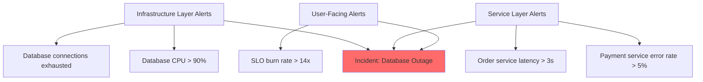

# How to Configure Incident Management Workflows Using Google Cloud Monitoring Incidents

Author: [nawazdhandala](https://www.github.com/nawazdhandala)

Tags: GCP, Incident Management, Google Cloud Monitoring, Alerting, SRE, Operations

Description: A practical guide to configuring incident management workflows in Google Cloud Monitoring, including alert routing, incident grouping, and response automation.

---

When something goes wrong in production, the last thing you want is confusion about who handles what. Google Cloud Monitoring has a built-in incident management system that ties directly into its alerting infrastructure. The incidents feature automatically creates incidents from alerts, groups related alerts together, and gives you a single place to coordinate your response.

In this post, I will walk through how to configure incident management workflows from scratch, including setting up alerting policies, configuring notification channels, grouping related alerts into incidents, and building out a response workflow that your on-call team can actually follow.

## How Incidents Work in Google Cloud Monitoring

An incident in Cloud Monitoring is created automatically when an alerting policy's conditions are met. Each incident tracks the timeline of the issue - when it started, which resources are affected, when it was acknowledged, and when it was resolved. Incidents close automatically when the alerting policy conditions are no longer met, or you can close them manually.

The relationship between alerts and incidents is one-to-many. A single incident can contain multiple alerts if they are related, which cuts down on alert fatigue and gives responders a clearer picture of what is happening.

## Setting Up Alerting Policies

Everything starts with well-configured alerting policies. A good alerting policy should be tied to symptoms (things users experience) rather than causes (things that might be wrong internally).

Here is an example of creating a latency alerting policy using the gcloud CLI:

```bash
# Create an alerting policy for high p99 latency on a Cloud Run service
gcloud alpha monitoring policies create \
  --display-name="High Latency - Payment Service" \
  --condition-display-name="P99 latency > 2s" \
  --condition-filter='resource.type="cloud_run_revision" AND resource.labels.service_name="payment-service" AND metric.type="run.googleapis.com/request_latencies"' \
  --condition-threshold-value=2000 \
  --condition-threshold-comparison=COMPARISON_GT \
  --condition-threshold-duration=300s \
  --condition-threshold-aggregation-alignment-period=60s \
  --condition-threshold-aggregation-per-series-aligner=ALIGN_PERCENTILE_99 \
  --notification-channels=projects/my-project/notificationChannels/my-pagerduty-channel \
  --documentation-content="Runbook: https://wiki.internal/runbooks/payment-latency" \
  --combiner=OR
```

A few things worth noting in this configuration. The duration of 300 seconds means the condition must be true for five consecutive minutes before an incident fires. This prevents flapping. The documentation field is where you put your runbook link - it shows up directly in the incident, so responders do not have to hunt for it.

## Configuring Notification Channels

Notification channels determine how your team gets alerted when incidents are created. Cloud Monitoring supports email, SMS, PagerDuty, Slack, webhooks, Pub/Sub, and mobile push notifications.

Set up multiple channels for different severity levels:

```bash
# Create a PagerDuty notification channel for critical alerts
gcloud alpha monitoring channels create \
  --display-name="PagerDuty - On-Call Team" \
  --type=pagerduty \
  --channel-labels=service_key=YOUR_PAGERDUTY_SERVICE_KEY

# Create a Slack channel for warning-level alerts
gcloud alpha monitoring channels create \
  --display-name="Slack - #ops-alerts" \
  --type=slack \
  --channel-labels=channel_name="#ops-alerts" \
  --channel-labels=auth_token=YOUR_SLACK_TOKEN

# Create a Pub/Sub channel for automation triggers
gcloud alpha monitoring channels create \
  --display-name="Pub/Sub - Alert Automation" \
  --type=pubsub \
  --channel-labels=topic=projects/my-project/topics/alert-notifications
```

The Pub/Sub channel is particularly useful because it lets you trigger automated workflows in response to incidents. More on that later.

## Grouping Related Alerts

One of the biggest problems in incident management is alert fatigue. When a database goes down, you might get alerts for the database health check, increased latency on every service that depends on it, elevated error rates, and failed health checks. That could easily be 20 or 30 separate alerts for one underlying issue.

Cloud Monitoring addresses this by grouping related alerts into a single incident. By default, alerts from the same alerting policy are grouped together. But you can improve grouping by using consistent resource labels and organizing your alerting policies thoughtfully.

Here is a strategy that works well:



Use alerting policy naming conventions that help responders quickly understand what layer of the stack is affected. Prefix your policies with the tier: "Infra - ", "Service - ", or "SLO - ".

## Building the Incident Response Workflow

With alerting and notifications configured, the next step is defining the workflow that happens after an incident is created. Here is a practical workflow using Cloud Monitoring's incident features:

**Step 1: Acknowledge the incident.** When the on-call engineer receives the notification, they open the incident in Cloud Monitoring and acknowledge it. This signals to the rest of the team that someone is looking at it.

**Step 2: Assess the scope.** The incident page shows all related alerts, affected resources, and a timeline. Use this to understand the blast radius before diving into debugging.

**Step 3: Follow the runbook.** The documentation you attached to the alerting policy appears directly in the incident. Click through to the runbook and follow the steps.

**Step 4: Add annotations.** As you investigate, add annotations to the incident with your findings. This creates a timeline that is invaluable for post-incident review.

**Step 5: Resolve or escalate.** If you can fix it, fix it. If not, escalate using the notification channels.

## Automating Incident Workflows with Pub/Sub

For more sophisticated workflows, use the Pub/Sub notification channel to trigger Cloud Functions that automate parts of your incident response:

```python
import base64
import json
import requests
from google.cloud import monitoring_v3

def handle_incident_notification(event, context):
    """Cloud Function triggered by monitoring alert via Pub/Sub."""
    # Decode the Pub/Sub message
    pubsub_message = base64.b64decode(event["data"]).decode("utf-8")
    alert_data = json.loads(pubsub_message)

    incident = alert_data.get("incident", {})
    policy_name = incident.get("policy_name", "")
    state = incident.get("state", "")

    # Only act on new incidents
    if state != "open":
        return

    # Post to a Slack channel with incident details
    slack_message = {
        "text": f"New incident: {incident.get('summary', 'Unknown')}",
        "blocks": [
            {
                "type": "section",
                "text": {
                    "type": "mrkdwn",
                    "text": (
                        f"*Incident Opened*\n"
                        f"Policy: {policy_name}\n"
                        f"Summary: {incident.get('summary', 'N/A')}\n"
                        f"URL: {incident.get('url', 'N/A')}"
                    ),
                },
            }
        ],
    }

    # Send to Slack webhook
    requests.post(
        "https://hooks.slack.com/services/YOUR/SLACK/WEBHOOK",
        json=slack_message,
    )

    # Create a Jira ticket for tracking
    create_jira_ticket(incident)

def create_jira_ticket(incident):
    """Create a Jira ticket for the incident."""
    jira_payload = {
        "fields": {
            "project": {"key": "OPS"},
            "summary": f"Incident: {incident.get('summary', 'Unknown')}",
            "description": f"Incident URL: {incident.get('url', 'N/A')}",
            "issuetype": {"name": "Bug"},
            "priority": {"name": "High"},
        }
    }
    # Post to Jira API
    requests.post(
        "https://your-org.atlassian.net/rest/api/2/issue",
        json=jira_payload,
        auth=("email@company.com", "JIRA_API_TOKEN"),
    )
```

## Using Incident Severity Levels

Not every incident deserves the same level of response. Define severity levels that map to your alerting policies:

- **P1 (Critical)**: User-facing outage, SLO breach imminent. Pages the on-call immediately.
- **P2 (High)**: Degraded performance, error rates elevated. Notifies on-call via Slack.
- **P3 (Medium)**: Non-urgent issues detected. Creates a ticket for the next business day.
- **P4 (Low)**: Informational alerts. Logged for trend analysis.

Map these severity levels to different notification channels in your alerting policies. Critical alerts go to PagerDuty, high alerts go to Slack, and medium/low alerts create tickets automatically through the Pub/Sub automation.

## Post-Incident Review

After an incident is resolved, Cloud Monitoring retains the full incident timeline including all annotations, alert state changes, and acknowledgments. Use this data for your post-incident review. Export the incident data to BigQuery for long-term trend analysis - track metrics like how many incidents per week, average time to acknowledge, and average time to resolve.

## Summary

Configuring incident management workflows in Google Cloud Monitoring is about connecting the dots between alerting policies, notification channels, and response procedures. Start with symptom-based alerts, group related alerts to reduce noise, attach runbooks to every alerting policy, and automate repetitive response steps using Pub/Sub and Cloud Functions. The goal is a workflow where your on-call team spends their energy solving problems instead of figuring out what the problem is.
