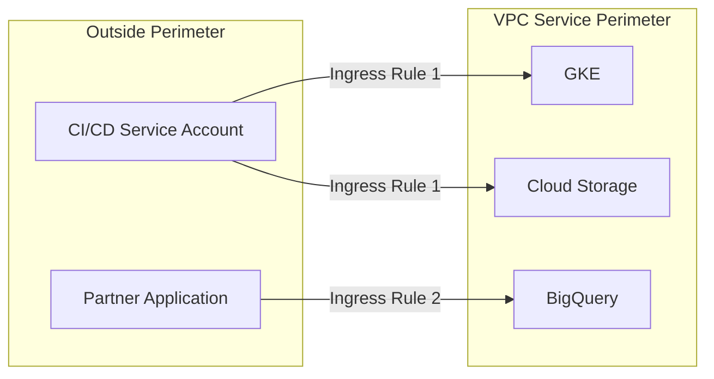

# How to Configure Ingress Rules for VPC Service Controls Perimeters

Author: [nawazdhandala](https://www.github.com/nawazdhandala)

Tags: GCP, VPC Service Controls, Ingress Rules, Security Perimeter, Access Control

Description: Learn how to configure ingress rules for VPC Service Controls perimeters to allow controlled access from outside the perimeter boundary to resources inside.

---

VPC Service Controls perimeters block all API access from outside the boundary by default. That is the whole point - keeping data safe inside the perimeter. But in practice, you need controlled exceptions. CI/CD pipelines need to deploy to projects inside the perimeter. Partner services need to read specific data. Monitoring tools need to access metrics.

Ingress rules are how you poke precise holes in the perimeter for these legitimate use cases. Unlike access levels (which grant broad access based on IP or device), ingress rules let you specify exactly which identity can access which service using which method.

Let me show you how to set them up.

## How Ingress Rules Work

An ingress rule has two parts:

1. **From**: Who is making the request (identity and source)
2. **To**: What they can access (project, service, and method)



## Prerequisites

- An existing VPC Service Controls perimeter
- The `roles/accesscontextmanager.policyAdmin` role
- Knowledge of the identities and services that need ingress access

## Step 1: Understand the Ingress Rule Structure

An ingress rule is defined in YAML with this structure:

```yaml
- ingressFrom:
    identityType: ANY_IDENTITY | ANY_USER_ACCOUNT | ANY_SERVICE_ACCOUNT
    # OR specific identities:
    identities:
      - serviceAccount:my-sa@external-project.iam.gserviceaccount.com
      - user:admin@example.com
    sources:
      - accessLevel: accessPolicies/POLICY_ID/accessLevels/LEVEL_NAME
      # OR
      - resource: projects/EXTERNAL_PROJECT_NUMBER
  ingressTo:
    operations:
      - serviceName: storage.googleapis.com
        methodSelectors:
          - method: google.storage.objects.get
          - method: google.storage.objects.list
      - serviceName: bigquery.googleapis.com
        methodSelectors:
          - method: "*"
    resources:
      - projects/INTERNAL_PROJECT_NUMBER
```

## Step 2: Create an Ingress Rule for a CI/CD Pipeline

This is the most common use case. Your Cloud Build or external CI/CD runs outside the perimeter and needs to deploy to projects inside.

Create a file called `ingress-policy.yaml`:

```yaml
# ingress-policy.yaml - Allow CI/CD to deploy inside the perimeter
- ingressFrom:
    identities:
      - serviceAccount:cicd-deployer@external-cicd-project.iam.gserviceaccount.com
    sources:
      - resource: projects/CICD_PROJECT_NUMBER
  ingressTo:
    operations:
      - serviceName: container.googleapis.com
        methodSelectors:
          - method: "*"
      - serviceName: storage.googleapis.com
        methodSelectors:
          - method: google.storage.objects.create
          - method: google.storage.objects.get
    resources:
      - projects/INTERNAL_PROJECT_NUMBER
```

Apply the ingress rules to your perimeter:

```bash
# Apply ingress rules to the perimeter
gcloud access-context-manager perimeters update my-perimeter \
  --set-ingress-policies=ingress-policy.yaml \
  --policy=$ACCESS_POLICY_ID
```

## Step 3: Create an Ingress Rule for Partner Data Access

Allow a partner to query specific BigQuery datasets.

```yaml
# partner-ingress.yaml - Allow partner to read from BigQuery
- ingressFrom:
    identities:
      - serviceAccount:partner-reader@partner-project.iam.gserviceaccount.com
    sources:
      - resource: projects/PARTNER_PROJECT_NUMBER
  ingressTo:
    operations:
      - serviceName: bigquery.googleapis.com
        methodSelectors:
          - method: google.cloud.bigquery.v2.JobService.InsertJob
          - method: google.cloud.bigquery.v2.JobService.GetQueryResults
          - method: google.cloud.bigquery.v2.TableService.GetTable
    resources:
      - projects/DATA_PROJECT_NUMBER
```

## Step 4: Create an Ingress Rule with Access Level Source

Instead of specifying a project as the source, you can use an access level (like a corporate IP range).

```yaml
# console-ingress.yaml - Allow access from corporate network
- ingressFrom:
    identityType: ANY_IDENTITY
    sources:
      - accessLevel: accessPolicies/POLICY_ID/accessLevels/corporate-network
  ingressTo:
    operations:
      - serviceName: "*"
        methodSelectors:
          - method: "*"
    resources:
      - "*"
```

This allows any authenticated identity coming from your corporate network to access any service in the perimeter. It is broad, but often needed for Console access.

## Step 5: Combine Multiple Ingress Rules

You can have multiple ingress rules in a single file.

```yaml
# combined-ingress.yaml

# Rule 1: CI/CD pipeline access
- ingressFrom:
    identities:
      - serviceAccount:cicd@build-project.iam.gserviceaccount.com
    sources:
      - resource: projects/BUILD_PROJECT_NUMBER
  ingressTo:
    operations:
      - serviceName: container.googleapis.com
        methodSelectors:
          - method: "*"
    resources:
      - projects/PROD_PROJECT_NUMBER

# Rule 2: Monitoring access
- ingressFrom:
    identities:
      - serviceAccount:monitoring@ops-project.iam.gserviceaccount.com
    sources:
      - resource: projects/OPS_PROJECT_NUMBER
  ingressTo:
    operations:
      - serviceName: monitoring.googleapis.com
        methodSelectors:
          - method: "*"
      - serviceName: logging.googleapis.com
        methodSelectors:
          - method: google.logging.v2.LoggingServiceV2.ListLogEntries
    resources:
      - projects/PROD_PROJECT_NUMBER

# Rule 3: Developer Console access from office
- ingressFrom:
    identityType: ANY_USER_ACCOUNT
    sources:
      - accessLevel: accessPolicies/POLICY_ID/accessLevels/corporate-network
  ingressTo:
    operations:
      - serviceName: "*"
        methodSelectors:
          - method: "*"
    resources:
      - "*"
```

```bash
# Apply all ingress rules
gcloud access-context-manager perimeters update my-perimeter \
  --set-ingress-policies=combined-ingress.yaml \
  --policy=$ACCESS_POLICY_ID
```

## Step 6: Test Ingress Rules in Dry-Run

Before applying to the enforced perimeter, test with dry-run.

```bash
# Apply ingress rules to dry-run configuration only
gcloud access-context-manager perimeters dry-run update my-perimeter \
  --set-ingress-policies=combined-ingress.yaml \
  --policy=$ACCESS_POLICY_ID
```

Then check the audit logs for dry-run violations to verify the rules work as expected.

```bash
# Check for dry-run violations
gcloud logging read \
  'protoPayload.metadata.@type="type.googleapis.com/google.cloud.audit.VpcServiceControlAuditMetadata" AND protoPayload.metadata.dryRun=true AND protoPayload.metadata.violationReason="RESOURCES_NOT_IN_SAME_SERVICE_PERIMETER"' \
  --limit=20 \
  --format="table(timestamp, protoPayload.authenticationInfo.principalEmail, protoPayload.methodName)" \
  --project=my-project-id
```

## Step 7: Update Existing Ingress Rules

To add a new rule without replacing existing ones, first export the current config.

```bash
# Export current perimeter config
gcloud access-context-manager perimeters describe my-perimeter \
  --policy=$ACCESS_POLICY_ID \
  --format=json > perimeter-config.json
```

Edit the ingress policies in the exported config, then apply the updated set.

## Common Method Selectors

Here are useful method selectors for common services:

**Cloud Storage:**
- `google.storage.objects.get` - Read objects
- `google.storage.objects.list` - List objects
- `google.storage.objects.create` - Upload objects
- `google.storage.buckets.get` - Get bucket metadata

**BigQuery:**
- `google.cloud.bigquery.v2.JobService.InsertJob` - Run queries
- `google.cloud.bigquery.v2.JobService.GetQueryResults` - Get query results
- `google.cloud.bigquery.v2.TableService.GetTable` - Get table metadata
- `google.cloud.bigquery.v2.DatasetService.GetDataset` - Get dataset metadata

**GKE:**
- Use `"*"` for the method selector since GKE operations involve many different methods

## Troubleshooting

If an ingress rule is not working:

1. Check that the source project number is correct (not the project ID)
2. Verify the service account email is exact
3. Make sure the method selectors cover the operations being attempted
4. Check audit logs for the specific violation reason

```bash
# Look for VPC SC violations from a specific identity
gcloud logging read \
  'protoPayload.metadata.@type="type.googleapis.com/google.cloud.audit.VpcServiceControlAuditMetadata" AND protoPayload.authenticationInfo.principalEmail="cicd@build-project.iam.gserviceaccount.com"' \
  --limit=10 \
  --format=json \
  --project=my-project-id
```

## Conclusion

Ingress rules give you fine-grained control over who can reach into your VPC Service Controls perimeter. The key principles are: be specific about identities and methods, test with dry-run before enforcing, and regularly audit your rules to remove ones that are no longer needed. A well-configured set of ingress rules lets legitimate traffic through while keeping the security boundary tight.
