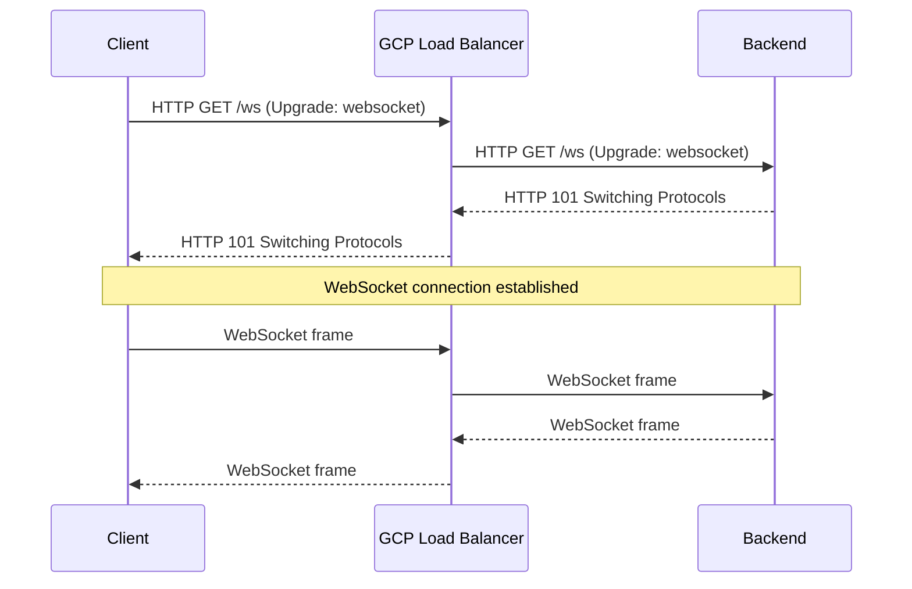

# How to Configure Load Balancing for WebSocket Applications on Google Cloud

Author: [nawazdhandala](https://www.github.com/nawazdhandala)

Tags: GCP, WebSocket, Load Balancer, Real-Time Applications, Google Cloud Networking

Description: A comprehensive guide to configuring Google Cloud Load Balancer for WebSocket applications, covering connection timeouts, session affinity, and backend configuration.

---

WebSocket applications need special consideration when sitting behind a load balancer. Unlike regular HTTP requests that complete in milliseconds, WebSocket connections persist for minutes or hours. A load balancer misconfigured for short-lived HTTP traffic will kill your WebSocket connections unexpectedly, frustrating users of your real-time chat, gaming, or live dashboard application.

Google Cloud Application Load Balancer supports WebSocket connections natively through its HTTP(S) load balancer, but you need to tune several settings to make it work well. This guide covers everything from timeout configuration to session affinity.

## How WebSocket Works with GCP Load Balancer

The GCP Application Load Balancer handles WebSocket connections via the HTTP Upgrade mechanism. The client sends an HTTP request with `Connection: Upgrade` and `Upgrade: websocket` headers. The load balancer forwards this to the backend, and when the backend responds with HTTP 101 Switching Protocols, the connection is upgraded to a persistent WebSocket connection.



The important thing to understand is that GCP does not do any WebSocket-specific processing. Once the connection upgrades, the load balancer acts as a transparent TCP proxy for that connection. This means WebSocket traffic works out of the box, but you need to handle timeouts and routing carefully.

## Step 1: Configure Backend Timeout

The most critical setting for WebSocket is the backend service timeout. By default, this is 30 seconds - far too short for persistent connections. You need to increase it to match the maximum expected lifetime of your WebSocket connections:

```bash
# Set the backend service timeout to 3600 seconds (1 hour)
# WebSocket connections that are idle for longer than this will be terminated
gcloud compute backend-services update ws-backend-service \
    --timeout=3600s \
    --global
```

This timeout applies to idle connections. If there is no data flowing in either direction for 3600 seconds, the load balancer closes the connection. Active connections with regular traffic are not affected.

For applications where connections can be idle for long periods (like monitoring dashboards), set this even higher or implement application-level keepalive pings.

## Step 2: Implement Application-Level Keepalive

Even with a long timeout, relying solely on the load balancer timeout is risky. Implement keepalive pings in your WebSocket application to ensure connections stay active:

```javascript
// Server-side WebSocket keepalive implementation using ws library
const WebSocket = require('ws');
const wss = new WebSocket.Server({ port: 8080 });

wss.on('connection', (ws) => {
  // Track whether the client is still alive
  ws.isAlive = true;

  ws.on('pong', () => {
    // Client responded to our ping, mark as alive
    ws.isAlive = true;
  });

  ws.on('message', (data) => {
    // Handle incoming messages
    console.log('Received:', data.toString());
  });
});

// Ping all connected clients every 30 seconds
// This keeps connections alive through the load balancer
const keepaliveInterval = setInterval(() => {
  wss.clients.forEach((ws) => {
    if (!ws.isAlive) {
      // Client did not respond to last ping, terminate connection
      return ws.terminate();
    }
    ws.isAlive = false;
    ws.ping();
  });
}, 30000);

wss.on('close', () => {
  clearInterval(keepaliveInterval);
});
```

## Step 3: Configure Session Affinity

WebSocket applications often maintain state on the backend server. When a client's WebSocket connection drops and they reconnect, you want them to reach the same backend so they can resume their session. Session affinity handles this:

```bash
# Enable client IP-based session affinity
# Ensures reconnecting clients reach the same backend
gcloud compute backend-services update ws-backend-service \
    --session-affinity=CLIENT_IP \
    --global
```

For more granular control, use cookie-based affinity which survives NAT changes:

```bash
# Enable generated cookie-based session affinity
# The load balancer sets a cookie that routes the client to the same backend
gcloud compute backend-services update ws-backend-service \
    --session-affinity=GENERATED_COOKIE \
    --affinity-cookie-ttl=3600 \
    --global
```

The cookie is set on the initial HTTP request before the WebSocket upgrade, so subsequent reconnection attempts include the cookie and route to the same backend.

## Step 4: Set Up the Health Check

Health checks for WebSocket backends should verify that the WebSocket server is running, not just that an HTTP server is responding:

```bash
# Create a health check that hits the WebSocket server's health endpoint
# Most WebSocket servers expose a regular HTTP health endpoint alongside WebSocket
gcloud compute health-checks create http ws-health-check \
    --port=8080 \
    --request-path="/health" \
    --check-interval=10s \
    --timeout=5s \
    --healthy-threshold=2 \
    --unhealthy-threshold=3
```

Make sure your WebSocket server has a regular HTTP health endpoint. Here is a common pattern:

```javascript
// Express server that handles both HTTP health checks and WebSocket connections
const express = require('express');
const http = require('http');
const WebSocket = require('ws');

const app = express();
const server = http.createServer(app);
const wss = new WebSocket.Server({ server, path: '/ws' });

// Health endpoint for the load balancer health check
app.get('/health', (req, res) => {
  const connectionCount = wss.clients.size;
  res.json({
    status: 'ok',
    connections: connectionCount,
    uptime: process.uptime()
  });
});

wss.on('connection', (ws) => {
  console.log('New WebSocket connection');
  // Handle WebSocket logic
});

server.listen(8080);
```

## Step 5: Configure Connection Draining

When scaling down or during deployments, you need to gracefully handle existing WebSocket connections:

```bash
# Set connection draining timeout to 3600 seconds
# This gives WebSocket connections time to complete during backend removal
gcloud compute backend-services update ws-backend-service \
    --connection-draining-timeout=3600 \
    --global
```

For rolling deployments, this means existing WebSocket connections get up to an hour to naturally disconnect while new connections route to updated backends.

## Complete Load Balancer Setup

Here is the full setup from scratch:

```bash
# 1. Create a health check for WebSocket backends
gcloud compute health-checks create http ws-health-check \
    --port=8080 \
    --request-path="/health" \
    --check-interval=10s

# 2. Create the backend service with WebSocket-appropriate settings
gcloud compute backend-services create ws-backend-service \
    --protocol=HTTP \
    --health-checks=ws-health-check \
    --timeout=3600s \
    --connection-draining-timeout=3600 \
    --session-affinity=CLIENT_IP \
    --global

# 3. Add your instance group as a backend
gcloud compute backend-services add-backend ws-backend-service \
    --instance-group=ws-instance-group \
    --instance-group-zone=us-central1-a \
    --global

# 4. Create a URL map
gcloud compute url-maps create ws-url-map \
    --default-service=ws-backend-service

# 5. Create a target HTTPS proxy (WebSocket over TLS is recommended)
gcloud compute target-https-proxies create ws-proxy \
    --url-map=ws-url-map \
    --ssl-certificates=my-ssl-cert

# 6. Create the forwarding rule
gcloud compute forwarding-rules create ws-forwarding-rule \
    --load-balancing-scheme=EXTERNAL_MANAGED \
    --target-https-proxy=ws-proxy \
    --ports=443 \
    --global
```

## Terraform Configuration

```hcl
# Backend service configured for WebSocket connections
resource "google_compute_backend_service" "websocket" {
  name                  = "ws-backend-service"
  protocol              = "HTTP"
  timeout_sec           = 3600  # 1 hour idle timeout for WebSocket
  session_affinity      = "CLIENT_IP"
  connection_draining_timeout_sec = 3600

  health_checks = [google_compute_health_check.ws.id]

  backend {
    group = google_compute_instance_group_manager.ws.instance_group
  }
}

# Health check for WebSocket server
resource "google_compute_health_check" "ws" {
  name               = "ws-health-check"
  check_interval_sec = 10
  timeout_sec        = 5

  http_health_check {
    port         = 8080
    request_path = "/health"
  }
}
```

## Scaling Considerations

WebSocket connections consume resources differently than HTTP requests. Each persistent connection holds a backend slot open. Plan your instance group sizing accordingly:

```bash
# Configure autoscaling based on connection count rather than CPU
# Each WebSocket connection uses minimal CPU but holds a connection slot
gcloud compute instance-groups managed set-autoscaling ws-instance-group \
    --zone=us-central1-a \
    --max-num-replicas=20 \
    --min-num-replicas=2 \
    --target-load-balancing-utilization=0.6 \
    --cool-down-period=300
```

A load balancing utilization target of 0.6 means the autoscaler adds instances when backends reach 60% of their connection capacity. This gives headroom for connection spikes without over-provisioning.

## Debugging WebSocket Issues

When WebSocket connections drop unexpectedly, check these areas:

1. **Load balancer logs** - Look for `statusDetails` field showing `backend_timeout` or `client_disconnected`.
2. **Backend logs** - Check if the WebSocket server itself is closing connections.
3. **Network tier** - Make sure you are using the Premium network tier for consistent WebSocket performance.

```bash
# Query load balancer logs for WebSocket-related errors
gcloud logging read 'resource.type="http_load_balancer" AND httpRequest.requestUrl:"ws"' \
    --limit=20 \
    --format="table(timestamp, httpRequest.status, jsonPayload.statusDetails)"
```

## Summary

The key to running WebSocket applications behind Google Cloud Load Balancer comes down to three things: increase the backend timeout well beyond the default 30 seconds, implement application-level keepalive pings, and enable session affinity so reconnecting clients reach the same backend. Get these right and your real-time application will run smoothly behind the load balancer with all the benefits of managed load balancing - health checks, autoscaling, and SSL termination.
