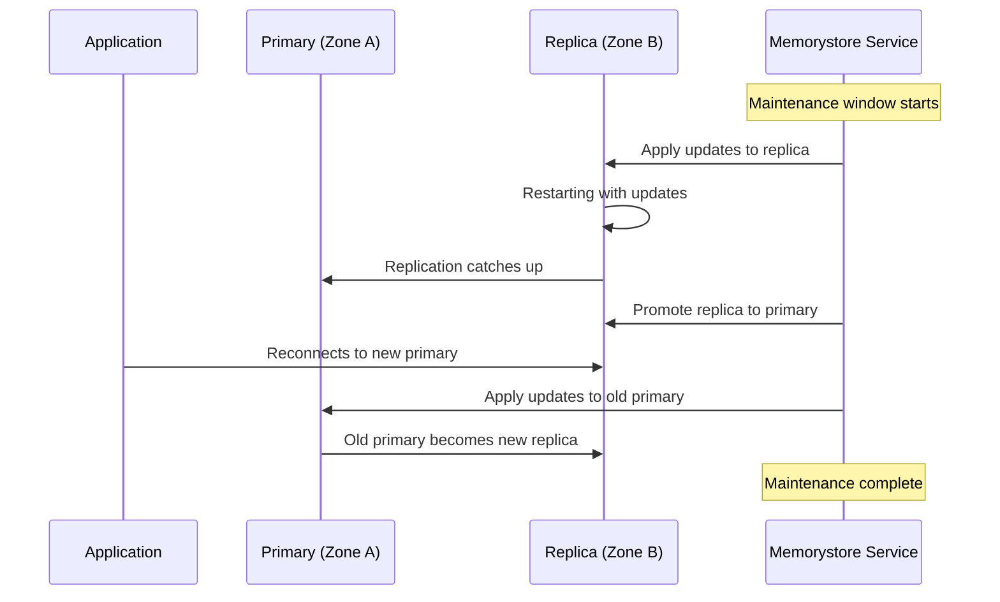

# How to Configure Maintenance Windows for Memorystore Redis Instances

Author: [nawazdhandala](https://www.github.com/nawazdhandala)

Tags: GCP, Memorystore, Redis, Maintenance, Operations

Description: Configure maintenance windows for your Memorystore Redis instances to control when Google applies updates, patches, and infrastructure changes with minimal impact.

---

Google periodically needs to perform maintenance on Memorystore Redis instances - patching the underlying operating system, updating Redis versions, replacing hardware, and applying security fixes. By default, these maintenance events can happen at any time, which means they might hit during your peak traffic hours. Configuring a maintenance window gives you control over when these updates occur.

I configure maintenance windows on every production Redis instance I manage. It takes two minutes and prevents the awkward situation where Redis gets patched during your busiest hour. In this post, I will show you how to set up maintenance windows, understand what happens during maintenance, and plan around it.

## What Happens During Maintenance

During a maintenance event, Memorystore applies updates to your Redis instance. The impact depends on your tier:

**Basic Tier:** The instance goes offline briefly while the update is applied. Expect a few minutes of downtime. All connections are dropped and data in memory may be lost.

**Standard Tier:** Memorystore uses the replication mechanism to minimize downtime. The replica is updated first, then a failover switches traffic to the updated replica, and then the old primary is updated. Impact is similar to a failover - typically under 30 seconds of connection interruption.



## Setting a Maintenance Window

Configure when maintenance can occur using the day of the week and hour:

```bash
# Set the maintenance window to Sunday at 3 AM UTC
gcloud redis instances update my-redis \
  --region=us-central1 \
  --maintenance-window-day=SUNDAY \
  --maintenance-window-hour=3
```

The available days are: `MONDAY`, `TUESDAY`, `WEDNESDAY`, `THURSDAY`, `FRIDAY`, `SATURDAY`, `SUNDAY`.

The hour is specified in UTC (0-23). Choose a time that corresponds to your lowest traffic period.

### Setting Maintenance Window at Creation Time

You can also set the maintenance window when creating the instance:

```bash
# Create a Redis instance with a maintenance window already configured
gcloud redis instances create production-cache \
  --size=5 \
  --region=us-central1 \
  --tier=standard \
  --redis-version=redis_7_0 \
  --enable-auth \
  --maintenance-window-day=SUNDAY \
  --maintenance-window-hour=3 \
  --display-name="Production Cache"
```

## Choosing the Right Window

Pick your maintenance window based on your traffic patterns. Here is how I approach it:

**Step 1: Analyze your traffic patterns.**

```bash
# Query Cloud Monitoring for your Redis operations by hour of day
# Look for the period with the lowest ops/sec
gcloud monitoring time-series list \
  --filter='resource.type="redis_instance" AND metric.type="redis.googleapis.com/stats/calls"' \
  --interval-end-time=2026-02-17T00:00:00Z \
  --interval-start-time=2026-02-10T00:00:00Z
```

**Step 2: Convert your low-traffic period to UTC.** If your lowest traffic is Sunday 2-5 AM Eastern (US), that is Sunday 7-10 AM UTC.

**Step 3: Set the window to the beginning of your low-traffic period.** Maintenance events typically complete within 1 hour.

### Common Window Choices

| Business Type | Low Traffic Period | Maintenance Window (UTC) |
|--------------|-------------------|-------------------------|
| US B2B SaaS | Sunday 3 AM ET | Sunday 8:00 |
| European E-commerce | Sunday 4 AM CET | Sunday 3:00 |
| Global 24/7 Service | (varies) | Sunday 6:00 UTC |
| Asia-Pacific | Sunday 3 AM JST | Saturday 18:00 |

## Viewing Current Maintenance Configuration

Check your instance's current maintenance settings:

```bash
# View the current maintenance window configuration
gcloud redis instances describe my-redis \
  --region=us-central1 \
  --format="table(name,maintenancePolicy.weeklyMaintenanceWindow[].day,maintenancePolicy.weeklyMaintenanceWindow[].startTime.hours)"
```

## Checking Upcoming Maintenance

Google notifies you of upcoming maintenance events. Check for scheduled maintenance:

```bash
# List upcoming maintenance events for all Redis instances
gcloud redis instances list \
  --region=us-central1 \
  --format="table(name,maintenanceSchedule.startTime,maintenanceSchedule.endTime)"
```

You can also check in the Cloud Console under Memorystore > Redis > instance details > Maintenance tab.

## Preparing for Maintenance

Even with a maintenance window configured, prepare your application for the event:

### Application-Level Preparation

Make sure your application code handles Redis disconnections:

```python
# maintenance_ready_client.py - Redis client prepared for maintenance events
import redis
import time
import logging

logging.basicConfig(level=logging.INFO)
logger = logging.getLogger("redis-client")

class MaintenanceReadyRedisClient:
    """Redis client that handles maintenance-related disconnections."""

    def __init__(self, host, port, password=None):
        self.host = host
        self.port = port
        self.password = password
        self.client = self._create_client()

    def _create_client(self):
        """Create a Redis client with maintenance-friendly settings."""
        return redis.Redis(
            host=self.host,
            port=self.port,
            password=self.password,
            decode_responses=True,
            # Short socket timeout to detect disconnections quickly
            socket_timeout=5,
            socket_connect_timeout=5,
            # Enable TCP keepalive to detect dead connections
            socket_keepalive=True,
            # Automatically retry on timeout
            retry_on_timeout=True,
            # Check connection health periodically
            health_check_interval=15
        )

    def execute_with_fallback(self, operation, fallback_value=None):
        """Execute a Redis operation with graceful fallback on failure."""
        max_retries = 3

        for attempt in range(max_retries):
            try:
                return operation(self.client)
            except (redis.ConnectionError, redis.TimeoutError) as e:
                logger.warning(
                    f"Redis operation failed (attempt {attempt + 1}/{max_retries}): {e}"
                )
                if attempt < max_retries - 1:
                    # Wait with exponential backoff
                    wait_time = 2 ** attempt
                    logger.info(f"Retrying in {wait_time} seconds...")
                    time.sleep(wait_time)
                    # Recreate the client in case the connection pool is stale
                    self.client = self._create_client()
                else:
                    logger.error("All retry attempts failed, using fallback value")
                    return fallback_value

    def get(self, key, fallback=None):
        """Get a value with fallback."""
        return self.execute_with_fallback(
            lambda c: c.get(key),
            fallback_value=fallback
        )

    def set(self, key, value, ttl=3600):
        """Set a value, silently failing during maintenance."""
        return self.execute_with_fallback(
            lambda c: c.set(key, value, ex=ttl),
            fallback_value=False
        )

# Usage
cache = MaintenanceReadyRedisClient(
    host="10.0.0.3",
    port=6379,
    password="auth-string"
)

# These operations gracefully handle maintenance windows
user = cache.get("user:1001", fallback=None)
cache.set("user:1001", "Alice")
```

### Pre-Maintenance Checklist

Before a scheduled maintenance window:

1. **Verify your application has retry logic** - Redis connections will drop during maintenance
2. **Check your monitoring alerts are active** - You want to know if something goes wrong
3. **Review recent changes** - Avoid deploying application changes during the maintenance window
4. **Warm up the cache after maintenance** - For Basic Tier, data is lost. Consider pre-warming critical cache entries

### Post-Maintenance Validation

After maintenance completes:

```bash
# Verify the Redis instance is back online
gcloud redis instances describe my-redis \
  --region=us-central1 \
  --format="value(state)"

# Check connectivity
redis-cli -h REDIS_IP -a AUTH_STRING PING

# Verify Redis version (may have been updated)
redis-cli -h REDIS_IP -a AUTH_STRING INFO server | grep redis_version

# Check connected clients recovered
redis-cli -h REDIS_IP -a AUTH_STRING INFO clients | grep connected_clients
```

## Removing a Maintenance Window

If you want to remove the maintenance window configuration (allowing maintenance at any time):

```bash
# Remove the maintenance window - maintenance can happen at any time
gcloud redis instances update my-redis \
  --region=us-central1 \
  --clear-maintenance-policy
```

I do not recommend this for production instances. It is better to have a window configured even if the timing is not perfect.

## Multiple Instances with Coordinated Windows

If you have multiple Redis instances, stagger their maintenance windows so they are not all maintained simultaneously:

```bash
# Instance 1: maintenance on Sunday at 2 AM UTC
gcloud redis instances update redis-sessions \
  --region=us-central1 \
  --maintenance-window-day=SUNDAY \
  --maintenance-window-hour=2

# Instance 2: maintenance on Sunday at 4 AM UTC
gcloud redis instances update redis-cache \
  --region=us-central1 \
  --maintenance-window-day=SUNDAY \
  --maintenance-window-hour=4

# Instance 3: maintenance on Sunday at 6 AM UTC
gcloud redis instances update redis-queue \
  --region=us-central1 \
  --maintenance-window-day=SUNDAY \
  --maintenance-window-hour=6
```

This ensures that not all caching layers are disrupted at the same time.

## Wrapping Up

Maintenance windows are a simple configuration that makes a real difference for production Redis instances. Set the window to your lowest traffic period, prepare your applications to handle brief disconnections, and verify everything works after maintenance completes. It takes less effort to configure than to explain to your team why Redis was patched during peak hours.
