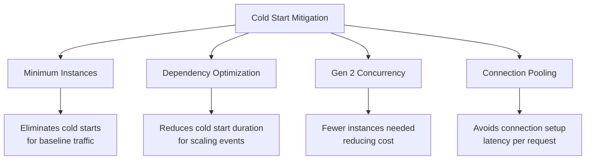

# How to Configure Minimum Instances for Cloud Functions to Eliminate Cold Starts

Author: [nawazdhandala](https://www.github.com/nawazdhandala)

Tags: GCP, Cloud Functions, Cold Start, Performance, Serverless

Description: Learn how to configure minimum instances in Google Cloud Functions to keep warm instances ready and eliminate cold start latency for latency-sensitive workloads.

---

Cold starts are the biggest complaint people have about serverless functions. When no instances are running and a request arrives, Google Cloud needs to spin up a new container, load your code, initialize dependencies, and then handle the request. This can add anywhere from 500 milliseconds to several seconds of latency depending on your runtime and dependencies. For user-facing APIs or real-time processing, that is not acceptable.

The minimum instances feature solves this by keeping a configurable number of function instances warm and ready to serve requests at all times. Let me walk you through how to set it up, what it costs, and when it makes sense.

## How Minimum Instances Work

When you configure minimum instances, Google Cloud keeps that many function instances running even when there is no traffic. These idle instances:

- Have already loaded your runtime and dependencies
- Have executed your global/module-level initialization code
- Are ready to handle requests immediately with no cold start
- Continue to scale beyond the minimum when traffic increases

Think of it like keeping a restaurant kitchen staffed even during slow hours. You pay for the staff whether they are cooking or not, but when an order comes in, it goes out fast.

## Configuring Minimum Instances

### Gen 2 Functions (Recommended)

For Gen 2 functions, set the `--min-instances` flag during deployment:

```bash
# Deploy with 2 minimum instances always warm
gcloud functions deploy my-api \
  --gen2 \
  --runtime=nodejs20 \
  --region=us-central1 \
  --source=. \
  --entry-point=handleRequest \
  --trigger-http \
  --allow-unauthenticated \
  --memory=512Mi \
  --min-instances=2 \
  --max-instances=100
```

You can also update an existing function without redeploying the code:

```bash
# Update minimum instances on an existing Gen 2 function
gcloud functions deploy my-api \
  --gen2 \
  --region=us-central1 \
  --min-instances=3 \
  --update-no-code
```

Since Gen 2 functions run on Cloud Run under the hood, you can also configure this through the Cloud Run service directly:

```bash
# Configure via Cloud Run (same effect for Gen 2 functions)
gcloud run services update my-api \
  --region=us-central1 \
  --min-instances=2
```

### Gen 1 Functions

Gen 1 also supports minimum instances, though the syntax is slightly different:

```bash
# Deploy Gen 1 function with minimum instances
gcloud functions deploy my-api \
  --runtime=nodejs20 \
  --region=us-central1 \
  --source=. \
  --entry-point=handleRequest \
  --trigger-http \
  --min-instances=1
```

## How Many Minimum Instances Do You Need?

This depends on your traffic pattern and latency requirements. Here is a practical approach to figuring out the right number.

### Analyze Your Traffic Pattern

Look at your function's concurrent execution over time:

```bash
# Check the maximum concurrent executions over the past week
gcloud monitoring metrics list \
  --filter="metric.type=cloudfunctions.googleapis.com/function/active_instances"
```

What you are looking for is your baseline traffic - the minimum number of concurrent requests at any given time. If your function always has at least 5 concurrent requests during business hours but drops to 0 at night, you might set minimum instances to 3-5.

### Consider Gen 2 Concurrency

Gen 2 functions support concurrent request handling on a single instance. If your function can handle 10 concurrent requests per instance and your baseline traffic is 20 requests per second, you might only need 2 minimum instances instead of 20.

```bash
# Deploy with concurrency and minimum instances
gcloud functions deploy my-api \
  --gen2 \
  --runtime=nodejs20 \
  --region=us-central1 \
  --source=. \
  --entry-point=handleRequest \
  --trigger-http \
  --concurrency=80 \
  --min-instances=2 \
  --max-instances=50 \
  --memory=1Gi \
  --cpu=1
```

This configuration keeps 2 instances warm, each capable of handling 80 concurrent requests, giving you warm capacity for 160 concurrent requests.

## Understanding the Cost

Minimum instances are not free. You pay for idle instance time at a reduced rate. Let me break down the costs.

For Gen 2 functions, idle instances are billed at the Cloud Run idle pricing:
- CPU: Billed only when processing requests (not when idle) if you use CPU allocation = "request"
- Memory: Billed at the idle rate even when not processing requests

Here is the key insight: set CPU allocation to "request only" for minimum instances to minimize costs:

```bash
# Use "request" CPU allocation to avoid paying for idle CPU
gcloud functions deploy my-api \
  --gen2 \
  --runtime=nodejs20 \
  --region=us-central1 \
  --source=. \
  --entry-point=handleRequest \
  --trigger-http \
  --min-instances=2 \
  --cpu-throttling
```

With this setting, idle instances only cost you for memory (roughly $0.00000250 per GB-second). A 512MB instance idle for 24 hours costs about $0.11 per day. That is roughly $3.30 per month per idle instance.

## Combining with Other Optimization Strategies

Minimum instances work best as part of a broader cold start mitigation strategy:



Even with minimum instances, traffic spikes will still cause new instances to spin up. Those new instances will still experience cold starts. So you should still optimize your dependency loading and initialization code to make those remaining cold starts as fast as possible.

## Setting Up with Terraform

If you manage your infrastructure with Terraform, here is how to configure minimum instances:

```hcl
# Terraform configuration for Cloud Function Gen 2 with minimum instances
resource "google_cloudfunctions2_function" "api" {
  name     = "my-api"
  location = "us-central1"

  build_config {
    runtime     = "nodejs20"
    entry_point = "handleRequest"
    source {
      storage_source {
        bucket = google_storage_bucket.source.name
        object = google_storage_bucket_object.source.name
      }
    }
  }

  service_config {
    # Keep 2 instances warm at all times
    min_instance_count = 2
    max_instance_count = 100

    # Memory and CPU allocation
    available_memory = "512Mi"
    available_cpu    = "1"

    # Concurrency per instance
    max_instance_request_concurrency = 80

    # Timeout in seconds
    timeout_seconds = 60

    # Service account
    service_account_email = google_service_account.function_sa.email
  }
}
```

## Scheduling Minimum Instances

For functions with predictable traffic patterns - busy during business hours, quiet at night - you can use Cloud Scheduler to adjust minimum instances dynamically:

```bash
# Create a scheduler job to increase min instances at 8 AM
gcloud scheduler jobs create http scale-up-morning \
  --schedule="0 8 * * 1-5" \
  --uri="https://cloudfunctions.googleapis.com/v2/projects/my-project/locations/us-central1/functions/my-api?updateMask=serviceConfig.minInstanceCount" \
  --http-method=PATCH \
  --headers="Content-Type=application/json" \
  --message-body='{"serviceConfig":{"minInstanceCount":5}}' \
  --oauth-service-account-email=scheduler-sa@my-project.iam.gserviceaccount.com

# Create another job to reduce min instances at 10 PM
gcloud scheduler jobs create http scale-down-night \
  --schedule="0 22 * * 1-5" \
  --uri="https://cloudfunctions.googleapis.com/v2/projects/my-project/locations/us-central1/functions/my-api?updateMask=serviceConfig.minInstanceCount" \
  --http-method=PATCH \
  --headers="Content-Type=application/json" \
  --message-body='{"serviceConfig":{"minInstanceCount":1}}' \
  --oauth-service-account-email=scheduler-sa@my-project.iam.gserviceaccount.com
```

This gives you fast response times during peak hours while minimizing costs during off-peak times.

## When Minimum Instances Make Sense

Minimum instances are worth the cost when:

- Your function serves user-facing API requests where latency matters
- You have a predictable baseline traffic level
- Cold start times are long (heavy dependencies, Java/.NET runtime)
- Your SLA requires consistent response times

They probably are not worth it when:

- Your function handles background event processing where latency does not matter
- Traffic is extremely sporadic with no predictable baseline
- Your function already has very fast cold starts (Go runtime with minimal dependencies)
- Cost is the primary concern and some latency is acceptable

## Monitoring Minimum Instance Effectiveness

Set up monitoring to track whether your minimum instances configuration is actually eliminating cold starts. With OneUptime, you can create dashboards that show cold start frequency and p99 latency before and after enabling minimum instances. This data helps you justify the cost and tune the instance count over time.

```bash
# Check instance count metrics to verify warm instances are running
gcloud monitoring metrics list \
  --filter="metric.type=cloudfunctions.googleapis.com/function/instance_count"
```

The goal is to find the sweet spot where you are covering your baseline traffic with warm instances while not overpaying for instances that sit idle. Start with a small number, monitor the cold start frequency, and adjust upward as needed.
