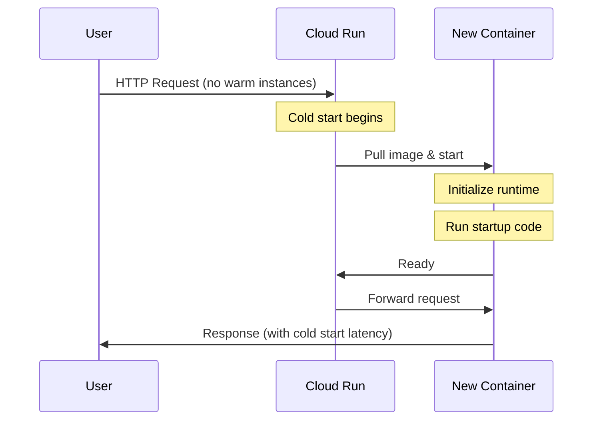

# How to Configure Minimum Instances on Cloud Run to Eliminate Cold Starts for Production Services

Author: [nawazdhandala](https://www.github.com/nawazdhandala)

Tags: GCP, Cloud Run, Cold Start, Performance, Serverless

Description: Learn how to configure minimum instances on Cloud Run to eliminate cold starts for latency-sensitive production services, including cost analysis and optimization strategies.

---

Cold starts are the tax you pay for serverless. When a Cloud Run service scales to zero and then receives a request, it needs to spin up a new container instance, which adds latency. For internal tools or batch processing, a few hundred extra milliseconds is fine. For customer-facing APIs where response time matters, it is not acceptable.

The minimum instances setting keeps a specified number of container instances warm and ready to handle requests, even when there is no traffic. Here is how to set it up and how to think about the cost trade-off.

## Understanding Cold Starts on Cloud Run

A cold start happens when Cloud Run needs to create a new container instance to handle a request. The cold start time includes:

1. Pulling the container image (cached after first pull)
2. Starting the container
3. Running your application's initialization code
4. Completing the first request

For a typical Node.js or Python application, cold starts range from 500ms to 2 seconds. Java and .NET applications can take 3-10 seconds because of runtime initialization. Languages like Go and Rust have minimal cold starts, often under 200ms.



## Setting Minimum Instances

### Using gcloud CLI

The simplest way to configure minimum instances:

```bash
# Set minimum instances to 1 to always keep at least one instance warm
gcloud run services update my-service \
  --region=us-central1 \
  --min-instances=1
```

For services that handle more consistent traffic:

```bash
# Set minimum instances to 3 for production services
gcloud run deploy my-service \
  --image=us-central1-docker.pkg.dev/my-project/repo/my-app:v1 \
  --region=us-central1 \
  --min-instances=3 \
  --max-instances=100 \
  --concurrency=80
```

### Using YAML Configuration

For more precise control, use a YAML service definition:

```yaml
# service.yaml - Cloud Run service with minimum instances
apiVersion: serving.knative.dev/v1
kind: Service
metadata:
  name: my-service
spec:
  template:
    metadata:
      annotations:
        # Keep 3 instances warm at all times
        autoscaling.knative.dev/minScale: "3"
        # Scale up to 100 instances under load
        autoscaling.knative.dev/maxScale: "100"
    spec:
      containerConcurrency: 80
      containers:
        - image: us-central1-docker.pkg.dev/my-project/repo/my-app:v1
          resources:
            limits:
              cpu: "1"
              memory: "512Mi"
```

Deploy with:

```bash
# Deploy the service with minimum instances configured
gcloud run services replace service.yaml --region=us-central1
```

## How Minimum Instances Are Billed

This is the important part. Minimum instances that are idle (not processing requests) are billed at a reduced rate, but they are not free.

The billing works like this:
- **Active instances** (processing requests): Full CPU and memory billing
- **Idle minimum instances** (warm but not processing): CPU billing at a lower rate, full memory billing

With the default "CPU is only allocated during request processing" setting, idle instances are billed for memory only. If you set "CPU is always allocated," idle instances are billed for both CPU and memory.

Let me break down the cost for a single minimum instance:

```
Configuration: 1 vCPU, 512Mi memory, CPU allocated during requests only

Active cost:
  CPU: $0.00002400/vCPU-second * 3600 = $0.0864/hour
  Memory: $0.00000250/GiB-second * 0.5 * 3600 = $0.0045/hour
  Total active: $0.0909/hour

Idle cost (minimum instance):
  CPU: $0 (not allocated when idle, in request-based billing)
  Memory: $0.00000250/GiB-second * 0.5 * 3600 = $0.0045/hour
  Total idle: $0.0045/hour
```

So keeping one minimum instance warm costs about $3.24/month in memory charges with the default billing model. That is a small price for eliminating cold starts.

## Choosing the Right Number of Minimum Instances

The right number depends on your traffic pattern and latency requirements.

**1 minimum instance** is fine for:
- APIs with sporadic but latency-sensitive traffic
- Services that receive at least a few requests per minute
- Development and staging environments

**3-5 minimum instances** work well for:
- Production APIs with moderate, steady traffic
- Services behind a load balancer that health-checks multiple instances
- Applications where a single instance cannot handle the initial burst

**10+ minimum instances** for:
- High-traffic services where cold starts during scale-up would degrade experience
- Services with very bursty traffic patterns

A good rule of thumb: set the minimum to handle your baseline traffic level. If your service normally processes 50 requests per second and each instance handles 80 concurrent requests, 1 minimum instance is probably enough for baseline. During scale-up events, new instances will cold start, but the warm instances absorb traffic in the meantime.

## Reducing Cold Start Time (Complementary Strategies)

Minimum instances prevent cold starts for baseline traffic, but during scale-up events, new instances still cold start. Here are strategies to reduce that time:

### Use a Smaller Container Image

```dockerfile
# Bad - large base image with unnecessary tools
FROM python:3.12

# Good - slim base image, much smaller
FROM python:3.12-slim

# Better for Go/Rust - scratch or distroless
FROM gcr.io/distroless/static-debian12
```

### Optimize Application Startup

```python
# Lazy initialization - load heavy resources on first request, not at startup
import functools

@functools.lru_cache(maxsize=1)
def get_ml_model():
    """Load ML model lazily on first request instead of at startup."""
    import tensorflow as tf
    return tf.saved_model.load('/models/my_model')

# Good: app starts fast, model loads on first request
# Trade-off: first request is slower, but subsequent requests are fast
```

### Use Startup CPU Boost

Cloud Run offers a startup CPU boost that temporarily allocates more CPU during instance startup:

```bash
# Enable startup CPU boost for faster cold starts
gcloud run services update my-service \
  --region=us-central1 \
  --cpu-boost
```

This doubles the CPU allocation during startup (up to a limit), which can significantly reduce cold start time for CPU-bound initialization.

## Monitoring Cold Starts

Track cold starts to understand their impact:

```bash
# Check instance count over time to see scaling behavior
gcloud monitoring time-series list \
  --filter='metric.type="run.googleapis.com/container/instance_count" AND resource.labels.service_name="my-service"' \
  --interval-start-time=$(date -u -d '-1 hour' +%Y-%m-%dT%H:%M:%SZ)
```

```bash
# Check startup latency
gcloud monitoring time-series list \
  --filter='metric.type="run.googleapis.com/container/startup_latencies" AND resource.labels.service_name="my-service"' \
  --interval-start-time=$(date -u -d '-24 hours' +%Y-%m-%dT%H:%M:%SZ)
```

You can also log cold starts from within your application:

```python
import os
import time

# Track whether this is a cold start
_startup_time = time.time()
_is_cold_start = True

@app.before_request
def track_cold_start():
    """Log cold start information for monitoring."""
    global _is_cold_start
    if _is_cold_start:
        startup_duration = time.time() - _startup_time
        print(f"Cold start detected. Startup took {startup_duration:.2f}s")
        _is_cold_start = False
```

## Combining with Concurrency Settings

Minimum instances and concurrency work together. If your minimum is 3 and concurrency is 80, your service can handle 240 concurrent requests without any cold starts. Requests beyond that trigger autoscaling, which means new instances with cold starts.

```bash
# Configure both minimum instances and concurrency
gcloud run services update my-service \
  --region=us-central1 \
  --min-instances=3 \
  --max-instances=50 \
  --concurrency=80
```

Choose your concurrency based on your application's characteristics. CPU-bound applications work best with lower concurrency (10-20). I/O-bound applications (making database queries, calling APIs) can handle higher concurrency (80-200).

## Practical Recommendation

For most production services, start with `--min-instances=1` and `--cpu-boost`. This eliminates the most painful cold start scenario (scaling from zero) at minimal cost. Monitor your P99 latency, and if you see spikes from cold starts during traffic ramps, increase the minimum.

The goal is not to eliminate every single cold start - that would be expensive. The goal is to keep them rare enough that they do not affect your users' experience.
