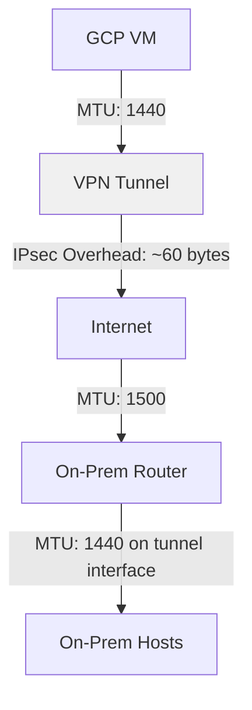

# How to Configure MTU Settings to Prevent Packet Fragmentation on GCP Cloud VPN Tunnels

Author: [nawazdhandala](https://www.github.com/nawazdhandala)

Tags: GCP, Cloud VPN, MTU, Packet Fragmentation, Networking, IPsec

Description: Understand and configure proper MTU settings for GCP Cloud VPN tunnels to prevent packet fragmentation and improve network performance.

---

Packet fragmentation is one of those silent performance killers that can plague VPN connections. Everything looks fine on the surface - the tunnel is up, traffic is flowing - but throughput is terrible and some applications randomly break. More often than not, the culprit is an MTU mismatch somewhere in the path.

In this post, I will explain how MTU works with GCP Cloud VPN, what values to use, and how to configure things properly to avoid fragmentation.

## Quick MTU Primer

MTU (Maximum Transmission Unit) is the largest packet size that can be transmitted on a network link without being fragmented. Standard Ethernet MTU is 1500 bytes. When a packet larger than the link MTU needs to be sent, one of two things happens:

1. **Fragmentation**: The packet gets split into smaller pieces. This adds overhead and can cause problems if fragments are lost or arrive out of order.
2. **Path MTU Discovery (PMTUD)**: The sender is told (via ICMP "Fragmentation Needed" messages) to send smaller packets. This is the preferred approach.

## Why VPN Tunnels Have Lower MTU

VPN tunnels add headers to every packet for encryption and encapsulation. These headers eat into the available payload space. For GCP Cloud VPN using IKEv2 with ESP:

- **ESP header**: 8 bytes
- **ESP trailer**: 2-16 bytes (depends on cipher and padding)
- **ESP IV**: 8-16 bytes (depends on cipher)
- **ESP authentication**: 12-16 bytes
- **UDP encapsulation (NAT-T)**: 8 bytes (if NAT-T is active)
- **New outer IP header**: 20 bytes

The total overhead ranges from about 50 to 73 bytes, depending on the cipher suite and whether NAT-T is used.

## GCP Cloud VPN MTU Values

GCP recommends these MTU values for Cloud VPN:

| Scenario | Recommended MTU |
|----------|----------------|
| HA VPN (no NAT-T) | 1440 bytes |
| HA VPN (with NAT-T) | 1420 bytes |
| Classic VPN | 1460 bytes |

These values account for the IPsec overhead while leaving enough room for the original packet payload.

## Configuring MTU on GCP VMs

The most reliable approach is to set the MTU on the VM network interfaces that will be sending traffic through the VPN tunnel. You can do this at the VPC network level or on individual VMs.

Setting MTU at the VPC level (applies to all VMs in the network):

```bash
# Set the VPC network MTU to 1460 (matches Cloud VPN)
gcloud compute networks update my-vpc \
    --mtu=1460
```

Note that changing VPC MTU requires all VMs to be restarted for the change to take effect on their interfaces.

For individual VMs running Linux, you can set the MTU directly:

```bash
# Set MTU on the VM's network interface to match VPN tunnel MTU
sudo ip link set dev ens4 mtu 1440

# Make it persistent across reboots - add to network config
# For Debian/Ubuntu, edit /etc/network/interfaces or netplan config
sudo tee /etc/netplan/99-custom-mtu.yaml << 'ENDCONF'
network:
  version: 2
  ethernets:
    ens4:
      mtu: 1440
ENDCONF

# Apply the netplan configuration
sudo netplan apply
```

## Configuring MTU on the On-Premises Side

Your on-premises devices also need matching MTU settings. The exact configuration depends on your device.

For Linux hosts:

```bash
# Set MTU on the interface facing the VPN
sudo ip link set dev eth0 mtu 1440
```

For Cisco routers, you can set the MTU on the tunnel interface:

```text
! Set the tunnel interface MTU on Cisco IOS
interface Tunnel0
  ip mtu 1440
  ip tcp adjust-mss 1400
```

The `ip tcp adjust-mss` command is particularly useful. It rewrites the TCP MSS (Maximum Segment Size) value in SYN packets so that TCP sessions automatically use appropriately sized segments. This prevents fragmentation for TCP traffic without needing to change MTU on every host.

## MSS Clamping - The Practical Fix

Rather than changing MTU on every single host, you can use MSS clamping on your router or firewall. This modifies the TCP MSS value in SYN packets as they pass through, telling both endpoints to use smaller segments.

On a Linux router:

```bash
# Clamp TCP MSS to 1400 on the VPN interface
# This handles TCP traffic without changing MTU on hosts
sudo iptables -t mangle -A FORWARD \
    -p tcp --tcp-flags SYN,RST SYN \
    -o tun0 \
    -j TCPMSS --set-mss 1400
```

The MSS should be set to the tunnel MTU minus 40 bytes (20 for IP header + 20 for TCP header). So for a 1440-byte tunnel MTU, the MSS should be 1400.

## Detecting Fragmentation Issues

How do you know if fragmentation is actually happening? Here are some telltale signs:

- **TCP connections work but UDP-based applications fail** (VoIP, DNS over UDP for large responses, gaming)
- **Small requests work but large file transfers are extremely slow**
- **Connections hang after the initial handshake** (TCP SYN/SYN-ACK are small, but data packets hit the MTU limit)
- **Intermittent packet loss** on the tunnel

You can test with ping using the "do not fragment" flag:

```bash
# Test Path MTU from a GCP VM through the tunnel
# -M do = set DF (Don't Fragment) bit
# -s 1412 = payload size (total packet = 1412 + 28 = 1440)
ping -M do -s 1412 -c 5 192.168.1.10

# If this works, try larger sizes until it fails
ping -M do -s 1450 -c 5 192.168.1.10
# This should fail with "Message too long" if MTU is 1440
```

On Windows:

```powershell
# Test Path MTU on Windows
# -f = Don't Fragment flag
# -l 1412 = payload size
ping -f -l 1412 192.168.1.10
```

## PMTUD and ICMP

Path MTU Discovery (PMTUD) relies on ICMP "Fragmentation Needed" (Type 3, Code 4) messages getting back to the sender. If ICMP is blocked anywhere in the path, PMTUD breaks and you end up with a "black hole" where large packets just disappear.

Make sure your firewall rules allow ICMP, especially Type 3 messages. On GCP:

```bash
# Create firewall rule to allow ICMP on the VPC
gcloud compute firewall-rules create allow-icmp \
    --network=my-vpc \
    --allow=icmp \
    --source-ranges=0.0.0.0/0 \
    --priority=1000
```

On the on-premises side, make sure your firewall is not blocking ICMP Type 3 from GCP's VPN gateway IP addresses.

## Handling Non-TCP Traffic

MSS clamping only works for TCP because it modifies TCP headers. UDP and other protocols do not have an equivalent mechanism. For non-TCP traffic, you have two options:

1. **Set MTU correctly on all hosts** that generate UDP traffic through the tunnel
2. **Allow fragmentation** and make sure your network reassembles fragments correctly

For applications like DNS, where occasional large UDP responses need to traverse the tunnel:

```bash
# Check if fragmented packets are arriving correctly
# Run tcpdump on the receiving end
sudo tcpdump -i ens4 -n 'ip[6:2] & 0x1fff != 0' -c 10
```

This captures only fragmented IP packets, helping you see if fragments are making it through.

## GCP VPC Network MTU Options

GCP VPC networks support MTU values of 1460 (default) and 1500. If your VPC is set to 1500 and you are using Cloud VPN, the VPN overhead will cause packets at the maximum size to be fragmented.

You can check your current VPC MTU:

```bash
# Check the MTU setting on your VPC network
gcloud compute networks describe my-vpc \
    --format="value(mtu)"
```

If it returns 1500 and you are using VPN, consider whether it makes sense to lower it to 1460, or rely on MSS clamping and PMTUD instead.

## Summary of Recommended Settings

Here is a quick reference for the settings that work best:



| Setting | Value |
|---------|-------|
| VPC MTU | 1460 |
| VM interface MTU | 1440 (for HA VPN) |
| On-prem tunnel interface MTU | 1440 |
| TCP MSS clamp | 1400 |
| ICMP | Allow Type 3 through all firewalls |

## Wrapping Up

MTU configuration might not be the most exciting part of setting up a VPN, but getting it wrong leads to difficult-to-diagnose performance problems. The safe approach is to set the MTU to 1440 on interfaces that send traffic through Cloud VPN, enable MSS clamping on your router for TCP traffic, and make sure ICMP is not blocked so PMTUD can work. Do this upfront and you will save yourself hours of debugging later.
