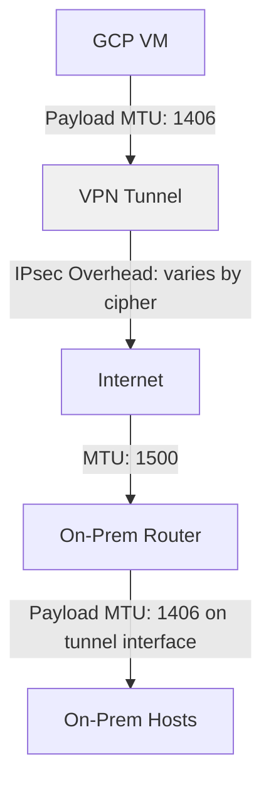

# How to Configure MTU Settings to Prevent Packet Fragmentation

Author: [nawazdhandala](https://www.github.com/nawazdhandala)

Tags: GCP, Cloud VPN, MTU, Packet Fragmentation, Networking, IPsec

Description: Understand and configure proper MTU settings for GCP Cloud VPN tunnels to prevent packet fragmentation and improve network performance.

---

Packet fragmentation is one of those silent performance killers that can plague VPN connections. Everything looks fine on the surface - the tunnel is up, traffic is flowing - but throughput is terrible and some applications randomly break. More often than not, the culprit is an MTU mismatch somewhere in the path.

In this post, I will explain how MTU works with GCP Cloud VPN, what values to use, and how to configure things properly to avoid fragmentation.

## Quick MTU Primer

MTU (Maximum Transmission Unit) is the largest packet size that can be transmitted on a network link without being fragmented. Standard Ethernet MTU is 1500 bytes. When a packet larger than the link MTU needs to be sent, one of two things happens:

1. **Fragmentation**: The packet gets split into smaller pieces. This adds overhead and can cause problems if fragments are lost or arrive out of order.
2. **Path MTU Discovery (PMTUD)**: The sender is told (via ICMP "Fragmentation Needed" messages) to send smaller packets. This is the preferred approach.

## Why VPN Tunnels Have Lower MTU

VPN tunnels add headers to every packet for encryption and encapsulation. These headers eat into the available payload space. For GCP Cloud VPN using IKEv2 with ESP:

- **ESP header**: 8 bytes
- **ESP trailer**: 2-16 bytes (depends on cipher and padding)
- **ESP IV**: 8-16 bytes (depends on cipher)
- **ESP authentication**: 12-16 bytes
- **UDP encapsulation (NAT-T)**: 8 bytes (if NAT-T is active)
- **New outer IP header**: 20 bytes

The total overhead varies by cipher suite and gateway IP stack. Current Google Cloud payload MTU values imply about 54 to 86 bytes of overhead for Cloud VPN tunnels on IPv4 gateway interfaces, and 20 bytes more overhead for tunnels on IPv6 gateway interfaces.

## GCP Cloud VPN MTU Values

GCP documents two different MTU values for Cloud VPN: the gateway MTU for encapsulated packets, and the payload MTU for the packet before it is encrypted and encapsulated.

| Scenario | Recommended MTU |
|----------|----------------|
| Classic VPN and HA VPN gateway MTU | 1460 bytes |
| HA VPN over Cloud Interconnect gateway MTU | 1440 bytes |
| Cloud VPN payload MTU with AEAD ciphers on IPv4 gateway interfaces | 1406 bytes |
| Cloud VPN payload MTU with non-AEAD ciphers on IPv4 gateway interfaces | 1374 or 1390 bytes, depending on the cipher suite |
| IPv6 gateway interfaces | 20 bytes less payload MTU than IPv4 gateway interfaces |

Configure your peer VPN gateway to match the Cloud VPN gateway MTU. For packets sent inside the tunnel, use the payload MTU that matches your cipher suite and gateway IP stack.

## Configuring MTU on GCP VMs

The most reliable approach is to set the MTU on the VM network interfaces that will be sending traffic through the VPN tunnel. You can do this at the VPC network level or on individual VMs.

Setting MTU at the VPC level (applies to all VMs in the network):

```bash
# Set the VPC network MTU to 1460 (the default Cloud VPN gateway MTU)

gcloud compute networks update my-vpc \
    --mtu=1460
```

Note that changing VPC MTU requires affected VMs to be stopped and started for the change to take effect on their interfaces. A guest OS reboot by itself does not update the MTU advertised by Google Cloud.

For individual VMs running Linux, you can set the MTU directly:

```bash
# Set MTU on the VM's network interface to a Cloud VPN payload MTU
sudo ip link set dev ens4 mtu 1406

# Make it persistent across reboots - add to network config
# For Debian/Ubuntu, edit /etc/network/interfaces or netplan config
sudo tee /etc/netplan/99-custom-mtu.yaml << 'ENDCONF'
network:
  version: 2
  ethernets:
    ens4:
      mtu: 1406
ENDCONF

# Apply the netplan configuration
sudo netplan apply
```

## Configuring MTU on the On-Premises Side

Your on-premises devices also need matching MTU settings. The exact configuration depends on your device.

For Linux hosts:

```bash
# Set MTU on the interface facing the VPN
sudo ip link set dev eth0 mtu 1406
```

For Cisco routers, you can set the MTU on the tunnel interface:

```text
! Set the tunnel interface MTU on Cisco IOS
interface Tunnel0
  ip mtu 1406
  ip tcp adjust-mss 1366
```

The `ip tcp adjust-mss` command is particularly useful. It rewrites the TCP MSS (Maximum Segment Size) value in SYN packets so that TCP sessions automatically use appropriately sized segments. This prevents fragmentation for TCP traffic without needing to change MTU on every host.

## MSS Clamping - The Practical Fix

Rather than changing MTU on every single host, you can use MSS clamping on your router or firewall. This modifies the TCP MSS value in SYN packets as they pass through, telling both endpoints to use smaller segments.

On a Linux router:

```bash
# Clamp TCP MSS to 1366 on the VPN interface
# This handles TCP traffic without changing MTU on hosts
sudo iptables -t mangle -A FORWARD \
    -p tcp --tcp-flags SYN,RST SYN \
    -o tun0 \
    -j TCPMSS --set-mss 1366
```

For IPv4 TCP without TCP options, the MSS should be set to the payload MTU minus 40 bytes (20 for IP header + 20 for TCP header). So for a 1406-byte payload MTU, the MSS should be 1366.

## Detecting Fragmentation Issues

How do you know if fragmentation is actually happening? Here are some telltale signs:

- **TCP connections work but UDP-based applications fail** (VoIP, DNS over UDP for large responses, gaming)
- **Small requests work but large file transfers are extremely slow**
- **Connections hang after the initial handshake** (TCP SYN/SYN-ACK are small, but data packets hit the MTU limit)
- **Intermittent packet loss** on the tunnel

You can test with ping using the "do not fragment" flag:

```bash
# Test Path MTU from a GCP VM through the tunnel
# -M do = set DF (Don't Fragment) bit
# -s 1378 = ICMP payload size (total IPv4 packet = 1378 + 28 = 1406)
ping -M do -s 1378 -c 5 192.168.1.10

# If this works, try larger sizes until it fails
ping -M do -s 1400 -c 5 192.168.1.10
# This should fail if the path MTU is 1406
```

On Windows:

```powershell
# Test Path MTU on Windows
# -f = Don't Fragment flag
# -l 1378 = ICMP payload size
ping -f -l 1378 192.168.1.10
```

## PMTUD and ICMP

Path MTU Discovery (PMTUD) relies on ICMP "Fragmentation Needed" (Type 3, Code 4) messages getting back to the sender. If ICMP is blocked anywhere in the path, PMTUD breaks and you end up with a "black hole" where large packets just disappear.

Make sure your firewall rules allow ICMP, especially Type 3 messages. On GCP:

```bash
# Create firewall rule to allow ICMP on the VPC
gcloud compute firewall-rules create allow-icmp \
    --network=my-vpc \
    --allow=icmp \
    --source-ranges=0.0.0.0/0 \
    --priority=1000
```

On the on-premises side, make sure your firewall is not blocking ICMP Type 3 from GCP's VPN gateway IP addresses.

## Handling Non-TCP Traffic

MSS clamping only works for TCP because it modifies TCP headers. UDP and other protocols do not have an equivalent mechanism. For non-TCP traffic, you have two options:

1. **Set MTU correctly on all hosts** that generate UDP traffic through the tunnel
2. **Allow fragmentation** and make sure your network reassembles fragments correctly

For applications like DNS, where occasional large UDP responses need to traverse the tunnel:

```bash
# Check if fragmented packets are arriving correctly
# Run tcpdump on the receiving end
sudo tcpdump -i ens4 -n 'ip[6:2] & 0x1fff != 0' -c 10
```

This captures only fragmented IP packets, helping you see if fragments are making it through.

## GCP VPC Network MTU Options

GCP VPC networks use 1460 as the default MTU and support custom MTU values from 1300 through 8896. Common custom values include 1500 for standard Ethernet and 8896 for jumbo frames. If your VPC is set above the Cloud VPN gateway MTU, packets at the maximum VPC size cannot be carried through Cloud VPN without being reduced before encapsulation.

You can check your current VPC MTU:

```bash
# Check the MTU setting on your VPC network
gcloud compute networks describe my-vpc \
    --format="value(mtu)"
```

If it returns a value above the applicable Cloud VPN gateway MTU, consider whether it makes sense to lower it, or rely on MSS clamping and PMTUD instead.

## Summary of Recommended Settings

Here is a quick reference for the settings that work best:


```mermaid
graph TD
    A[GCP VM] -->|Payload MTU: 1406| B[VPN Tunnel]
    B -->|IPsec Overhead: varies by cipher| C[Internet]
    C -->|MTU: 1500| D[On-Prem Router]
    D -->|Payload MTU: 1406 on tunnel interface| E[On-Prem Hosts]
    style B fill:#f0f0f0
```

| Setting | Value |
|---------|-------|
| VPC MTU | 1460 |
| VM interface MTU | 1406 for Cloud VPN with AEAD ciphers on IPv4 gateway interfaces, or the documented payload MTU for your cipher and gateway IP stack |
| On-prem tunnel interface MTU | Match the applicable Cloud VPN payload MTU |
| TCP MSS clamp | Payload MTU minus 40 bytes for IPv4 TCP |
| ICMP | Allow Type 3 through all firewalls |

## Wrapping Up

MTU configuration might not be the most exciting part of setting up a VPN, but getting it wrong leads to difficult-to-diagnose performance problems. The safe approach is to use the Cloud VPN gateway MTU on your peer VPN gateway, use the documented Cloud VPN payload MTU for traffic inside the tunnel, enable MSS clamping on your router for TCP traffic, and make sure ICMP is not blocked so PMTUD can work. Do this upfront and you will save yourself hours of debugging later.
