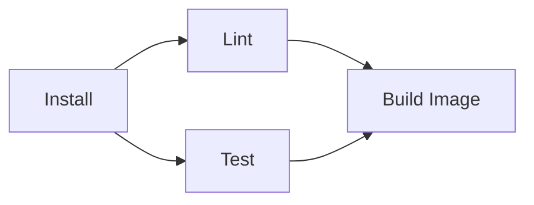
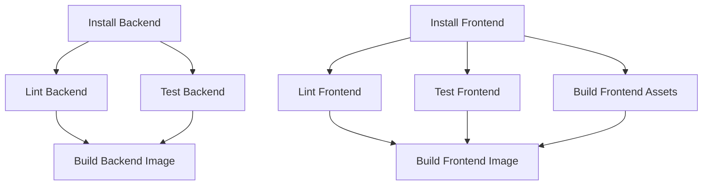

# How to Configure Multi-Step Builds in cloudbuild.yaml with Sequential and Parallel Steps

Author: [nawazdhandala](https://www.github.com/nawazdhandala)

Tags: GCP, Cloud Build, cloudbuild.yaml, CI/CD, Build Pipeline, Build Optimization

Description: Learn how to configure multi-step Cloud Build pipelines with both sequential and parallel execution to build efficient CI/CD workflows on GCP.

---

A real-world CI/CD pipeline does more than just build a Docker image. It runs linters, executes tests, builds artifacts, scans for vulnerabilities, and deploys to various environments. Cloud Build handles all of this through multi-step builds defined in cloudbuild.yaml. In this post, I will cover how to structure complex build pipelines with both sequential and parallel steps to get the right balance of correctness and speed.

## How Cloud Build Executes Steps

By default, Cloud Build executes steps sequentially - step 1 finishes before step 2 starts, step 2 finishes before step 3, and so on. Each step runs in its own container but shares a persistent workspace volume mounted at `/workspace`.

Here is a basic sequential pipeline:

```yaml
# Sequential build pipeline - each step waits for the previous one
steps:
  # Step 1: Install dependencies
  - name: 'node:20'
    id: 'install'
    args: ['npm', 'ci']

  # Step 2: Run linter (waits for install)
  - name: 'node:20'
    id: 'lint'
    args: ['npm', 'run', 'lint']

  # Step 3: Run tests (waits for lint)
  - name: 'node:20'
    id: 'test'
    args: ['npm', 'test']

  # Step 4: Build Docker image (waits for test)
  - name: 'gcr.io/cloud-builders/docker'
    id: 'build'
    args: ['build', '-t', 'gcr.io/$PROJECT_ID/my-app:$SHORT_SHA', '.']

images:
  - 'gcr.io/$PROJECT_ID/my-app:$SHORT_SHA'
```

This works fine, but notice that the linter and tests could run at the same time since they both just need the installed dependencies. That is where parallel steps come in.

## Making Steps Run in Parallel

To run steps in parallel, you use two fields: `id` and `waitFor`. The `id` field gives a step a unique name. The `waitFor` field tells a step which other steps it needs to wait for before starting.

Here is the same pipeline optimized with parallel steps:

```yaml
# Optimized pipeline with parallel lint and test steps
steps:
  # Step 1: Install dependencies
  - name: 'node:20'
    id: 'install'
    args: ['npm', 'ci']

  # Step 2: Run linter (starts after install, in parallel with test)
  - name: 'node:20'
    id: 'lint'
    waitFor: ['install']
    args: ['npm', 'run', 'lint']

  # Step 3: Run tests (starts after install, in parallel with lint)
  - name: 'node:20'
    id: 'test'
    waitFor: ['install']
    args: ['npm', 'test']

  # Step 4: Build image (waits for both lint and test to pass)
  - name: 'gcr.io/cloud-builders/docker'
    id: 'build'
    waitFor: ['lint', 'test']
    args: ['build', '-t', 'gcr.io/$PROJECT_ID/my-app:$SHORT_SHA', '.']

images:
  - 'gcr.io/$PROJECT_ID/my-app:$SHORT_SHA'
```

The execution looks like this:



Both `lint` and `test` start as soon as `install` completes, and `build` waits for both to finish. If lint takes 30 seconds and tests take 2 minutes, this saves you 30 seconds compared to running them sequentially.

## The waitFor Special Value: Start Immediately

If you want a step to start immediately when the build begins - without waiting for any previous step - use `waitFor: ['-']`:

```yaml
# Steps that start immediately, without waiting for anything
steps:
  # Starts immediately - pull cache image
  - name: 'gcr.io/cloud-builders/docker'
    id: 'pull-cache'
    waitFor: ['-']
    entrypoint: 'bash'
    args: ['-c', 'docker pull gcr.io/$PROJECT_ID/my-app:latest || true']

  # Starts immediately - install dependencies
  - name: 'node:20'
    id: 'install'
    waitFor: ['-']
    args: ['npm', 'ci']

  # Waits for both pull-cache and install
  - name: 'gcr.io/cloud-builders/docker'
    id: 'build'
    waitFor: ['pull-cache', 'install']
    args:
      - 'build'
      - '--cache-from'
      - 'gcr.io/$PROJECT_ID/my-app:latest'
      - '-t'
      - 'gcr.io/$PROJECT_ID/my-app:$SHORT_SHA'
      - '.'
```

This is useful when you have independent setup tasks that can happen simultaneously at the start of the build.

## A Complex Real-World Example

Let's build a more realistic pipeline for a monorepo with a frontend and backend:

```yaml
# Complex pipeline for a monorepo with frontend and backend services
steps:
  # ---- Phase 1: Install dependencies (parallel) ----

  # Install backend dependencies
  - name: 'node:20'
    id: 'install-backend'
    waitFor: ['-']
    dir: 'backend'
    args: ['npm', 'ci']

  # Install frontend dependencies
  - name: 'node:20'
    id: 'install-frontend'
    waitFor: ['-']
    dir: 'frontend'
    args: ['npm', 'ci']

  # ---- Phase 2: Validation (parallel, after respective installs) ----

  # Lint backend
  - name: 'node:20'
    id: 'lint-backend'
    waitFor: ['install-backend']
    dir: 'backend'
    args: ['npm', 'run', 'lint']

  # Test backend
  - name: 'node:20'
    id: 'test-backend'
    waitFor: ['install-backend']
    dir: 'backend'
    args: ['npm', 'test']

  # Lint frontend
  - name: 'node:20'
    id: 'lint-frontend'
    waitFor: ['install-frontend']
    dir: 'frontend'
    args: ['npm', 'run', 'lint']

  # Test frontend
  - name: 'node:20'
    id: 'test-frontend'
    waitFor: ['install-frontend']
    dir: 'frontend'
    args: ['npm', 'test']

  # Build frontend assets
  - name: 'node:20'
    id: 'build-frontend'
    waitFor: ['install-frontend']
    dir: 'frontend'
    args: ['npm', 'run', 'build']

  # ---- Phase 3: Docker builds (after all validation passes) ----

  # Build backend image
  - name: 'gcr.io/cloud-builders/docker'
    id: 'build-backend-image'
    waitFor: ['lint-backend', 'test-backend']
    args:
      - 'build'
      - '-t'
      - 'gcr.io/$PROJECT_ID/backend:$SHORT_SHA'
      - './backend'

  # Build frontend image
  - name: 'gcr.io/cloud-builders/docker'
    id: 'build-frontend-image'
    waitFor: ['lint-frontend', 'test-frontend', 'build-frontend']
    args:
      - 'build'
      - '-t'
      - 'gcr.io/$PROJECT_ID/frontend:$SHORT_SHA'
      - './frontend'

images:
  - 'gcr.io/$PROJECT_ID/backend:$SHORT_SHA'
  - 'gcr.io/$PROJECT_ID/frontend:$SHORT_SHA'

timeout: 1800s
options:
  machineType: 'E2_HIGHCPU_8'
```

The execution graph for this pipeline:



Both service pipelines run completely independently until the final image build steps. This maximizes parallelism and keeps the total build time close to the duration of the slowest path.

## Sharing Data Between Steps

All steps in a Cloud Build pipeline share the `/workspace` directory. Files written by one step are available to subsequent steps. This is how you pass artifacts between steps:

```yaml
# Sharing build artifacts between steps via /workspace
steps:
  # Generate a version file
  - name: 'bash'
    id: 'version'
    entrypoint: 'bash'
    args:
      - '-c'
      - |
        # Write version info to a file that later steps can read
        echo "$SHORT_SHA" > /workspace/version.txt
        echo "Build at $(date)" >> /workspace/version.txt

  # Read the version file in a later step
  - name: 'bash'
    id: 'use-version'
    entrypoint: 'bash'
    args:
      - '-c'
      - |
        # Read the version file created in the previous step
        VERSION=$(cat /workspace/version.txt)
        echo "Building version: $VERSION"
```

For parallel steps that both need to write to the workspace, be careful about file conflicts. Each parallel step should write to its own subdirectory or use unique file names.

## Environment Variables Between Steps

Environment variables set in one step do not carry over to the next step (each step is a separate container). To pass values between steps, write them to a file:

```yaml
# Pass environment values between steps using files
steps:
  # Step 1: Compute a value and save it
  - name: 'bash'
    id: 'compute-tag'
    entrypoint: 'bash'
    args:
      - '-c'
      - |
        # Compute a version tag and save to workspace
        TAG="v$(date +%Y%m%d)-$SHORT_SHA"
        echo $TAG > /workspace/image_tag.txt

  # Step 2: Read the value and use it
  - name: 'gcr.io/cloud-builders/docker'
    id: 'build'
    entrypoint: 'bash'
    args:
      - '-c'
      - |
        TAG=$(cat /workspace/image_tag.txt)
        docker build -t gcr.io/$PROJECT_ID/my-app:$$TAG .
```

## Error Handling in Multi-Step Builds

By default, if any step fails, the entire build stops and is marked as failed. This is usually the right behavior - if tests fail, you do not want to build and push the image.

However, some steps are non-critical (like posting a notification). For these, you can add error handling within the step:

```yaml
# Non-critical step that should not fail the build
steps:
  - name: 'gcr.io/cloud-builders/curl'
    id: 'notify-start'
    waitFor: ['-']
    entrypoint: 'bash'
    args:
      - '-c'
      - |
        # Notify Slack about build start, but do not fail if notification fails
        curl -X POST -H 'Content-type: application/json' \
          --data '{"text":"Build started for $SHORT_SHA"}' \
          $$SLACK_WEBHOOK || echo "Slack notification failed, continuing build"
```

The `|| echo` ensures the step exits with a zero status even if the curl command fails.

## Best Practices

Keep step IDs descriptive and consistent. Good IDs make the build logs readable and make `waitFor` references self-documenting.

Always explicitly set `waitFor` when you want parallel execution. Without it, steps run sequentially regardless of their actual dependencies.

Use the `dir` field to set the working directory for steps in monorepos instead of `cd` commands in bash scripts. It is cleaner and more visible in the build configuration.

Start with a sequential pipeline and add parallelism incrementally. It is easier to debug a sequential pipeline, and you can measure the actual time savings of each parallelization.

Use a higher machine type when running many parallel steps. Parallel steps compete for CPU and memory on the same machine, so a single-vCPU machine running four parallel steps will not be faster than running them sequentially.

## Wrapping Up

Multi-step builds with parallel execution are essential for keeping CI/CD pipelines fast as projects grow. The `id` and `waitFor` fields give you fine-grained control over the execution graph, and Cloud Build handles the orchestration automatically. Start by identifying which steps are truly independent, add parallel execution for those, and verify that the total build time improves. The combination of parallel and sequential steps lets you build pipelines that are both fast and correct.
