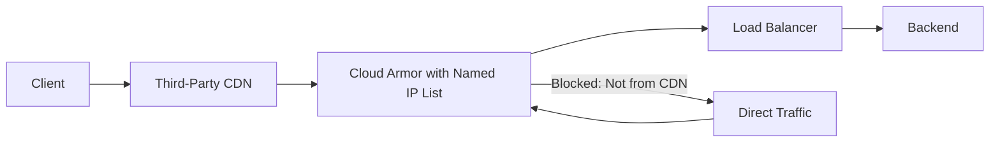

# How to Configure Named IP Lists in Cloud Armor for Dynamic IP Allowlisting in GCP

Author: [nawazdhandala](https://www.github.com/nawazdhandala)

Tags: GCP, Cloud Armor, Named IP Lists, IP Allowlisting, Security

Description: Use Cloud Armor named IP lists to dynamically allowlist IP ranges from third-party providers like CDNs and partner services without manually managing IP addresses.

---

Managing IP allowlists in Cloud Armor is straightforward when you have a handful of static IPs. But when you need to allow traffic from a third-party CDN provider with hundreds of IP ranges that change regularly, manual management becomes a nightmare. That is exactly what Cloud Armor named IP lists solve. They are pre-maintained lists of IP ranges from well-known providers that Google keeps up to date automatically.

This guide covers how to use named IP lists in your Cloud Armor security policies and when they make sense.

## What Are Named IP Lists?

Named IP lists are curated collections of IP address ranges maintained by Google. They represent the IP ranges of well-known third-party services. Instead of hardcoding IP ranges in your security rules and having to update them whenever the provider changes their ranges, you reference the named list, and Cloud Armor automatically stays current.

Currently available named IP lists include ranges from providers like Cloudflare, Fastly, Imperva, and other CDN and security providers. The full list of available named IP lists can be queried from the API.

## Viewing Available Named IP Lists

First, check what named IP lists are available:

```bash
# List all available named IP lists
gcloud compute security-policies list-preconfigured-expression-sets \
  --project=your-project-id
```

You can also view the specific IP ranges in a named list:

```bash
# View details of a specific named IP list
gcloud compute security-policies describe-named-ip-lists \
  --project=your-project-id
```

## Why Use Named IP Lists?

Here is a common scenario. You have a web application behind a GCP load balancer, but you also use a third-party CDN in front of it. You want to make sure that only traffic coming through your CDN reaches your load balancer - not direct traffic that bypasses the CDN.

Without named IP lists, you would need to:
1. Look up the CDN provider's current IP ranges
2. Create Cloud Armor rules with those ranges
3. Monitor for changes to the provider's IP ranges
4. Update your rules whenever ranges change

With named IP lists, you reference the list once and Google handles the updates.



## Step 1: Create a Security Policy

Start by creating a Cloud Armor security policy:

```bash
# Create a security policy for CDN origin protection
gcloud compute security-policies create cdn-origin-policy \
  --description="Allow traffic only from our CDN provider" \
  --project=your-project-id
```

## Step 2: Add a Named IP List Rule

Add a rule that uses a named IP list to allow traffic from your CDN provider:

```bash
# Allow traffic from a CDN provider using a named IP list
gcloud compute security-policies rules create 1000 \
  --security-policy=cdn-origin-policy \
  --expression="evaluatePreconfiguredExpr('sourceiplist-cloudflare')" \
  --action=allow \
  --description="Allow traffic from Cloudflare IP ranges"
```

The expression `evaluatePreconfiguredExpr('sourceiplist-cloudflare')` matches any request whose source IP falls within Cloudflare's published IP ranges.

## Step 3: Add Additional Trusted Sources

You might have multiple trusted sources - your CDN, your monitoring services, and your own office IPs:

```bash
# Allow traffic from your office and monitoring
gcloud compute security-policies rules create 900 \
  --security-policy=cdn-origin-policy \
  --src-ip-ranges="203.0.113.10/32,198.51.100.0/24" \
  --action=allow \
  --description="Allow traffic from office and monitoring IPs"

# Allow traffic from Fastly CDN ranges
gcloud compute security-policies rules create 1100 \
  --security-policy=cdn-origin-policy \
  --expression="evaluatePreconfiguredExpr('sourceiplist-fastly')" \
  --action=allow \
  --description="Allow traffic from Fastly IP ranges"
```

## Step 4: Set the Default Rule to Deny

To enforce that only traffic from your trusted sources reaches the backend, set the default rule to deny:

```bash
# Deny all traffic that does not match any allow rule
gcloud compute security-policies rules update 2147483647 \
  --security-policy=cdn-origin-policy \
  --action=deny-403 \
  --description="Default deny - only CDN and trusted sources allowed"
```

## Step 5: Attach to Your Backend Service

Apply the policy to your backend service:

```bash
# Attach the security policy to the backend service
gcloud compute backend-services update your-web-backend \
  --security-policy=cdn-origin-policy \
  --global \
  --project=your-project-id
```

## Combining Named IP Lists with Other Conditions

You can combine named IP list checks with other CEL expressions for more granular control:

```bash
# Allow CDN traffic only if it also has the correct forwarding header
gcloud compute security-policies rules create 1000 \
  --security-policy=cdn-origin-policy \
  --expression="evaluatePreconfiguredExpr('sourceiplist-cloudflare') && has(request.headers['x-cdn-secret']) && request.headers['x-cdn-secret'] == 'your-shared-secret'" \
  --action=allow \
  --description="Allow Cloudflare traffic with valid shared secret header"
```

This adds a second layer of verification. Even if an attacker spoofs a Cloudflare IP (unlikely but possible in theory), they would also need to know the shared secret header.

## Using Named IP Lists for Bot Detection

Another use case is allowing known good bots while blocking everything else that claims to be a bot:

```bash
# Create a policy for bot management
gcloud compute security-policies create bot-management-policy \
  --description="Allow only verified bot traffic" \
  --project=your-project-id

# Allow verified search engine crawlers
gcloud compute security-policies rules create 1000 \
  --security-policy=bot-management-policy \
  --expression="evaluatePreconfiguredExpr('sourceiplist-google') && request.headers['user-agent'].matches('.*Googlebot.*')" \
  --action=allow \
  --description="Allow verified Googlebot traffic"

# Block unverified traffic claiming to be bots
gcloud compute security-policies rules create 2000 \
  --security-policy=bot-management-policy \
  --expression="request.headers['user-agent'].matches('.*(bot|crawler|spider).*') && !evaluatePreconfiguredExpr('sourceiplist-google')" \
  --action=deny-403 \
  --description="Block fake bot traffic"
```

## Monitoring Named IP List Rules

Check your logs to see how named IP list rules are performing:

```bash
# View Cloud Armor logs for named IP list matches
gcloud logging read \
  'resource.type="http_load_balancer" AND jsonPayload.enforcedSecurityPolicy.name="cdn-origin-policy"' \
  --project=your-project-id \
  --limit=30 \
  --format="table(timestamp, jsonPayload.enforcedSecurityPolicy.configuredAction, jsonPayload.remoteIp)"
```

Pay attention to denied requests. If you see legitimate traffic being blocked, check whether the source IP should be in your allow rules.

## How IP List Updates Work

Google periodically syncs named IP lists with the provider's published IP ranges. When a provider adds or removes IP ranges, the named list in Cloud Armor is updated automatically. You do not need to take any action.

However, there can be a short delay between when a provider publishes new ranges and when they appear in the named IP list. If you notice traffic from a known CDN being blocked, check whether the provider recently added new IP ranges that have not yet propagated.

## Limitations to Know About

A few limitations to keep in mind:

- Named IP lists are only available for specific well-known providers. You cannot create your own named IP list
- For custom IP lists that change frequently, you will need to use the Cloud Armor API to update rules programmatically
- Named IP lists only support source IP matching. You cannot use them for destination IP checks
- The available named IP lists may vary by region and Cloud Armor tier

## Automating Custom IP List Updates

If you need dynamic IP lists for providers not covered by named lists, here is a pattern using a Cloud Function:

```bash
# Script to update a Cloud Armor rule with fresh IP ranges from a provider
# Run this on a schedule (e.g., Cloud Scheduler + Cloud Function)

# Fetch the latest IP ranges from your provider
IP_RANGES=$(curl -s https://provider.example.com/ip-ranges.json | jq -r '.prefixes[].ip_prefix' | tr '\n' ',')

# Update the Cloud Armor rule with new IP ranges
gcloud compute security-policies rules update 1000 \
  --security-policy=cdn-origin-policy \
  --src-ip-ranges="${IP_RANGES}" \
  --action=allow \
  --description="Allow traffic from provider - updated $(date)"
```

## Wrapping Up

Named IP lists in Cloud Armor take the pain out of managing dynamic IP allowlists for well-known third-party providers. They are especially valuable for CDN origin protection, where you want to ensure only your CDN can reach your load balancer directly. By letting Google maintain the IP ranges, you avoid a common source of security gaps - stale allowlists that miss new provider IP ranges. If you are using a third-party CDN or security service in front of your GCP load balancer, named IP lists should be part of your Cloud Armor configuration.
