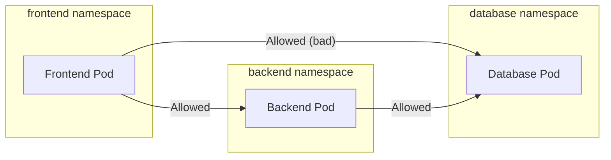
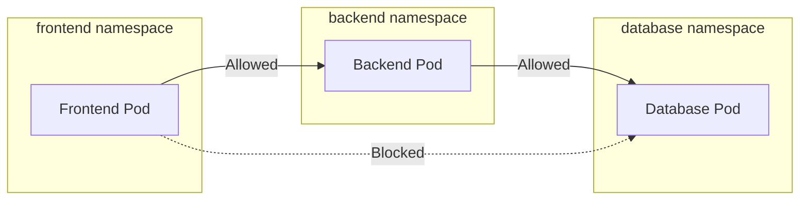

# How to Configure Network Policies in GKE to Isolate Namespaces from Each Other

Author: [nawazdhandala](https://www.github.com/nawazdhandala)

Tags: GCP, GKE, Kubernetes, Network Policies, Security, Networking

Description: Learn how to use Kubernetes Network Policies in GKE to isolate namespaces from each other, restricting cross-namespace traffic for better security in multi-tenant clusters.

---

By default, every pod in a Kubernetes cluster can talk to every other pod, regardless of namespace. That is fine for development, but in production - especially when you have multiple teams, environments, or tenants sharing a cluster - you want namespace isolation. If a pod in the `staging` namespace gets compromised, it should not be able to reach pods in the `production` namespace.

Network Policies in GKE let you define firewall-like rules at the pod level. You specify which traffic is allowed, and everything else is denied. Let me walk through setting up namespace isolation from scratch.

## Prerequisites

Network Policies require a network policy enforcement mechanism. In GKE, you have two options:

1. **Calico** (enabled with `--enable-network-policy` flag)
2. **Dataplane V2 / Cilium** (enabled with `--enable-dataplane-v2` flag)

For new clusters, I recommend Dataplane V2 as it provides better performance and additional observability features.

```bash
# Create a cluster with network policy support using Dataplane V2
gcloud container clusters create my-cluster \
  --region us-central1 \
  --enable-dataplane-v2 \
  --num-nodes 3

# Or enable Calico on an existing cluster
gcloud container clusters update my-cluster \
  --region us-central1 \
  --enable-network-policy
```

## The Default Problem

Let me illustrate the problem. Suppose you have three namespaces: `frontend`, `backend`, and `database`.

```bash
# Create the namespaces
kubectl create namespace frontend
kubectl create namespace backend
kubectl create namespace database
```

Without Network Policies, a pod in `frontend` can directly connect to pods in `database`, bypassing the `backend` entirely. That is a security issue.



What we want is:



## Step 1: Default Deny All Traffic

The first step is to create a default deny policy in each namespace. This blocks all ingress and egress traffic unless explicitly allowed by another policy.

```yaml
# default-deny.yaml - Apply this to each namespace you want to isolate
apiVersion: networking.k8s.io/v1
kind: NetworkPolicy
metadata:
  name: default-deny-all
  namespace: frontend
spec:
  podSelector: {}  # Empty selector matches ALL pods in the namespace
  policyTypes:
    - Ingress
    - Egress
```

Apply it to all three namespaces.

```bash
# Apply default deny to each namespace
for ns in frontend backend database; do
  kubectl -n $ns apply -f - <<EOF
apiVersion: networking.k8s.io/v1
kind: NetworkPolicy
metadata:
  name: default-deny-all
  namespace: $ns
spec:
  podSelector: {}
  policyTypes:
    - Ingress
    - Egress
EOF
done
```

After applying these policies, no pod can communicate with any other pod. We now need to selectively open the paths we want.

## Step 2: Allow DNS Resolution

The default deny policy blocks DNS as well, which breaks service discovery. You need to explicitly allow DNS traffic to kube-dns.

```yaml
# allow-dns.yaml - Allow all pods to reach kube-dns for service discovery
apiVersion: networking.k8s.io/v1
kind: NetworkPolicy
metadata:
  name: allow-dns
  namespace: frontend
spec:
  podSelector: {}  # Applies to all pods in the namespace
  policyTypes:
    - Egress
  egress:
    # Allow DNS queries to kube-dns in the kube-system namespace
    - to:
        - namespaceSelector:
            matchLabels:
              kubernetes.io/metadata.name: kube-system
      ports:
        - protocol: UDP
          port: 53
        - protocol: TCP
          port: 53
```

Apply this to all three namespaces as well.

```bash
# Apply DNS allow policy to each namespace
for ns in frontend backend database; do
  kubectl -n $ns apply -f - <<EOF
apiVersion: networking.k8s.io/v1
kind: NetworkPolicy
metadata:
  name: allow-dns
  namespace: $ns
spec:
  podSelector: {}
  policyTypes:
    - Egress
  egress:
    - to:
        - namespaceSelector:
            matchLabels:
              kubernetes.io/metadata.name: kube-system
      ports:
        - protocol: UDP
          port: 53
        - protocol: TCP
          port: 53
EOF
done
```

## Step 3: Allow Frontend to Backend Traffic

Now define the allowed communication paths. Frontend pods should be able to reach backend pods on the API port.

```yaml
# frontend-to-backend.yaml
# Egress rule: Allow frontend pods to send traffic to backend namespace
apiVersion: networking.k8s.io/v1
kind: NetworkPolicy
metadata:
  name: allow-egress-to-backend
  namespace: frontend
spec:
  podSelector:
    matchLabels:
      app: frontend
  policyTypes:
    - Egress
  egress:
    - to:
        - namespaceSelector:
            matchLabels:
              kubernetes.io/metadata.name: backend
          podSelector:
            matchLabels:
              app: backend-api
      ports:
        - protocol: TCP
          port: 8080
---
# Ingress rule: Allow backend to receive traffic from frontend namespace
apiVersion: networking.k8s.io/v1
kind: NetworkPolicy
metadata:
  name: allow-ingress-from-frontend
  namespace: backend
spec:
  podSelector:
    matchLabels:
      app: backend-api
  policyTypes:
    - Ingress
  ingress:
    - from:
        - namespaceSelector:
            matchLabels:
              kubernetes.io/metadata.name: frontend
          podSelector:
            matchLabels:
              app: frontend
      ports:
        - protocol: TCP
          port: 8080
```

Notice that you need both an egress rule in the source namespace and an ingress rule in the destination namespace. Both sides must allow the traffic.

## Step 4: Allow Backend to Database Traffic

Similarly, allow the backend to reach the database.

```yaml
# backend-to-database.yaml
# Egress: Backend can reach database pods on port 5432
apiVersion: networking.k8s.io/v1
kind: NetworkPolicy
metadata:
  name: allow-egress-to-database
  namespace: backend
spec:
  podSelector:
    matchLabels:
      app: backend-api
  policyTypes:
    - Egress
  egress:
    - to:
        - namespaceSelector:
            matchLabels:
              kubernetes.io/metadata.name: database
          podSelector:
            matchLabels:
              app: postgres
      ports:
        - protocol: TCP
          port: 5432
---
# Ingress: Database accepts connections from backend only
apiVersion: networking.k8s.io/v1
kind: NetworkPolicy
metadata:
  name: allow-ingress-from-backend
  namespace: database
spec:
  podSelector:
    matchLabels:
      app: postgres
  policyTypes:
    - Ingress
  ingress:
    - from:
        - namespaceSelector:
            matchLabels:
              kubernetes.io/metadata.name: backend
          podSelector:
            matchLabels:
              app: backend-api
      ports:
        - protocol: TCP
          port: 5432
```

## Step 5: Allow Intra-Namespace Traffic

Pods within the same namespace often need to communicate with each other. Add a policy to allow same-namespace traffic.

```yaml
# allow-same-namespace.yaml - Allow traffic within the same namespace
apiVersion: networking.k8s.io/v1
kind: NetworkPolicy
metadata:
  name: allow-same-namespace
  namespace: backend
spec:
  podSelector: {}
  policyTypes:
    - Ingress
    - Egress
  ingress:
    - from:
        - podSelector: {}  # All pods in the same namespace
  egress:
    - to:
        - podSelector: {}  # All pods in the same namespace
```

## Testing the Policies

Verify that the policies are working correctly.

```bash
# Test: Frontend CAN reach backend (should succeed)
kubectl -n frontend exec deploy/frontend -- \
  wget -qO- --timeout=5 http://backend-api.backend:8080/health

# Test: Frontend CANNOT reach database (should fail/timeout)
kubectl -n frontend exec deploy/frontend -- \
  wget -qO- --timeout=5 http://postgres.database:5432 || echo "Blocked as expected"

# Test: Backend CAN reach database (should succeed)
kubectl -n backend exec deploy/backend-api -- \
  pg_isready -h postgres.database -p 5432
```

## Allowing External Traffic

If your frontend needs to receive traffic from an ingress controller or load balancer, you need to allow that too.

```yaml
# allow-ingress-external.yaml - Allow traffic from the ingress namespace
apiVersion: networking.k8s.io/v1
kind: NetworkPolicy
metadata:
  name: allow-ingress-from-lb
  namespace: frontend
spec:
  podSelector:
    matchLabels:
      app: frontend
  policyTypes:
    - Ingress
  ingress:
    - from:
        - namespaceSelector:
            matchLabels:
              kubernetes.io/metadata.name: ingress-nginx
      ports:
        - protocol: TCP
          port: 3000
```

## Monitoring Network Policy Enforcement

If you are using Dataplane V2 (Cilium), you can observe network policy decisions.

```bash
# View network policy logs (with Dataplane V2)
kubectl -n kube-system logs -l k8s-app=cilium --tail 100 | grep "policy-verdict"
```

## Wrapping Up

Network Policies are essential for any multi-tenant or multi-environment GKE cluster. The pattern is always the same: start with a default deny policy, then selectively allow the traffic paths your application requires. Always remember to allow DNS, and test every policy thoroughly because a misconfigured policy can silently break your application. Once in place, these policies give you strong network segmentation without needing separate clusters for each team or environment.
