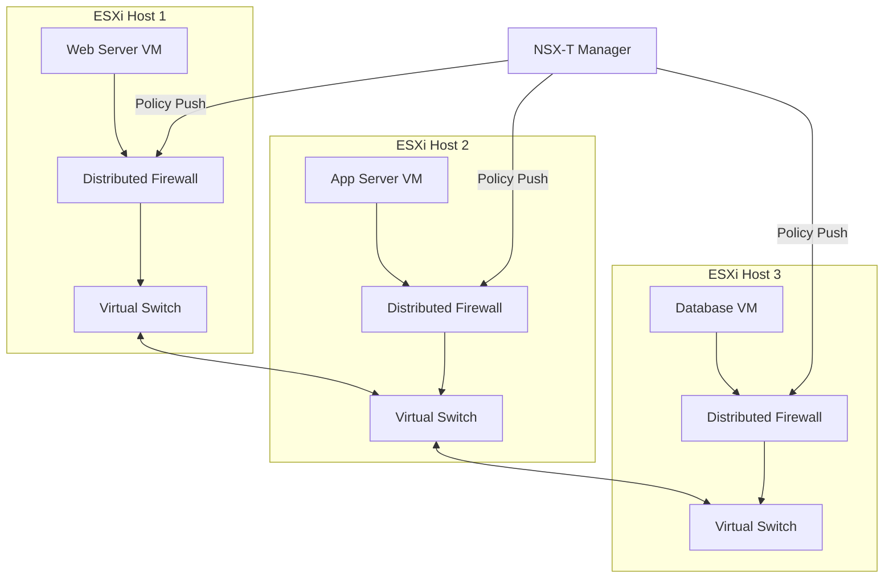

# How to Configure NSX-T Distributed Firewall Policies for Micro-Segmentation on VMware Engine

Author: [nawazdhandala](https://www.github.com/nawazdhandala)

Tags: GCP, VMware Engine, NSX-T, Micro-Segmentation, Network Security

Description: Configure NSX-T distributed firewall policies for micro-segmentation on Google Cloud VMware Engine to enforce zero-trust network security.

---

Traditional perimeter firewalls protect the boundary of your network but do nothing to prevent lateral movement once an attacker is inside. Micro-segmentation flips this model by placing firewall rules at the virtual machine level. Every VM gets its own firewall policy, and traffic between VMs is inspected and controlled even if they sit on the same network segment.

Google Cloud VMware Engine includes NSX-T, which provides a distributed firewall that enforces policies at the hypervisor level. This means firewall rules follow the VM wherever it moves and cannot be bypassed by the VM itself. Here is how to set it up.

## How the NSX-T Distributed Firewall Works

The distributed firewall (DFW) runs in the kernel of each ESXi host. When a VM sends a packet, the DFW inspects it before it even reaches the virtual switch. This is different from a traditional firewall appliance where traffic must be routed through a central point.



## Accessing NSX-T Manager

Your GCVE private cloud includes an NSX-T Manager instance. Get the access credentials from the console.

```bash
# Retrieve NSX-T Manager credentials
gcloud vmware private-clouds nsx credentials describe \
  --private-cloud=my-gcve-cloud \
  --location=us-central1

# The output gives you the NSX-T Manager URL and admin credentials
```

Log into the NSX-T Manager web interface. All DFW configuration is done through this interface or the NSX-T API.

## Step 1: Create Security Groups

Security groups are collections of VMs that share the same security policy. You can group VMs by tags, names, operating system, or network segment.

```bash
# Using the NSX-T API to create groups
# Group for web tier VMs
curl -k -u admin:PASSWORD -X PUT \
  "https://NSX_MANAGER/policy/api/v1/infra/domains/default/groups/web-tier" \
  -H "Content-Type: application/json" \
  -d '{
    "display_name": "Web Tier",
    "description": "All web server VMs",
    "expression": [
      {
        "resource_type": "Condition",
        "member_type": "VirtualMachine",
        "key": "Tag",
        "operator": "EQUALS",
        "value": "web-tier"
      }
    ]
  }'

# Group for application tier VMs
curl -k -u admin:PASSWORD -X PUT \
  "https://NSX_MANAGER/policy/api/v1/infra/domains/default/groups/app-tier" \
  -H "Content-Type: application/json" \
  -d '{
    "display_name": "App Tier",
    "description": "All application server VMs",
    "expression": [
      {
        "resource_type": "Condition",
        "member_type": "VirtualMachine",
        "key": "Tag",
        "operator": "EQUALS",
        "value": "app-tier"
      }
    ]
  }'

# Group for database tier VMs
curl -k -u admin:PASSWORD -X PUT \
  "https://NSX_MANAGER/policy/api/v1/infra/domains/default/groups/db-tier" \
  -H "Content-Type: application/json" \
  -d '{
    "display_name": "Database Tier",
    "description": "All database VMs",
    "expression": [
      {
        "resource_type": "Condition",
        "member_type": "VirtualMachine",
        "key": "Tag",
        "operator": "EQUALS",
        "value": "db-tier"
      }
    ]
  }'
```

## Step 2: Tag Virtual Machines

Apply tags to VMs so they are automatically added to the correct security groups.

```bash
# Tag a VM as belonging to the web tier
curl -k -u admin:PASSWORD -X POST \
  "https://NSX_MANAGER/api/v1/fabric/virtual-machines?action=add_tags" \
  -H "Content-Type: application/json" \
  -d '{
    "external_id": "vm-12345",
    "tags": [
      {
        "scope": "tier",
        "tag": "web-tier"
      },
      {
        "scope": "environment",
        "tag": "production"
      }
    ]
  }'
```

## Step 3: Create Service Definitions

Define the services (ports and protocols) that your firewall rules will reference.

```bash
# Create a custom service for your application port
curl -k -u admin:PASSWORD -X PUT \
  "https://NSX_MANAGER/policy/api/v1/infra/services/app-service-8080" \
  -H "Content-Type: application/json" \
  -d '{
    "display_name": "Application Service 8080",
    "service_entries": [
      {
        "resource_type": "L4PortSetServiceEntry",
        "display_name": "TCP-8080",
        "protocol": "TCP",
        "destination_ports": ["8080"]
      }
    ]
  }'
```

## Step 4: Create Firewall Policies

Now create the distributed firewall policies that enforce micro-segmentation. Policies are organized into sections with ordered rules.

```bash
# Create the main micro-segmentation policy
curl -k -u admin:PASSWORD -X PUT \
  "https://NSX_MANAGER/policy/api/v1/infra/domains/default/security-policies/micro-segmentation" \
  -H "Content-Type: application/json" \
  -d '{
    "display_name": "Three-Tier Application Micro-Segmentation",
    "description": "Enforces strict traffic control between application tiers",
    "category": "Application",
    "sequence_number": 100,
    "rules": [
      {
        "display_name": "Allow Web to App",
        "description": "Web servers can reach app servers on port 8080",
        "source_groups": ["/infra/domains/default/groups/web-tier"],
        "destination_groups": ["/infra/domains/default/groups/app-tier"],
        "services": ["/infra/services/app-service-8080"],
        "action": "ALLOW",
        "sequence_number": 10,
        "logged": true
      },
      {
        "display_name": "Allow App to DB",
        "description": "App servers can reach database servers on port 5432",
        "source_groups": ["/infra/domains/default/groups/app-tier"],
        "destination_groups": ["/infra/domains/default/groups/db-tier"],
        "services": ["/infra/services/PostgreSQL"],
        "action": "ALLOW",
        "sequence_number": 20,
        "logged": true
      },
      {
        "display_name": "Block Web to DB",
        "description": "Web servers cannot directly access databases",
        "source_groups": ["/infra/domains/default/groups/web-tier"],
        "destination_groups": ["/infra/domains/default/groups/db-tier"],
        "services": ["ANY"],
        "action": "DROP",
        "sequence_number": 30,
        "logged": true
      },
      {
        "display_name": "Block DB to Web",
        "description": "Database servers cannot initiate connections to web servers",
        "source_groups": ["/infra/domains/default/groups/db-tier"],
        "destination_groups": ["/infra/domains/default/groups/web-tier"],
        "services": ["ANY"],
        "action": "DROP",
        "sequence_number": 40,
        "logged": true
      },
      {
        "display_name": "Block Intra-Tier DB Traffic",
        "description": "Prevent lateral movement between database VMs",
        "source_groups": ["/infra/domains/default/groups/db-tier"],
        "destination_groups": ["/infra/domains/default/groups/db-tier"],
        "services": ["ANY"],
        "action": "DROP",
        "sequence_number": 50,
        "logged": true
      }
    ]
  }'
```

## Step 5: Set Up the Default Deny Rule

The foundation of micro-segmentation is denying all traffic by default and only allowing what is explicitly permitted.

```bash
# Create a default deny-all policy at the lowest priority
curl -k -u admin:PASSWORD -X PUT \
  "https://NSX_MANAGER/policy/api/v1/infra/domains/default/security-policies/default-deny" \
  -H "Content-Type: application/json" \
  -d '{
    "display_name": "Default Deny All",
    "description": "Deny all traffic not explicitly allowed",
    "category": "Application",
    "sequence_number": 9999,
    "rules": [
      {
        "display_name": "Deny All",
        "source_groups": ["ANY"],
        "destination_groups": ["ANY"],
        "services": ["ANY"],
        "action": "DROP",
        "sequence_number": 10,
        "logged": true
      }
    ]
  }'
```

Be careful with this rule. Make sure your allow rules are in place and tested before enabling the default deny, or you will lock yourself out.

## Step 6: Enable Logging and Monitoring

DFW rule logging sends events to a syslog server or to the NSX-T Manager where you can query them.

```bash
# Configure syslog export for firewall logs
curl -k -u admin:PASSWORD -X PUT \
  "https://NSX_MANAGER/api/v1/node/services/syslog/exporters/firewall-logs" \
  -H "Content-Type: application/json" \
  -d '{
    "exporter_name": "firewall-logs",
    "server": "syslog.example.com",
    "port": 514,
    "protocol": "TCP",
    "level": "INFO"
  }'
```

## Verifying Your Policies

Before moving to a default deny posture, verify that legitimate traffic is being allowed.

```bash
# Check the realized status of your security policy
curl -k -u admin:PASSWORD -X GET \
  "https://NSX_MANAGER/policy/api/v1/infra/domains/default/security-policies/micro-segmentation/rules" \
  | python3 -m json.tool

# View firewall rule statistics to confirm traffic is matching rules
curl -k -u admin:PASSWORD -X GET \
  "https://NSX_MANAGER/policy/api/v1/infra/domains/default/security-policies/micro-segmentation/statistics" \
  | python3 -m json.tool
```

## Rolling Out Micro-Segmentation Safely

Do not flip the switch to default deny all at once. Follow this progression:

1. Start in monitor mode. Create your policies but set the default rule to ALLOW instead of DROP. Review the logs to understand your traffic patterns.

2. Add allow rules for all legitimate traffic you observe in the logs.

3. Switch the default rule to DROP on a per-group basis, starting with the most isolated tier (usually databases).

4. Gradually extend to other tiers as you confirm that all needed traffic flows are covered.

This approach prevents outages from missing rules while still moving toward a zero-trust posture.

## Wrapping Up

NSX-T distributed firewall on Google Cloud VMware Engine gives you micro-segmentation without deploying additional security appliances. Every VM gets its own enforcement point at the hypervisor level, policies follow VMs when they move between hosts, and the tag-based grouping means new VMs automatically get the right security posture. The key is rolling out gradually - start with monitoring, build your rule set based on observed traffic, and move to default deny only when you are confident that all legitimate traffic is accounted for.
