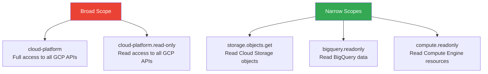

# How to Configure OAuth Consent Screen and API Scopes for Least Privilege in GCP

Author: [nawazdhandala](https://www.github.com/nawazdhandala)

Tags: GCP, OAuth, API Scopes, Least Privilege, Google Cloud Security

Description: A practical guide to configuring the OAuth consent screen and selecting API scopes with least privilege principles on Google Cloud Platform.

---

Every application that accesses Google APIs on behalf of users needs an OAuth consent screen. It is the dialog that asks users to grant your application specific permissions. Getting this configuration right is not just about compliance - it directly affects user trust, security posture, and whether Google approves your app for production use.

The principle of least privilege applies heavily here: request only the scopes your application actually needs. Requesting broad scopes like `https://www.googleapis.com/auth/cloud-platform` when you only need to read from a specific Cloud Storage bucket is a security risk and will likely get your app flagged during Google's verification review.

## Understanding OAuth Scopes on GCP

OAuth scopes define what your application can do with a user's authorization. Each Google API has its own set of scopes ranging from broad (full access) to narrow (read-only on specific resources).



Always prefer narrow scopes. They limit the blast radius if your application or a user's token is compromised.

## Configuring the OAuth Consent Screen

### Using the gcloud CLI

```bash
# Configure the OAuth consent screen brand
# This sets up the application name, support email, and developer contact
gcloud alpha iap oauth-brands create \
    --application_title="My Internal App" \
    --support_email="support@mycompany.com"
```

For more detailed configuration, use the Google Cloud Console or the API directly:

```bash
# Create an OAuth client ID for a web application
gcloud auth application-default set-quota-project my-project

# Create OAuth credentials
gcloud services enable iap.googleapis.com

# Create an OAuth client
gcloud alpha iap oauth-clients create \
    projects/my-project/brands/BRAND_ID \
    --display_name="My Web App"
```

### Consent Screen Configuration Options

The consent screen has several important settings:

**User type** - Choose "Internal" if your app is only for users within your Google Workspace organization. Internal apps skip the verification process and only show the consent screen to organization members. Choose "External" for apps available to any Google account.

**Application name** - This appears on the consent screen. Use your actual product name.

**Scopes** - The permissions your app requests. This is where least privilege matters most.

**Authorized domains** - Domains verified in Google Search Console that your app uses.

## Selecting Least-Privilege Scopes

Here is how to choose scopes for common scenarios:

### Cloud Storage Access

```python
# Bad: Requesting full cloud-platform scope just to read files
# This gives access to ALL GCP services, not just Storage
SCOPES_BAD = ['https://www.googleapis.com/auth/cloud-platform']

# Good: Request only the specific Storage scope needed
# Read-only access to Cloud Storage objects
SCOPES_GOOD = ['https://www.googleapis.com/auth/devstorage.read_only']

# Even better: Use the most restrictive scope possible
# Read access to Cloud Storage metadata only (no object data)
SCOPES_BEST = ['https://www.googleapis.com/auth/devstorage.read_only']
```

### BigQuery Access

```python
# Only need to run queries and read results
SCOPES = [
    'https://www.googleapis.com/auth/bigquery.readonly',  # Read data
]

# If you also need to create tables and write data
SCOPES = [
    'https://www.googleapis.com/auth/bigquery',  # Full BigQuery access
]

# Never use cloud-platform scope just for BigQuery
# BAD: 'https://www.googleapis.com/auth/cloud-platform'
```

### Gmail and Google Workspace

```python
# Only need to send emails on behalf of the user
SCOPES = [
    'https://www.googleapis.com/auth/gmail.send',  # Send only, no read
]

# Need to read email metadata but not content
SCOPES = [
    'https://www.googleapis.com/auth/gmail.metadata',  # Headers only
]

# BAD: Full Gmail access when you only need to send
# 'https://www.googleapis.com/auth/gmail.modify'
```

## Implementing OAuth in Your Application

Here is a complete example of an application that properly requests minimal scopes:

```python
# oauth_app.py
# Web application that accesses BigQuery with least-privilege scopes

from flask import Flask, redirect, request, session, url_for
from google.oauth2.credentials import Credentials
from google_auth_oauthlib.flow import Flow
from google.cloud import bigquery

app = Flask(__name__)
app.secret_key = 'your-secret-key'

# Only request the scopes the application actually needs
# bigquery.readonly - read BigQuery data
# userinfo.email - identify the user
SCOPES = [
    'https://www.googleapis.com/auth/bigquery.readonly',
    'https://www.googleapis.com/auth/userinfo.email',
    'openid',
]

# OAuth flow configuration
CLIENT_SECRETS_FILE = 'client_secret.json'

@app.route('/authorize')
def authorize():
    """Start the OAuth flow with minimal scopes."""
    flow = Flow.from_client_secrets_file(
        CLIENT_SECRETS_FILE,
        scopes=SCOPES,
        redirect_uri=url_for('callback', _external=True)
    )

    # Generate the authorization URL
    authorization_url, state = flow.authorization_url(
        access_type='offline',       # Get a refresh token
        include_granted_scopes='true', # Incremental authorization
        prompt='consent',             # Always show consent screen
    )

    session['state'] = state
    return redirect(authorization_url)

@app.route('/callback')
def callback():
    """Handle the OAuth callback and store credentials."""
    flow = Flow.from_client_secrets_file(
        CLIENT_SECRETS_FILE,
        scopes=SCOPES,
        state=session['state'],
        redirect_uri=url_for('callback', _external=True)
    )

    # Exchange the authorization code for credentials
    flow.fetch_token(authorization_response=request.url)
    credentials = flow.credentials

    # Store credentials securely (use Secret Manager in production)
    session['credentials'] = {
        'token': credentials.token,
        'refresh_token': credentials.refresh_token,
        'token_uri': credentials.token_uri,
        'client_id': credentials.client_id,
        'client_secret': credentials.client_secret,
        'scopes': credentials.scopes,
    }

    return redirect(url_for('query_data'))

@app.route('/query')
def query_data():
    """Use the OAuth credentials to query BigQuery."""
    creds_data = session.get('credentials')
    if not creds_data:
        return redirect(url_for('authorize'))

    credentials = Credentials(**creds_data)
    client = bigquery.Client(credentials=credentials, project='my-project')

    # Run a read-only query (our scope only allows reading)
    query = "SELECT COUNT(*) as total FROM `my_dataset.my_table`"
    results = client.query(query).result()

    return str(list(results))
```

## Incremental Authorization

Instead of requesting all scopes upfront, use incremental authorization to request additional scopes only when needed:

```python
# Start with basic scopes
BASIC_SCOPES = [
    'openid',
    'https://www.googleapis.com/auth/userinfo.email',
]

# Request additional scopes only when the user needs that feature
BIGQUERY_SCOPES = [
    'https://www.googleapis.com/auth/bigquery.readonly',
]

def request_bigquery_access():
    """Incrementally request BigQuery scope when the user first accesses reports."""
    flow = Flow.from_client_secrets_file(
        CLIENT_SECRETS_FILE,
        scopes=BASIC_SCOPES + BIGQUERY_SCOPES,
        redirect_uri=url_for('callback', _external=True)
    )

    authorization_url, state = flow.authorization_url(
        # This flag tells Google to add to existing scopes, not replace
        include_granted_scopes='true',
    )

    return redirect(authorization_url)
```

## Terraform Configuration for OAuth Clients

```hcl
# Configure the OAuth brand (consent screen)
resource "google_iap_brand" "default" {
  support_email     = "support@mycompany.com"
  application_title = "My Application"
  project           = "my-project"
}

# Create an OAuth client
resource "google_iap_client" "default" {
  display_name = "My Web Application"
  brand        = google_iap_brand.default.name
}
```

## Scope Reference for Common GCP Services

Here is a quick reference for choosing the right scope:

| Service | Read-Only Scope | Full Access Scope |
|---------|----------------|-------------------|
| Cloud Storage | `devstorage.read_only` | `devstorage.full_control` |
| BigQuery | `bigquery.readonly` | `bigquery` |
| Compute Engine | `compute.readonly` | `compute` |
| Cloud Logging | `logging.read` | `logging.write` |
| Pub/Sub | `pubsub` (no read-only) | `pubsub` |

## Verification and Publishing

For external apps requesting sensitive scopes, Google requires a verification review:

```bash
# Check current consent screen configuration
gcloud alpha iap oauth-brands list --format=yaml

# Prepare for verification by ensuring:
# 1. You have a privacy policy URL
# 2. You have a terms of service URL
# 3. You only request scopes you can justify
# 4. Your authorized domains are verified
```

**Sensitive scopes** (like Gmail read access) require a security assessment by a third party. **Restricted scopes** (like full Drive access) require an even more rigorous review. The fewer sensitive scopes you request, the faster and easier the verification process.

## Best Practices

**Audit scope usage regularly.** Use Cloud Monitoring to check which scopes are actually being used by tokens, and remove any that are not needed.

**Use service accounts for server-to-server communication.** OAuth user consent is for end-user-facing applications. Backend services should use service account impersonation or Workload Identity.

**Store tokens securely.** Use Google Cloud Secret Manager for refresh tokens, not environment variables or config files.

**Implement token revocation.** Give users the ability to revoke your application's access. This builds trust and is required for verified apps.

Configuring OAuth with least privilege is not just a best practice - it is a fundamental security control that limits what can go wrong when tokens are compromised. Start narrow, use incremental authorization for additional features, and regularly audit what your application actually needs.
