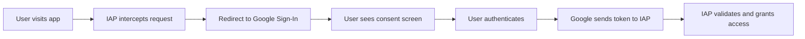

# How to Configure OAuth Consent Screen and Credentials for GCP Identity-Aware Proxy

Author: [nawazdhandala](https://www.github.com/nawazdhandala)

Tags: GCP, IAP, OAuth, Authentication, Identity-Aware Proxy, Security

Description: A complete guide to configuring the OAuth consent screen and OAuth credentials needed for Identity-Aware Proxy in Google Cloud, covering both internal and external user types.

---

Before you can enable Identity-Aware Proxy on any GCP resource, you need to configure an OAuth consent screen and create OAuth credentials. This is the authentication foundation that IAP uses to verify user identities. Getting this right is important because misconfigured OAuth settings lead to broken sign-in flows, confusing error messages, and frustrated users.

This post covers the full configuration process, including the differences between internal and external user types, how to create OAuth clients for IAP, and the common mistakes that trip people up.

## Why OAuth Is Needed for IAP

IAP uses OAuth 2.0 to authenticate users. When someone visits your IAP-protected application, they are redirected to Google's sign-in page. After signing in, Google sends an OAuth token back to IAP, which IAP validates. The consent screen is what users see during this sign-in flow - it shows the application name and what data access is being requested.



## Step 1: Configure the OAuth Consent Screen

You can configure the consent screen through the Cloud Console or the API. Let me cover both approaches.

### Using the Cloud Console

1. Go to the Google Cloud Console
2. Navigate to APIs and Services, then OAuth consent screen
3. Choose your user type (Internal or External)
4. Fill in the required fields

### Using gcloud and the API

For the consent screen (also known as the IAP "brand"), use the IAP API.

```bash
# Create an IAP brand (OAuth consent screen) for internal users
gcloud iap oauth-brands create \
    --application_title="My Internal App" \
    --support_email="admin@company.com" \
    --project=my-project-id
```

To list existing brands:

```bash
# List IAP brands in the project
gcloud iap oauth-brands list --project=my-project-id
```

## Understanding User Types

### Internal

Internal means only users within your Google Workspace or Cloud Identity organization can sign in. This is the right choice for employee-facing applications.

Benefits of internal:
- No app verification required by Google
- Users see a minimal consent screen
- Only your organization's users can authenticate

### External

External means anyone with a Google account can potentially sign in (subject to your IAM policies). You would use this for customer-facing applications or when you need to grant access to users outside your organization.

With external apps in testing mode:
- Only explicitly listed test users can sign in
- You do not need Google verification
- Limited to 100 test users

With external apps in production mode:
- Any Google account user can sign in (if authorized in IAP)
- You may need Google verification if requesting sensitive scopes
- No test user limits

## Step 2: Create OAuth Credentials

IAP needs an OAuth 2.0 client ID and client secret. There are two ways to set this up.

### Option A: Let GCP Create Credentials Automatically

When you enable IAP on a backend service for the first time, GCP can create OAuth credentials automatically.

```bash
# Enable IAP - GCP creates OAuth client automatically
gcloud compute backend-services update my-backend-service \
    --iap=enabled \
    --global \
    --project=my-project-id
```

This is the simplest approach, but you have less control over the OAuth client configuration.

### Option B: Create Credentials Manually

For more control, create the OAuth client yourself.

```bash
# First, get the brand name
BRAND_NAME=$(gcloud iap oauth-brands list \
    --project=my-project-id \
    --format="value(name)")

# Create an IAP OAuth client
gcloud iap oauth-clients create "$BRAND_NAME" \
    --display_name="My App IAP Client" \
    --project=my-project-id
```

This outputs the client ID and secret. Save them - you will need them when enabling IAP.

```bash
# Enable IAP with your own OAuth credentials
gcloud compute backend-services update my-backend-service \
    --iap=enabled,oauth2-client-id=YOUR_CLIENT_ID,oauth2-client-secret=YOUR_CLIENT_SECRET \
    --global \
    --project=my-project-id
```

### Option C: Using the Google Cloud Console for OAuth Clients

You can also create OAuth clients through the Console:

1. Go to APIs and Services, then Credentials
2. Click Create Credentials, then OAuth client ID
3. Set the application type to Web application
4. Add the authorized redirect URI: `https://iap.googleapis.com/v1/oauth/clientIds/CLIENT_ID:handleRedirect`
5. Note down the client ID and secret

## Step 3: Configure Authorized Redirect URIs

If you created the OAuth client manually through the Console (not through the IAP API), you need to add the correct redirect URI.

The format is:

```
https://iap.googleapis.com/v1/oauth/clientIds/YOUR_CLIENT_ID:handleRedirect
```

This tells Google where to send the user after authentication. If this URI is wrong, users will see a redirect mismatch error after signing in.

## Step 4: Add Authorized Domains

For external user types, you need to add your application's domain as an authorized domain.

In the OAuth consent screen settings, add:
- Your application domain (e.g., `myapp.company.com`)
- Any additional domains that IAP redirects through

```bash
# You can check current brand configuration
gcloud iap oauth-brands list \
    --project=my-project-id \
    --format=json
```

## Terraform Configuration

Here is how to set up the entire OAuth configuration with Terraform.

```hcl
# Create the IAP brand (consent screen)
resource "google_iap_brand" "app_brand" {
  support_email     = "admin@company.com"
  application_title = "My Internal Application"
  project           = var.project_id
}

# Create the IAP OAuth client
resource "google_iap_client" "app_client" {
  display_name = "My App IAP Client"
  brand        = google_iap_brand.app_brand.name
}

# Use the client credentials when configuring the backend service
resource "google_compute_backend_service" "app" {
  name        = "my-backend-service"
  protocol    = "HTTP"
  port_name   = "http"
  timeout_sec = 30

  backend {
    group = google_compute_instance_group_manager.app.instance_group
  }

  health_checks = [google_compute_health_check.app.id]

  iap {
    oauth2_client_id     = google_iap_client.app_client.client_id
    oauth2_client_secret = google_iap_client.app_client.secret
  }
}
```

Note: The `google_iap_brand` resource can only be created once per project and cannot be deleted through Terraform. If it already exists, import it.

```bash
# Import an existing IAP brand into Terraform state
terraform import google_iap_brand.app_brand projects/PROJECT_NUMBER/brands/PROJECT_NUMBER
```

## Configuring Scopes

By default, IAP requests the `email` and `profile` scopes. These are sufficient for most applications. If your application needs additional scopes, configure them in the OAuth consent screen settings.

Common scopes for IAP:
- `email` - user's email address (always included)
- `profile` - user's basic profile information (always included)
- `openid` - OpenID Connect authentication (always included)

If you add sensitive or restricted scopes, Google may require app verification for external user types.

## Handling Multiple Applications

If you have multiple applications behind IAP, you have two options:

1. **Share one OAuth client**: All applications use the same client ID and secret. Simpler to manage.
2. **Separate OAuth clients**: Each application gets its own client. Better isolation.

For separate clients, create multiple IAP OAuth clients under the same brand.

```bash
# Create a client for each application
gcloud iap oauth-clients create "$BRAND_NAME" \
    --display_name="App A IAP Client"

gcloud iap oauth-clients create "$BRAND_NAME" \
    --display_name="App B IAP Client"
```

## Common Issues

**"The OAuth client was not found" error**: The client ID in the backend service configuration does not match any client in the project. Verify the client ID.

**"Redirect URI mismatch" error**: The redirect URI in the OAuth client configuration does not match what IAP is using. For IAP clients created through the IAP API, this is handled automatically. For manually created clients, add `https://iap.googleapis.com/v1/oauth/clientIds/CLIENT_ID:handleRedirect`.

**"Access denied" after consent**: The user authenticated successfully but does not have the `iap.httpsResourceAccessor` role on the backend service. This is an IAM issue, not an OAuth issue.

**"App not verified" warning**: For external user types that have not gone through Google's verification, users see a warning. Internal user types never see this warning.

**Cannot create IAP brand**: Only one brand can exist per project. If one already exists, list it with `gcloud iap oauth-brands list` and use it.

## Rotating OAuth Client Secrets

If your client secret is compromised, you can create a new client and update the backend service.

```bash
# Create a new OAuth client
gcloud iap oauth-clients create "$BRAND_NAME" \
    --display_name="Rotated IAP Client"

# Update the backend service with the new client credentials
gcloud compute backend-services update my-backend-service \
    --iap=enabled,oauth2-client-id=NEW_CLIENT_ID,oauth2-client-secret=NEW_CLIENT_SECRET \
    --global \
    --project=my-project-id
```

Active sessions will not be interrupted. New authentication requests will use the new client.

## Summary

The OAuth consent screen and credentials are the foundation of IAP authentication. Choose internal user type for employee-facing apps and external for public-facing ones. Let GCP create OAuth clients automatically for simplicity, or create them manually for more control. The most common issues stem from redirect URI mismatches and missing IAM bindings, so double-check those first when troubleshooting. Once configured, the OAuth setup is mostly hands-off unless you need to rotate secrets or change user types.
