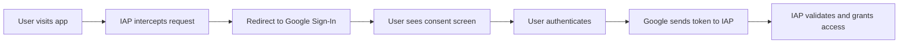

# Configure OAuth Consent Screen and Credentials for GCP Identity-Aware Proxy

Author: [nawazdhandala](https://www.github.com/nawazdhandala)

Tags: GCP, IAP, OAuth, Authentication, Identity-Aware Proxy, Security

Description: A complete guide to configuring the OAuth consent screen and OAuth credentials needed for Identity-Aware Proxy in Google Cloud, covering both internal and external user types.

---

Before you can enable Identity-Aware Proxy with a custom OAuth configuration, you need to configure an OAuth consent screen and create OAuth credentials. IAP can also use a Google-managed OAuth client for internal browser access, which does not require you to create a client ID and secret yourself. Getting this right is important because misconfigured OAuth settings lead to broken sign-in flows, confusing error messages, and frustrated users.

This post covers the full configuration process, including the differences between internal and external user types, how to create OAuth clients for IAP, and the common mistakes that trip people up.

## Why OAuth Is Needed for IAP

IAP uses OAuth 2.0 to authenticate users. When someone visits your IAP-protected application, they are redirected to Google's sign-in page. After signing in, Google sends an OAuth token back to IAP, which IAP validates. The consent screen is what users see during this sign-in flow - it shows the application name and what data access is being requested.


```mermaid
flowchart LR
    A[User visits app] --> B[IAP intercepts request]
    B --> C[Redirect to Google Sign-In]
    C --> D[User sees consent screen]
    D --> E[User authenticates]
    E --> F[Google sends token to IAP]
    F --> G[IAP validates and grants access]
```

## Step 1: Configure the OAuth Consent Screen

You should configure the consent screen through the Cloud Console. The old IAP API-based setup is deprecated, but gcloud is still useful for enabling IAP after the OAuth configuration is ready.

### Using the Cloud Console

1. Go to the Google Cloud Console
2. Navigate to APIs and Services, then OAuth consent screen
3. Choose your user type (Internal or External)
4. Fill in the required fields

### Using gcloud and the API

The older IAP OAuth Admin API treated the consent screen as an IAP "brand", but the `gcloud iap oauth-brands` and `gcloud iap oauth-clients` commands are deprecated and no longer work for new projects. Configure the OAuth branding page in the Google Cloud console instead.

```bash
# These commands are deprecated and should not be used for new IAP setup:
# gcloud iap oauth-brands create
# gcloud iap oauth-clients create
```

You can still enable IAP itself with gcloud after the OAuth configuration is ready:

```bash
# Enable IAP on a global backend service with the Google-managed OAuth client
gcloud compute backend-services update my-backend-service \
    --iap=enabled \
    --global \
    --project=my-project-id
```

## Understanding User Types

### Internal

Internal means only users within your Google Workspace or Cloud Identity organization can sign in. This is the right choice for employee-facing applications.

Benefits of internal:
- No app verification required by Google
- Users see a minimal consent screen
- Only your organization's users can authenticate

### External

External means anyone with a Google account can potentially sign in (subject to your IAM policies). You would use this for customer-facing applications or when you need to grant access to users outside your organization.

With external apps in testing mode:
- Only explicitly listed test users can sign in
- You do not need Google verification
- Limited to 100 test users

With external apps in production mode:
- Any Google account user can sign in (if authorized in IAP)
- You may need Google verification if requesting sensitive scopes
- No test user limits

## Step 2: Create OAuth Credentials

IAP can use a Google-managed OAuth client or a custom OAuth client. You only need to manage an OAuth 2.0 client ID and client secret yourself when you use a custom OAuth configuration.

### Option A: Use the Google-Managed OAuth Client

When you enable IAP on a backend service with gcloud, IAP can use a Google-managed OAuth client.

```bash
# Enable IAP with the Google-managed OAuth client
gcloud compute backend-services update my-backend-service \
    --iap=enabled \
    --global \
    --project=my-project-id
```

This is the simplest approach for internal browser access, but it only allows users within the resource's organization and shows Google Cloud branding instead of your own branding.

### Option B: Create Custom Credentials in the IAP Console

For external users, custom branding, or programmatic access, create a custom OAuth client from the IAP settings in the Google Cloud console.

1. Go to the IAP page in the Google Cloud Console
2. In the Applications tab, open the settings for the resource
3. Select Custom OAuth
4. Configure the consent screen if prompted
5. Click Auto Generate Credentials, or enter an existing client ID and secret
6. Download and store the credentials securely

You will need the client ID and secret when enabling IAP with a custom OAuth configuration.

```bash
# Enable IAP with your own OAuth credentials
gcloud compute backend-services update my-backend-service \
    --iap=enabled,oauth2-client-id=YOUR_CLIENT_ID,oauth2-client-secret=YOUR_CLIENT_SECRET \
    --global \
    --project=my-project-id
```

### Option C: Using the Google Cloud Console for OAuth Clients

You can also create a web OAuth client through Google Auth Platform:

1. Go to Google Auth Platform, then Clients
2. Click Create Credentials, then OAuth client ID
3. Set the application type to Web application
4. Add the authorized redirect URI: `https://iap.googleapis.com/v1/oauth/clientIds/CLIENT_ID:handleRedirect`
5. Note down the client ID and secret

## Step 3: Configure Authorized Redirect URIs

If you create a web OAuth client manually instead of letting IAP auto-generate one, you need to add the correct redirect URI.

The format is:

```text
https://iap.googleapis.com/v1/oauth/clientIds/YOUR_CLIENT_ID:handleRedirect
```

This tells Google where to send the user after authentication. If this URI is wrong, users will see a redirect mismatch error after signing in.

## Step 4: Add Authorized Domains

For external user types, you may need to add your application's domain as an authorized domain in the OAuth branding configuration.

In the OAuth consent screen settings, add:
- Your application domain (e.g., `myapp.company.com`)
- Any additional domains that IAP redirects through

The old `gcloud iap oauth-brands list` command is deprecated, so check the branding configuration in the Google Cloud console.

## Terraform Configuration

The Terraform `google_iap_brand` and `google_iap_client` resources depend on the deprecated IAP OAuth Admin API, so they should not be used for new IAP OAuth setup. You can still configure a backend service to use existing custom OAuth credentials.

```hcl
resource "google_compute_backend_service" "app" {
  name        = "my-backend-service"
  protocol    = "HTTP"
  port_name   = "http"
  timeout_sec = 30

  backend {
    group = google_compute_instance_group_manager.app.instance_group
  }

  health_checks = [google_compute_health_check.app.id]

  iap {
    enabled              = true
    oauth2_client_id     = var.iap_oauth2_client_id
    oauth2_client_secret = var.iap_oauth2_client_secret
  }
}
```

You can also apply an existing custom OAuth client with `google_iap_settings`:

```hcl
resource "google_iap_settings" "app_oauth" {
  name = "projects/${var.project_number}/iap_web/compute/services/my-backend-service"

  access_settings {
    oauth_settings {
      oauth_client_id     = var.iap_oauth2_client_id
      oauth_client_secret = var.iap_oauth2_client_secret
    }
  }
}
```

## Configuring Scopes

IAP uses Google sign-in scopes such as `openid`, `email`, and `profile` to identify the user. These are sufficient for IAP authentication. If you share a custom OAuth client with other applications or use it for programmatic access, be careful with additional scopes because all applications using that client share the same permission scope configuration.

Common scopes for IAP:
- `email` - user's email address
- `profile` - user's basic profile information
- `openid` - OpenID Connect authentication

If you add sensitive or restricted scopes, Google may require app verification for external user types.

## Handling Multiple Applications

If you have multiple applications behind IAP, you have two options:

1. **Share one OAuth client**: All applications use the same client ID and secret. Simpler to manage.
2. **Separate OAuth clients**: Each application gets its own client. Better isolation.

For separate clients, create or auto-generate a separate custom OAuth client for each application in the Google Cloud console.

## Common Issues

**"The OAuth client was not found" error**: The client ID in the backend service configuration does not match any client in the project. Verify the client ID.

**"Redirect URI mismatch" error**: The redirect URI in the OAuth client configuration does not match what IAP is using. For clients auto-generated from the IAP settings, this is handled automatically. For manually created clients, add `https://iap.googleapis.com/v1/oauth/clientIds/CLIENT_ID:handleRedirect`.

**"Access denied" after consent**: The user authenticated successfully but does not have the `iap.httpsResourceAccessor` role on the backend service. This is an IAM issue, not an OAuth issue.

**"App not verified" warning**: For external user types that have not gone through Google's verification, users see a warning. Internal user types never see this warning.

**Cannot use `gcloud iap oauth-brands` or `gcloud iap oauth-clients`**: The IAP OAuth Admin API commands are deprecated and no longer work for new setup. Use the OAuth branding and IAP settings pages in the Google Cloud console.

## Rotating OAuth Client Secrets

If your client secret is compromised, you can create or auto-generate a new custom OAuth client and update the backend service.

```bash
# Update the backend service with the new client credentials
gcloud compute backend-services update my-backend-service \
    --iap=enabled,oauth2-client-id=NEW_CLIENT_ID,oauth2-client-secret=NEW_CLIENT_SECRET \
    --global \
    --project=my-project-id
```

Active sessions will not be interrupted. New authentication requests will use the new client.

## Summary

The OAuth consent screen and credentials are the foundation of custom IAP authentication. Choose internal user type for employee-facing apps and external for public-facing ones. Use the Google-managed OAuth client for simple internal browser access, or configure a custom OAuth client when you need external users, custom branding, or programmatic access. The most common issues stem from redirect URI mismatches and missing IAM bindings, so double-check those first when troubleshooting. Once configured, the OAuth setup is mostly hands-off unless you need to rotate secrets or change user types.
